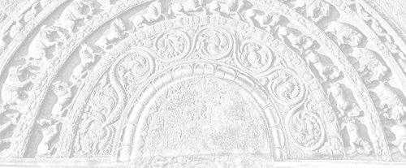

# Sermon 5

> Namo tassa bhagavato arahato sammāsambuddhassa \
> Namo tassa bhagavato arahato sammāsambuddhassa \
> Namo tassa bhagavato arahato sammāsambuddhassa
>
> *Etaṁ santaṁ, etaṁ paṇītaṁ, \
> yadidaṁ sabbasaṅkhārasamatho sabbūpadhipaṭinissaggo \
> taṇhakkhayo virāgo nirodho nibbānaṁ.*[^fn148]
>
> "This is peaceful, this is excellent, \
> namely the stilling of all preparations, the relinquishment of all assets, \
> the destruction of craving, detachment, cessation, extinction."

With the permission of the Most Venerable Great Preceptor and the assembly of
the venerable meditative monks.

Towards the end of our last sermon, we discussed, to some extent, a special mode
of attention, regarding the four objects of contemplation in the
*Satipaṭṭhānasutta* – body, feelings, mind, and mind-objects.[^fn149] That
discussion might have revealed a certain middle path indicated by the Buddha.

We drew attention to a thematic paragraph, occurring throughout the
*Satipaṭṭhānasutta*, which outlines a method of using objects and concepts for
*satipaṭṭhāna* meditation without dogmatic involvement. This leads the meditator
to a particular kind of attitude, summed up by the concluding phrase:

> He abides independent and does not cling to anything in the world,
>
> *anissito ca viharati, na ca kiñci loke upādiyati*.[^fn150]

By way of clarification, we brought in the simile of a scaffolding for a
building, that here the concepts only serve as a scaffolding for building up
mindfulness and knowledge.[^fn151]

Talking about the scaffolding, we are reminded of two different attitudes,
namely, the attitude of leaning on to and dwelling in the scaffolding itself,
and the enlightened attitude of merely utilizing it for the purpose of erecting
a building.

For further explanation of this technique, we may take up the two terms
*parāmasana* and *sammasana*. It might be better to distinguish the meanings of
these two terms also with the help of a simile. As for a simile, let us take up
the razor, which is such a useful requisite in our meditative life. There is a
certain special way in sharpening a razor. With the idea of sharpening the
razor, if one grabs it tightly and rubs it on the sharpening stone, it will only
become blunt. *Parāmasana*, grasping, grabbing, is something like that.

What then is the alternative? A more refined and softer approach is required as
meant by the term *sammasana*. There is a proper mode of doing it. One has to
hold the razor in a relaxed way, as if one is going to throw it away. One holds
it lightly, ready to let go of it at any time. But, of course, with mindfulness.
The wrist, also, is not rigid, but relaxed. Hand is supple at the joints and
easy to swing. Then with that readiness, one sharpens the razor, sliding it
smoothly on the stone. First: up, up, up, then: down, down, down, and then: up
down, up down, up down. The third combined movement ensures that those parts of
the blade still untouched by the stone will also get duly sharpened.

It is in the same manner that the razor of insight wisdom has to be whetted on
the sharpening stone of the *Satipaṭṭhānasutta*. Inward, inward, inward –
outward, outward, outward – inward outward, inward outward. Or else: arising,
arising, arising – ceasing, ceasing, ceasing – arising ceasing, arising ceasing.

This is an illustration for the method of reflection, or *sammasana*, introduced
by the Buddha in the *Satipaṭṭhānasutta*. Words and concepts have to be made use
of, for attaining Nibbāna. But here the aim is only the up-building of
mindfulness and knowledge. Once their purpose is served, they can be dismantled
without being a bother to the mind. This is the significance of the concluding
phrase "He abides independent and does not cling to anything in the world".[^fn152]

There is another sutta in which the Buddha has touched upon this same point in
particular. It is the *Samudayasutta* in the *Satipaṭṭhānasaṁyutta* of the
*Saṁyutta Nikāya*. In that sutta, the Buddha has proclaimed the arising and
the going down of the four foundations of mindfulness. He begins by saying:

> Monks, I shall teach you the arising and the going down of the four
> foundations of mindfulness.
>
> *Catunnaṁ, bhikkhave, satipaṭṭhānānaṁ samudayañca atthagamañca
> desessāmi*.[^fn153]

He goes on to say:

> *Ko ca, bhikkhave, kāyassa samudayo? Āhārasamudayā kāyassa samudayo,
> āhāranirodhā kāyassa atthagamo*.
>
> What, monks, is the arising of the body? With the arising of nutriment is the
> arising of the body and with the cessation of the nutriment is the going down
> of the body.

Similarly:

> *Phassasamudayā vedanānaṁ samudayo, phassanirodhā vedanānaṁ atthagamo*.
>
> With the arising of contact is the arising of feeling, and with the cessation
> of contact is the going down of feeling.

And then:

> *Nāmarūpasamudayā cittassa samudayo, nāmarūpanirodhā cittassa atthagamo*.
>
> With the arising of name-and-form is the arising of the mind, and with the
> cessation of name-and-form is the going down of the mind.

And lastly:

> *Manasikārasamudayā dhammānaṁ samudayo, manasikāranirodhā dhammānaṁ
> atthagamo*.
>
> With the arising of attention is the arising of mind-objects, and with the
> ceasing of attention is the going down of mind-objects.

This, too, is an important discourse, well worth remembering, because here the
Buddha is dealing with the arising and cessation, or arising and going down, of
the four objects used for establishing mindfulness.

As we know, the concept of nutriment in this Dhamma is much broader than the
worldly concept of food. It does not imply merely the ordinary food, for which
the term used is *kabaliṅkārāhāra*, or material food. Taken in a deeper sense,
it includes the other three kinds of nutriment as well, namely *phassa*, or
contact, *manosañcetanā*, or volition, and *viññāṇa*, or consciousness. These
four together account for the concept of body as such. Therefore, due to these
four there comes to be a body, and with their cessation the body ends. So also
in the case of feeling. We all know that the arising of feeling is due to
contact.

The reference to name-and-form in this context might not be clear enough at
once, due to various definitions of name-and-form, or *nāma-rūpa*. Here, the
reason for the arising of the mind is said to be name-and-form. Mind is said to
arise because of name-and-form, and it is supposed to go down with the cessation
of name-and-form.

The fact that the mind-objects arise due to attention is noteworthy. All the
mind-objects mentioned in the fourth section of contemplation arise when there
is attention. And they go down when attention is not there. In other words,
attending makes objects out of them. This way, we are reminded that, apart from
making use of these words and concepts for the purpose of attaining Nibbāna,
there is nothing worth holding on to or clinging to dogmatically. So if a
meditator works with this aim in mind, he will be assured of a state of mind
that is independent and clinging-free, *anissita*, *anupādāna*.

One marvellous quality of the Buddha's teaching emerges from this discussion. A
mind-object is something that the mind hangs on to as the connotations of the
word *ārammaṇa* (cp. *ālambhana*) suggest. But because of the mode of insight
wisdom outlined here, because of the middle path approach, even the tendency to
'hang-on' is finally done away with and the object is penetrated through.
Despite the above connotations of 'hanging on' (*ārammaṇa*), the object is
transcended. Transcendence in its highest sense is not a case of surpassing, as
is ordinarily understood. Instead of leaving behind, it penetrates through. Here
then, we have a transcendence that is in itself a penetration.

So the terms *anissita* and *anupādāna* seem to have a significance of their
own. More of it comes to light in quite a number of other suttas. Particularly
in the *Dvayatānupassanāsutta* of the *Sutta Nipāta* we come across the
following two verses, which throw more light on these two terms:

> *Anissito na calati,* \
> *nissito ca upādiyaṁ,* \
> *itthabhāvaññathābhāvaṁ,* \
> *saṁsāraṁ nātivattati.*
> 
> *Etam ādīnavaṁ ñatvā,* \
> *nissayesu mahabbhayaṁ,* \
> *anissito anupādāno,* \
> *sato bhikkhu paribbaje*.[^fn154]
> 
> The unattached one wavers not, \
> But the one attached, clinging on, \
> Does not get beyond *saṁsāra*, \
> Which is an alternation between a this-ness and an otherwise-ness.
> 
> Knowing this peril, \
> The great danger, in attachments or supports \
> Let the monk fare along mindfully, \
> Resting on nothing, clinging to nothing.

Caught up in the dichotomy of *saṁsāric* existence, which alternates between
this-ness and otherwise-ness, one is unable to transcend it, so long as there is
attachment and clinging. *Nissayas* are the supports that encourage clinging in
the form of dogmatic adherence to views. Seeing the peril and the danger in
them, a mindful monk has no recourse to them. This gives one an idea of the
attitude of an *arahant*. His mind is free from enslavement to the conjoined
pairs of relative concepts.

This fact is borne out by certain Canonical statements, which at first sight
might appear as riddles. The two last sections of the *Sutta Nipāta*, the
*Aṭṭhakavagga* and the *Pārāyanavagga* in particular, contain verses which are
extremely deep. In the *Aṭṭhakavagga*, one often comes across apparently
contradictory pairs of terms, side by side. About the *arahant* it is said that:

> he neither grasps nor gives up,
> 
> *nādeti na nirassati*.[^fn155]
> 
> There is nothing taken up or rejected by him,
> 
> *attaṁ nirattaṁ na hi tassa atthi*.[^fn156]

By the way, the word *attaṁ* in this context is derived from *ādātta* (*ā* +
*dā*), by syncopation. It should not be mistaken as a reference to *attā*, or
soul. Similarly, *niratta* is from *as*, to throw, *nirasta*, conveying the idea
of giving up or putting down.

There is nothing taken up or given up by the *arahant*. Other such references to
the *arahant's* attitude are:

> *Na rāgarāgī na virāgaratto*,
>
> He is neither attached to attachment, nor attached to detachment.[^fn157]
>
> *Na hi so rajjati no virajjati*,
>
> He is neither attached nor detached.[^fn158]

It is in order to explain why such references are used that we took all this
trouble to discuss at length the significance of such terms as
*nissaya*.[^fn159] Probably due to a lack of understanding in this respect, the
deeper meanings of such suttas have got obscured. Not only that, even textual
corruption through distorted variant readings has set in, because they appeared
like riddles. However, the deeper sense of these suttas sometimes emerges from
certain strikingly strange statements like the following found in the
*Khajjanīyasutta* of the *Saṁyutta Nikāya*. The reference here is to the
*arahant*.

> *Ayaṁ vuccati, bhikkhave, bhikkhu neva ācināti na apacināti, apacinitvā ṭhito
> neva pajahati na upādiyati, pajahitvā ṭhito neva viseneti na usseneti,
> visenetvā ṭhito neva vidhūpeti na sandhūpeti*.[^fn160]
>
> Monks, such a monk is called one who neither amasses nor diminishes; already
> diminished as he is, he neither gives up nor grasps; already given up as he
> is, he neither disbands nor binds together; already disbanded as he is, he
> neither exorcizes nor proficiates.

Even to one who does not understand the language, the above quotation would
sound enigmatic. Even the rendering of the terms used here is not an easy
matter, because of the nuances they seem to convey.

We could perhaps say that such a monk neither amasses or accumulates, nor
diminishes. Since he is already diminished, presumably as regards the five
aggregates, he neither abandons nor grasps anew. Since the giving up is
complete, he neither binds together or enlists (note the word *sena,* army), nor
disbands. Disbanding (if not 'disarmament'), being complete, there is neither
exorcizing or smoking out, nor proficiating or inviting. The coupling of these
terms and their peculiar employment is suggestive of the *arahant's* freedom
from the dichotomy.

In the *Brāhmaṇavagga* of the *Dhammapada* too, we come across a similar
enigmatic verse:

> *Yassa pāraṁ apāraṁ vā,* \
> *pārāpāraṁ na vijjati,* \
> *vītaddaraṁ visaṁyuttaṁ,* \
> *tam ahaṁ brūmi brāhmaṇaṁ*.[^fn161]
> 
> For whom there is neither a farther shore, \
> Nor a hither shore, nor both, \
> Who is undistressed and unfettered, \
> Him I call a Brahmin.

In this context the word *brāhmaṇa* refers to the *arahant*. Here too, it is
said that the *arahant* has neither a farther shore, nor a hither shore, nor
both. This might sometimes appear as a problem. Our usual concept of an
*arahant* is of one who has crossed over the ocean of *saṁsāra* and is standing
on the other shore. But here is something enigmatic.

We come across a similar sutta in the *Sutta Nipāta* also, namely its very
first, the *Uragasutta*. The extraordinary feature of this sutta is the
recurrence of the same refrain throughout its seventeen verses. The refrain is:

> *So bhikkhu jahāti orapāraṁ,* \
> *urago jiṇṇamiva tacaṁ purāṇaṁ*.[^fn162]
> 
> That monk forsakes the hither and the tither, \
> Like a snake its slough that doth wither.

This simile of the slough, or the worn-out skin of the snake, is highly
significant. To quote one instance:

> *Yo nājjhagamā bhavesu sāraṁ,* \
> *vicinaṁ pupphamiva udumbaresu,* \
> *so bhikkhu jahāti orapāraṁ,* \
> *urago jiṇṇamiva tacaṁ purāṇaṁ*.[^fn163]
> 
> That monk who sees no essence in existence, \
> Like one seeking flowers in *Udumbara* trees, \
> Will give up the hither as well as the thither, \
> Like the snake its slough that doth wither.

The *arahant* has abandoned his attachment to existence. As such, he is free
from the bondage of those conjoined terms in worldly usage. So the *arahant*
looks at the worldly usage in the same way as a snake would turn back and look
at the worn-out skin he has sloughed off. Sometimes we see a snake moving about
with a remnant of its slough hanging on. We might even think that the snake is
carrying its slough around. It is the same in the case of the *arahants*.

Now there is this term *sa-upādisesa Nibbāna dhātu*. Taking the term at its face
value, some might think that the clinging is not yet over for the *arahants* –
that there is still a little bit left.

The *arahant*, though he has attained release and realized Nibbāna, so long as
he is living in the world, has to relate to the external objects in the world
somehow through his five senses, making use of them. Seeing it, some might
conclude that it is because of some residual clinging. But we have to understand
this in the light of the simile of the worn-out skin. In the case of the
*arahant*, too, the sloughed off skin is still hanging on.

As a sidelight we may cite a remark of Venerable Sāriputta:

> *Iminā pūtikāyena aṭṭiyāmi harāyāmi jigucchāmi,*[^fn164]
>
> I am harassed and repelled by this body, I am ashamed of it.

This is because the body is for him something already abandoned. All this goes
to show that the *arahant* has an unattached, unclinging attitude.

Linguistic usage, which is a special feature of existence, is enlivened by the
cravings, conceits, and views with which it is grasped. Worldlings thrive on it,
whereas the *arahants* are free from it. This is the upshot of the above
discussion on the terms *anusaya* and *nissaya*.[^fn165]

Yet another important term that should receive attention in any discussion on
Nibbāna is *āsava*. This is because the *arahant* is often called a
*khīṇāsava*, one whose *āsavas* are extinct.[^fn166] *Āsavakkhayo*, extinction
of *āsavas*, is an epithet of Nibbāna.[^fn167] So the distinct feature of an
*arahant* is his extinction of *āsavas*.

Now, what does *āsava* mean? In ordinary life, this word is used to denote
fermentation or liquor that has got fermented for a long time.[^fn168] If there
is even a dreg of ferment in a vessel, it is enough to cause fermentation for
any suitable raw material put into it. So also are the *āsavas*. They are like
the residual dregs of the ebullient mass of defilements in beings, which have
undergone fermentation for a long, long time in *saṁsāra*.

Very often, *āsavas* are said to be of three kinds, as *kāmāsavā, bhavāsavā*,
and *avijjāsavā*. The term *āsava* in this context is usually rendered as
'influxes'. We may understand them as certain intoxicating influences, which
create a world of sense-desires, a stupor that gives a notion of existence and
leads to ignorance. These influxes are often said to have the nature of
infiltrating into the mind. Sometimes a fourth type of influxes, *diṭṭhāsavā*,
is also mentioned. But this can conveniently be subsumed under *avijjāsavā*.

The extinction of influxes becomes a distinctive characteristic of an *arahant*,
as it ensures complete freedom. One could be said to have attained complete
freedom only if one's mind is free from these influxes. It is because these
influxes are capable of creating intoxication again and again.

The immense importance of the extinction of influxes, and how it accounts for
the worthiness of an *arahant*, is sometimes clearly brought out. The ultimate
aim of the Buddha's teaching is one that in other systems of thought is
generally regarded as attainable only after death. The Buddha, on the other
hand, showed a way to its realization here and now.

As a matter of fact, even brahmins like Pokkharasāti went about saying that it
is impossible for a human being to attain something supramundane:

> *Katham'hi nāma manussabhūto uttarimanussadhammā alamariyañāṇadassanavisesaṁ
> ñassati vā dakkhati vā sacchi vā karissati?*[^fn169]
>
> How can one as a human being know or see or realize a supramundane state, an
> extraordinary knowledge and vision befitting the noble ones?

They thought that such a realization is possible only after death. Immortality,
in other systems of thought, is always an after death experience.

Now the realization of the extinction of influxes, on the other hand, gives a
certain assurance about the future. It is by this extinction of influxes that
one wins to the certitude that there is no more birth after this. *Khīṇā
jāti*,[^fn170] extinct is birth! Certitude about something comes only with
realization. In fact, the term *sacchikiriya* implies a seeing with one's own
eyes, as the word for eye, *akśi*, is implicit in it.

However, everything cannot be verified by seeing with one's own eyes. The Buddha
has pointed out that there are four ways of realization or verification:

> *Cattāro me, bhikkhave, sacchikaraṇīyā dhammā. Katame cattaro?Atthi,
> bhikkhave, dhammā kāyena sacchikaraṇīyā; atthi, bhikkhave, dhammā satiyā
> sacchikaraṇīyā; atthi, bhikkhave, dhammā cakkhunā sacchikaraṇīyā; atthi,
> bhikkhave, dhammā paññāya sacchikaraṇīyā*.[^fn171]
>
> Monks, there are these four realizable things. What four? There are things,
> monks, that are realizable through the body; there are things, monks, that are
> realizable through memory; there are things, monks, that are realizable
> through the eye; there are things, monks, that are realizable through wisdom.

By way of explanation, the Buddha says that the things realizable through the
body are the eight deliverances, the things realizable through memory are one's
former habitations, the things realizable through the eye are the death and
rebirth of beings, and what is realizable through wisdom, is the extinction of
influxes.

One's former lives cannot be seen with one's own eyes by running into the past.
It is possible only by purifying one's memory and directing it backwards.
Similarly, the death and rebirth of beings can be seen, as if with one's fleshly
eye, by the divine eye, by those who have developed it. So also the fact of
extirpating all influxes is to be realized by wisdom, and not by any other
means. The fact that the influxes of sensuality, existence, ignorance, and
views, will not flow in again, can be verified only by wisdom. That is why
special mention is made of Nibbāna as something realizable.[^fn172]

Because Nibbāna is said to be something realizable, some are of the opinion
that nothing should be predicated about it. What is the reason for this special
emphasis on its realizability? It is to bring into sharp relief the point of
divergence, since the Buddha taught a way of realizing here and now something
that in other religions was considered impossible.

What was it that they regarded impossible to be realized? The cessation of
existence, or *bhavanirodha*. How can one be certain here and now that this
existence has ceased? This might sometimes appear as a big puzzle. But all the
same, the *arahant* experiences the cessation of existence as a realization.
That is why he even gives expression to it as: *Bhavanirodho Nibbānaṁ*,[^fn173]
"cessation of existence is Nibbāna".

It comes about by this extinction of influxes. The very existence of 'existence'
is especially due to the flowing in of influxes of existence. What is called
'existence' is not the apparent process of existing visible to others. It is
something that pertains to one's own mental continuum.

For instance, when it is said that some person is in the world of sense desires,
one might sometimes imagine it as living surrounded by objects of sense
pleasure. But that is not always the case. It is the existence in a world of
sense desires, built up by sensuous thoughts. It is the same with the realms of
form and formless realms. Even those realms can be experienced and attained
while living in this world itself.

Similarly, it is possible for one to realize the complete cessation of this
existence while living in this very world. It is accomplished by winning to the
realization that the influxes of sense desires, existence, and ignorance, no
longer influence one's mind.

So all this goes to show the high degree of importance attached to the word
*āsava*. The *Sammādiṭṭhisutta* of the *Majjhima Nikāya* seems to pose a problem
regarding the significance of this term. At one place in the sutta it is said
that the arising of ignorance is due to the arising of influxes and that the
cessation of ignorance is due to the cessation of influxes:

> *Āsavasamudayā avijjāsamudayo, āsavanirodhā avijjānirodho*.[^fn174]

If the sutta says only this much, it will not be such a problem, because it
appears as a puzzle to many nowadays, why ignorance is placed first. Various
reasons are adduced and arguments put forward as to why it is stated first out
of the twelve factors. The fact that there is still something to precede it
could therefore be some consolation.

But then, a little way off, in the selfsame sutta, we read:

> *Avijjāsamudayā āsavasamudayo, avijjanirodhā āsavanirodho,*[^fn175]
>
> with the arising of ignorance is the arising of influxes, with the cessation
> of ignorance is the cessation of influxes.

Apparently this contradicts the previous statement. The preacher of this
discourse, Venerable Sāriputta, is not one who contradicts himself. So most
probably there is some deep reason behind this.

Another problem crops up, since ignorance is also counted among the different
kinds of influxes. This makes our puzzle all the more deep. But this state of
affairs could best be understood with the help of an illustration. It is in
order to explain a certain fascinating behaviour of the mind that even
*arahants* of great wisdom had to make seemingly contradictory statements.

We have to draw in at this juncture a very important discourse in the *Saṁyutta
Nikāya*, which is a marvel in itself. It comes in the section on the aggregates,
*Khandhasaṁyutta*, as the second *Gaddulasutta*. Here the Buddha makes the
following impressive declaration:

> '*Diṭṭhaṁ vo, bhikkhave, caraṇaṁ nāma cittan'ti?' 'Evaṁ, bhante.' 'Tampi kho,
> bhikkhave, caraṇaṁ nāma cittaṁ citteneva cintitaṁ. Tenapi kho, bhikkhave,
> caraṇena cittena cittaññeva cittataraṁ. Tasmātiha, bhikkhave, abhikkhaṇaṁ
> sakaṁ cittaṁ paccavekkhitabbaṁ: Dīgharattam idaṁ cittaṁ saṁkiliṭṭhaṁ rāgena
> dosena mohenā'ti. Cittasaṁkilesā, bhikkhave, sattā saṁkilissanti, cittavodānā
> sattā visujjhanti*.
>
> *Nāhaṁ, bhikkhave, aññaṁ ekanikāyampi samanupassāmi evaṁ cittaṁ, yathayidaṁ,
> bhikkhave, tiracchānagatā pāṇā. Tepi kho, bhikkhave, tiracchānagatā pāṇā
> citteneva cintitā. Tehipi kho, bhikkhave, tiracchānagatehi pāṇehi cittaññeva
> cittataraṁ. Tasmātiha, bhikkhave, bhikkhunā abhikkhaṇaṁ sakaṁ cittaṁ
> paccavekkhitabbaṁ: Dīgharattam idaṁ cittaṁ saṁkiliṭṭhaṁ rāgena dosena
> mohenā'ti. Cittasaṁkilesā, bhikkhave, sattā saṁkilissanti, cittavodānā sattā
> visujjhanti*.'[^fn176]
>
> 'Monks, have you seen a picture called a movie (*caraṇa*)?' 'Yes, Lord.'
> 'Monks, even that picture called a movie is something thought out by the mind.
> But this mind, monks, is more picturesque than that picture called a movie.
> Therefore, monks, you should reflect moment to moment on your own mind with
> the thought: For a long time has this mind been defiled by lust, hate, and
> delusion. By the defilement of the mind, monks, are beings defiled. By the
> purification of the mind, are beings purified.
>
> Monks, I do not see any other class of beings as picturesque as beings in the
> animal realm. But those beings in the animal realm, monks, are also thought
> out by the mind. And the mind, monks, is far more picturesque than those
> beings in the animal realm. Therefore, monks, should a monk reflect moment to
> moment on one's own mind with the thought: For a long time has this mind been
> defiled by lust, hate, and delusion. By the defilement of the mind, monks, are
> beings defiled. By the purification of the mind, are beings purified.'

Here the Buddha gives two illustrations to show how marvellous this mind is.
First he asks the monks whether they have seen a picture called *caraṇa*. Though
the word may be rendered by movie, it is not a motion picture of the sort we
have today. According to the commentary, it is some kind of variegated painting
done on a mobile canvas-chamber, illustrative of the results of good and evil
karma.[^fn177] Whatever it may be, it seems to have been something marvellous.
But far more marvellous, according to the Buddha, is this mind. The reason given
is that even such a picture is something thought out by the mind.

Then, by way of an advice to the monks, says the Buddha:

> Therefore, monks, you should reflect on your mind moment to moment with the
> thought: For a long time this mind has been defiled by lust, hate, and
> delusion.

The moral drawn is that beings are defiled by the defilement of their minds and
that they are purified by the purification of their minds. This is the
illustration by the simile of the picture.

And then the Buddha goes on to make another significant declaration:

> Monks, I do not see any other class of beings as picturesque as beings in the
> animal realm.

But since those beings also are thought out by the mind, he declares that the
mind is far more picturesque than them. Based on this conclusion, he repeats the
same advice as before.

At first sight the sutta, when it refers to a picture, seems to be speaking
about the man who drew it. But there is something deeper than that. When the
Buddha says that the picture called *caraṇa* is also something thought out by
the mind, he is not simply stating the fact that the artist drew it after
thinking it out with his mind. The reference is rather to the mind of the one
who sees it. He, who sees it, regards it as something marvellous. He creates a
picture out of it. He imagines something picturesque in it.

In fact, the allusion is not to the artist's mind, but to the spectator's mind.
It is on account of the three defilements lust, hate, and delusion, nurtured in
his mind for a long time, that he is able to appreciate and enjoy that picture.
Such is the nature of those influxes.

That is why the Buddha declared that this mind is far more picturesque than the
picture in question. So if one turns back to look at one's own mind, in
accordance with the Buddha's advice, it will be a wonderful experience, like
watching a movie. Why? Because reflection reveals the most marvellous sight in
the world.

But usually one does not like to reflect, because one has to turn back to do so.
One is generally inclined to look at the thing in front. However, the Buddha
advises us to turn back and look at one's own mind every moment. Why? Because
the mind is more marvellous than that picture called *caraṇa*, or movie.

It is the same declaration that he makes with reference to the beings in the
animal realm. When one comes to think about it, there is even less room for
doubt here, than in the case of the picture. First of all, the Buddha declares
that there is no class of beings more picturesque than those in the animal
realm. But he follows it up with the statement that even those beings are
thought out by the mind, to draw the conclusion that as such the mind is more
picturesque than those beings of the animal realm.

Let us try to sort out the point of this declaration. Generally, we may agree
that beings in the animal realm are the most picturesque. We sometimes say that
the butterfly is beautiful. But we might hesitate to call a blue fly beautiful.
The tiger is fierce, but the cat is not. Here one's personal attitude accounts
much for the concepts of beauty, ugliness, fierceness, and innocence of animals.
It is because of the defiling influence of influxes, such as ignorance, that the
world around us appears so picturesque.

Based on this particular sutta, with its reference to the *caraṇa* picture as
a prototype, we may take a peep at the modern day's movie film, by way of an
analogy. It might facilitate the understanding of the teachings on *paṭicca
samuppāda* and Nibbāna in a way that is closer to our everyday life. The
principles governing the film and the drama are part and parcel of the life
outside cinema and the theatre. But since it is generally difficult to grasp
them in the context of the life outside, we shall now try to elucidate them with
reference to the cinema and the theatre.

Usually a film or a drama is shown at night. The reason for it is the presence
of darkness. This darkness helps to bring out the darkness of ignorance that
dwells in the minds of beings. So the film as well as the drama is presented to
the public within a framework of darkness. If a film is shown at day time, as a
matinee show, it necessitates closed windows and dark curtains. In this way,
films and dramas are shown within a curtained enclosure.

There is another strange thing about these films and dramas. One goes to the
cinema or the theatre saying: "I am going to see a film show, I am going to see
a drama". And one returns saying: "I have seen a film show, I have seen a
drama". But while the film show or the drama is going on, one forgets that one
is seeing a show or a drama.

Such a strange spell of delusion takes over. This is due to the intoxicating
influence of influxes. If one wishes to enjoy a film show or a drama, one should
be prepared to get intoxicated by it. Otherwise it will cease to be a film show
or a drama for him.

What do the film producers and dramatists do? They prepare the background for
eliciting the influxes of ignorance, latent in the minds of the audience. That
is why such shows and performances are held at night, or else dark curtains are
employed. They have an intricate job to do. Within the framework of darkness,
they have to create a delusion in the minds of their audience, so as to enact
some story in a realistic manner.

To be successful, a film or a drama has to be given a touch of realism. Though
fictitious, it should be apparently real for the audience. There is an element
of deception involved, a hoodwink. For this touch of realism, quite a lot of
make-up on the part of actors and actresses is necessary. As a matter of fact,
in the ancient Indian society, one of the primary senses of the word *saṅkhāra*
was the make-up done by actors and actresses.

Now in the present context, *saṅkhāra* can include not only this make-up in
personal appearance, but also the acting itself, the delineation of character,
stage-craft etc.. In this way, the film producers and dramatists create a
suitable environment, making use of the darkness and the make-up contrivances.
These are the *saṅkhāras*, or the 'preparations'.

However, to be more precise, it is the audience that make preparations, in the
last analysis. Here too, as before, we are compelled to make a statement that
might appear strange: So far not a single cinema has held a film show and not a
single theatre has staged a drama.

And yet, those who had gone to the cinema and the theatre had seen film shows
and dramas. Now, how can that be? Usually, we think that it is the film producer
who produced the film and that it is the dramatist who made the drama.

But if we are to understand the deeper implications of what the Buddha declared,
with reference to the picture *caraṇa*, a film show or drama is produced, in the
last analysis, by the spectator himself. When he goes to the cinema and the
theatre, he takes with him the spices needed to concoct a film or a drama, and
that is: the influxes, or *āsavas*. Whatever technical defects and shortcomings
there are in them, he makes good with his influxes.

As we know, in a drama there is a certain interval between two scenes. But the
average audience is able to appreciate even such a drama, because they are
influenced by the influxes of sense desire, existence, and ignorance.

With the progress in science and technology, scenes are made to fall on the
screen with extreme rapidity. All the same, the element of delusion is still
there. The purpose is to create the necessary environment for arousing delusion
in the minds of the audience. Whatever preparations others may make, if the
audience does not respond with their own preparations along the same lines, the
drama will not be a success. But in general, the worldlings have a tendency to
prepare and concoct, so they would make up for any short comings in the film or
the drama with their own preparations and enjoy them.

Now, for instance, let us think of an occasion when a film show is going on
within the framework of darkness. In the case of a matinee show, doors and
windows will have to be closed. Supposing the doors are suddenly flung open,
while a vivid technicolour scene is flashing on the screen, what happens then?
The spectators will find themselves suddenly thrown out of the cinema world they
had created for themselves. Why? Because the scene in technicolour has now lost
its colour. It has faded away. The result is dejection, disenchantment. The film
show loses its significance.

That film show owed its existence to the dark framework of ignorance and the
force of preparations. But now that the framework has broken down, such a vast
change has come over, resulting in a disenchantment. Now the word *rāga* has a
nuance suggestive of colour, so *virāga*, dispassion, can also literally mean a
fading away or a decolouration. Here we have a possible instance of *nibbidā
virāga*, disenchantment, dispassion, at least in a limited sense.

A door suddenly flung open can push aside the delusion, at least temporarily.
Let us consider the implications of this little event. The film show, in this
case, ceases to be a film show because of a flash of light coming from outside.
Now, what would have happened if this flash of light had come from within – from
within one's mind? Then also something similar would have happened. If the light
of wisdom dawns on one's mind while watching a film show or a drama, one would
even wonder whether it is actually a film or a drama, while others are enjoying
it.

Speaking about the film show, we mentioned above that the spectator has entered
into a world of his own creation. If we are to analyse this situation according
to the law of dependent origination, we may add that in fact he has a
consciousness and a name-and-form in line with the events of the story, based on
the preparations in the midst of the darkness of ignorance. With all his
experiences in seeing the film show, he is building up his five aggregates.

Therefore, when the light of wisdom comes and dispels the darkness of ignorance,
a similar event can occur. One will come out of that plane of existence. One
will step out of the world of sense desires, at least temporarily.

Now, with regard to the *arahants*, too, the same trend of events holds good.
When their ignorance ceases, leaving no residue, *avijjāya tveva
asesavirāganirodhā*, exhausting the influxes as well, preparations also cease.
Why? Because the preparations owe their existence to ignorance. They have the
ability to prepare so long as there is ignorance.

*Saṅkhāra* generally means preparations. It is the make-up and the make-believe
which accounted for the delusion. The darkness of ignorance provided the setting
for it. If somehow or other, the light of wisdom enters the scene, those
preparations, *saṅkhāra*, became no-preparations, *visaṅkhāra*, and the
prepared, *saṅkhata*, becomes a non-prepared, *asaṅkhata*.

So what was true with regard to the film show, is also true, in a deeper sense,
with regard to the events leading up to the attainment of *arahanthood*. With
the dawn of that light of wisdom, the preparations, or *saṅkhāra*, lose their
significance and become *visaṅkhāra*.

Though for the world outside they appear as preparations, for the *arahant* they
are not preparations, because they do not prepare a *bhava*, or existence, for
him. They are made ineffective. Similarly, the prepared or the made-up, when it
is understood as something prepared or made-up, becomes an un-prepared or an
un-made. There is a subtle principle of un-doing involved in this.

Sometimes, this might be regarded as a modernistic interpretation. But there is
Canonical evidence in support of such an interpretation. For instance, in the
*Dvayatānupassanāsutta* of the *Sutta Nipāta*, we come across the following
verse:

> *Nivutānaṁ tamo hoti,* \
> *andhakāro apassataṁ,* \
> *satañca vivaṭaṁ hoti,* \
> *āloko passatāmiva,* \
> *santike na vijānanti,* \
> *magā dhammassa akovidā*.[^fn178]
> 
> Murk it is to those enveloped, \
> As darkness unto the undiscerning, \
> But to the good wide ope' it is, \
> As light is unto those discerning, \
> So near, and yet they know not, \
> Fools, unskilled in the Norm.

It is all murky to those enveloped by the hindrance of ignorance, like the
darkness for those who are unable to see. But for the noble ones, it is visible
like an open space, even as the light to those with vision. Though it is near at
hand, fools, inexpert in the Dhamma, do not understand. This same impression
of the Buddha comes up again in the following verse in the *Udāna*:

> *Mohasambandhano loko,* \
> *bhabbarūpo va dissati,* \
> *upadhibandhano bālo,* \
> *tamasā parivārito,* \
> *sassatoriva khāyati,* \
> *passato natthi kiñcanaṁ*.[^fn179]
> 
> The world, enfettered to delusion, \
> Feigns a promising mien, \
> The fool, to his assets bound, \
> Sees only darkness around, \
> It looks as though it would last, \
> But to him who sees there is naught.

The world appears as real to one who is fettered to delusion. He imagines it to
be reliable. And so the fool, relying on his assets, is encompassed by the
darkness. To him the world appears as eternal. But the one who has the right
vision, knows that in reality there is nothing.

All this goes to show that the life outside is not much different from what goes
on within the four walls of the cinema and the theatre. Just as, in the latter
case, an enjoyable story is created out of a multitude of scenes, relayed at
varying degrees of rapidity, backed by the delusive make-up of actors and
actresses, so that one may lose oneself in a world of fantasy, even so,
according to the point of view of Dhamma, the lifestyle outside is something
made up and concocted.

However, the darkness within is much thicker than the darkness outside. The
darkness outside may be dispelled even by a door flung open, as we saw above.
But not so easily the darkness within. That is why, in the psalms of the
Theras and Therīs, it is said that they split or burst asunder the mass of
delusion:

> *tamokhandhaṁ padāliya,* [and also as] \
> *tamokhandhaṁ padālayiṁ.*[^fn180]

The pitchy black darkness of ignorance in the world is one that is thick enough
to be split up and burst asunder. So it seems, the darkness within is almost
tangibly thick. But the first incision on this thick curtain of darkness is made
by the path knowledge of the Stream-winner.

As a side-light, we may cite an episode from the lives of the Venerables
Sāriputta and Mahā Moggallāna, the two chief disciples of the Buddha.
Formerly, as brahmin youths, they were known as Upatissa and Kolita. These
two young men once went to see a hill-top festival, called
*giraggasamajja*.[^fn181]

Since by then, their discerning wisdom was already matured, they suddenly
developed a dejection about the entertainment going on. The hill-top festival,
as it were, lost its festivity for them. They understood the vanity of it and
could no longer enjoy it as before.

They may have already had a distant glimpse of the similarity between the two
levels of experience, mentioned above. But they on their own could not get at
the principles underlying the delusion involved.

Much later, as a wandering ascetic, when Upatissa met the Venerable Assaji
Thera on his alms-round, he begged the latter to preach the Dhamma to him.
Venerable Assaji said: "I know only a little". Upatissa also assured him: "I
need only a little". Venerable Assaji preached 'a little' and Upatissa, too,
heard 'a little', but since there was much in it, the latter attained the Fruit
of Stream-winning even on hearing the first two lines of the following verse:

> *Ye dhammā hetuppabhavā,* \
> *tesam hetuṁ Tathāgato āha,* \
> *tesañca yo nirodho,* \
> *evaṁ vādi mahāsamaṇo*.[^fn182]
> 
> Of things that proceed from a cause, \
> Their cause the Tathāgata has told, \
> And also their cessation, \
> Thus teaches the great ascetic.

The verse gives in a nutshell the law of dependent arising. From it, Upatissa
got the clue to his riddle of life.

Some interpret the word *hetu*, cause, in this verse, as *avijjā*, or ignorance,
the first link. But that is not the case. It refers to the basic principle known
as *idappaccayatā*, the relatedness of this to that.[^fn183]

*Hetuppabhavā dhammā* is a reference to things dependently arisen. In point of
fact, it is said about a Stream-winner that he has seen well the cause as well
as the things arisen from a cause: *Hetu ca sudiṭṭho, hetusamuppanā ca
dhammā*.[^fn184] That means that he has seen the law of dependent arising as
also the dependently arisen phenomena.

We have already discussed the significance of these two terms.[^fn185] What is
called *paṭicca samuppāda* is the basic principle itself. It is said that the
wandering ascetic Upatissa was able to arouse the path of Stream-winning on
hearing just the first two lines,[^fn186] and these state the basic principle as
such.

The word *tesaṁ*, plural, clearly implies that the reference is to all the
twelve factors, inclusive of ignorance. The cessation, also, is of those twelve,
as for instance it is said in the *Udāna*: *Khayaṁ paccayānaṁ avedi*,[^fn187]
"understood the cessation of conditions", since all the twelve are conditions.

To sum up: Whatever phenomena that arise from a cause, their cause is
*idappaccayatā*, or the law of relatedness of this to that.

> This being, this exists, \
> With the arising of this, this arises. \
> This not being, this does not exist, \
> With the cessation of this, this ceases.

And then the cessation of things arisen from a cause is ultimately Nibbāna
itself. That is the implication of the oft recurrent phrase:

> *avijjāya tveva asesavirāganirodhā*[^fn188]
>
> with the complete fading away and cessation of that very ignorance.

So then, from this discussion it should be clear that our illustration with the
help of the simile of the cinema and the theatre is of much relevance to an
understanding of the law of dependent arising. With this much, we shall wind up
today.

[^fn148]: [MN 64 / M I 436](https://suttacentral.net/mn64/pli/ms), *Mahāmālunkyasutta*

[^fn149]: See *Sermon 4*

[^fn150]: [MN 10 / M I 56](https://suttacentral.net/mn10/pli/ms), *Satipaṭṭhānasutta*

[^fn151]: See *Sermon 4*

[^fn152]: [MN 10 / M I 56](https://suttacentral.net/mn10/pli/ms), *Satipaṭṭhānasutta*

[^fn153]: [SN 47.42 / S V 184](https://suttacentral.net/sn47.42/pli/ms), *Samudayasutta*

[^fn154]: [Snp 3.12 / Sn 752-753](https://suttacentral.net/snp3.12/pli/ms), *Dvayatānupassanāsutta*

[^fn155]: [Snp 4.15 / Sn 954](https://suttacentral.net/snp4.15/pli/ms), *Attadaṇḍasutta*

[^fn156]: [Snp 4.3 / Sn 787](https://suttacentral.net/snp4.3/pli/ms), *Duṭṭhaṭṭhakasutta*

[^fn157]: [Snp 4.4 / Sn 795](https://suttacentral.net/snp4.4/pli/ms), *Suddhaṭṭhakasutta*

[^fn158]: [Snp 4.6 / Sn 813](https://suttacentral.net/snp4.6/pli/ms), *Jarāsutta*

[^fn159]: See *Sermon 4*

[^fn160]: [SN 22.79 / S III 90](https://suttacentral.net/sn22.79/pli/ms), *Khajjaniyasutta*

[^fn161]: [Dhp 385](https://suttacentral.net/dhp383-423/pli/ms), *Brāhmaṇavagga*

[^fn162]: [Snp 1.1 / Sn 1-17](https://suttacentral.net/snp1.1/pli/ms), *Uragasutta*

[^fn163]: [Snp 1.1 / Sn 5](https://suttacentral.net/snp1.1/pli/ms), *Uragasutta*

[^fn164]: [AN 9.11 / A IV 377](https://suttacentral.net/an9.11/pli/ms), *Sīhanādasutta*

[^fn165]: See *Sermon 4*

[^fn166]: E.g. at [DN 27 / D III 83](https://suttacentral.net/dn27/pli/ms), *Aggaññasutta*

[^fn167]: E.g. at [Dhp 253](https://suttacentral.net/dhp235-255/pli/ms), *Malavagga*

[^fn168]: E.g. the *pupphāsava, phalāsava, madhvāsava, guḷāsava* at Sv III 944

[^fn169]: [MN 99 / M II 200](https://suttacentral.net/mn99/pli/ms), *Subhasutta*

[^fn170]: E.g. at [DN 2 / D I 84](https://suttacentral.net/dn2/pli/ms), *Sāmaññaphalasutta*

[^fn171]: [AN 4.189 / A II 182](https://suttacentral.net/an4.189/pli/ms), *Sacchikaraṇīyasutta*

[^fn172]: [AN 3.55 / A I 159](https://suttacentral.net/an3.55/pli/ms), *Nibbutasutta*

[^fn173]: [AN 10.7 / A V 9](https://suttacentral.net/an10.7/pli/ms), *Sāriputtasutta*

[^fn174]: [MN 9 / M I 54](https://suttacentral.net/mn9/pli/ms), *Sammādiṭṭhisutta*

[^fn175]: [MN 9 / M I 55](https://suttacentral.net/mn9/pli/ms), *Sammādiṭṭhisutta*

[^fn176]: [SN 22.100 / S III 151](https://suttacentral.net/sn22.100/pli/ms), *Gaddulasutta*

[^fn177]: Spk II 327

[^fn178]: [Snp 3.12 / Sn 763](https://suttacentral.net/snp3.12/pli/ms), *Dvayatānupassanāsutta*

[^fn179]: [Ud 7.9 / Ud 79](https://suttacentral.net/ud7.9/pli/ms), *Udenasutta*

[^fn180]: [Thag 12.2 / Th 627](https://suttacentral.net/thag12.2/pli/ms), *Sunīto Thero*; [Thig 1.3 / Thī 3](https://suttacentral.net/thig1.3/pli/ms), *Puṇṇā Therī*; [Thig 2.5 / Thī 28](https://suttacentral.net/thig2.5/pli/ms), *Cittā Therī*; Thī 44, *Uttamā Therī*; Thī 120, *Tiṁsamattā Therī*; Thī 173-174, *Vijayā Therī*; Thī 180, *Uttarā Therī*

[^fn181]: [Dhp 11-12 Commentary: Dhp-a I 88](https://www.digitalpalireader.online/_dprhtml/index.html?loc=k.1.0.0.1.7.0.a&para=54&query=giraggasamajja), *Sāriputtattheravatthu*

[^fn182]: [Vin I 40](https://suttacentral.net/pli-tv-kd1/pli/ms)

[^fn183]: *Idappaccayatā* is discussed in detail above, see *Sermon 2*

[^fn184]: [AN 6.95 / A III 440](https://suttacentral.net/an6.95/pli/ms), *Catutthaabhabbaṭṭhānasutta*

[^fn185]: See *Sermon 2*

[^fn186]: Sp-ṭ III 226 (Burmese ed.)

[^fn187]: [Ud 1.2 / Ud 2](https://suttacentral.net/ud1.2/pli/ms), *Dutiyabodhisutta*

[^fn188]: [MN 38 / M I 263](https://suttacentral.net/mn38/pli/ms), *Mahātaṇhāsaṅkhayasutta*
