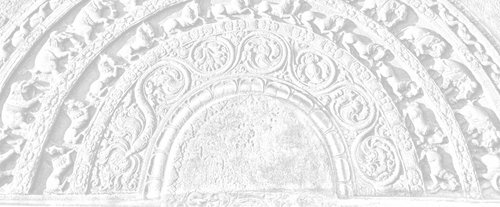

# Sermon 9

> Namo tassa bhagavato arahato sammāsambuddhassa \
> Namo tassa bhagavato arahato sammāsambuddhassa \
> Namo tassa bhagavato arahato sammāsambuddhassa
>
> *Etaṁ santaṁ, etaṁ paṇītaṁ, \
> yadidaṁ sabbasaṅkhārasamatho sabbūpadhipaṭinissaggo \
> taṇhakkhayo virāgo nirodho nibbānaṁ.*[^fn300]
>
> "This is peaceful, this is excellent, \
> namely the stilling of all preparations, the relinquishment of all assets, \
> the destruction of craving, detachment, cessation, extinction."

With the permission of the Most Venerable Great Preceptor and the assembly of
the venerable meditative monks.

This is the ninth sermon in the series of sermons given on the topic of Nibbāna.
In our last sermon we discussed, to some extent, how the insubstantiality and
the vanity of the comic acts enacted by *saṁsāric* beings in this drama of
existence gradually become clear to a meditator as he keeps his postures
according to the *Satipaṭṭhānasutta*.

We mentioned how the fact that name is only a shadow of form is revealed to the
meditator when he is attending to his postures seeing the elements constituting
the basis of form as empty.

By way of analogy we brought in the simile of a mime or a dumb show. What
characterizes that kind of drama is the comic nature of the acts which depict
scenes suggestive of animate or inanimate objects not actually present on the
stage. A meditator becomes aware, while attending to his postures, that he is
merely enacting a dumb show. He comes to understand how far name is dependent on
form, and the four elements appear to him as empty.

In the *Satipaṭṭhānasutta* we find the following instruction in regard to the
keeping of postures:

> *Yathā yathā vā pan'assa kāyo paṇihito hoti tathā tathā naṁ pajānāti,*[^fn301]
>
> in whatever way his body is disposed, so he understands it.

This is suggestive of the attempt of a spectator to understand the mimicry of an
actor or an actress in a pantomime. While attending to one's postures one feels
as if one is watching a one-man dumb show. One gets an opportunity to watch it
even more keenly when one comes to the section on full awareness,
*sampajaññapabba*, dealing with the minor postures, *khuddaka iriyāpatha*.

The worldlings are in the habit of creating material objects in accordance with
the factors on the name side in an extremely subtle manner, by grasping the four
elements under the influence of the personality view, *sakkāyadiṭṭhi*. The
material objects around us are recognized as such by grasping the four elements.
The definition of the form aspect in name-and-form points to such a conclusion:

> *cattāro ca mahābhūtā catunnañca mahābhūtānaṁ upādāya rūpaṁ,*[^fn302]
>
> the four great primaries and form dependent on those four primaries.

The word *upādāya* in this context has a special connotation of relativity. So
in this way, material objects are created with the help of factors in the name
group. This reveals a certain principle of relativity. In this relativity one
sees the emptiness of both name and form.

This same principle of relativity is implicit in some other statements of the
Buddha, but they are rather neglected for a lack of recognition of their
significance. We come across such a discourse with a high degree of importance
in the *Saḷāyatanavagga* of the *Saṁyutta Nikāya*. There the Buddha states that
principle of relativity with the help of an illustration:

> *Hatthesu, bhikkhave, sati ādānanikkhepanaṁ paññāyati, pādesu sati
> abhikkamapaṭikkamo paññāyati, pabbesu sati sammiñjanapasāraṇaṁ paññāyati,
> kucchismiṁ sati jighacchā pipāsā paññāyati.*[^fn303]
>
> When there are hands, monks, a taking up and putting down is apparent; when
> there are feet, a going forward and coming back is apparent; when there are
> joints, a bending and stretching is apparent; when there is a belly, hunger
> and thirst is apparent.

Then the contrary of this situation is also given:

> *Hatthesu, bhikkhave, asati ādānanikkhepanaṁ na paññāyati, pādesu asati
> abhikkamapaṭikkamo na paññāyati, pabbesu asati sammiñjanapasāraṇaṁ na
> paññāyati, kucchismiṁ asati jighacchā pipāsā na paññāyati.*
>
> When there are no hands, a taking up and putting down is not apparent; when
> there are no feet, a going forward and coming back is not apparent; when there
> are no joints, a bending and stretching is not apparent; when there is no
> belly, hunger and thirst are not apparent.

What is implied by all this is that basic principle of relativity.

Some meditators, engaged in *satipaṭṭhāna* meditation, might think that
materiality does not really exist and only mentality is there. In other words,
there are no hands, only a taking up and putting down is there. There are no
feet, only a going and coming is there. That way, they might dogmatically take
the bare activity as real and subject it to an analysis.

But what is important here is the understanding of the relativity between the
two, which reveals the emptiness of both. If, on the other hand, one of them is
taken too seriously as real, it ends up in a dogmatic standpoint. It will not
lead to a deeper understanding of the emptiness of name and form.

Now in the case of a pantomime, as already mentioned, a spectator has to imagine
persons and things not found on the stage as if they are present, in order to
make sense out of an act. Here too we have a similar situation. Name and form
exist in relation to each other. What one sees through this interrelation is the
emptiness or insubstantiality of both.

We brought up all these analogies of dramas and film shows just to give an idea
of the impermanence of *saṅkhāras*, or preparations. In fact, the term
*saṅkhāra*, is very apt in the context of dramas and film shows. It is
suggestive of a pretence sustained with some sort of effort. It clearly brings
out their false and unreal nature.

The purpose of the perception of impermanence, with regard to this drama of
existence, is the dispelling of the perception of permanence about the things
that go to make up the drama. With the dispelling of the perception of
permanence, the tendency to grasp a sign or catch a theme is removed. It is due
to the perception of permanence that one grasps a sign in accordance with
perceptual data. When one neither takes a sign nor gets carried away by its
details, there is no aspiration, expectation, or objective by way of craving.
When there is no aspiration, one cannot see any purpose or essence to aim at.

It is through the three deliverances, the signless, the desireless, and the
void, that the drama of existence comes to an end. The perception of
impermanence is the main contributory factor for the cessation of this drama.
Some of the discourses of the Buddha, concerning the destruction of the world,
can be cited as object lessons in the development of the perception of
impermanence leading to the signless deliverance.

For instance, in the discourse on the appearance of the seven suns,
*Sattasuriyasutta*, mentioned earlier,[^fn304] this world system, which is so
full of valuable things like the seven kinds of jewels, gets fully consumed in a
holocaust leaving not even a trace of ash or soot, as if some ghee or oil has
been burned up. The perception of impermanence, arising out of this description,
automatically leads to an understanding of voidness.

If the conviction that not only the various actors and actresses on the world
stage, but all the accompanying decorations get fully destroyed together with
the stage itself at some point of time grips the mind with sufficient intensity
to exhaust the influxes of sensuality, existence and ignorance, emancipation
will occur then and there. That may be the reason why some attained
*arahanthood* immediately on listening to that sermon.[^fn305] That way, the
perception of impermanence acts as an extremely powerful antidote for
defilements.

> *Aniccasaññā, bhikkhave, bhāvitā bahulīkatā sabbaṁ kāmarāgaṁ pariyādiyati,
> sabbaṁ rūparāgaṁ pariyādiyati, sabbaṁ bhavarāgaṁ pariyādiyati, sabbaṁ avijjaṁ
> pariyādiyati, sabbaṁ asmimānaṁ pariyādiyati samūhanati.*[^fn306]
>
> Monks, the perception of impermanence, when developed and intensively
> practised, exhausts all attachments to sensuality, exhausts all attachments to
> form, exhausts all attachments to existence, exhausts all ignorance, exhausts
> all conceits of an 'am' and eradicates it completely.

This shows that the perception of impermanence gradually leads to an
understanding of voidness, as is clearly stated in the following quotation:

> *Aniccasaññino, bhikkhave, bhikkhuno anattasaññā sanṭhāti. Anattasaññī
> asmimānasamugghātaṁ pāpuṇāti diṭṭheva dhamme nibbānaṁ.*[^fn307]
>
> Monks, in one who has the perception of impermanence, the perception of
> not-self gets established. With the perception of not-self, he arrives at the
> destruction of the conceit 'am', which is extinction here and now.

Such an assessment of the importance of the perception of impermanence will
enable us to make sense out of the seemingly contradictory statements in some of
the verses in the *Dhammapada*, such as the following:

> *Puttā matthi dhanaṁ matthi,* \
> *iti bālo vihaññati,* \
> *attā hi attano natthi,* \
> *kuto puttā kuto dhanaṁ?*[^fn308]
> 
> Sons I have, wealth I have, \
> So the fool is vexed, \
> Even oneself is not one's self, \
> Where then are sons, where is wealth?

The perception of not-self at its highest, gives rise to the idea of voidness,
as implied by the dictum:

> *suññam idaṁ attena vā attaniyena vā,*[^fn309]
>
> this is empty of self or anything belonging to a self.

Some are afraid of this term *suññatā*, emptiness, voidness, for various
reasons. That is why we mentioned at the very outset, already in the first
sermon, that gradually the monks themselves showed a lack of interest in those
discourses that deal with the idea of voidness.[^fn310] The Buddha had already
predicted, as a danger that will befall the *Sāsana* in the future, this lack of
regard for such discourses. This prediction reveals the high degree of
importance attached to them.

The last two sections of the *Sutta Nipāta*, namely *Aṭṭhakavagga* and
*Pārāyanavagga*, abound in extremely deep sermons. In the *Pārāyanavagga*, for
instance, we find the Brahmin youth Mogharāja putting the following question
to the Buddha:

> *Kathaṁ lokaṁ avekkhantaṁ, maccurājā na passati?*[^fn311]
>
> By looking upon the world in which manner can one escape the eye of the king
> of death?

The Buddha gives the answer in the following verse:

> *Suññato lokaṁ avekkhassu,* \
> *Mogharāja sadā sato,* \
> *attānudiṭṭhim ūhacca,* \
> *evaṁ maccutaro siyā,* \
> *evaṁ lokam avekkhantaṁ,* \
> *maccurājā na passati*.[^fn312]
> 
> Look upon the world as void, \
> Mogharāja, being mindful at all times, \
> Uprooting the lingering view of self, \
> Get well beyond the range of death, \
> Him who thus looks upon the world, \
> The king of death gets no chance to see.

From this we can infer that the entire Dhamma, even like the world system
itself, inclines towards voidness. This fact is borne out by the following
significant quotation in the *Cūḷataṇhāsaṅkhayasutta*, cited by Sakka as an
aphorism given by the Buddha himself:

> *Sabbe dhammā nālaṁ abhinivesāya.*[^fn313]

Though we may render it simply as "nothing is worth clinging on to", it has a
deeper significance. The word *abhinivesa* is closely associated with the idea
of entering into or getting entangled in views of one's own creation. The
implication, then, is that not only the views as such, but nothing at all is
worthwhile getting entangled in. This is suggestive of the emptiness of
everything.

This brings us to a very important sutta among the Eighths of the *Aṅguttara
Nikāya*, namely the *Kiṁmūlakasutta*. In this particular sutta we find the
Buddha asking the monks how they would answer a set of questions which wandering
ascetics of other sects might put to them. The questions are as follows:

> *Kiṁ mūlakā, āvuso, sabbe dhammā?* \
> *Kiṁ sambhavā sabbe dhammā?* \
> *Kiṁ samudayā sabbe dhammā?* \
> *Kiṁ samosaraṇā sabbe dhammā?* \
> *Kiṁ pamukhā sabbe dhammā?* \
> *Kim adhipateyyā sabbe dhammā?* \
> *Kim uttarā sabbe dhammā?* \
> *Kiṁ sārā sabbe dhammā?*[^fn314]
>
> What is the root of all things? \
> What is the origin of all things? \
> Where do all things arise? \
> Towards what do all things converge? \
> What is at the head of all things? \
> What dominates all things? \
> What is the point of transcendence of all things? \
> What is the essence of all things?

The monks confessed that they are unable to answer those questions on their own and begged the Buddha to instruct them. Then the Buddha gave the exact answer to each question in a cut and dried form, saying,

> This is the way you should answer if wandering ascetics of other sects raise those questions:
>
> *Chandamūlakā, āvuso, sabbe dhammā,* \
> *manasikārasambhavā sabbe dhammā,* \
> *phassasamudayā sabbe dhammā,* \
> *vedanāsamosaraṇā sabbe dhammā,* \
> *samādhipamukhā sabbe dhammā,* \
> *satādhipateyyā sabbe dhammā,* \
> *paññuttarā sabbe dhammā,* \
> *vimuttisārā sabbe dhammā*.
>
> Rooted in desire, friends, are all things. \
> Born of attention are all things. \
> Arisen from contact are all things. \
> Converging on feeling are all things. \
> Headed by concentration are all things. \
> Dominated by mindfulness are all things. \
> Surmountable by wisdom are all things. \
> Yielding deliverance as essence are all things.

Before getting down to an analysis of the basic meaning of this discourse, it is
worthwhile considering why the Buddha forestalled a possible perplexity among
his disciples in the face of a barrage of questions likely to be levelled by
other sectarians. Why did he think it fit to prepare the minds of the disciples
well in advance of such a situation?

Contemporary ascetics of other sects, notably the *brahmins*, entertained
various views regarding the origin and purpose of 'all things'. Those who
subscribed to a soul theory, had different answers to questions concerning
thing-hood or the essence of a thing. Presumably it was not easy for the monks,
with their not-self standpoint, to answer those questions to the satisfaction of
other sectarians. That is why those monks confessed their incompetence and
begged for guidance.

It was easy for those of other sects to explain away the questions relating to
the origin and purpose of things on the basis of their soul theory or divine
creation. Everything came out of Brahma, and self is the essence of everything.
No doubt, such answers were substantial enough to gain acceptance. Even modern
philosophers are confronted with the intricate problem of determining the exact
criterion of a 'thing'. What precisely accounts for the thing-hood of a thing?
What makes it no-thing?

Unfortunately for the sutta, its traditional commentators seem to have ignored
the deeper philosophical dimensions of the above questionnaire. They have
narrowed down the meaning of the set of answers recommended by the Buddha by
limiting its application to wholesome mental states.[^fn315]

The occurrence of such terms as *chanda, sati, samādhi* and *paññā*, had
probably led them to believe that the entire questionnaire is on the subject of
wholesome mental states. But this is a serious underestimation of the import of
the entire discourse. It actually goes far deeper in laying bare a basic
principle governing both skilful and unskilful mental states.

Now, for instance, the first two verses of the *Dhammapada* bring out a
fundamental law of psychology applicable to things both skilful and unskilful:

> *Manopubbaṅgamā dhammā, manoseṭṭhā manomayā*.[^fn316]

Both verses draw upon this fundamental principle. Nowadays, these two lines are
variously interpreted, but the basic idea expressed is that "all things have
mind as their forerunner, mind is their chief, and they are mind-made". This
applies to both skilful and unskilful mental states.

Now the sutta in question has also to be interpreted in the same light, taking
into account both these aspects. It must be mentioned, in particular, that with
the passage of time a certain line of interpretation gained currency, according
to which such terms as *chanda* were taken as skilful in an exclusive sense.

For instance, the term *sati*, wherever and whenever it occurred, was taken to
refer to *sammā sati*.[^fn317] Likewise, *chanda* came to be interpreted as
*kusalacchanda*, desire or interest in the skilful, or *kattukamyatāchanda*,
desire to perform.[^fn318]

But we have to reckon with a special trait in the Buddha's way of preaching. His
sermons were designed to lead onward the listeners, gradually, according to
their degree of understanding. Sometimes the meaning of a term, as it occurs at
the end of a sermon, is different from the meaning it is supposed to have at the
beginning of the sermon. Such a technique is also evident.

The term *chanda* is one that has both good and bad connotations. In such
contexts as *chandarāga*[^fn319] and *chandajaṁ aghaṁ*,[^fn320] it is suggestive
of craving as the cause of all suffering in this world. It refers to that
attachment, *rāga*, which the world identifies with craving as such.

But in the context *chanda-iddhipāda*,[^fn321] where the reference is to a
particular base for success, it is reckoned as a skilful mental state. However,
that is not a sufficient reason to regard it as something alien to the generic
sense of the term.

There is an important sutta, which clearly reveals this fact, in the *Saṁyutta
Nikāya*. A *brahmin* named Uṇṇābha once came to Venerable Ānanda with a question
that has a relevance to the significance of the term *chanda*. His question was:

> *Kim atthiyaṁ nu kho, bho Ānanda, samaṇe Gotame brahmacariyaṁ vussati?*[^fn322]
>
> Sir Ānanda, what is the purpose for which the holy life is lived under the
> recluse Gotama?

Venerable Ānanda promptly gives the following answer:

> *Chandappahānatthaṁ kho, brāhmaṇa, bhagavati brahmacariyaṁ vussati.*
>
> Brahmin, it is for the abandonment of desire that the holy life is lived under
> the Exalted One.

Then the *brahmin* asks:

> *Atthi pana, bho Ānanda, maggo atthi paṭipadā etassa chandassa pahānāya?*
>
> Is there, sir Ānanda, a way or practice for the abandonment of this desire?

Venerable Ānanda says: "Yes". Now, what is the way he mentions in that context?
It is none other than the four bases for success, *iddhipāda*, which are
described as follows:

> *Chandasamādhipadhānasaṅkhārasamannāgataṁ iddhipādaṁ bhāveti,* \
> *viriyasamādhipadhānasaṅkhārasamannāgataṁ iddhipādaṁ bhāveti,* \
> *cittasamādhipadhānasaṅkhārasamannāgataṁ iddhipādaṁ bhāveti,* \
> *vīmaṁsāsamādhipadhānasaṅkhārasamannāgataṁ iddhipādaṁ bhāveti*.
>
> (1.) "One develops the basis for success that has volitional preparations
> leading to a concentration through desire",
>
> (2.) "one develops the basis for success that has volitional preparations
> leading to a concentration through energy",
>
> (3.) "one develops the basis for success that has volitional preparations
> leading to a concentration by making up the mind",
>
> (4.) "one develops the basis for success that has volitional preparations
> leading to a concentration through investigation".

Venerable Ānanda replies that the way of practice to be followed for the
abandonment of desire is the above mentioned four bases pertaining to desire,
energy, mind and investigation. The *brahmin* is puzzled at this reply. He
thinks, if that is so, desire is not abandoned. It is still there. And he raises
this objection to show that there is an implicit contradiction:

> *Chandeneva chandaṁ pajahissatī'ti, netaṁ ṭhānaṁ vijjati*,
>
> that one abandons desire by desire itself is an impossibility.

Then the Venerable Ānanda brings out a simile to convince the *brahmin* of the
implicit truth in his reply.

> What do you think, *brahmin*, is it not the case that you earlier had the
> desire 'I will go to the park', and after you came here, the appropriate
> desire subsided?

So this is the logic behind the statement concerning the abandonment of craving.
The term *chanda* is used here in the first instance with reference to that type
of craving for the purpose of the abandonment of craving.

Desire as a basis for success is developed for the very abandonment of desire.
So there is no question about the use of the same word. Here, *chanda* as a base
of success still belongs to the *chanda*-family. A desire should be there even
for the abandonment of desire. This is a distinctive basic principle underlying
the middle path.

Some have a great liking for the word *chanda*, but dislike the word *taṇhā*. So
much so that, if one speaks of a craving for attaining Nibbāna, it might even be
regarded as a blasphemy. In another sermon given by Venerable Ānanda himself,
one addressed to a particular sick nun, we find the statement:

> *Taṇhaṁ nissāya taṇhā pahātabbā*,[^fn323]
>
> depending on craving one should abandon craving.

That again is suggestive of a special application of the middle path technique.
But the kind of craving meant here is not something crude. It is specifically
explained there that it is the longing arising in one for the attainment of
*arahanthood* on hearing that someone has already attained it. Of course, there
is a subtle trace of craving even in that longing, but it is one that is helpful
for the abandonment of craving. So one need not fight shy of the implications of
these words.

As a matter of fact, even the word *rati*, attachment, is used with reference to
Nibbāna. When, for instance, it is said that the disciple of the Buddha is
attached to the destruction of craving:

> *taṇhakkhayarato hoti sammāsambuddhasāvako,*[^fn324]

It may sound rather odd, because the word *rati* usually stands for lust.
However, according to the Middle Path principle of utilizing one thing to
eliminate another, words like *chanda* and *taṇhā* are used with discretion.

Sometimes terms like *nekkhamasita domanassa*,[^fn325] unhappiness based on
renunciation, are employed to indicate the desire for attaining Nibbāna.
Therefore the statement *chandamūlakā sabbe dhammā* need not be interpreted as
referring exclusively to skilful mental states.

With regard to the significance of *sati* and *samādhi*, too, we may mention in
passing, that terms like *micchā sati*, wrong mindfulness, and *micchā samādhi*,
wrong concentration, do sometimes occur in the discourses.[^fn326]

So let us
examine whether the set of statements under consideration has any sequential
coherence or depth.

> Rooted in desire, friends, are all things.

We might as well bring out the meaning of these statements with the help of an
illustration. Supposing there is a heap of rubbish and someone approaches it
with a basket to collect it and throw it away. Now, about the rubbish heap, he
has just a unitary notion. That is to say, he takes it as just one heap of
rubbish. But as he bends down and starts collecting it into the basket, he
suddenly catches sight of a gem. Now the gem becomes the object of his desire
and interest.

A gem arose out of what earlier appeared as a rubbish heap. It became the thing
for him, and desire was at the root of this phenomenon – true to the dictum
"rooted in desire, friends, are all things".

Then what about origination through attention? It is through attention that the
gem came into being. One might think that the origin of the gem should be traced
to the mine or to some place where it took shape, but the Buddha traces its
origin in accordance with the norm *manopubbaṅgamā dhammā*, "mind is the
forerunner of all things". So then, the root is desire and the source of origin
is attention, the very fact of attending.

> *Phassasamudayā sabbe dhammā,*
>
> all things arise from contact.

There was eye-contact with the gem as something special out of all the things in
the rubbish heap. So the gem 'arose' from eye-contact.

> *Vedanāsamosaraṇā sabbe dhammā,*
>
> all things converge on feeling.

As soon as the eye spotted the gem, a lot of pleasant feelings about it arose in
the mind. Therefore, all things converge on feeling.

> *Samādhipamukhā sabbe dhammā,*
>
> headed by concentration are all things.

Here, in this case, it may be wrong concentration, *micchā samādhi*, but all the
same it is some kind of concentration. It is now a concentration on the gem. It
is as if his meditation has shifted from the rubbish heap to the gem.

> *Satādhipateyyā sabbe dhammā,*
>
> dominated by mindfulness are all things.

As to this dominance, undistracted attention is necessary for the maintenance of
that thing which has now been singled out. Where there is distraction, attention
is drawn to other things as well. That is why mindfulness is said to be
dominant. Be it the so-called wrong mindfulness, but nonetheless, it is now
directed towards the gem.

Now comes the decisive stage, that is, the 'surmountability by wisdom', *paññuttarā*.

Let us for a moment grant that somehow or other, even though wrongly, *micchā*,
some kind of surrogate mindfulness and concentration has developed out of this
situation. Now, if one wants to cross over in accordance with the Dhamma, that
is, if one wants to attain Nibbāna with this gem itself as the topic of
meditation, one has to follow the hint given by the statement

> *paññuttarā sabbe dhammā*,
>
> surmountable by wisdom are all things.

What one has to do now is to see through the gem, to penetrate it, by viewing it
as impermanent, fraught with suffering, and not-self, thereby arriving at the
conviction that, after all, the gem belongs to the rubbish heap itself.

The gem is transcended by the wisdom that it is just one item in this rubbish
heap that is 'the world' in its entirety. If one wins to the wisdom that this
gem is something like a piece of charcoal, to be destroyed in the holocaust at
the end of a world period, one has transcended that gem.

So then, the essence of all things is not any self or soul, as postulated by the
*brahmins*. Deliverance is the essence. In such discourses as the
*Mahāsāropamasutta*, the essence of this entire Dhamma is said to be
deliverance.[^fn327] The very emancipation from all this, to be rid of all this,
is itself the essence.

Some seem to think that the essence is a heaping up of concepts and clinging to
them. But that is not the essence of this teaching. It is the ability to
penetrate all concepts, thereby transcending them. The deliverance resulting
from transcendence is itself the essence.

With the cessation of that concept of a gem as some special thing, a valuable
thing, separate from the rest of the world, as well as of the ensuing heap of
concepts by way of craving, conceit and views, the gem ceases to exist. That
itself is the deliverance. It is the emancipation from the gem. Therefore,

> *vimuttisārā sabbe dhammā,*
>
> deliverance is the essence of all things.

So then, we have here a very valuable discourse which can even be used as a
topic of insight meditation. The essence of any mind object is the very
emancipation from it, by seeing it with wisdom. Considered in this light,
everything in the world is a meditation object. That is why we find very strange
meditation topics mentioned in connection with the attainments of ancient
*arahant* monks and nuns. Sometimes, even apparently unsuitable meditation
objects have been successfully employed.

Meditation teachers, as a rule, do not approve of certain meditation objects for
beginners, with good reasons. For instance, they would not recommend a female
form as a meditation object for a male, and a male form for a female. That is
because it can arouse lust, since it is mentioned in the *Theragāthā* that lust
arose in some monk even on seeing a decayed female corpse in a cemetery.[^fn328]
But in the same text one comes across an episode in connection with Venerable
Nāgasamāla, which stands in utter contrast to it.

Venerable Nāgasamāla attained *arahanthood* with the help of a potentially
pernicious meditation object, as he describes it, in his words:

> Once, on my begging round, I happened to look up to see a dancing woman,
> beautifully dressed and bedecked, dancing to the rhythm of an orchestra just
> on the middle of the highway.[^fn329]

And, what happened then?

> *Tato me manasikāro,* \
> *yoniso udapajjatha,* \
> *ādīnavo pāturahu,* \
> *nibbidā samatiṭṭhatha,* \
> *tato cittaṁ vimucci me,* \
> *passa dhammasudhammataṁ*.[^fn330]
>
> Just then, radical attention \
> Arose from within me, \
> The perils were manifest, \
> And dejection took place, \
> Then my mind got released, \
> Behold the goodness of the Norm.

If one wishes to discover the goodness of this norm, one has to interpret the
sutta in question in a broader perspective, without limiting its application to
skilful mental states.

If a train of thoughts had got started up about that gem, even through a wrong
concentration, and thereby a wrong mindfulness and a wrong concentration had
taken shape, at whatever moment radical attention comes on the scene, complete
reorientation occurs instantaneously, true to those qualities of the Dhamma
implied by the terms, *sandiṭṭhika*, visible here and now, *akālika*, not
involving time, and *ehipassika*, inviting one to come and see.

Some might wonder, for instance, how those *brahmins* of old who had practiced
their own methods of concentration, attained *arahanthood* on hearing just one
stanza as soon as they came to the Buddha.[^fn331] The usual interpretation is
that it is due to the miraculous powers of the Buddha, or else that the persons
concerned had an extraordinary stock of merit. The miracle of the Dhamma,
implicit in such occurrences, is often ignored.

Now as to this miracle of the Dhamma, we may take the case of someone keen on
seeing a rainbow. He will have to go on looking at the sky indefinitely, waiting
for a rainbow to appear. But if he is wise enough, he can see the spectrum of
rainbow colours through a dewdrop hanging on a leaf of a creeper waving in the
morning sun, provided he finds the correct perspective. For him, the dewdrop
itself is the meditation object. In the same way, one can sometimes see the
entire Dhamma, thirty-seven factors of enlightenment and the like, even in a
potentially pernicious meditation object.

From an academic point of view, the two terms *yoniso manasikāra*, radical
attention, and *ayoniso manasikāra*, non-radical attention, are in utter
contrast to each other. There is a world of difference between them. So also
between the terms *sammā diṭṭhi*, right view, and *micchā diṭṭhi*, wrong view.
But from the point of view of realization, there is just a little difference.

Now as we know, that spectrum of the sun's rays in the dewdrop disappears with a
very little shift in one's perspective. It appears only when viewed in a
particular perspective. What we find in this Dhamma is something similar. This
is the intrinsic nature of this Dhamma that is to be seen here and now,
timeless, leading onward, and realizable by the wise each one by himself.

Our interpretation of this sutta, taking the word *sabbe dhammā* to mean 'all
things', is further substantiated by the *Samiddhisutta* found in the section on
the Nines in the *Aṅguttara Nikāya*. It is a discourse preached by Venerable
Sāriputta.

To a great extent, it runs parallel to the one we have already analysed. The
difference lies only in a few details. In that sutta we find Venerable Samiddhi
answering the questions put to him by Venerable Sāriputta, like a pupil at a
catechism. The following is the gist of questions raised and answers given:

> *'Kim ārammaṇā, Samiddhi, purisassa saṅkappavitakkā uppajjantī'ti?* \
> *'Nāmarūpārammaṇā, bhante.'*
> 
> *'Te pana, Samiddhi, kva nānattaṁ gacchantī'ti?* \
> *'Dhātūsu, bhante.'*
> 
> *'Te pana, Samiddhi, kiṁ samudayā'ti?* \
> *'Phassasamudayā, bhante.'*
> 
> *'Te pana, Samiddhi, kiṁ samosaraṇā'ti?* \
> *'Vedanāsamosaraṇā, bhante.'*
> 
> *'Te pana, Samiddhi, kiṁ pamukhā'ti?* \
> *'Samādhipamukhā, bhante.'*
> 
> *'Te pana, Samiddhi, kim adhipateyyā'ti?* \
> *'Satādhipateyyā, bhante.'*
> 
> *'Te pana, Samiddhi, kim uttarā'ti?* \
> *'Paññuttarā, bhante.'*
> 
> *'Te pana, Samiddhi kiṁ sārā'ti?* \
> *'Vimuttisārā, bhante.'*
> 
> *'Te pana, Samiddhi, kim ogadhā'ti?* \
> *'Amatogadhā, bhante.'*[^fn332]

Except for the first two questions and the last one, the rest is the same as in
the questionnaire given by the Buddha. But from this catechism it is extremely
clear that Venerable Sāriputta is asking about thoughts and concepts.

In the case of the previous sutta, one could sometimes doubt whether the word
*sabbe dhammā* referred to skilful or unskilful mental states. But here it is
clear enough that Venerable Sāriputta's questions are on thoughts and concepts.
Let us now try to translate the above catechism.

> "With what as object, Samiddhi, do concepts and thoughts arise in a man?" \
> "With name-and-form as object, venerable sir."
> 
> "But where, Samiddhi, do they assume diversity?" \
> "In the elements, venerable sir."
> 
> "But from what, Samiddhi, do they arise?" \
> "They arise from contact, venerable sir."
> 
> "But on what, Samiddhi, do they converge?" \
> "They converge on feeling, venerable sir."
> 
> "But what, Samiddhi, is at their head?" \
> "They are headed by concentration, venerable sir."
> 
> "But by what, Samiddhi, are they dominated?" \
> "They are dominated by mindfulness, venerable sir."
> 
> "But what, Samiddhi, is their highest point?" \
> "Wisdom is their highest point, venerable sir."
> 
> "But what, Samiddhi, is their essence?" \
> "Deliverance is their essence, venerable sir."
> 
> "But in what, Samiddhi, do they get merged?" \
> "They get merged in the deathless, venerable sir."

Some noteworthy points emerge from this catechism. All concepts and thoughts
have name-and-form as their object. The eighteen elements account for their
diversity. They arise with contact. They converge on feeling. They are headed by
concentration. They are dominated by mindfulness. Their acme or point of
transcendence is wisdom. Their essence is deliverance and they get merged in the
deathless.

Be it noted that the deathless is a term for Nibbāna. Therefore, as we have
stated above, everything has the potentiality to yield the deathless, provided
radical attention is ushered in.

It is indubitably clear, from this catechism, that the subject under
consideration is concepts and thoughts. All mind objects partake of the
character of concepts and thoughts. Therefore the mind objects, according to the
Buddha, have to be evaluated on the lines of the above mentioned normative
principles, and not on the lines of self essence and divine creation as
postulated by soul theories.

In accordance with the dictum 'mind is the forerunner of all things',
*manopubbaṅgamā dhammā,*[^fn333] the course of training advocated by the Buddha,
which begins with name-and-form as object, reaches its consummation in seeing
through name-and-form, that is, in its penetration. It culminates in the
transcendence of name-and-form, by penetrating into its impermanent,
suffering-fraught, and not-self nature. This fact is borne out by the discourses
already quoted.

The essence of the teaching is release from name-and-form. When one rightly
understands the relation between name and form as well as their emptiness, one
is able to see through name-and-form. This penetration is the function of
wisdom. So long as wisdom is lacking, consciousness has a tendency to get
entangled in name-and-form.

This is the insinuation of the following *Dhammapada* verse about the *arahant*:

> *Kodhaṁ jahe vippajaheyya mānaṁ,* \
> *saṁyojanaṁ sabbam atikkameyya,* \
> *taṁ nāmarūpasmim asajjamānaṁ,* \
> *akiñcanaṁ nānupatanti dukkhā.*[^fn334]
> 
> Let one put wrath away, conceit abandon, \
> And get well beyond all fetters as well, \
> That one, untrammelled by name-and-form, \
> With naught as his own – no pains befall.

The path shown by the Buddha, then, is one that leads to the transcendence of
name-and-form by understanding its emptiness. In this connection, the
*Brahmajālasutta* of the *Dīgha Nikāya* reveals a very important fact on
analysis.[^fn335] What it portrays is how the sixty-two wrong views lose their
lustre in the light of wisdom emanating from the non-manifestative consciousness
of the Buddha, which is lustrous on all sides, *sabbato pabha*.[^fn336]

As to how a lustre could be superseded, we have already explained with reference
to a film show.[^fn337] The film show lost its lustre when the doors were flung
open. The narrow beam of light, directed on the cinema screen, faded away
completely before the greater light now coming from outside. Similarly, the
sixty-two wrong views in the *Brahmajālasutta* are seen to fade away before the
light of wisdom coming from the non-manifestative consciousness of the Buddha.
The narrow beams of sixty-two wrong views faded in the broader flood of light
that is wisdom.

Those heretics who propounded those wrong views, conceived them by dogmatically
holding on to name-and-form. They got entangled in name-and-form, and those
views were the product of speculative logic based on it. We come across an
allusion to this fact in the *Mahāviyūhasutta* of the *Sutta Nipāta*. There it
is declared that those of other sects are not free from the limitations of
name-and-form.

> *Passaṁ naro dakkhiti nāmarūpaṁ,* \
> *disvāna vā ñassati tānim eva,* \
> *kāmaṁ bahuṁ passatu appakaṁ vā,* \
> *na hi tena suddhiṁ kusalā vadanti.*[^fn338]
> 
> A seeing man will see only name-and-form, \
> Having seen he will know just those constituents alone, \
> Let him see much or little, \
> Experts do not concede purity thereby.

In the *Brahmajālasutta* itself we find some views advanced by those who had
higher knowledges. With the help of those higher knowledges, which were still of
the mundane type, they would see into their past, sometimes hundreds of
thousands of their past lives, and drawing also from their ability to read
others' minds, they would construct various views. Many such views are recorded
in the *Brahmajālasutta*, only to be rejected and invalidated. Why so? The
reason is given here in this verse.

The man who claims to see with those higher knowledges is seeing only
name-and-form, *passaṁ naro dakkhiti nāmarūpaṁ*. Having seen, he takes whatever
he sees as real knowledge, *disvāna vā ñassati tānim eva*.

Just as someone inside a closed room with tinted window panes sees only what is
reflected on those dark panes, and not beyond, even so, those 'seers' got
enmeshed in name-and-form when they proceeded to speculate on what they saw as
their past lives. They took name-and-form itself to be real. That is why the
Buddha declared that whether they saw much or little, it is of no use, since
experts do not attribute purity to that kind of vision, *kāmaṁ bahuṁ passatu
appakaṁ vā, na hi tena suddhiṁ kusalā vadanti*.

Here it is clear enough that those narrow wrong views are based on
name-and-form, assuming it to be something real. The Buddha's vision, on the
other hand, is one that transcends name-and-form. It is a supramundane vision.
This fact is clearly revealed by the implications of the very title of the
*Brahmajālasutta*. At the end of the discourse, the Buddha himself compares it
to an all-embracing super-net.[^fn339]

Just as a clever fisherman would throw a finely woven net well over a small
lake, so that all the creatures living there are caught in it as they come up,
all the possible views in the world are enmeshed or forestalled by this
super-net, or *brahmajāla*.

Let us now pause to consider what the mesh of this net could be. If the
*Brahmajālasutta* is a net, what constitutes that fine mesh in this net? There
is a word occurring all over the discourse, which gives us a clear answer to
this question. It is found in the phrase which the Buddha uses to disqualify
every one of those views, namely,

> *tadapi phassapaccayā, tadapi phassapaccayā,*[^fn340]
>
> and that too is due to contact, and that too is due to contact.

So from this we can see that contact is the mesh of this net.

The medley of wrong views, current among those of other sects, is the product of
the six sense-bases dependent on contact. The Buddha's vision, on the other
hand, seems to be an all-encompassing lustre of wisdom, born of the cessation of
the six sense-bases, which in effect, is the vision of Nibbāna.

This fact is further clarified in the sutta by the statement of the Buddha that
those who cling to those wrong views, based on name-and-form, keep on whirling
within the *saṁsāric* round because of those very views.

> *Sabbe te chahi phassāyatanehi phussa phussa paṭisaṁvedenti, tesaṁ
> phassapaccayā vedanā, vedanāpaccayā taṇhā, taṇhāpaccayā upādānaṁ,
> upādānapaccayā bhavo, bhavapaccayā jāti, jātipaccayā jarāmaraṇaṁ
> sokaparidevadukkhadomanassupāyāsā sambhavanti. Yato kho, bhikkhave, bhikkhu,
> channaṁ phassāyatanānaṁ samudayañca atthagamañca assādañca ādīnavañca
> nissaraṇañca yathābhūtaṁ pajānāti, ayaṁ imehi sabbeheva uttaritaraṁ
> pajānāti.*[^fn341]

> They all continue to experience feeling coming into contact again and again
> with the six sense-bases, and to them dependent on contact there is feeling,
> dependent on feeling there is craving, dependent on craving there is grasping,
> dependent on grasping there is becoming, dependent on becoming there is birth,
> and dependent on birth, decay, death, sorrow, lamentation, pain, grief and
> despair come to be. But when, monks, a monk knows, as they truly are, the
> arising, the going down, the satisfaction, the peril and the stepping out
> concerning the six sense-bases, that monk has a knowledge which is far
> superior to that of all those dogmatists.

This paragraph clearly brings out the distinction between those who held on to
such speculative views and the one who wins to the vision made known by the
Buddha. The former were dependent on contact, that is, sensory contact, even if
they possessed worldly higher knowledges. Because of contact originating from
the six sense-bases there is feeling. Because of feeling they are lured into
craving and grasping which make them go round and round in *saṁsāra*.

The emancipated monk who keeps to the right path, on the other hand, wins to
that synoptic vision of the six sense-bases, replete in its five aspects. That
is what is known as the light of wisdom. To him, all five aspects of the six
sense-bases become clear, namely the arising, the going down, the satisfaction,
the peril and the stepping out. That light of wisdom is considered the highest
knowledge, precisely because it reveals all these five aspects of the six
sense-bases.

The reference to the formula of dependent arising in the above passage is highly
significant. It is clear proof of the fact that the law of dependent arising is
not something to be explained with reference to a past existence. It is a law
relevant to the present moment.

This name-and-form is reflected on consciousness. Now as to this consciousness,
the *Nidānasaṁyutta* of the *Saṁyutta Nikāya*, which is a section dealing with
the law of dependent arising in particular, defines it in a way that includes
all the six types of consciousness.

> *Katamañca, bhikkhave, viññāṇaṁ? Chayime, bhikkhave, viññāṇakāyā –
> cakkhuviññāṇaṁ, sotaviññāṇaṁ, ghānaviññāṇaṁ, jivhāviññāṇaṁ, kāyaviññāṇaṁ,
> manoviññāṇaṁ, idaṁ vuccati, bhikkhave, viññāṇaṁ*.[^fn342]
>
> And what, monks, is consciousness? There are these six classes of
> consciousness – eye- consciousness, ear-consciousness, nose-consciousness,
> tongue-consciousness, body-consciousness and mind-consciousness; this, monks,
> is called consciousness.

This shows that the consciousness mentioned in the formula of dependent arising
is not something like a re-linking consciousness. The reference here is not to
just one consciousness. It is in dependence on name-and-form, reflected on all
six types of consciousness, that the six sense-bases get established.

The discrimination between an 'internal' and an 'external' is the outcome of the
inability to penetrate name-and-form, to see through it. There is an apparent
duality: I, as one who sees, and name-and-form, as the objects seen. Between
them there is a dichotomy as internal and external. It is on this very dichotomy
that the six sense-bases are 'based'. Feeling and all the rest of it come on top
of those six sense-bases. Craving and grasping follow suit, as a result of which
those dogmatists get caught up in the vicious cycle of dependent arising and
keep running round in *saṁsāra* as the Buddha has declared.

So then, it becomes clear from the *Brahmajālasutta* that such a wide variety of
wrong views exist in this world due to the dogmatic involvement in name-and-form
reflected on consciousness, that is by mis-taking the reflection to be one's
self. This, in brief, is tantamount to *sakkāyadiṭṭhi*, or personality view.

Now let us take up a parable by way of an illustration of the distinction
between the wrong view of the dogmatists, already analysed, and the right view,
which is in complete contrast to it. It is an episode in the *Ummaggajātaka*
which more or less looks like a parable to illustrate this point.[^fn343] In the
*Ummaggajātaka* one comes across the problem of a gem. In that story there are
in fact several such problems concerning gems, and we are taking up just one of
them.

The citizens of Mithilā came and informed king Videha that there is a gem in
the pond near the city gate. The king commissioned his royal adviser Senaka with
the task of taking out the gem. He went and got the people to empty the pond but
failed to find the gem there. Even the mud was taken out and the earth dug up in
a vain attempt to locate the gem.

When he confessed his failure to the king, the latter entrusted the job to
*bodhisatta* Mahosadha, the youngest adviser. When he went there and had a look
around, he immediately understood that the gem is actually in a crow's nest on a
palm tree near the pond. What appeared in the pond is only its reflection. He
convinced the king of this fact by getting a man to immerse a bowl of water into
the pond, which also reflected the gem. Then the man climbed up the palm tree
and found the gem there, as predicted by Mahosadha.

If we take this episode as an illustration, the view of the dogmatists can be
compared to Senaka's view. The discovery of the Buddha that name-and-form is a
mere reflection is like the solution advanced by *bodhisatta* Mahosadha to the
problem of the gem in the pond.

Now what is the role of personality view in this connection? It is said that the
Buddha preached the Dhamma adopting a via media between two extreme views. What
are they? The eternalist view and the nihilist view. The eternalist view is like
that attachment to the reflection.

Sometimes, when one sees one's own image in water, one falls in love with it,
imagining it to be someone else, as in the case of the dog on the plank
mentioned in an earlier sermon.[^fn344] It can sometimes arouse hate as well.
Thus there could be both self-love and self-hate.

Inclining towards these two attitudes, the personality view itself leads to the
two extreme views known as eternalism and nihilism, or annihilationism. It is
like Senaka's attempt to find the gem by emptying the water and digging the
bottom of the pond. The Buddha avoids both these extremes by understanding that
this name-and-form is a reflection, owing to the reflective nature of this pond
of consciousness. It has no essence.

The name in this name-and-form, as we have already stated in an earlier sermon,
is merely a formal name, or an apparent name.[^fn345] And the form here is only
a nominal form, a form only in name. There is neither an actual name nor a
substantial form here. Name is only apparent, and form is only nominal. With
this preliminary understanding one has to arouse that wisdom by building up the
ability to see through name-and-form, in order to win to freedom from this
name-and-form.

So, in this sermon, our special attention has been on name-and-form, on the
interrelation between name-and-form and consciousness. All this reveals to us
the importance of the first two lines of the problematic verse already quoted,

> *viññānaṁ anidassanaṁ anantaṁ sabbato pabhaṁ,*[^fn346]
>
> consciousness which is non-manifestative, endless, lustrous on all sides.

According to the Buddha's vision, by fully comprehending the fact that
name-and-form is a mere image, or reflection, the non-manifestative
consciousness develops the penetrative power to see through it. But those
others, who could not understand that it is a reflection, aroused self-love and
self-hate.

It is as if one is trying to outstrip one's shadow by running towards it out of
fun, while the other is trying to flee from it out of fear. Such is the nature
of the two extreme views in this world.

> *Dvīhi, bhikkhave, diṭṭhigatehi pariyuṭṭhitā devamanussā olīyanti eke,
> atidhāvanti eke, cakkhumanto ca passanti.*[^fn347]
>
> Obsessed by two views, monks, are gods and men, some of whom lag behind, while
> others overreach, only they do see that have eyes to see.

This is how the *Itivuttaka*, the collection of the 'thus said' discourses, sums
up the situation in the world. Some fall back and lag behind, while others
overstep and overreach. It is only they that see, who have eyes to see.

[^fn300]: [MN 64 / M I 436](https://suttacentral.net/mn64/pli/ms), *Mahāmālunkyasutta*

[^fn301]: [MN 10 / M I 56](https://suttacentral.net/mn10/pli/ms), *Satipaṭṭhānasutta*

[^fn302]: [MN 9 / M I 53](https://suttacentral.net/mn9/pli/ms), *Sammādiṭṭhisutta*

[^fn303]: S IV 171, *Hatthapādopamasutta*

[^fn304]: A IV 100, *Sattasuriyasutta*; see *Sermon 8*

[^fn305]: Mp IV 52

[^fn306]: S III 155, *Aniccasaññāsutta*

[^fn307]: A IV 353, *Sambodhisutta*

[^fn308]: [Dhp 62](https://suttacentral.net/dhp60-75/pli/ms), *Bālavagga*

[^fn309]: E.g. at M I 297, *Mahāvedallasutta*

[^fn310]: [SN 20.7 / S II 267](https://suttacentral.net/sn20.7/pli/ms), *Āṇisutta*; see *Sermon 1*

[^fn311]: Sn 1118, *Mogharājamāṇavapucchā*

[^fn312]: Sn 1119, ibid.

[^fn313]: M I 251, *Cūḷataṇhāsaṅkhayasutta*

[^fn314]: A IV 338, *Kiṁmūlakasutta*

[^fn315]: Sv-pṭ I 138

[^fn316]: Dhp 1-2, *Yamakavagga*

[^fn317]: See the discussion at As 250

[^fn318]: Vibh-a 289

[^fn319]: E.g. at D II 58, *Mahānidānasutta*

[^fn320]: S I 22, *Nasantisutta*

[^fn321]: E.g. at S V 253, *Iddhipādasaṁyutta*

[^fn322]: S V 272, *Uṇṇābhabrāhmaṇasutta*

[^fn323]: A II 145, *Bhikkuṇīsutta*

[^fn324]: Dhp 187, *Buddhavagga*

[^fn325]: M III 220, *Saḷāyatanavibhaṅgasutta*

[^fn326]: D II 353, D III 254, 287, 290, 291, M I 118, M III 77, 140, S II 168, S III 109, S V 1, 12, 13, 16, 18-20, 23, 383, A II 220-229, A III 141, A IV 237, A V 212-248

[^fn327]: M I 197, *Mahāsāropamasutta*

[^fn328]: Th 315-316, Rājadatta Thera

[^fn329]: Th 267-268, Nāgasamāla Thera

[^fn330]: Th 269-270, Nāgasamāla Thera

[^fn331]: Pj II 587

[^fn332]: A IV 385, *Samiddhisutta*

[^fn333]: Dhp 1, *Yamakavagga*

[^fn334]: Dhp 221, *Kodhavagga*

[^fn335]: D I 1-46, *Brahmajālasutta*

[^fn336]: D I 223, *Kevaḍḍhasutta*

[^fn337]: See *Sermon 5*

[^fn338]: Sn 909, *Mahāviyūhasutta*

[^fn339]: D I 46, *Brahmajālasutta*

[^fn340]: D I 42, *Brahmajālasutta*

[^fn341]: D I 45, *Brahmajālasutta*

[^fn342]: S II 4, *Vibhaṅgasutta*

[^fn343]: Ja VI 129 (no 546), *Ummaggajātaka*

[^fn344]: See *Sermon 6*

[^fn345]: See *Sermon 1*

[^fn346]: M I 329, *Brahmanimantanikasutta*

[^fn347]: It 43, *Diṭṭhigatasutta*
