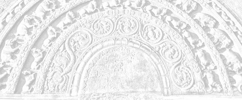

# Sermon 10

> Namo tassa bhagavato arahato sammāsambuddhassa \
> Namo tassa bhagavato arahato sammāsambuddhassa \
> Namo tassa bhagavato arahato sammāsambuddhassa
>
> *Etaṁ santaṁ, etaṁ paṇītaṁ, \
> yadidaṁ sabbasaṅkhārasamatho sabbūpadhipaṭinissaggo \
> taṇhakkhayo virāgo nirodho nibbānaṁ.*[^fn348]
>
> "This is peaceful, this is excellent, \
> namely the stilling of all preparations, the relinquishment of all assets, \
> the destruction of craving, detachment, cessation, extinction."

With the permission of the Most Venerable Great Preceptor and the assembly of
the venerable meditative monks.

This is the tenth sermon in the series of sermons on Nibbāna. With the help of a
parable based on the problem of the gem in the *Ummaggajātaka*, we made an
attempt, towards the end of our last sermon, to clarify to some extent how the
personality view arises due to the ignorance of the fact that name-and-form is
something reflected on consciousness.

We mentioned in brief how a certain would-be wise man took the trouble to empty
a pond and even dig out the mud under the impression that there is actually a
gem in it, simply because there appeared to be a gem in the pond.

Similarly, by taking to be real name-and-form, which is only an image reflected
on consciousness leading to a personality view, *sakkāyadiṭṭhi*, both eternalism
and nihilism, built on the two views of existence and non-existence, tended
towards two extremes. Under the influence of self love, eternalism took up the
view that there is a self, and looked forward to its perpetuation. Prompted by
self hate, annihilationism or nihilism cherished the fond hope that the release
from this self will occur at death. Both these extreme views confuse the issue
by not understanding the reflected image as such.

Now how did the middle path, which the Buddha introduced to the world, avoid
these two extremes? It is by offering a knowledge and vision of things as they
are, *yathābhūtañāṇadassana*, in place of those two views of existence and
non-existence. In other words, he made known to the world the true knowledge and
vision that name-and-form is merely an image reflected on consciousness.

There is a special significance in the word *yathābhūta*. In contradistinction
to the two words *bhava* and *vibhava*, the word *bhūta* has some peculiarity of
its own. In order to clarify the meaning of the term *yathābhūta*, we can draw
upon a discourse in the *Itivuttaka*, a few lines of which we had already quoted
at the end of the previous sermon. When presented in full, that discourse will
make it clear why the Buddha introduced the word *bhūta* in preference to the
existing usage in terms of *bhava* and *vibhava*. This is how that discourse
proceeds:

> *Dvīhi, bhikkhave, diṭṭhigatehi pariyuṭṭhitā devamanussā olīyanti eke,
> atidhāvanti eke, cakkhumanto va passanti. Kathañca, bhikkhave, olīyanti eke?
> Bhavārāmā, bhikkhave, devamanussā bhavaratā bhavasammuditā, tesaṁ
> bhavanirodhāya dhamme desiyamāne cittaṁ na pakkhandati na pasīdati na
> santiṭṭhati nādhimuccati. Evaṁ kho, bhikkhave, olīyanti eke.*
>
> *Kathañca, bhikkhave, atidhāvanti eke? Bhaveneva kho pana eke aṭṭīyamānā
> harāyamānā jigucchamānā vibhavaṁ abhinandanti – yato kira, bho, ayaṁ attā
> kāyassa bhedā paraṁ maraṇā ucchijjati vinassati na hoti paraṁ maraṇā, etaṁ
> santaṁ etaṁ paṇītaṁ etaṁ yāthāvanti. Evaṁ kho, bhikkhave, atidhāvanti eke.*
>
> *Kathañca, bhikkhave, cakkhumanto passanti? Idha bhikkhu bhūtaṁ bhūtato
> passati, bhūtaṁ bhūtato disvā bhūtassa nibbidāya virāgāya nirodhāya paṭipanno
> hoti. Evaṁ kho, bhikkhave, cakkhumanto va passantī'ti.*[^fn349]
>
> Obsessed by two views, monks, are gods and men, some of whom lag behind, while
> others overreach. Only they do see that have eyes to see. How, monks, do some
> lag behind? Gods and men, monks, delight in existence, they are attached to
> existence, they rejoice in existence. When Dhamma is being preached to them
> for the cessation of existence, their minds do not reach out towards it, do
> not get pleased in it, do not get steadied in it, do not rest confident with
> it. It is thus that some lag behind.
>
> How, monks, do some overreach? Being troubled, ashamed, and disgusted of
> existence as such, some delight in non-existence – since this self, at the
> breaking up of this body after death, will be annihilated and destroyed, this
> is peace, this is excellent, this is how it should be. Thus, monks do some
> overreach.
>
> And how, monks, do those with eyes see? Herein a monk sees the become as
> become. Having seen the become as become, he is treading the path towards
> dejection, dispassion and cessation regarding becoming. Thus it is, monks,
> that those with eyes see.

This passage clearly brings out the extreme nature of those two views of
existence and non-existence. The two verses occurring at the end of this sutta
present the gist of the discourse even more clearly:

> *Ye bhūtaṁ bhūtato disvā,* \
> *bhūtassa ca atikkamaṁ,* \
> *yathābhūte vimuccanti,* \
> *bhavataṇhā parikkhayā.*
>
> *Sa ve bhūtapariñño so,* \
> *vītataṇho bhavābhave,* \
> *bhūtassa vibhavā bhikkhu,* \
> *nāgacchati punabbhavaṁ.*
> 
> Those who have seen the become as become, \
> As well as the going beyond of whatever has become, \
> Are released in regard to things as they are, \
> By the exhaustion of craving for becoming.
>
> That monk, who has fully comprehended the become, \
> Who is devoid of craving for continued becoming, \
> By the discontinuation of what has become, \
> Will not come back again to a state of becoming.

Now it is extremely clear, even from the quotation as it stands, that the Buddha
has interposed this word *bhūta* between the dichotomous terms *bhava* and
*vibhava*. In the contemporary society, these two terms were used to denote the
existence and the destruction of a soul. This usage is clearly revealed by some
discourses, in which those who held on to similar views expressed them in such
terms as *bhavissāmi* and *na bhavissāmi*.[^fn350] These expressions, meaning 'I
will be' and 'I will not be', carry with them an implication of a person or a
self.

The term *bhūta*, on the other hand, is not amenable to such a usage. It has the
passive sense of something that has become. Like that reflection mentioned
earlier, it conveys the idea of being produced by causes and conditions. Going
by the analogy of the reflected image mentioned above, the eternalist, because
of his narcissistic selflove, gets attached to his own self image and lags
behind. When the Buddha preaches the Dhamma for the cessation of existence, he
shrinks from fear that it would lead to the destruction of his self. It is like
the narcissistic attempt to embrace one's own image in water out of self love.

The annihilationist view leads to an attitude of escapism, like that of one who
is obsessed by his own shadow. One cannot outstrip one's own shadow. It is only
a vain attempt. So also is the fond hope of the nihilist that by simply negating
self one can be free from repeated birth. It turns out to be mere wishful
thinking, because simply by virtue of the view 'I shall not be after death' one
cannot win deliverance, so long as such defilements like ignorance and craving
are there. These were the two extremes towards which those two dogmatic views of
eternalism and annihilationism tended.

By introducing the term *bhūta* the Buddha made it known that the five groups
are the product of causes and conditions, that they are conditionally arisen. In
the *Itivuttaka*, for instance, one comes across the following significant
lines:

> *Jātaṁ bhūtaṁ samuppannaṁ, kataṁ saṅkhatamaddhuvaṁ.*[^fn351]

The reference here is to the five groups of grasping. They are 'born', 'become',
'arisen' (that is conditionally arisen), 'made up', 'prepared', and 'unstable'.
These words are suggestive of some artificiality. The word *addhuvaṁ* brings out
their impermanence and insubstantiality. There is no eternal essence, like
*sat*, or being. It is merely a self image, a reflection. So it seems that the
word *bhūta* has connotations of being a product of causes and conditions.

Therefore, in spite of the scare it has aroused in the soul-theorists, Nibbāna
is not something that destroys a truly existing entity. Though Nibbāna is called
*bhavanirodha*,[^fn352] cessation of existence, according to the outlook of the
Buddha the worldlings have merely a craving for existence, *bhavataṅhā*, and not
a real existence. It is only a conceit of existence, the conceit 'am',
*asmimāna*.

In reality it amounts to a craving, and this is the significance of the term
*taṅhā ponobhāvikā*, craving which makes for re-becoming. Because of that
craving, which is always bent forward, worldlings keep running round in
*saṁsāra*. But on analysis a concrete situation always reveals a state of a
become, a *bhūta*, as something produced by causes and conditions.

A donkey drags a wagon when a carrot is projected towards it from the wagon. The
journey of beings in *saṁsāra* is something like that. So what we have here is
not the destruction of some existing essence of being or a soul. From the point
of view of the Dhamma the cessation of existence, or *bhavanirodha*, amounts to
a stopping of the process of becoming, by the removal of the causes leading to
it, namely ignorance and craving. It is, in effect, the cessation of suffering
itself.

Those who held on to the annihilationist view, entertained the hope that their
view itself entitled them to their cherished goal. But it was in vain, because
the ignorance, craving, and grasping within them created for them the five
groups of grasping, or this mass of suffering, again and again despite their
view, *uppajjati dukkham idaṁ punappunaṁ*.

So what we have here is a deep philosophy of things as they are, which follows a
certain law of causality. The Buddha's middle path is based on this knowledge
and vision of things as they are, avoiding both extremes of self indulgence and
self mortification.

Let us now consider the question of existence involved in this context. The
terms *bhava* and *vibhava* are generally associated with the idea of worlds'
existence. Some seem to take *atthi*, or 'is', as the basic element in the
grammatical structure. Very often those upholders of dogmatic views brought up
such propositions as 'everything exists', *sabbaṁ atthi*, and 'nothing exists',
*sabbaṁ natthi*, before the Buddha, expecting him to give a categorical
answer.[^fn353]

But the Buddha pointed out that *asmi*, or 'am', is more basic than the usage of
'is' and 'is not'. The most elementary concept is *asmi*, or 'am'. Hence the
term *asmimāna*, the conceit 'am'. In the grammatical structure, the pride of
place should be given to *asmi*, or 'am'. We sometimes tend to regard *atthi*,
or 'is', as the primary term. But *asmi* deserves pride of place in so far as it
is the basic element in the grammatical structure. It is like the central peg
from which all measurings and surveyings of the world start, since the word
*māna* in *asmimāna* also means 'measuring'. Given *asmi*, or 'am', everything
else comes to be.

Let us take an illustration. If, for instance, we say "there is something",
someone will pose the question: "Where is it?" It should be either here or there
or yonder, that is, over there. It can be in one of those three places. Now, if
it is here, how does that place become a 'here'? That is where I am. 'There' is
where he is, and 'yonder' is where you are.

So we have here the framework of the grammar. Here is the basic lining up for
the formation of the grammatical structure, its most elementary pattern. So,
then, 'I am', 'you are', and 'he is'. In this way we see that one can speak of
the existence of something relative to a viewpoint represented by 'am' or 'I
am'. That is why the Buddha rejected as extremes the two views of absolute
existence and absolute non-existence, based on 'is', *atthi*, and 'is not',
*natthi*.

Only when there is an 'I', can something exist relative to that I. And that
something, if it is 'there', it is where 'I' am not present, or at a distance
from me. If it is 'yonder', or over there, it is before you who are in front of
me. And if it is 'here', it is beside me. From this we can see that this conceit
'am' is, as it were, the origin of the whole world, the origin of the world of
grammar.

On a previous occasion, too, while discussing the significance of the two terms
*itthabhāva* and *aññathābhāva*, we had to make a similar statement.[^fn354] The
Buddha draws our attention to a very important fact in this concern, namely, the
fact that the conceit 'am' does not arise without causes and conditions. It is
not something uncaused, and unconditioned. If it is uncaused and unconditioned,
it can never be made to cease. The notion 'am' arises due to certain causes and
conditions. There is a word suggestive of this causal origin, namely *upādāya*.

Now, for instance, we use the term *pañc'upādānakkhandha*. When we speak of the
five groups of grasping, the word *upādāna* (*upa + ā + dā*) is often rendered
by grasping. The prefix *upa* is supposed to imply the tenacity of the
hold.[^fn355]

One can therefore ask whether it is not sufficient to relax the hold on the five
groups. Strictly speaking, the prefix *upa* in *upādāna* conveys the sense of
proximity or nearness. Sometimes the two words *upeti* and *upādiyati* are found
in juxtaposition. *Upeti*, *upa + i*, to go, means 'coming near' or
'approaching', and *upādiyati* has the sense of 'holding on to', having come
close. In other words, we have here not only a case of holding, but of holding
'on to'.

So the totality of existence, from the point of view of Dhamma, is dependent on
a holding on, or a grasping on. It is not something uncaused and unconditioned.
Here we may remind ourselves of the simile of the winding of a rope or a cord
which we brought up in a previous sermon.[^fn356] We cannot help going back to
the same simile again and again, if we are to deepen our understanding of the
Dhamma.

In that illustration we spoke of two persons winding up several strands to make
a rope or a cord. But both are winding in the same direction from either end.
Such an attempt at winding, however long it is continued, does not result in an
actual winding, for the simple reason that the winding from one end is
continually being unwinded from the other end. But what happens if a third
person catches hold of the rope in the middle? Due to that hold on the middle,
something like a rope appears to get winded up.

Now existence, too, is something similar. It is because of the hold in the
middle that the rope gets wound up. From the point of view of an outsider, the
one in the middle is holding on to a rope. But the truth is, that the semblance
of a rope is there due to that holding on itself. This, then, is the norm of
this world. "Whatever is of a nature to arise, all that is of a nature to
cease," *yaṁ kiñci samudayadhammaṁ, sabbaṁ taṁ nirodhadhammaṁ*.[^fn357]

It is in the nature of things that every winding ends up in an unwinding. But
because of that hold in the middle, the windings get accumulated. Just because
of his hold in the middle, his hand is under stress and strain. Similarly, the
stress and strain that is existence is also due to a grasping or a holding on
to, *upādānapaccayā bhavo*.

In fact, we have not given this illustration merely for the sake of a simile. We
can adduce reasons for its validity even from the discourses. This word
*upādāya* is particularly noteworthy. As we have already shown, *upādāna* does
not simply mean grasping, or grasping rigidly, but holding on to something,
having come close to it. This holding on creates a certain relationship, which
may be technically termed a relativity. The two stand relative to each other.
For instance, that rope exists relative to the grasping of the person who holds
on to it. Now *upādāya* is the absolutive form of *upādāna*, it has the
implication of something relative.

There is a discourse in the *Khandhasaṁyutta*, which clearly reveals this fact.
It is a sermon preached by Venerable Puṇṇa Mantāṇiputta to Venerable Ānanda.
This is the relevant paragraph:

> *Upādāya, āvuso Ānanda, asmīti hoti, no anupādāya. Kiñca upādāya asmīti hoti,
> no anupādāya? Rūpaṁ upādāya asmīti hoti, no anupādāya; vedanaṁ upādāya asmīti
> hoti, no anupādāya; saññaṁ upādāya asmīti hoti, no anupādāya; saṅkhāre upādāya
> asmīti hoti, no anupādāya; viññāṇaṁ upādāya asmīti hoti, no anupādāya.
> Upādāya, āvuso Ānanda, asmīti hoti, no anupādāya.*
>
> *Seyyathāpi, āvuso Ānanda, itthī vā puriso vā daharo yuvā maṇḍanakajātiko
> ādāse vā parisuddhe pariyodāte acche vā udakapatte sakaṁ mukhanimittaṁ
> paccavekkhamāno upādāya passeyya, no anupādāya, evam eva kho, āvuso Ānanda,
> upādāya asmīti hoti, no anupādāya.*[^fn358]

Let us now try to get at the meaning of this important passage, which should
clarify further what we have already attempted to explain through similes.

> It is with dependence, friend Ānanda, that the notion 'am' occurs, not without
> dependence. With dependence on what, does the notion 'am' occur, and not
> without dependence? With dependence on form does the notion 'am' occur, not
> without dependence; with dependence on feeling does the notion 'am' occur, not
> without dependence; with dependence on perception does the notion 'am' occur,
> not without dependence; with dependence on preparations does the notion 'am'
> occur, not without dependence; with dependence on consciousness does the
> notion 'am' occur, not without dependence.
>
> Just as, friend Ānanda, a woman or a man, youthful and fond of adornment, in
> looking at her or his facial image in a mirror or in a bowl filled with pure,
> clear, clean water, would be seeing it with dependence and not without
> dependence, even so, friend Ānanda, it is with dependence that the notion 'am'
> occurs, not without dependence.

In fact, it is rather difficult to render the word *upādāya*. It means 'in
dependence on' something and has a relative sense. Reinforced with the emphatic
double negative, the assertion seems to imply that the notion 'am' is something
dependent and not independent, that it arises due to causes and conditions. In
the explanation that follows, this dictum is substantiated by bringing in the
five groups or aggregates, relative to which one posits an 'am'.

The subsequent illustration serves to bring out the required nuance of the term
*upādāya*, which is more often connected with the rather gross idea of grasping.
The young woman or the young man is looking at her or his face in a mirror. They
can see their own face, or the sign of it, *mukhanimitta*, only with the help of
a mirror, that is, as an image reflected on it. They are dependent on a mirror
or a similar object for seeing their own face, not independent.

What Venerable Puṇṇa Mantāṇiputta seems to stress, is that the notion 'am' is
the result of grasping or holding on to form, feeling, perception, preparations,
and consciousness. It is when one looks into a mirror that one suddenly becomes
self-conscious. Whether one has a liking or a dislike for what one sees, one
gets the notion 'this is me'. So it is by coming close to a mirror which
reflects one's facial image that the notion 'am' occurs depending on it. The
word *upādāya* therefore approximates to the idea of coming close and holding on
to.

That notion occurs due to a relationship arising from that holding on. Even if
one already has no such notion, the moment one looks into a mirror one is
suddenly reminded of it, as if to exclaim: "Ah, here I am!" This is the gist of
what Venerable Puṇṇa Mantāṇiputta is trying to put across through this
discourse.

This shows that the conceit 'am' arises due to the five grasping groups. The
absolutive *upādāya*, though akin to *upādāna*, has a deeper significance. It is
a word suggestive of a relationship. It does not merely mean a holding on, but
also a certain necessary relationship arising out of that holding on.

Just as the looking into a mirror or a bowl of water gives rise to a facial
image as a reflection, here too the relationship calls forth the deluded
reflection "here I am". Given the notion "here I am", there follows the
corollary "things that are mine".

So there is supposed to be an 'I' in contradistinction to things that are
'mine'. It is the difficulty to demarcate the area of applicability between
these two concepts that has given rise to insoluble problems. "Who am I and what
is mine?" The twenty modes of personality view, *sakkāya diṭṭhi*, portray how
one is at one's wit's end to solve this problem.

Let us now see how the twenty modes of personality view are made up. For
instance, as regards form, it is fourfold as follows:

> *Rūpaṁ attato samanupassati, rūpavantaṁ vā attānaṁ, attani vā rūpaṁ, rūpasmiṁ
> vā attānaṁ*.[^fn359]
>
> He regards form as self, or self as possessing form, or form as in self, or
> self as in form.

It is the same with the other four groups. In this way, the personality view is
altogether twenty-fold.

All this comes about due to the ignorance that name-and-form is only a
reflection, like that facial image. In grasping this self image of name-and-form
one grasps the five groups. Attachment to name-and-form amounts to a holding on
to these five groups. To many, the relationship between name-and-form and the
grasping groups appears as a big puzzle. Wherever one looks, one sees this self
image of name-and-form. But when one grasps it, what comes within the grasp is a
group of form, feeling, perception, preparations, and consciousness.

The magical illusion created by consciousness is so complete that it is capable
of playing a dual role, as in double acting. Because it reflects, like a mirror,
consciousness itself is grasped, just as one grasps the mirror. Not only the
reflection of the mirror, but the mirror itself is grasped. The grasping group
of consciousness represents such a predicament.

One can form an idea about the relation between name-and-form and consciousness
by going deeper into the implications of this discourse. In the discussion of
the interrelation between name and form, the Buddha makes use of two highly
significant terms, namely *adhivacanasamphassa* and *paṭighasamphassa.*

How contact arises dependent on name-and-form is explained by the Buddha in the
*Mahānidānasutta* of the *Dīgha Nikāya*.[^fn360] It is addressed to Venerable
Ānanda in the form of a catechism.

*Phassa*, or contact, is a sort of hybrid, carrying with it the implications of
both *adhivacanasamphassa* and *paṭighasamphassa*. That is to say, it partakes
of the character of name, *nāma*, as suggested by *adhivacanasamphassa*, as well
as that of form, *rūpa*, indicated by *paṭighasamphassa*. This will be clear
from the relevant section of the catechism in the *Mahānidānasutta*:

> *"Nāmarūpapaccayā phasso'ti iti kho panetaṁ vuttaṁ, tad'Ānanda, imināpetaṁ
> pariyāyena veditabbaṁ, yathā nāmarūpapaccayā phasso. Yehi, Ānanda, ākārehi
> yehi liṅgehi yehi nimittehi yehi uddesehi nāmakāyassa paññatti hoti, tesu
> ākāresu tesu liṅgesu tesu nimittesu tesu uddesesu asati api nu kho rūpakāye
> adhivacanasamphasso paññāyethā'ti?"*
>
> *"No hetaṁ, bhante."*
>
> *"Yehi, Ānanda, ākārehi yehi liṅgehi yehi nimittehi yehi uddesehi rūpakāyassa
> paññatti hoti, tesu ākāresu tesu liṅgesu tesu nimittesu tesu uddesesu asati
> api nu kho nāmakāye paṭighasamphasso paññāyethā'ti?"*
>
> *"No hetaṁ, bhante."*
>
> *"Yehi, Ānanda, ākārehi yehi liṅgehi yehi nimittehi yehi uddesehi nāmakāyassa
> ca rūpakāyassa ca paññatti hoti, tesu ākāresu tesu liṅgesu tesu nimittesu tesu
> uddesesu asati api nu kho adhivacanasamphasso vā paṭighasamphasso vā
> paññāyethā'ti?"*
>
> *"No hetaṁ, bhante."*
>
> *"Yehi, Ānanda, ākārehi yehi liṅgehi yehi nimittehi yehi uddesehi nāmarūpassa
> paññatti hoti, tesu ākāresu tesu liṅgesu tesu nimittesu tesu uddesesu asati
> api nu kho phasso paññāyethā'ti?"*
>
> *"No hetaṁ, bhante."*
>
> *"Tasmātih'Ānanda, eseva hetu etaṁ nidānaṁ esa samudayo esa paccayo phassassa,
> yadidaṁ nāmarūpaṁ."*
>
> "From name-and-form as condition, contact comes to be. Thus it has been said
> above. And that Ānanda, should be understood in this manner, too, as to how
> from name-and-form as condition, contact arises. If, Ānanda, all those modes,
> characteristics, signs and exponents, by which the name-group, *nāma-kāya*, is
> designated were absent, would there be manifest any verbal impression,
> *adhivacanasamphassa*, in the form-group, *rūpa-kāya*?"
>
> "There would not, lord."
>
> "If, Ānanda, all those modes, characteristics, signs and exponents, by which
> the form-group is designated were absent, would there be manifest any
> resistance-impression, *paṭighasamphasso*, in the name-group?"
>
> "There would not, lord."
>
> "And if, Ānanda, all those modes, characteristics, signs and exponents, by
> which there is a designation of both name-group and form-group were absent,
> would there be manifest either any verbal impression or any
> resistance-impression?"
>
> "There would not, lord."
>
> "And if, Ānanda, all those modes, characteristics, signs and exponents, by
> which there comes to be a designation of name-and-form were absent, would
> there be manifest any contact?"
>
> "There would not, lord."
>
> "Wherefore, Ānanda, this itself is the cause, this is the origin, this is the
> condition for contact, that is to say, name-and-form."

With the help of four words of allied sense, namely *ākāra*, mode, *liṅga*,
characteristic, *nimitta*, sign, and *uddesa*, exponent, the Buddha
catechetically brings out four conclusions by this disquisition. They are:

1. By whatever modes, characteristics, signs and exponents the name-group,
   *nāma-kāya*, is designated, in their absence no designation of verbal
   impression, *adhivacanasamphassa*, in the form-group, *rūpa-kāya*, is
   possible.

2. By whatever modes, characteristics, signs and exponents the form-group is
   designated, in their absence no designation of resistance-impression,
   *paṭighasamphasso*, in the name-group, *nāmakāya*, is possible.

3. By whatever modes, characteristics, signs and exponents both name-group and
   form-group are designated, in their absence no designation of verbal
   impression or resistance-impression is possible.

4. By whatever modes, characteristics, signs and exponents name-and-form is
   designated, in their absence no designation of contact is possible.

All this may well appear like a riddle, but then let us consider what
name-and-form means, to begin with. The definition we gave to *nāma* in our very
first sermon happened to be different from the well known definition nowadays
given in terms of a bending.[^fn361]

We interpreted *nāma* in the sense of a 'naming'. Now this term *adhivacana*
also conveys the same idea. *Adhivacana*, synonym, *nirutti*, nomenclature, and
*paññatti*, designation, are part and parcel of linguistic usage.

In the *Niruttipathasutta* of the *Khandhasaṁyutta* one comes across three
terms, *niruttipatha, adhivacanapatha,* and *paññattipatha*, pathways of
nomenclature, pathways of synonyms, pathways of designation.[^fn362] There three
terms are closely allied in meaning, in that they bring out in sharp relief
three aspects of linguistic usage.

*Nirutti* emphasises the explanatory or expository function of language,
*adhivacana* its symbolic and metaphorical character, while *paññatti* brings
out its dependence on convention.

What we have here is *adhivacanasamphassa*. Its affinity to name is obvious, and
this is precisely the meaning we attributed to *nāma*. Therefore, what we have
in this concept of *nāmakāya*, or name-group, literally 'name-body', is a set of
first principles in linguistic usage pertaining to definition.

The form-group, or *rūpakāya*, literally 'form-body', on the other hand has
something to do with resistance, as suggested by the term *paṭighasamphassa*.
*Paṭigha* means 'striking against'. Form, or *rūpa,* has a striking quality,
while name, or *nāma,* has a descriptive quality. *Phassa*, or contact, is a
hybrid of these two. This is what gives a deeper dimension to the above
disquisition.

The point that the Buddha seeks to drive home is the fact that the concept of
contact necessarily presupposes both name and form. In other words, name and
form are mutually interrelated, as already stated above. There would be no
verbal impression in the form-group, if there were no modes, characteristics,
etc., proper to name. Likewise there could be no resistant impression in the
name-group, if there were no modes, characteristics, etc., proper to form.

At first sight these two may appear as totally opposed to each other. But what
is implied is a case of mutual interrelation. The expression peculiar to the
name-group is a necessary condition for the form-group, while the resistance
peculiar to the form-group is a necessary condition for the name-group. Since
here we have something deep, let us go for an illustration for the sake of
clarity.

As we have already stated, a verbal impression in regard to the form-group is
there because of the constituents of the name-group. Now the form-group consists
of the four great primaries earth, water, fire and air. Even to distinguish
between them by their qualities of hardness and softness, hotness and coolness,
etc., feeling, perception, intention, contact and attention, which are the
constituents of the name-group, have to play their part. Thus it is with the
help of those members on the name side that the four basic elements associated
with form receive recognition.

Metaphor is a figure of speech, common in ornate literary language as well as in
technical terminology. Here the inanimate is animated by personification. What
is proper to the animate world is superimposed on the inanimate. Now the word
*adhivacana* is, even literally, a superimposition, and it is a term with
obvious metaphorical associations. Whereas in the literary field it has an
ornate value as a figurative expression, in technical usage it serves the
purpose of facility of expression by getting the tools to speak for themselves.

For instance, a carpenter might speak of two planks touching each other as if
they can actually touch and feel. The concept of touch, even when it is
attributed to inanimate objects, is the outcome of attention, in this case the
attention of the carpenter. Here, again, we are reminded of the role of
attention in the origination of things as stated in the *Kiṁmūlakasutta* and
*Samiddhisutta* discussed above.[^fn363]

In accordance with the dictum "Mind is the forerunner of all things",[^fn364]
"All things are rooted in interest, they originate with attention and arise out
of contact", *chandamūlakā, āvuso, sabbe dhammā, manasikārasambhavā,
phassasamudayā* (etc.).[^fn365] Wherever the carpenter's interest went, his
attention discovered and picked up the thing, and here the thing is the fact of
two planks touching each other.

Interest, attention and contact together bring out some deeper implications of
the law of dependent arising. Not only with regard to inanimate objects, but
even in the case of this conscious body, the question of contact is related to
the fact of attention.

If, for instance I ask what I am touching now, one might say that I am touching
the palm leaf fan in my hand. This is because we usually associate the idea of
touching with the hand that holds. But suppose I put away the fan and ask again
what I am touching now, one might find it difficult to answer. It might not be
possible for another to guess by mere external observation, since it is
essentially subjective. It is dependent on my attention. It could even be my
robe that I am touching in the sense of contact, in which case I am becoming
conscious of my body as apart from the robe I am wearing.

Consciousness follows in the wake of attention. Whatever my attention picks up,
of that I am conscious. Though I have in front of me so many apparently visible
objects, until my attention is focussed, eye-consciousness does not come about.
The basic function of this type of consciousness, then, is to distinguish
between the eye and the object seen. It is only after the eye has become
conscious, that other factors necessary for sense perception fall into place.

The two things born of that basic discrimination, together with the
discriminating consciousness itself, that is eye-consciousness, make up the
concept of contact.

> *Cakkhuñca paṭicca rūpe ca uppajjati cakkhuviññāṇaṁ, tiṇṇaṁ saṅgati
> phasso*.[^fn366]
>
> Dependent on eye and forms, eye-consciousness arises, the concurrence of the
> three is contact.

The same principle holds good in the case of the two planks touching each other.
All this goes to show that it is with the help of the factors in the name-group
that we can even metaphorically speak of a contact between inanimate things.

Let us now consider how resistance-impression, *paṭighasamphassa*, comes about.
It is said that the factors of the form-group have a part to play in producing
resistance-impression on the name-group. We sometimes speak of an idea 'striking
us', as if it were something material. Or else an idea could be 'at the back' of
our mind and a word 'on the tip' of our tongue.

The clearest manifestation of contact is that between material objects, where
collision is suggestive of resistance, as implied by the word *paṭigha*. This
primary sense of striking against or striking together is implicit even in the
simile given by the Buddha in the *Dhātuvibhaṅgasutta* of the *Majjhima Nikāya*,
and in the *Phassamūlakasutta* of the *Saṁyutta Nikāya*, concerning two sticks
being rubbed together to kindle a fire.[^fn367]

Though as a gross manifestation contact is primarily associated with the
form-group, it is essentially connected with the name-group, as we have already
explained with illustrations. It is when both resistance-impression and verbal
impression come together that contact arises, dependent on name-and-form,
*nāmarūpapaccayā phasso*.

Another point that needs to be clarified in this connection is the exact
significance of the word *rūpa*. This word has been variously interpreted and
explained among different Buddhist sects. How did the Buddha define *rūpa*? In
ordinary usage it can mean either forms visible to the eye, or whatever is
generally spoken of as 'material'. Its exact significance has become a subject
of controversy. What precisely do we mean by '*rūpa*'?

The Buddha himself has explained the word, giving the following etymology in the
*Khajjanīyasutta* of the *Khandhasaṁyutta* in the *Saṁyutta Nikāya*. While
defining the five groups there, he defines the form group as follows:

> *Kiñca, bhikkhave, rūpaṁ vadetha? Ruppatī'ti kho, bhikkhave, tasmā rūpan'ti
> vuccati. Kena ruppati? Sītena pi ruppati, uṇhena pi ruppati, jighacchāya pi
> ruppati, pipāsāya pi ruppati, daṁsamakasavātātapasiriṁsapasamphassena pi
> ruppati. Ruppatī'ti kho, bhikkhave, tasmā rūpan'ti vuccati.*[^fn368]
>
> And what, monks, do you call *rūpa*? It is affected, monks, that is why it is
> called *rūpa*. Affected by what? Affected by cold, affected by heat, affected
> by hunger, affected by thirst, affected by contact with gadflies, mosquitoes,
> wind, sun and serpents. It is affected, monks, that is why it is called
> *rūpa*.

This definition seems to convey something very deep, so much so that various
Buddhist sects came out with various interpretations of this passage. The Buddha
departs from the way of approach taken up by the materialistic systems of
thought in the world in defining *rūpa* with *ruppati*, 'being affected'.

It is not the inanimate trees and rocks in the world that are said to be
affected by cold and heat, but this conscious body. So this body is not
conceived of as a bundle of atoms to be animated by introducing into it a life
faculty, *jīvitindriya*. What is meant by *rūpa* is this same body, this body
with form, which, for the meditator, is a fact of experience.

Attempts at interpretation from a scholastic point of view created a lot of
complications. But the definition, as it stands, is clear enough. It is directly
addressed to experience. The purpose of the entire Dhamma preached by the Buddha
is not to encourage an academic dabbling in philosophical subtleties with a mere
jumble of words. The purpose is utter disenchantment, dispassion and cessation,
*ekantanibbidāya, virāgāya, nirodhāya*.[^fn369]

Therefore the etymology given here in terms of *ruppati*, 'to be affected', is
in full accord with that purpose. *Rūpa* is so called, because it is affected by
cold, heat, and the sting of gadflies, mosquitoes, etc., not because of any
atomism in it.

If we are to examine further the meaning of this verb *ruppati*, we can count on
the following quotation from the *Piṅgiyasutta* of the *Pārāyanavagga* in the
*Sutta Nipāta*. It runs:

> *ruppanti rūpesu janā pamattā,*[^fn370]
>
> heedless men are affected in regard to forms.

The canonical commentary *Cūḷaniddesa*, commenting on the word, brings out the
various nuances connected with it.

> *Ruppantīti kuppanti pīḷayanti ghaṭṭayanti byādhitā domanassitā honti*.[^fn371]
>
> *Ruppanti* means to be adversely affected, to be afflicted, to come into
> contact with, to be dis-eased and dis-pleased.

Surely it is not the trees and rocks that are affected in this manner. It is
this animate body that is subject to all this. The pragmatic purpose of utter
detachment, dispassion and cessation is clear enough even from this commentary.

What is known as the form-group, *rūpakkhandha*, is one vast wound with nine
apertures.[^fn372] This wound is affected when it is touched by cold and heat,
when gadflies and mosquitoes land on it. This wound gets irritated by them.

We come across yet another canonical reference in support of these nuances in
the following two lines in the *Uṭṭhānasutta* of the *Sutta Nipāta*.

> *Āturānañhi kā niddā, sallaviddhāna ruppataṁ*.[^fn373]
>
> For what sleep could there be for those who are afflicted, being pierced with
> a dart.

These two lines stress the need for heedfulness for beings pierced with the
arrow of craving. Here, too, the verb *ruppati* has the sense of being affected
or afflicted. All this goes to show that the early Buddhist concept of *rūpa*
had a striking simplicity about it.

As we have already stated at the very outset, the teachings in the discourses
are simple enough. But there is a certain depth in this very simplicity, for it
is only when the water is lucid and limpid that one can see the bottom of a
pond. But with the passage of time there was a tendency to lose interest in
these discourses, because of the general predilection for complexity.

Materialistic philosophers, in particular, were carried away by this trend,
whether they were Hindus or Buddhists. Modern day scientists, too, got caught in
this trend. They pursued the materialistic overtones of the word *rūpa*, without
realizing that they are running after a mirage.

They went on analysing matter, until they ended up with an atomism and grasped a
heap of concepts. The analysis of matter thus precipitated a grasping of a mass
of concepts. Whether one grasps a pole or a mole, it is a grasping all the same.

The Buddha's admonitions, on the contrary, point in a different direction. He
pointed out that in order to be free from the burdensome oppression of form, one
has to be free from the perception of form. What is of relevance here is the
very perception of form, *rūpasaññā*. From the point of view of Dhamma, any
attempt at analysis of the materialistic concept of form, or any microscopic
analysis of matter, would lead to a pursuit of a mirage.

This fact, the modern day scientist is now in a position to appreciate. He has
found that the mind with which he carries on the analysis is influencing his
findings at every level. In other words, he has been running after a mirage, due
to his ignorance of the mutual interrelation between name and form. One would
not be in such a plight, if one understands that the real problem at issue is
not that of form, but of the perception of form.

In an earlier sermon we happened to quote a verse which makes it extremely
clear. Let us now hark back to that verse, which occurs in the *Jaṭāsutta* of
the *Saṁyutta Nikāya*.

> *Yattha nāmañca rūpañca,* \
> *asesaṁ uparujjhati,* \
> *paṭighaṁ rūpasaññā ca,* \
> *etthesā chijjate jaṭā.*[^fn374]
> 
> Where name and form \
> As well as resistance and perception of form \
> Are completely cut off, \
> It is there that the tangle gets snapped.

The entire *saṁsāric* problem is solved when the tangle gets snapped. Name and
form, resistance and perception of form are completely cut off in that
non-manifestative consciousness mentioned in our earlier sermons.[^fn375] That,
in effect, is the end of the tangle within and the tangle without.

Our discussion of the law of dependent arising must have made it clear that
there is an interrelation between name-and-form and consciousness on the one
hand, and between name and form themselves on the other. This, then, is a case
of a tangle within and a tangle without.

Like the central spot of a whirlpool, the deepest point of the entire formula of
*paṭicca samuppāda* is traceable to the interrelation that obtains between name
and form on the one hand, and between name-and-form and consciousness on the
other.

As far as the significance of perception of form is concerned, the true purpose
of the spiritual endeavour, according to the Buddha, is the very freedom from
this perception of form. How does perception of form come about? It is due to
that 'striking against', or resistance. Perception of form arises, for instance,
when gadflies and mosquitoes land on this body.

As we have already mentioned, even the distinctions of hard and soft, etc., with
which we recognize the four elements, is a matter of touching. We are only
trying to measure and gauge the four great primaries with this human frame. We
can never ever comprehend fully the gamut of these four great primaries. But we
are trying to understand them through this human frame in a way that is
meaningful to our lives.

All kinds of beings have their own specific experience of 'touch', in relation
to their experience of the four elements. So what we have here is entirely a
question of perception of form.

The true purpose, then, should be the release of one's mind from this perception
of form. It is only when the mind is freed from resistance and the perception of
form, as well as from name-and-form, that one can win to the deliverance from
this problem of the tangle within and the tangle without that is *saṁsāra*.

Yet another fact emerges from the above discussion. The two views of existence
and non-existence, *bhava / vibhava*, asserting an absolute existence and an
absolute non-existence, seem to have posed an insoluble problem to many
philosophers. Concerning the origin of the world, they wondered whether *sat*,
or being, came out of *asat*, or non-being, or vice versa.

All these problems arose out of a misunderstanding about form, or material
objects, as we may well infer from the following two lines of a verse in the
*Kalahavivādasutta* of the *Sutta Nipāta*.

> *Rūpesu disvā vibhavaṁ bhavañca, vinicchayaṁ kurute jantu loke.*[^fn376]
>
> Having seen the existence and destruction of material forms, a man in this
> world comes to a conclusion.

What is the conclusion? That there is an absolute existence and an absolute
non-existence. One comes to this conclusion drawing an inference from the
behaviour of visible objects.

For instance, we could presume that this machine before us exists in an absolute
sense, ignoring the causes and conditions underlying its existence. The day this
machine is destroyed we would say: "It was, but now it is not."

The Buddha has pointed out that such absolute views of existence and
non-existence are a result of an incorrect understanding about form. What
actually is involved here is the perception of form. Due to a misconception
about the perception of form, the world inclines towards the two extreme views
of absolute existence and absolute non-existence.

So the whole point of our discussion today has been the clarification of the
mutual interrelation between name and form, to show that name-and-form itself is
only an image, or a shadow, reflected on consciousness.

[^fn348]: M I 436, *Mahāmālunkyasutta*

[^fn349]: It 43, *Diṭṭhigatasutta*

[^fn350]: E.g. at M I 8, *Sabbāsavasutta*; or at M I 135, *Alaggadūpamasutta*

[^fn351]: It 37, *Ajātasutta*

[^fn352]: E.g. at A V 9, *Sāriputtasutta*

[^fn353]: E.g. at S II 76, *Jāṇussoṇisutta*

[^fn354]: See *Sermon 2*

[^fn355]: Vism 569

[^fn356]: See *Sermon 8*

[^fn357]: S V 423, *Dhammacakkappavattanasutta*

[^fn358]: S III 105, *Ānandasutta*

[^fn359]: M I 300, *Cūḷavedallasutta*

[^fn360]: D II 62, *Mahānidānasutta*

[^fn361]: See *Sermon 1*

[^fn362]: S III 71, *Niruttipathasutta*

[^fn363]: A IV 385, *Samiddhisutta*; A IV 338, *Kiṁmūlakasutta*; see *Sermon 9*

[^fn364]: Dhp 1, *Yamakavagga*

[^fn365]: A IV 338, *Kiṁmūlakasutta*

[^fn366]: M I 111, *Madhupiṇḍikasutta*

[^fn367]: M III 242, *Dhātuvibhaṅgasutta*; S IV 215, *Phassamūlakasutta*

[^fn368]: S III 86, *Khajjanīyasutta*

[^fn369]: This expression occurs e.g. at D II 251, *Mahāgovindasutta*

[^fn370]: Sn 1121, *Piṅgiyamāṇavapucchā*

[^fn371]: Nidd II 238

[^fn372]: A IV 386, *Gaṇḍasutta*

[^fn373]: Sn 331, *Uṭṭhānasutta*

[^fn374]: S I 13, *Jaṭāsutta*; see *Sermon 1*

[^fn375]: See *Sermon 7*

[^fn376]: Sn 867, *Kalahavivādasutta*
