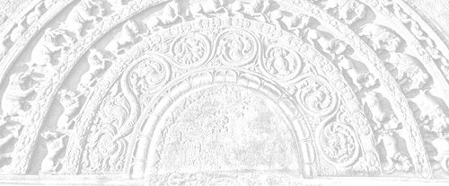

# Sermon 11

> Namo tassa bhagavato arahato sammāsambuddhassa \
> Namo tassa bhagavato arahato sammāsambuddhassa \
> Namo tassa bhagavato arahato sammāsambuddhassa
>
> *Etaṁ santaṁ, etaṁ paṇītaṁ, \
> yadidaṁ sabbasaṅkhārasamatho sabbūpadhipaṭinissaggo \
> taṇhakkhayo virāgo nirodho nibbānaṁ.*[^fn377]
>
> "This is peaceful, this is excellent, \
> namely the stilling of all preparations, the relinquishment of all assets, \
> the destruction of craving, detachment, cessation, extinction."

With the permission of the Most Venerable Great Preceptor and the assembly of
the venerable meditative monks.

This is the eleventh sermon in the series of sermons on Nibbāna. In our last
sermon, we tried to explain that contact arises dependent on name-and-form,
because form gets a verbal impression by the naming quality in name, and name
gets a resistance-impression by the striking quality in form. In the context of
this Dhamma, contact, properly so-called, is a combination of these two, namely
verbal impression and resistance-impression.

We also happened to mention the other day a new etymological explanation given
by the Buddha to the word *rūpa*, quoting the relevant passage from the
*Khajjanīyasutta* of the *Khandhasaṁyutta* in the *Saṁyutta Nikāya*. He has
defined the form group with reference to 'affectation':

> *Ruppatī'ti kho, bhikkhave, tasmā rūpan'ti vuccati.*[^fn378]
>
> It is affected, monks, that is why it is called form. By what is it affected?
> By cold, heat, hunger, thirst, and the sting of gadflies, mosquitoes and the
> like.

While analysing the implications of this 'being affected', we mentioned that the
form group could be compared to a wound. According to the commentarial exegesis,
too, *ruppati* means to be adversely affected, to be afflicted, to come into
conflict with, to be diseased and displeased. These are reminiscent of the
responses usually associated with the person who has an easy lacerable wound. To
say that a *paṭighasamphassa* arises because of this lacerable quality is
therefore very apt.

The primary sense of the word *paṭigha* is 'striking against'. Perception of
form arises as a result of an attempt to understand through the factors on the
name side this particular striking against, which resembles the laceration of a
wound.

This perception of form, which follows in the wake of the feeling that arises
when something strikes against form, is like the groping of a blind man in the
dark. Generally, the worldling is in the habit of staring at the form that comes
within his grasp, to ascertain its true nature. Likewise, he touches the form he
sees with his eyes to verify it. As the saying goes: "Seeing is believing, but
touch is the real thing".

But both these attempts are like the gropings of a blind man. The worldling is
unable to get rid of his delusion completely by either of these methods. It is
because he is accustomed to draw conclusions under the influence of his
perception of the compact, *ghanasaññā*.

The fact that the two extreme views of existence and non-existence are also the
outcome of this perception of the compact in regard to form, is borne out by the
following two lines of the verse we quoted from the *Kalahavivādasutta* in our
previous sermon.

> *Rūpesu disvā vibhavaṁ bhavañca, vinicchayaṁ kurute jantu loke*.[^fn379]
>
> Having seen the existence and destruction of material forms, a man in this
> world comes to a conclusion.

The worldling has the idea that material forms have an absolute existence. This
idea is the result of his perception of form. It is a perception arising out of
his impression of that 'striking against'. Whatever the level of this perception
of form be, it is not better than the impression of a blind man. The two extreme
views of absolute existence and non-existence in the world are based on this
kind of impression.

Various types of views and opinions current in the world regarding material
forms and matter in general, are the outcome of the notion that they are
absolutely real. There is a tendency in the worldling to presume that what he
grasps with his hands and sees with his eyes exists absolutely. So a thing is
said to exist for some length of time, before it gets destroyed.

The logical conclusion, then, is that all things in the world exist absolutely
and that at some point of time they get absolutely destroyed. This is how the
two extreme views of absolute existence and absolute non-existence have arisen
in this world. This is the outcome of a perception of form, which is tantamount
to a pursuit of a mirage. It is an illusion.

The Buddha has declared, in the *Jaṭāsutta*, that where name-and-form as well as
resistance and perception of form are cut off and surcease, there the entire
*saṁsāric* problem, which amounts to a tangle within and a tangle without, is
also conclusively solved.[^fn380] That this is so could be inferred to some
extent from what we have discussed so far.

*Nāma* and *rūpa*, as well as *paṭigha-* and *rūpasaññā*, are highly significant
terms. *Paṭigha-* and *rūpasaññā* are equivalent to *paṭighasamphassa* and
*adhivacanasamphassa* respectively. Now as to this perception of form, it is
basically conditioned by contact. That is why the *Kalahavivādasutta* states
that contact is the cause of the two views of existence and non-existence.

In this *Kalahavivādasutta* one finds a series of questions and answers going
deeper and deeper into the analysis of contact, step by step.

The question *phasso nu lokasmiṁ kutonidāno*, "what is the cause of contact in
this world?"; gets the answer *nāmañca rūpañca paṭicca phasso*, "dependent on
name-and-form is contact".[^fn381]

The next question is: *Kismiṁ vibhūte na phussanti phassā*, "in the absence of
what, do contacts not bring about contact", or, "touches do not touch?" It gets
the answer: *Rūpe vibhūte na phusanti phassā*, "in the absence of form, contacts
do not bring about contact".

The question that comes up next, and the answer given, are extremely important.
They lead to a deep analysis of the Dhamma, so much so that both verses deserve
to be quoted in full. The question is:

> *Kathaṁsametassa vibhoti rūpaṁ,* \
> *sukhaṁ dukhaṁ vā pi kathaṁ vibhoti,* \
> *etaṁ me pabrūhi yathā vibhoti,* \
> *taṁ jāniyāmā iti me mano ahu.*[^fn382]
> 
> To one constituted in which manner does form cease to exist, \
> Or, how even pleasure and pain cease to exist, \
> Do tell me how all these become non-existent, \
> Let us know this, such a thought arose in me.

The answer to this question is couched in this extraordinary verse:

> *Na saññasaññī na visaññasaññī,* \
> *no pi asaññī na vibhūtasaññī,* \
> *evaṁ sametassa vibhoti rūpaṁ,* \
> *saññānidānā hi papañcasaṅkhā.*[^fn383]

What this verse purports to describe is the state of a person for whom form as
also pleasure and pain has ceased to exist. He is not one with normal
perception, nor is he one with abnormal perception. He is not non-percipient,
nor has he rescinded perception. It is to one constituted in this manner that
form ceases to exist, for, *papañcasaṅkhā* – whatever they may be – have
perception as their source.

The meaning of this verse needs to be clarified further. According to the
*Mahāniddesa*, the allusion in this verse is to one who is on the path to the
formless realms, having attained the first four absorptions.[^fn384] The
commentary is forced to that conclusion, because it takes the phrase *na
vibhūtasaññī* as negating formless realms as such. The assumption is that the
person referred to is neither conscious with normal perception, nor abnormally
unconscious, nor devoid of perception, as in the attainment of cessation, nor in
one of the formless attainments. So then, the only possibility seemed to be to
identify it with some intermediate state. That is why the *Mahāniddesa* and the
other commentaries interpret this problematic state as that of one who is on the
path to formless attainments, *arūpamaggasamaṅgi*.[^fn385]

However, considerations of context and presentation would lead to a different
conclusion. The extraordinary state alluded to by this verse seems to be a
surpamundane one, which goes far deeper than the so-called intermediate state.
The transcendence of form, indicated here, is more radical than the
transcendence in attaining to formless states. It is a transcendence at a
supramundane level, as we may well infer from the last line of the verse,
*saññānidānā hi papañcasaṅkhā.*

*Papañcasaṅkhā* is a term which has a relevance to insight meditation and the
denouement of the sutta is also suggestive of such a background.

The *Kalahavivādasutta*, consisting of sixteen verses, is, from beginning to
end, a network of deep questions and answers leading to levels of insight. The
opening verse, for instance, states the initial problem as follows:

> *Kuto pahūtā kalahā vivādā,* \
> *paridevasokā sahamaccharā ca,* \
> *mānātimānā saha pesuṇā ca,* \
> *kuto pahūtā te tad iṅgha brūhi.*[^fn386]
> 
> Whence do spring up contentions and disputes, \
> Lamentations, sorrows and envies, \
> And arrogance together with slander, \
> Whence do they spring up, pray tell me this.

It is in answer to this basic question that this discourse gradually unfolds
itself. In accordance with the law of dependent arising, the cause of
contentions and disputes is said to be the tendency to hold things dear,
*piyappahūtā kalahā vivādā*.

Then the question is about the cause of this idea of holding things dear. The
cause of it is said to be desire, *chandanidānāni piyāni loke.* Things dear
originate from desire. Desire, or interest, makes things 'dear'.

The next question is: What is the origin of desire? Desire is traced to the
distinction between the pleasant and the unpleasant. It is in reply to the
question regarding the origin of this distinction between the pleasant and the
unpleasant that contact is brought in.

In fact, it is the question as to the origin of contact, *phasso nu lokasmiṁ
kuto nidāno*, which formed the starting point of our discussion. The answer to
that question is name-and-form, *nāmañca rūpañca*. So in this chain of causes,
the link that comes next to contact is name-and-form.

Now the verse in question beginning with *na saññasaññī* goes deeper than
name-and-form. Even the question about contact has a peculiar wording: *Kismiṁ
vibhūte na phusanti phassā*, "When what is not there, do touches not touch?"

The question, then, is not just the cessation of contact as such. The answer,
too, has the same peculiarity. *Rūpe vibhūte na phusanti phassā*, "It is when
form is not there that touches do not touch". It is the subsequent question
regarding form that brings out the cryptic verse as the answer.

All this goes to show that the verse in question alludes to a supramundane state
far transcending the formless or any supposed intermediate stage. The
transcendence of pleasure and pain, as well as perception of form, is implied
here.

The verse beginning with *na saññasaññī* brings the entire analytical
disquisition to a climax. It comes as the thirteenth verse in the series.
Usually, such a disquisition leads up to a climax, highlighting Nibbāna. It is
obvious, therefore, that the reference here is to the *Nibbānic* mind.

We have here four negations: *Na saññasaññī – na visaññasaññī – no pi asaññī –
na vibhūtasaññī.* These four negations insinuate a strange supramundane level of
perception. In short, it is an attempt to analyse the crux of the Dhamma in
terms of perception. As to the provocation for such an approach, we may remind
ourselves of the fact that, according to the Buddha, release from materiality
amounted to a release from the perception of form. Here, we have something
really deep.

As it was stated in the *Jaṭāsutta*, for the disentangling of the tangle,
name-and-form, resistance and perception of form, have to be cut off. This last
mentioned perception of form, or *rūpasaññā*, is highly significant.

Before the advent of the Buddha the general belief, even among ascetics, was
that, in order to be free from form, one has to attain to the formless, *arūpa*,
But, as we pointed out in an earlier sermon, this kind of approach to the
question of freedom from form, is like the attempt of one who, having imagined a
ghost in the darkness of the night, runs away to escape it.[^fn387] He is simply
taking the fantasy of the ghost with him.

Likewise, perception of form is already implicit in the formless. What has been
done is only a pushing away of the perception of form with the help of
*saṅkhāras*. It is merely a suppression of form through the power of absorption.
It does not amount to a cessation of the perception of form.

What, then, is the message the Buddha gave to the world regarding the
abandonment by way of eradication? He pointed out that freedom from form can be
won only by comprehending a certain deep normative principle behind perception.

Till then, one keeps on going round and round in *saṁsāra*. Even if one breaks
away from form to stay for aeons in formless realms, one swings back to form at
the end of that period. Why? Because the ghost of form still haunts the
formless. It is precisely because of this fact that pre-Buddhistic ascetics
could not free themselves from the round of existence.

The *Kalahavivādasutta* as a whole, could be regarded as an extremely deep
analysis of the basis of the two views of existence and non-existence. Our
departure from the *Mahāniddesa* in regard to the interpretation of this
discourse might sometimes be called in question. But let the wise judge its
reasonableness on its own merits.

According to our interpretation so far, the thirteenth verse marks the climax of
the discourse, with its allusion to Nibbāna. This is obvious from the fourteenth
verse, in which the questioner confesses:

> *Yaṁ taṁ apucchimha akittayī no, aññaṁ taṁ pucchāma tad iṅgha brūhi.*[^fn388]
>
> Whatever we have asked you, that you have explained to us. Now we wish to ask
> you something else, pray, give us an answer to that too.

The question now posed is this:

> *Ettāvataggaṁ nu vadanti h'eke, yakkhassa suddhiṁ idha paṇḍitāse, udāhu aññam
> pi vadanti etto?*
>
> Do some, who are reckoned as wise men here, declare the highest purity of the
> soul with this much alone, or else do they posit something beyond this?

The interlocutor is trying to get the solution restated in terms of the two
views of existence and non-existence. The term *yakkha* is used in this context
in the sense of an individual soul.[^fn389]

It betrays an assumption based on a wrong view. The question concerns the purity
of the individual soul. The interlocutor wants to ascertain whether wise men in
the world declare this state as the highest purity of the soul, or whether they
go beyond this in postulating something more. Here is an attempt to get the
answer already given restated in terms of the soul theory, a sort of
anti-climax. The two concluding verses that follow, give the lie to this
presumptuous question.

> *Ettāvataggaṁ pi vadanti h'eke* \
> *yakkhassa suddhiṁ idha paṇḍitāse,* \
> *tesaṁ paneke samayaṁ vadanti* \
> *anupādisese kusalā vadānā.*
>
> Some, who are regarded as wise men here, \
> Call this itself the highest purity of the individual soul, \
> But there are again some among them, \
>  who speak of an annihilation, \
> Claiming to be experts in the cessation without residue.
>
> *Ete ca ñatvā upanissitā ti* \
> *ñatvā munī nissaye so vimaṁsī,* \
> *ñatvā vimutto na vivādam eti* \
> *bhavābhavāya na sameti dhīro.*
>
> Knowing that they are dependent on speculative views, \
> The sage with discernment, \
>  with regard to whatever is speculative, \
> Emancipated as he is through understanding, \
>  does not enter into dispute, \
> A truly wise man does not fall back either \
>  on existence or on non-existence.

The concluding verse amounts to a refutation of both these extreme views. The
truly wise sage, who is released with proper discernment of the nature of
dogmatic involvement, has no disputes with those who are at loggerheads with
each other on the issue of existence and non-existence. This, in effect, means
that Nibbāna as a goal avoids both extremes of eternalism and nihilism.

The *Upasīvasutta* in the *Pārāyanavagga* of the *Sutta Nipāta* provides further
proof of the plausibility of the above interpretation. There, Nibbāna as the
cessation of consciousness in the *arahant*, is compared to the extinction of a
flame.

> *Accī yathā vātavegena khitto* \
> *atthaṁ paleti na upeti saṅkhaṁ* \
> *evaṁ munī nāmakāyā vimutto* \
> *atthaṁ paleti na upeti saṅkhaṁ.*[^fn390]
> 
> As flame flung on by force of wind, \
> Reaches its end, comes not within reckoning, \
> So the sage, released from name-and-form, \
> Reaches his end, comes not within reckoning.

When a flame goes out, it cannot be reckoned as having gone in any of the
directions, like north, east, south, and west. All what can be said about it, is
that it has gone out.[^fn391]

Even after the Buddha has given this reply, the brahmin youth Upasīva,
entrenched as he is in the eternalist view, raises a question which is similar
to the one already quoted. He, too, is trying to understand it in terms of the
two extreme views of existence and non-existence.

> *Atthaṁgato so uda vā so natthi* \
> *udāhu ve sassatiyā arogo,* \
> *taṁ me munī sādhu viyākarohi,* \
> *tathā hi te vidito esa dhammo.*
> 
> Has he reached his end, or is he no more, \
> Or is he eternally well, \
> That to me, sage, in full explain, \
> For this Dhamma is well within your ken.

In the discourses we find similar instances of attempts to determine, in terms
of those two extreme views, even a conclusive statement of the Buddha on the
question of Nibbāna.

Yet another instance is found in the *Poṭṭhapādasutta* of the *Dīghanikāya*.
There the Buddha outlines the path to Nibbāna from the point of view of
perception. The discourse, therefore, is one that highlights the importance of
the term *saññā*. In that discourse, the path of training leading to Nibbāna is
introduced under the heading

> *anupubbābhisaññānirodha-sampajāna-samāpatti*,[^fn392]
>
> the attainment, with full awareness, to the gradual cessation of higher levels
> of perception.

What is significant in this particular context, is that the invitation for this
exposition came from the ascetics of other sects. In response to their request
to enlighten them on the subject of the cessation of higher levels of
perception, *abhisaññānirodha*, the Buddha gave quite a long account of the
course of training required for it. But at the end of that deep exposition, the
wandering ascetic Poṭṭhapāda raises the following question:

> *Saññā nu kho purisassa attā, udāhu aññā saññā aññā attā?*
>
> Is perception a man's soul, or is perception something and soul another?

This is typical of their bigotted attitude, which prevented them from
understanding this Dhamma, free from the soul prejudice.

We went so far as to bring out all this evidence, because the point at issue is
fairly important. Even the attempt of the *Mahāniddesa* to explain the verse
beginning with *na saññasaññī* is far from conclusive. It is not at all likely
that the ascetics of other sects subscribed to a view that the intermediate
stage between the fourth absorption and the first formless absorption is
equivalent to the purest state of the soul. Such an interim state is of no
account.

As we go on, we might come across further proof of the tenability of this
interpretation. The verse beginning with *na saññasaññī* is not easily
forgotten, because of its unusual accent on the negative particle.

We might have to hark back to it when we come across similar discourses dealing
with Nibbāna. Till then, let us remind ourselves of two similes we have already
given, in order to get a foretaste of the significance of this problematic
verse.

Firstly, the Buddha's simile of the magic show as an illustration for
consciousness in the *Pheṇapiṇḍūpamasutta* – *māyūpamañca viññāṇaṁ*.[^fn393]
While describing the five groups, he compares consciousness to a magical
performance at crossroads, conducted by a magician or his apprentice. A man with
the right type of vision, watching this magic show, understands that it is
empty, hollow and void of essence. It is as if he has seen through the tricks
and deceptions of the magician.

While watching a magic show, the audience in general reacts to it with gaping
mouths and exclamations. But how would a man with radical attention and
penetrative wisdom, who is fully aware of the tricks of the magician, watch a
magic show? He is simply looking on with a vacant gaze.

This reminds us of the significance of the word *viññāṇaṁ anidassanaṁ anantaṁ
sabbato pabhaṁ*.[^fn394] That gaze is 'endless', *anantaṁ*, in the sense that it
does not have the magic show as its object. It goes beyond. It is also
'non-manifestative', *anidassanaṁ*, since the magic show does not manifest
itself, as it has now been penetrated through with wisdom. This wisdom is
revealing in its 'all lustrous' nature, *sabbato pabhaṁ*, so much so that the
tricks are seen-through.

So this man with discernment is watching with a vacant gaze. Now how would such
a person appear to one who is deluded and enchanted by the magic show? The
latter might regard the former as an inattentive spectator who misses the magic
show. Or else, he might think that the other is out of his senses, or insensate.

What the riddle verse beginning with *na saññasaññī* refers to, is such a vacant
gaze. That is to say, the person referred to is not one with the ordinary
worldling's perception, which is deluded, nor has he fainted and become
unconscious, *na saññasaññī na visaññasaññī*. He is not in a trance, devoid of
perception, *no pi asaññī*, nor has he put and end to perception, *na
vibhūtasaññī*. What these four negations highlight, is that vacant gaze of the
one who is emancipated through wisdom.

Somewhat on the lines of the simile used by the Buddha, we might reintroduce, as
a flashback, the simile of the cinema.[^fn395] Though it has a modernistic
flavour, it could perhaps be more easily understood. Let us suppose that a
matinee show of a technicolour film is in progress with closed doors and
windows. Suddenly, by some technical defect, the doors and windows are flung
open. What would be the change of perspective in the spectator now? He, too,
would be looking on with a vacant gaze. Though still the show is going on, he is
no longer seeing it. A sort of 'cessation' has occurred, at least temporarily.

The theme as well as the objective of all our sermons is expressed in the
quotation beginning with "This is peaceful, this is excellent" (etc.), which
forms the rubric, as it were, for each sermon. The change that occurs in the
spectator now, is somewhat reminiscent of it. Though not all preparations, at
least those preparations connected with the film show are momentarily 'stilled'.
Whatever assets in the form of the bundle of experiences on which the film show
is evalued, are 'relinquished'. The craving or the desire for the show has gone
down. The colourful show has 'faded away', making way for detachment. The film
show has 'ceased' for him. It is also extinct for him, since his burning desire
has cooled off now. In this way, we can understand the four puzzling negations
in that riddle verse as an attempt to describe the vacant gaze of this
spectator, and that man with discernment at the magic show.

Another aspect of special significance in this riddle verse emerges from the
last line, *saññānidānā hi papañcasaṅkhā*, which could be tentatively rendered
as "for [whatever are termed] *papañcasaṅkhā* have perception as their source".

*Papañca* is a term with a deep philosophical dimension in Buddhism. In fact,
even the rise of many Buddhist sects could be put down to an insufficient
appreciation of its significance. In our own philosophical tradition, too, much
of the confusion with regard to the interpretation of Nibbāna seems to have come
about due to a lack of understanding in this particular field. Therefore we
propose to devote sufficient time and attention to clarify the significance of
this term *papañca*.

To begin with, we can bring up clear evidence of the fact that the word
*papañca* is used in the discourses to convey some deep idea. As a rule,
whenever the Buddha presents a set of ideas pertaining to some Dhamma topic, the
deepest or the most important of them is mentioned last.

This feature is quite evident in the *Aṅguttara Nikāya*, where very often a
sermon is seen to unfold itself in an ascending order, leading to a climax. In
an enumeration of items 'the last but not the least', happens to be the most
important. Granted that this is the general trend, we can trace as many as nine
such contexts among the suttas in which *papañca* is counted last.[^fn396] This
itself is a clue to its importance.

One of the most telling instances is to be found in the Eights of the *Aṅguttara
Nikāya*. It is called *Anuruddhamahāvitakkasutta*. There we are told that to
Venerable Anuruddha, once meditating in solitude in Pācīnavaṁsa Park, the
following seven thoughts occurred, concerning Dhamma.

> *Appicchassāyaṁ dhammo, nāyaṁ dhammo mahicchassa; santuṭṭhassāyaṁ dhammo,
> nāyaṁ dhammo asantuṭṭhassa; pavivittassāyaṁ dhammo, nāyaṁ dhammo
> saṅgaṇikārāmassa; āraddhaviriyassāyaṁ dhammo, nāyaṁ dhammo kusītassa;
> upaṭṭithasatissāyaṁ dhammo, nāyaṁ dhammo muṭṭhassatissa; samāhitassāyaṁ
> dhammo, nāyaṁ dhammo asamāhitassa; paññavato ayaṁ dhammo, nāyaṁ dhammo
> duppaññassa*.[^fn397]
>
> This Dhamma is for one who wants little, not for one who wants much; this
> Dhamma is for one who is contented, not for one who is discontent; this Dhamma
> is for one who is secluded, not for one who is fond of society; this Dhamma is
> for the energetic, not for one who is lazy; this Dhamma is for one who has set
> up mindfulness, not for one who is laggard in mindfulness; this Dhamma is for
> one who is composed, not for one who is flustered; this Dhamma is for one who
> is wise, not for one who is unwise.

When these seven thoughts occurred to him, Venerable Anuruddha kept on pondering
over them for a long while, probably with some Dhamma zest. He might have even
felt confident that this is a perfect set of Dhamma thoughts, since the number
is seven and wisdom comes last.

However, the Buddha was monitoring his behaviour of mind from Bhesakaḷāvanae,
many leagues away, and found that this set of seven is far from complete. So he
appeared before Venerable Anuruddha through his psychic power and, having first
commended Venerable Anuruddha for those seven thoughts, calling them 'thoughts
of a great man', *mahāpurisavitakka*, gave him an eighth to add on to them and
ponder upon. The eighth thought of a great man is:

> *Nippapañcārāmassāyaṁ Dhammo nippapañcaratino, nāyaṁ Dhammo papañcārāmassa
> papañcaratino*.
>
> This Dhamma is for one who likes and delights in *nippapañca* and not for one
> who likes and delights in *papañca*.

Following the Buddha's instructions in this concern, Venerable Anuruddha
attained *arahanthood*, and uttered two verses as a paean of joy. From the two
verses it becomes clear that the Buddha's helpful hint regarding *nippapañca* –
whatever it may mean – was what triggered off his attainment.

> *Yathā me ahu saṅkappo,* \
> *tato uttari desayi,* \
> *nippapañcarato Buddho,* \
> *nippapañcaṁ adesayi.*
> 
> *Tassāhaṁ Dhamma maññāya,* \
> *vihāsiṁ sāsane rato,* \
> *tisso vijjā anuppattā,* \
> *kataṁ Buddhassa sāsanaṁ.*[^fn398]
> 
> Whatever thoughts I had on my own, \
> Going far beyond them the Lord preached to me, \
> The Buddha, who delights in *nippapañca*, \
> Preached *nippapañca* to me.
> 
> Understanding his Dhamma, \
> I dwelt delighting in his admonishment, \
> The three knowledges are attained, \
> Done is the Buddha's behest.

The words of Venerable Anuruddha clearly reveal the immense significance
attached to the term *papañca* and its relevance to the question of attaining
Nibbāna.

It is noteworthy that a number of suttas like *Kalahavivādasutta*,
*Sakkapañhasutta*, *Cūḷasīhanādasutta*, and *Madhupiṇḍikasutta* give prominence
to the term *papañca* by listing it as the last.[^fn399]

One of the most important discourses throwing light on the significance of this
term *papañca* is the *Madhupiṇḍikasutta* of the *Majjhima Nikāya*. We shall
therefore proceed to discuss this particular sutta at some length.

The *Madhupiṇḍikasutta* is in fact a discourse that unfolds itself in three
stages, like a three act play. It might not be inapt to say something about the
title of this discourse by way of introduction, before we get down to an
analysis of it. At the conclusion of the discourse, Venerable Ānanda makes the
following comment on its significance before the Buddha:

> Lord, just as if a man overcome by hunger and exhaustion came upon a
> honey-ball, and, from whatever side he goes on licking it, he would get a
> sweet delectable flavour which remains unimpaired, so too, Lord, any nimble
> witted monk, from whatever angle he examines with wisdom the meaning of this
> discourse on the Dhamma, he would find satisfaction and gladness of mind. What
> is the name of this discourse, Lord?[^fn400]

It was then that the Buddha gave this name to the discourse, saying:

> Well, then, Ānanda, you may remember this discourse on the Dhamma as the
> 'honey-ball discourse'.

We might not have the ability to assimilate fully the flavour of this discourse,
and in any case we might not even have sufficient time for it today. However, if
we are to make a start, we may begin with the first act, that is, where we find
the Buddha spending his noon-day siesta at Mahāvana in Kapilavatthu. The Sakyan
Daṇḍapāṇi, so called because he used to carry a staff in hand, comes to see the
Buddha and puts the following short question to him:

> *Kiṁvādī samaṇo kimakkhāyi?*
>
> What does the recluse assert, what does he proclaim?

The Buddha's reply to it is rather long and winding, so much so that it is not
easy to render it clear enough:

> *Yathāvādi kho, āvuso, sadevake loke samārake sabrahmake sassamaṇabrāhmaṇiyā
> pajāya sadevamanussāya na kenaci loke viggayha tiṭṭhati, yathā ca pana kāmehi
> visaṁyuttaṁ viharantaṁ taṁ brāhmaṇaṁ akathaṁkathiṁ chinnakukkuccaṁ bhavābhave
> vītataṇhaṁ saññā nānusenti, evaṁvādī kho ahaṁ, āvuso, evamakkhāyī.*
>
> According to whatever doctrine, friend, one does not quarrel with anyone in
> the world with its gods, its Māras and Brahmas, with the progeny of the world
> comprising recluses and brahmins, gods and men, and also due to which
> perceptions no more underlie that brahmin who abides detached from sense
> pleasures, without perplexity, remorse cut off and devoid of craving for any
> kind of existence, such is my doctrine, friend, thus do I proclaim it.

It must be noted that the word brahmin in this context refers to the *arahant*.
The reply, winding as it is, goes deeper in its insinuations, touching the
presumptions of the questioner. That is to say, generally, in the world, if
anyone proclaims a doctrine, it is natural that it will come into conflict with
other doctrines.

Also, in proclaiming that doctrine one has to have latent perceptions relating
to it. The Buddha's reply, however, seems to contradict these presumptions. In a
nutshell, the reply amounts to this:

Firstly, the Buddha's teaching is such that he does not come into conflict with
others. Secondly, perceptions do not lie latent in him.

The occurrence of the term *saññā*, perception, in this context, is also
significant. We have already stressed the importance of this term. Perceptions
do not lie latent in the Buddha or in the doctrine propounded by him.

Daṇḍapāṇi's response to this reply of the Buddha is also recorded in the sutta.
It is dramatic enough to substantiate our comparison of the discourse to a
three-act play. Daṇḍapāṇi shook his head, wagged his tongue, raised his eyebrows
into a three-lined frown on his forehead and departed, leaning on his stick. The
Buddha's reply did not arouse any faith in him.

In the next act we find the Buddha seated in the company of the monks in the
evening and telling them of his brief encounter with Daṇḍapāṇi. Then one of the
monks requested an explanation of the enigmatic reply the Buddha had given to
Daṇḍapāṇi. The Buddha's explanation, however, took the form of an even longer
statement, no less enigmatic than the former. It runs:

> *Yatonidānaṁ, bhikkhu, purisaṁ papañcasaññāsaṅkhā samudācaranti, ettha ce
> natthi abhinanditabbaṁ abhivaditabbaṁ ajjhosetabbaṁ, esevanto rāgānusayānaṁ,
> esevanto paṭighānusayānaṁ, esevanto diṭṭhānusayānaṁ, esevanto
> vicikicchānusayānaṁ, esevanto mānānusayānaṁ, esevanto bhavarāgānusayānaṁ,
> esevanto avijjānusayānaṁ, esevanto
> daṇḍādāna-satthādāna-kalaha-viggaha-vivāda-tuvaṁtuvaṁ-pesuñña-musāvādānaṁ,
> etthete pāpakā akusalā dhammā aparisesā nirujjhanti.*
>
> From whatever source *papañcasaññāsaṅkhā* beset a man, if, in regard to that,
> there is nothing to be delighted in, asserted, or clung to, then this itself
> is the end of the underlying tendencies to attachment, to aversion, to views,
> to doubts, to conceit, to attachment towards existence, and to ignorance. This
> itself is the end of taking rods and weapons, quarrels, disputes, accusations,
> slander and false speech. Here these evil unskilful states cease without
> remainder.

After making such a long and winding statement, the Buddha rose from his seat
and went into his dwelling, as if it were the end of the second act. One can
well imagine the consternation of the monks at this dramatic turn of events. The
explanation looked even more astounding than the original statement, because of
its elliptical character. So here is a case of a puzzle within a puzzle. It is
the first few words that are most puzzling.

Naturally, the monks were so perplexed that they decided to approach Venerable
Mahā Kaccāna and request him to give them a detailed exposition of the Buddha's
words, as he had been praised by the Buddha for his skill in this respect.

When they went to him and made the request, Venerable Mahā Kaccāna showed some
modest hesitation at first, but finally agreed to it. Now we come to the third
act, in which Venerable Mahā Kaccāna is giving the exposition.

> *Cakkhuñc'āvuso paṭicca rūpe ca uppajjati cakkhuviññāṇaṁ, tiṇṇaṁ saṅgati
> phasso, phassapaccayā vedanā, yaṁ vedeti taṁ sañjānāti, yaṁ sañjānāti taṁ
> vitakketi, yaṁ vitakketi taṁ papañceti, yaṁ papañceti tatonidānaṁ purisaṁ
> papañcasaññāsaṅkhā samudācaranti atītānāgatapaccuppannesu cakkhuviññeyyesu
> rūpesu.*

Not only with regard to eye and forms, but also with reference to all the other
sense-faculties, including the mind, together with their respective
sense-objects, a similar statement is made. Suffice it to translate the one
quoted above as a paradigm.

> Dependent on the eye and forms, brethren, arises eye-consciousness; the
> concurrence of the three is contact; because of contact, feeling; what one
> feels, one perceives; what one perceives, one reasons about; what one reasons
> about, one turns into *papañca*; what one turns into *papañca*, owing to that

(*tatonidānaṁ,* which is the correlative of *yatonidānaṁ* forming the key word
in the Buddha's brief summary above)

> *papañcasaññāsaṅkhā* beset him who directed his powers of sense-perception.
> They overwhelm him and subjugate him in respect of forms cognizable by the eye
> belonging to the past, the future and the present.

It is the same with regard to the ear and sounds and the rest. Lastly, even
about mind and mind-objects Venerable Mahā Kaccāna makes a similar statement.

At this point, we are forced to say something about the commentarial explanation
of this particular passage. It seems that the commentarial exegesis has failed
to bring out the deeper implications of the term *papañcasaññāsaṅkhā*. The main
reason for the confusion is the lack of attention on the part of the commentator
to the peculiar syntax of the formula in question.

The formula begins on an impersonal note,

> *cakkhuñc'āvuso paṭicca rūpe ca uppajjati cakkhuviññāṇaṁ.*

The word *paṭicca* is reminiscent of the law of dependent arising.

> *Tiṇṇaṁ saṅgati phasso,*
>
> the concurrence of the three is contact.
>
> *Phassapaccayā vedanā,*
>
> conditioned by contact is feeling.

From here onwards the formula takes a different turn.

> *Yaṁ vedeti taṁ sañjānāti, yaṁ sañjānāti taṁ vitakketi, yaṁ vitakketi taṁ
> papañceti,*
>
> what one feels, one perceives; what one perceives, one reasons about; what one
> reasons about, one turns into *papañca*.

In this way, we can distinguish three phases in this description of the process
of sense perception in Venerable Mahā Kaccāna's exposition. It begins with an
impersonal note, but at the point of feeling it takes on a personal ending,
suggestive of deliberate activity.

> *Yaṁ vedeti taṁ sañjānāti, yaṁ sañjānāti taṁ vitakketi, yaṁ vitakketi taṁ
> papañceti,*
>
> what one feels, one perceives; what one perceives, one reasons about; what one
> reasons about, one turns into *papañca*.

Though we render the formula in this way, the commentary explains it
differently. It ignores the significance of the personal ending and interprets
the sensory process periphrastically, for example as *saññā sañjānāti, vitakko
vitakketi*, 'perception perceives', 'reasoning reasons about', etc.[^fn401] It
amounts to saying that, when feeling occurs, perception comes forward and
perceives it, then reasoning takes up the task of reasoning about perception.
*Papañca* then steps in and converts that reasoning into *papañca*. This is how
the commentary explains that formula. It has left out of account the
significance of the use of the active voice in this section of the formula.

There is a special purpose in using the active voice in this context. It is in
order to explain how a man is overwhelmed by *papañcasaññāsaṅkhā* – whatever it
may be – that Venerable Mahā Kaccāna has introduced this sequence of events in
three phases.

In fact, he is trying to fill in the gap in the rather elliptical statement of
the Buddha, beginning with *yatonidānaṁ, bhikkhu, purisaṁ papañcasaññāsaṅkhā
samudācaranti,* "monk, from whatever source *papañcasaññāsaṅkhā* beset a man".
The initial phase is impersonal, but then comes the phase of active
participation.

From feeling onwards, the person behind it takes over. What one feels, one
perceives; what one perceives, one reasons about; what one reasons about, one
turns into *papañca*. The grossest phase is the third.

Venerable Mahā Kaccāna's formula shows how the process of sense-perception
gradually assumes a gross form. This third phase is implicit in the words *yaṁ
papañceti tatonidānaṁ purisaṁ papañcasaññāsaṅkhā samudācaranti*, "what one turns
into *papañca*, owing to that *papañcasaññāsaṅkhā* beset that man".

The word *purisaṁ* is in the accusative case here, implying that the person who
directed sense-perception is now beset with, or overwhelmed by,
*papañcasaññāsaṅkhā*, as a result of which all the evil unskilful mental states
come to be. This itself is an index to the importance of the term *papañca*.

The course of events suggested by these three phases may be illustrated with the
legend of the three magicians. While journeying through a forest, three men,
skilled in magic, came upon a scattered heap of bones of a tiger. To display
their skill, one of them converted the bones into a complete skeleton, the
second gave it flesh and blood, and the third gave it life. The resurrected
tiger devoured all three of them. It is such a predicament that is hinted at by
the peculiar syntax of the formula in question.

The comparison of this discourse to a honey-ball is understandable, since it
holds the secret of the latent tendencies towards dogmatic views. It also
affords a deep insight into the nature of the linguistic medium, and words and
concepts in everyday usage.

We haven't yet clarified the meaning of the term *papañca*. It is already found
in common parlance as a word suggestive of verbosity and circumlocution.

Etymologically, it is traceable to *pra + √pañc*, and it conveys such meanings
as 'spreading out', 'expansion', 'diffuseness' and 'manifoldness'. Verbosity and
circumlocution usually lead to delusion and confusion.

However, the word *papañca* is sometimes used to denote a conscious elaboration
of what is already expressed in brief. In this particular sense, the cognate
term *vipañcitaññū* is used in the context of four types of persons,
distinguished according to their levels of understanding, namely *ugghaṭitaññū,
vipañcitaññū, neyyo,* and *padaparamo*.[^fn402] Here, *vipañcitaññū* signifies
that sort of person to whom comprehension of the doctrine comes when the meaning
of what is uttered in brief is analysed in detail.

All in all, *papañca* in linguistic usage has the insinuation of a certain
degree of delusion brought about by verbosity and circumlocution. But here the
term has a deeper philosophical dimension. Here it is not a case of linguistic
usage, but the behaviour of the mind as such, since it concerns
sense-perception.

The fact that it follows in the wake of *vitakka* is suggestive of its affinity
to *vicāra*, or discursive thought, so often quoted as the twin of *vitakka*,
that is as *vitakkavicāra*.

The mind has the tendency to wander afar, all alone, *dūraṅgamaṁ
ekacaraṁ*,[^fn403] through the medium of thought, or *vitakka*. When *vitakka*
breaks loose and runs riot, it creates a certain deluded state of mind, which is
*papañca*.

[^fn377]: [MN 64 / M I 436](https://suttacentral.net/mn64/pli/ms), *Mahāmālunkyasutta*

[^fn378]: [SN 22.79 / S III 86](https://suttacentral.net/sn22.79/pli/ms), *Khajjanīyasutta*

[^fn379]: [Snp 4.11 / Sn 867](https://suttacentral.net/snp4.11/pli/ms), *Kalahavivādasutta*

[^fn380]: [SN 1.23 / S I 13](https://suttacentral.net/sn1.23/pli/ms), *Jaṭāsutta*; see *Sermon 1*

[^fn381]: [Snp 4.11 / Sn 871-872](https://suttacentral.net/snp4.11/pli/ms), *Kalahavivādasutta*

[^fn382]: [Snp 4.11 / Sn 873](https://suttacentral.net/snp4.11/pli/ms), *Kalahavivādasutta*

[^fn383]: [Snp 4.11 / Sn 874](https://suttacentral.net/snp4.11/pli/ms), *Kalahavivādasutta*

[^fn384]: Nidd I 280

[^fn385]: Nidd I 280 and Pj II 553

[^fn386]: [Snp 4.11 / Sn 862](https://suttacentral.net/snp4.11/pli/ms), *Kalahavivādasutta*

[^fn387]: See *Sermon 7*

[^fn388]: [Snp 4.11 / Sn 875](https://suttacentral.net/snp4.11/pli/ms), *Kalahavivādasutta*

[^fn389]: Similar connotations recur in the variant reading *paramayakkhavisuddhi* at [AN 10.29 / A V 64](https://suttacentral.net/an10.29/pli/ms), and in the expression *yakkhassa suddhi* at Sn 478

[^fn390]: [Snp 5.7 / Sn 1074](https://suttacentral.net/snp5.7/pli/ms), *Upasīvamāṇavapucchā*

[^fn391]: [MN 72 / M I 487](https://suttacentral.net/mn72/pli/ms), *Aggivacchagottasutta*

[^fn392]: [DN 9 / D I 184](https://suttacentral.net/dn9/pli/ms), *Poṭṭhapādasutta*

[^fn393]: [SN 22.95 / S III 142](https://suttacentral.net/sn22.95/pli/ms), *Pheṇapiṇḍūpamasutta*; see also *Sermon 6*

[^fn394]: [MN 49 / M I 329](https://suttacentral.net/mn49/pli/ms), *Brahmanimantanikasutta*; see also *Sermon 8*

[^fn395]: See *Sermons 5, 6 and 7*

[^fn396]: [DN 21 / D II 276](https://suttacentral.net/dn21/pli/ms), *Sakkapañhasutta*; [DN 34 / D III 287](https://suttacentral.net/dn34/pli/ms), *Dasuttarasutta*; [MN 11 / M I 65](https://suttacentral.net/mn11/pli/ms), *Cūḷasīhanādasutta*; [MN 18 / M I 112](https://suttacentral.net/mn18/pli/ms) *Madhupiṇḍikasutta*; [AN 6.14 / A III 293](https://suttacentral.net/an6.14/pli/ms), *Bhaddakasutta*; [AN 6.15 / A III 294](https://suttacentral.net/an6.15/pli/ms), *Anutappiyasutta*; [AN 8.30 / A IV 230](https://suttacentral.net/an8.30/pli/ms), *Anuruddhamahāvitakkasutta*; [AN 8.79 / A IV 331](https://suttacentral.net/an8.79/pli/ms), *Parihānasutta*; [Snp 4.11 / Sn 874](https://suttacentral.net/snp4.11/pli/ms), *Kalahavivādasutta*

[^fn397]: [AN 8.30 / A IV 228](https://suttacentral.net/an8.30/pli/ms), *Anuruddhamahāvitakkasutta*

[^fn398]: [AN 8.30 / A IV 235](https://suttacentral.net/an8.30/pli/ms), *Anuruddhamahāvitakkasutta*

[^fn399]: [DN 21 / D II 276](https://suttacentral.net/dn21/pli/ms), *Sakkapañhasutta*; [MN 11 / M I 65](https://suttacentral.net/mn11/pli/ms), *Cūḷasīhanādasutta*; [MN 18 / M I 112](https://suttacentral.net/mn18/pli/ms) *Madhupiṇḍikasutta*; [Snp 4.11 / Sn 874](https://suttacentral.net/snp4.11/pli/ms), *Kalahavivādasutta*

[^fn400]: [MN 18 / M I 114](https://suttacentral.net/mn18/pli/ms), *Madhupiṇḍikasutta*

[^fn401]: Ps II 77

[^fn402]: [AN 4.133 / A II 135](https://suttacentral.net/an4.133/pli/ms), *Ugghaṭitaññūsutta*

[^fn403]: [Dhp 37](https://suttacentral.net/dhp33-43/pli/ms), *Cittavagga*
