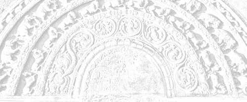

# Sermon 15

> Namo tassa bhagavato arahato sammāsambuddhassa \
> Namo tassa bhagavato arahato sammāsambuddhassa \
> Namo tassa bhagavato arahato sammāsambuddhassa
>
> *Etaṁ santaṁ, etaṁ paṇītaṁ, \
> yadidaṁ sabbasaṅkhārasamatho sabbūpadhipaṭinissaggo \
> taṇhakkhayo virāgo nirodho nibbānaṁ.*[^fn511]
>
> "This is peaceful, this is excellent, \
> namely the stilling of all preparations, the relinquishment of all assets, \
> the destruction of craving, detachment, cessation, extinction."

With the permission of the Most Venerable Great Preceptor and the assembly of
the venerable meditative monks. This is the fifteenth sermon in the series of
sermons on Nibbāna.

Towards the end of our last sermon we happened to quote a brief exhortation on
Dhamma from the *Udāna*, which enabled the ascetic Bāhiya Dārucīriya to liberate
his mind from imaginings and attain the state of non-identification,
*atammayatā*, or *arahanthood*. In order to attempt an exposition of that
exhortation of the Buddha, which was pithy enough to bring about instantaneous
*arahanthood*, let us refresh our memory of that brief discourse to Bāhiya.

> *Tasmātiha te, Bāhiya, evaṁ sikkhitabbaṁ: diṭṭhe diṭṭhamattaṁ bhavissati, sute
> sutamattaṁ bhavissati, mute mutamattaṁ bhavissati, viññāte viññātamattaṁ
> bhavissati. Evaṁ hi te, Bāhiya, sikkhitabbaṁ.*
>
> *Yato kho te, Bāhiya, diṭṭhe diṭṭhamattaṁ bhavissati, sute sutamattaṁ
> bhavissati, mute mutamattaṁ bhavissati, viññāte viññātamattaṁ bhavissati, tato
> tvaṁ Bāhiya na tena. Yato tvaṁ Bāhiya na tena, tato tvaṁ Bāhiya na tattha.
> Yato tvaṁ Bāhiya na tattha, tato tvaṁ Bāhiya nev'idha na huraṁ na
> ubhayamantarena. Es'ev'anto dukkhassa*.[^fn512]
>
> Well, then, Bāhiya, you had better train yourself thus: In the seen there will
> be just the seen, in the heard there will be just the heard, in the sensed
> there will be just the sensed, in the cognized there will be just the
> cognized. Thus, Bāhiya, should you train yourself.
>
> And when to you, Bāhiya, there will be in the seen just the seen, in the heard
> just the heard, in the sensed just the sensed, in the cognized just the
> cognized, then, Bāhiya, you will not be by it. And when, Bāhiya, you are not
> by it, then, Bāhiya, you are not in it. And when, Bāhiya, you are not in it,
> then, Bāhiya, you are neither here nor there nor in between. This, itself, is
> the end of suffering.

As a clue to an exegesis of this discourse, we made an attempt, the other day,
to unravel the meaning of the two puzzling terms in the text, namely, *na tena*
and *na tattha*. These two terms are apparently unrelated to the context. To get
at their significance, we brought up a quotation of two lines from the
*Jarāsutta* of the *Aṭṭhakavagga* of the *Sutta Nipāta*.

> *Dhono na hi tena maññati* \
> *yadidaṁ diṭṭhasutaṁ mutesu vā.*[^fn513]

*Dhona* is a term for the *arahant* in the sense that he has 'shaken off' the
dust of defilements. So then, these two lines imply that the *arahant* does not
imagine thereby, namely *yadidaṁ*, in terms of whatever is seen, heard or
sensed. These two lines are, as it were, a random exegesis of our riddle terms
in the *Bāhiyasutta*.

The first line itself gives the clue to the rather elliptical term *na tena*,
which carries no verb with it. Our quotation makes it clear that the implication
is *maññanā*, or imagining. *Dhono na hi tena maññati*, the *arahant* does not
imagine 'by it' or 'thereby'.

Although the *Bāhiyasutta* makes no mention of the word *maññanā*, this
particular expression seems to suggest that what is implied here is a form of
imagining.

By way of further proof we may allude to another quotation, which we had to
bring up several times:

> *Yena yena hi maññanti, tato taṁ hoti aññathā*.[^fn514]
>
> In whatever terms they imagine it, thereby it turns otherwise.

We came across another expression, which has a similar connotation: *tena ca mā
maññi,* "do not be vain thereby".[^fn515]

The first thing we can infer, therefore, from the above quoted two lines of the
verse, is that what is to be understood by the elliptical expression *na tena*
in the *Bāhiyasutta* is the idea of imagining, or in short, *na tena maññati*,
"does not imagine thereby".

Secondly, as to what precisely is implied by the word *tena*, or 'by it', can
also be easily inferred from those two lines.

In fact, the second line beginning with the word *yadidaṁ*, which means 'namely'
or 'that is', looks like a commentary on the first line itself. The *dhono*, or
the *arahant*, does not imagine 'thereby', namely by whatever is seen, heard and
sensed.

The verse in question mentions only the three terms *diṭṭha, suta* and *muta*,
whereas the *Bāhiyasutta* has as its framework the four terms *diṭṭha, suta,
muta* and *viññata*. Since what precedes the term *na tena* in the *Bāhiyasutta*
is the fourfold premise beginning with *diṭṭhe diṭṭhamattaṁ bhavissati*, "when
to you, Bāhiya, there will be in the seen just the seen", it stands to reason
that what the Buddha meant by the term *na tena* is the attitude of not thinking
'in terms of' whatever is seen, heard, sensed or cognized. That is to say, not
imagining 'thereby'.

This same attitude of not imagining 'thereby' is what is upheld in the
*Mūlapariyāyasutta*, which we discussed at length on a previous
occasion.[^fn516] There we explained the word *maññanā*, 'me-thinking',
'imagining', taking as a paradigm the first term *paṭhavi*, occurring in the
list of twenty-four terms given there. Among the twenty-four terms, we find
mentioned the four relevant to our present problem, namely *diṭṭha, suta, muta*
and *viññāta*.[^fn517]

We are now used to the general schema of the *Mūlapariyāyasutta*, concerning the
attitude of the three categories of persons mentioned there. Let us, for
instance, take up what is said in that context with regard to the *sekha*, or
the monk in higher training.

> *Paṭhaviṁ paṭhavito abhiññāya paṭhaviṁ mā maññi, paṭhaviyā mā maññi, paṭhavito
> mā maññi, paṭhaviṁ me ti mā maññi, paṭhaviṁ mā abhinandi.*

This is how the attitude of the *sekha* is described with regard to *paṭhavi*,
or earth. Suppose we substitute *diṭṭha*, or the seen, in place of *paṭhavi*.
This is what we should get:

> *Diṭṭhaṁ diṭṭhato abhiññāya diṭṭhaṁ mā maññi, diṭṭhasmiṁ mā maññi, diṭṭhato mā
> maññi, diṭṭhaṁ me ti mā maññi, diṭṭhaṁ mā abhinandi.*

What the *sekha* has before him is a step of training, and this is how he has to
train in respect of the four things, the seen, the heard, the sensed and the
cognized. He should not imagine in terms of them.

For instance, he understands through higher knowledge, and not through the
ordinary perception of the worldling, the seen as 'seen'. Having thus understood
it, he has to train in not imagining the seen as a thing, by objectifying it.
*Diṭṭhaṁ mā maññi*, let him not imagine a 'seen'. Also, let him not imagine 'in
the seen', or 'from the seen'. We have already pointed out the relationship
between these imaginings and the grammatical structure.[^fn518]

This objectification of the seen gives rise to acquisitive tendencies, to
imagine the seen as 'mine'. *Diṭṭhaṁ me ti mā maññi,* let him not imagine 'I
have seen' or 'I have a seen'.

This acquisition has something congratulatory about it. It leads to some sort of
joy, so the monk in higher training has to combat that too. *Diṭṭhaṁ mā
abhinandi*, let him not delight in the seen.

It seems, then, that the Buddha has addressed the ascetic Bāhiya Dārucīriya in
the language of the *ariyans*, for the very first instruction given to him was
"in the seen there will be just the seen". So highly developed in wisdom and
quick witted was *Bāhiya*[^fn519] that the Buddha promptly asked him to stop
short at the seen, by understanding that in the seen there is just the seen.

Not to have imaginings or me-thinkings about the seen is therefore the way to
stop short at just the seen. If one does not stop short at just the seen, but
goes on imagining in terms of 'in the seen', 'from the seen', etc., as already
stated, one will end up with an identification, or *tammayatā*.

In our last sermon we brought up the term *tammayatā*. When one starts imagining
in such terms about something, one tends to become one with it, *tammayo*, even
as things made out of gold and silver are called golden, *suvaṇṇamaya*, and
silvery, *rajatamaya*. It is as if one who grasps a gem becomes its owner and if
anything happens to the gem he is affected by it. To possess a gem is to be
possessed by it.

When one gets attached and becomes involved and entangled in the seen through
craving, conceit and views, by imagining egoistically, the result is
identification, *tammayatā*, literally 'of-that-ness'.

In this present context, however, the Buddha puts Bāhiya Dārucīriya on the path
to non-identification, or *atammayatā*. That is to say, he advises Bāhiya not to
indulge in such imaginings. That attitude leads to non-identification and
detachment. When one has no attachments, involvements and entanglements
regarding the seen, one does not have the notion of being in the seen.

Once we spoke about a children's hut into which the mother was invited.[^fn520]
When she crept into that plaything of a hut, she did not seriously entertain the
thought of being 'in' it. Similarly if one does not indulge in imaginings, one
has no notion of being 'in' the seen.

This, then, is the significance of the words *na tattha*, 'not in it'.

> *Yato tvaṁ Bāhiya na tena, tato tvaṁ Bāhiya na tattha.*
>
> When, Bāhiya, you are not by it, then, Bāhiya, you are not in it.

That is to say, when for instance Bāhiya does not imagine 'by the seen', he is
not 'in the seen'. Likewise, he is not in the heard, sensed or cognized. From
this we can deduce the meaning of what follows.

> *Yato tvaṁ Bāhiya na tattha, tato tvaṁ Bāhiya nev'idha na huraṁ na
> ubhayamantarena*.

At whatever moment you neither imagine 'by the seen' nor entertain the notion of
being 'in the seen', which is tantamount to projecting an 'I' into the seen,
then you are neither here nor there nor in between.

In a number of earlier sermons we have sufficiently explained the significance
of the two ends and the middle as well as the above, the below and the across in
the middle. What do they signify?

As we happened to point out on an earlier occasion, it is by driving the peg of
the conceit 'am' that a world is measured out, construed or postulated.[^fn521]
We also pointed out that the grammatical structure springs up along with it.
That is to say, together with the notion 'am' there arises a 'here'. 'Here' am
I, he is 'there' and you are 'yon' or in front of me. This is the basic ground
plan for the grammatical structure, known to grammar as the first person, the
second person and the third person.

A world comes to be measured out and a grammatical structure springs up. This,
in fact, is the origin of proliferation, or *papañca*. So it is the freedom from
that proliferation that is meant by the expression *nev'idha na huraṁ na
ubhayamantarena*, "neither here nor there nor between the two". The notion of
one's being in the world, or the bifurcation as 'I' and 'the world', is no
longer there. *Es'ev'anto dukkhassa*, this, then, is the end of suffering,
Nibbāna.

The fundamental first principles underlying this short exhortation of the Buddha
could thus be inferred to some extent. We could perhaps elicit something more
regarding the significance of the four key terms in question.

In the section of the fours in the *Aṅguttara Nikāya* we come across four modes
of noble usages, *cattāro ariya vohārā*,[^fn522] namely:

1. *diṭṭhe diṭṭhavāditā*
2. *sute sutavāditā*
3. *mute mutavāditā*
4. *viññāte viññātavāditā*

These four are:

1. asserting the fact of having seen in regard to the seen,
2. asserting the fact of having heard in regard to the heard,
3. asserting the fact of having sensed in regard to the sensed,
4. asserting the fact of having cognized in regard to the cognized.

Generally speaking, these four noble usages stand for the principle of
truthfulness. In some discourses, as well as in the *Vinayapiṭaka*, these terms
are used in that sense. They are the criteria of the veracity of a statement in
general, not so much in a deep sense.

However, there are different levels of truth. In fact, truthfulness is a
question of giving evidence that runs parallel with one's level of experience.
At higher levels of experience or realization, the evidence one gives also
changes accordingly.

The episode of Venerable Mahā Tissa Thera is a case in view.[^fn523] When he met
a certain woman on his way, who displayed her teeth in a wily giggle, he simply
grasped the sign of her teeth. He did not totally refrain from grasping a sign,
but took it as an illustration of his meditation subject. Later, when that
woman's husband, searching for her, came up to him and asked whether he had seen
a woman, he replied that all he saw was a skeleton. Now that is a certain level
of experience.

Similarly the concept of truthfulness is something that changes with levels of
experience. There are various degrees of truth, based on realization. The
highest among them is called *paramasacca*.[^fn524] As to what that is, the
*Dhātuvibhaṅgasutta* itself provides the answer in the following statement of
the Buddha.

> *Etañhi, bhikkhu, paramaṁ ariyasaccaṁ yadidaṁ amosadhammaṁ Nibbānaṁ.*[^fn525]
>
> Monk, this is the highest noble truth, namely Nibbāna, that is of a
> non-falsifying nature.

All other truths are falsified when the corresponding level of experience is
transcended. But Nibbāna is the highest truth, since it can never be falsified
by anything beyond it.

The fact that it is possible to give evidence by this highest level of
experience comes to light in the *Chabbisodhanasutta* of the *Majjhima Nikāya*.
In this discourse we find the Buddha instructing the monks as to how they should
interrogate a fellow monk who claims to have attained *arahanthood*. The
interrogation has to follow certain criteria, one of which concerns the four
standpoints *diṭṭha, suta, muta* and *viññāta*, the seen, the heard, the sensed
and the cognized.

What sort of answer a monk who rightly claims to *arahanthood* would give is
also stated there by the Buddha. It runs as follows:

> *Diṭṭhe kho ahaṁ, āvuso, anupāyo anapāyo anissito appaṭibaddho vippamutto
> visaṁyutto vimariyādikatena cetasā viharāmi.*[^fn526]

Here, then, is the highest mode of giving evidence in the court of Reality as an
*arahant*.

> Friends, with regard to the seen, I dwell unattracted, unrepelled,
> independent, uninvolved, released, unshackled, with a mind free from barriers.

He is unattracted, *anupāyo*, by lust and unrepelled, *anapāyo*, by hate. He is
not dependent, *anissito*, on cravings, conceits and views. He is not involved,
*appaṭibaddho*, with desires and attachments and is released, *vippamutto*, from
defilements. He is no longer shackled, *visaṁyutto*, by fetters and his mind is
free from barriers.

What these barriers are, we can easily infer. They are the bifurcations such as
the internal and the external, *ajjhatta bahiddhā*, which are so basic to what
is called existence, *bhava*. Where there are barriers, there are also
attachments, aversions and conflicts. Where there is a fence, there is defence
and offence.

So the *arahant* dwells with a mind unpartitioned and barrierless,
*vimariyādikatena cetasā*. To be able to make such a statement is the highest
standard of giving evidence in regard to the four noble usages.

It is also noteworthy that in the *Bāhiyasutta* the Buddha has presented the
triple training of higher morality, higher concentration and higher wisdom,
*adhisīla, adhicitta* and *adhipaññā*, through these four noble usages. The
commentary, too, accepts this fact.[^fn527] But this is a point that might need
clarification. How are we to distinguish between morality, concentration and
wisdom in this brief exhortation?

Now how does the exhortation begin? It opens with the words *tasmātiha te,
Bāhiya, evaṁ sikkhitabbaṁ*, "well then, Bāhiya, you should train yourself thus."
This is an indication that the Buddha introduced him to a course of training,
and this is the preliminary training:

> *Diṭṭhe diṭṭhamattaṁ bhavissati, sute sutamattaṁ bhavissati, mute mutamattaṁ
> bhavissati, viññāte viññātamattaṁ bhavissati.*
>
> In the seen there will be just the seen, in the heard there will be just the
> heard, in the sensed there will be just the sensed, in the cognized there will
> be just the cognized.

What is hinted at by this initial instruction is the training in higher
morality, *adhisīlasikkhā*. The most important aspect of this training is the
morality of sense-restraint, *indriya saṁvara sīla*. The first principles of
sense-restraint are already implicit in this brief instruction.

If one stops short at just the seen in regard to the seen, one does not grasp a
sign in it, or dwell on its details. There is no sorting out as 'this is good',
'this is bad'. That itself conduces to sense-restraint.

So we may conclude that the relevance of this brief instruction to the morality
of sense-restraint is in its enjoining the abstention from grasping a sign or
dwelling on the details. That is what pertains to the training in higher
morality, *adhisīlasikkha*.

Let us see how it also serves the purpose of training in higher concentration.
To stop at just the seen in the seen is to refrain from discursive thought,
which is the way to abandon mental hindrances. It is discursive thought that
brings hindrances in its train. So here we have what is relevant to the training
in higher concentration as well.

Then what about higher wisdom, *adhipaññā*? Something more specific has to be
said in this concern. What precisely is to be understood by higher wisdom in
this context? It is actually the freedom from imaginings, *maññanā*, and
proliferation, *papañca*.

If one stops short at just the seen in the seen, such ramifications as mentioned
in discourses like the *Mūlapariyāyasutta* do not come in at all. The tendency
to objectify the seen and to proliferate it as 'in it', 'from it' and 'it is
mine' receives no sanction. This course of training is helpful for the
emancipation of the mind from imaginings and proliferations.

The Buddha has compared the six sense-bases, that is eye, ear, nose, tongue,
body and mind, to a deserted village.

> *Suññaṁ idaṁ attena vā attaniyena vā.*[^fn528]
>
> This is void of a self or anything belonging to a self.

All these sense-bases are devoid of a self or anything belonging to a self.
Therefore they are comparable to a deserted village, a village from which all
inhabitants have fled.

The dictum "in the seen there will be just the seen" is an advice conducive to
the attitude of regarding the six sense-bases as a deserted village. This is
what pertains to higher wisdom in the Buddha's exhortation.

*Papañca*, or prolific conceptualisation, is a process of transaction with
whatever is seen, heard, sensed, etc. So here there is no process of such
transaction. Also, when one trains oneself according to the instruction "in the
seen there will be just the seen, in the heard there will be just the heard, in
the sensed there will be just the sensed, in the cognized there will be just the
cognized", that identification implied by the term *tammayatā* will no longer be
there.

Egotism, the conceit 'am' and all what prompts conceptual proliferation will
come to an end. This kind of training uproots the peg of the conceit 'am',
thereby bringing about the cessation of prolific conceptualisation, the
cessation of becoming and the cessation of suffering.

We can therefore conclude that the entire triple training is enshrined in this
exhortation. What happens as a result of this training is indicated by the
riddle like terms *na tena, na tattha, nev'idha na huraṁ na ubhayamantarena*.

When the wisdom of the ascetic Bāhiya Dārucīriya had sufficiently matured by
following the triple course of training, the Buddha gave the hint necessary for
realization of that cessation of becoming, which is Nibbāna, in the following
words:

> Then, Bāhiya, you will not be by it. And when, Bāhiya, you are not by it,
> then, Bāhiya, you are not in it. And when, Bāhiya, you are not in it, then,
> Bāhiya, you are neither here nor there nor in between. This, itself, is the
> end of suffering.

This sermon, therefore, is one that succinctly presents the quintessence of the
*Saddhamma*. It is said that the mind of the ascetic Bāhiya Dārucīriya was
released from all influxes immediately on hearing this exhortation.

Now let us come back to the sequence of events in the story as mentioned in the
*Udāna*. It was after the Buddha had already set out on his alms round that this
sermon was almost wrenched from him with much insistence. When it had proved its
worth, the Buddha continued with his alms round. Just then a cow with a young
calf gored the *arahant* Bāhiya Dārucīriya to death.

While returning from his alms round with a group of monks, the Buddha saw the
corpse of the *arahant* Bāhiya. He asked those monks to take the dead body on a
bed and cremate it. He even told them to build a cairn enshrining his relics,
saying: "Monks, a co-celibate of yours has passed away."

Those monks, having carried out the instructions, came back and reported to the
Buddha. Then they raised the question: "Where has he gone after death, what is
his after death state?" The Buddha replied:

> Monks, Bāhiya Dārucīriya was wise, he lived up to the norm of the Dhamma, he
> did not harass me with questions on Dhamma. Monks, Bāhiya Dārucīriya has
> attained *Parinibbāna*.

In conclusion, the Buddha uttered the following verse of uplift:

> *Yattha āpo ca paṭhavī,* \
> *tejo vāyo na gādhati,* \
> *na tattha sukkā jotanti,* \
> *ādicco nappakāsati,* \
> *na tattha candimā bhāti,* \
> *tamo tattha na vijjati.*
> 
> *Yadā ca attanāvedi,* \
> *muni monena brāhmaṇo,* \
> *atha rūpā arūpā ca,* \
> *sukhadukkhā pamuccati.*[^fn529]

On the face of it, the verse seems to imply something like this:

> Where water, earth, fire and air \
> Do not find a footing, \
> There the stars do not shine, \
> And the sun spreads not its lustre, \
> The moon does not appear resplendent there, \
> And no darkness is to be found there.
> 
> When the sage, the brahmin with wisdom, \
> Understands by himself, \
> Then is he freed from form and formless, \
> And from pleasure and pain as well.

The commentary to the *Udāna*, *Paramatthadīpanī*, gives a strange
interpretation to this verse. It interprets the verse as a description of the
destination of the *arahant* Bāhiya Dārucīriya after he attained *Parinibbāna*,
the place he went to.[^fn530] Even the term *Nibbānagati* is used in that
connection, the 'place' one goes to in attaining *Parinibbāna*. That place,
according to the commentary, is not easily understood by worldlings. Its
characteristics are said to be the following:

The four elements, earth, water, fire and air, are not there. No sun, or moon,
or stars are there. The reason why the four elements are negated is supposed to
be the fact that there is nothing that is compounded in the uncompounded Nibbāna
element, into which the *arahant* passes away.

Since no sun, or moon, or stars are there in that mysterious place, one might
wonder why there is no darkness either. The commentator tries to forestall the
objection by stating that it is precisely because one might think that there
should be darkness when those luminaries are not there, that the Buddha
emphatically negates it. So the commentarial interpretation apparently leads us
to the conclusion that there is no darkness in the Nibbāna element, even though
no sun or moon or stars are there.

The line of interpretation we have followed throughout this series of sermons
allows us to depart from this commentarial trend. That place where earth, water,
fire and air do not find a footing is not where the *arahant* Bāhiya Dārucīriya
had 'gone' when he passed away. The commentator seems to have construed this
verse as a reply the Buddha gave to the question raised by those monks. Their
question was: "Where has he gone after death, what is his after death state?"
They were curious about his borne.

But when we carefully examine the context, it becomes clear that they raised
that question because they did not know that the corpse they cremated was that
of an *arahant*. Had they known it, they would not have even asked that
question. That is precisely the reason for the Buddha's declaration that Bāhiya
attained *Parinibbāna*, a fact he had not disclosed before. He added that Bāhiya
followed the path of Dhamma without harassing him with questions and attained
*Parinibbāna*.

Now that is the answer proper. To reveal the fact that Bāhiya attained
*Parinibbāna* is to answer the question put by those inquisitive monks.
Obviously they knew enough of the Dhamma to understand then, that their question
about the borne and destiny of Venerable Bāhiya was totally irrelevant.

So then the verse uttered by the Buddha in conclusion was something extra. It
was only a joyous utterance, a verse of uplift, coming as a grand finale to the
whole episode.

Such verses of uplift are often to be met with in the *Udāna*. As we already
mentioned, the verses in the *Udāna* have to be interpreted very carefully,
because they go far beyond the implications of the story concerned.[^fn531] They
invite us to take a plunge into the ocean of Dhamma. Just one verse is enough.
The text is small but deep. The verse in question is such a spontaneous
utterance of joy. It is not the answer to the question, "Where did he go?"

Well, in that case, what are we to understand by the word *yattha*, 'where'?

We have already given a clue to it in our seventh sermon with reference to that
non-manifestative consciousness, *anidassana viññāṇa*. What the Buddha describes
in this verse, is not the place where the Venerable *arahant* Bāhiya went after
his demise, but the non-manifestative consciousness he had realized here and
now, in his concentration of the fruit of *arahanthood*, or
*arahattaphalasamādhi*.

Let us hark back to the four lines quoted in the *Kevaḍḍhasutta*.

> *Viññāṇaṁ anidassanaṁ,* \
> *anantaṁ sabbato pabhaṁ,* \
> *ettha āpo ca paṭhavī,* \
> *tejo vāyo na gādhati.*[^fn532]
> 
> Consciousness which is non-manifestative, \
> Endless, lustrous on all sides, \
> It is here that water, earth, \
> Fire and air no footing find.

The first two lines of the verse in the *Bāhiyasutta*, beginning with the
correlative *yattha*, 'where', find an answer in the last two lines quoted above
from the *Kevaḍḍhasutta*.

What is referred to as 'it is here', is obviously the non-manifestative
consciousness mentioned in the first two lines. That problematic place indicated
by the word *yattha*, 'where', in the *Bāhiyasutta*, is none other than this
non-manifestative consciousness.

We had occasion to explain at length in what sense earth, water, fire and air
find no footing in that consciousness. The ghostly elements do not haunt that
consciousness. That much is clear.

But how are we to understand the enigmatic reference to the sun, the moon and
the stars? It is said that the stars do not shine in that non-manifestative
consciousness, the sun does not spread its lustre and the moon does not appear
resplendent in it, nor is there any darkness. How are we to construe all this?

Briefly stated, the Buddha's declaration amounts to the revelation that the sun,
the moon and the stars fade away before the superior radiance of the
non-manifestative consciousness, which is infinite and lustrous on all sides.

How a lesser radiance fades away before a superior one, we have already
explained with reference to the cinema in a number of earlier sermons.[^fn533]
To sum up, the attention of the audience in a cinema is directed to the narrow
beam of light falling on the screen. The audience, or the spectators, are seeing
the scenes making up the film show with the help of that beam of light and the
thick darkness around.

This second factor is also very important. Scenes appear not simply because of
the beam of light. The thickness of the darkness around is also instrumental in
it. This fact is revealed when the cinema hall is fully lit up. If the cinema
hall is suddenly illuminated, either by the opening of doors and windows or by
some electrical device, the scenes falling on the screen fade away as if they
were erased. The beam of light, which was earlier there, becomes dim before the
superior light. The lesser lustre is superseded by a greater lustre.

We might sometimes be found fault with for harping on this cinema simile, on the
ground that it impinges on the precept concerning abstinence from enjoying
dramatic performances, song and music. But let us consider whether this cinema
is something confined to a cinema hall.

In the open air theatre of the world before us, a similar phenomenon of
supersedence is occurring. In the twilight glow of the evening the twinkling
stars enable us to faintly figure out the objects around us, despite the growing
darkness. Then the moon comes up. Now what happens to the twinkling little
stars? They fade away, their lustre being superseded by that of the moon.

Then we begin to enjoy the charming scenes before us in the serene moonlit
night. The night passes off. The day light gleam of the sun comes up. What
happens then? The soft radiance of the moon wanes before the majestic lustre of
the sun. The moon gets superseded and fades away. Full of confidence we are now
watching the multitude of technicoloured scenes in this massive theatre of the
world. In broad daylight, when sunshine is there, we have no doubt about our
vision of objects around us.

But now let us suppose that the extraneous defilements in the mind of a noble
disciple, treading the noble eightfold path, get dispelled, allowing its
intrinsic lustre of wisdom to shine forth. What happens then? The stars, the
moon and the sun get superseded by that light of wisdom. Even the forms that one
had seen by twilight, moonlight and sunlight fade away and pale into
insignificance. The umbra of form and the penumbra of the formless get fully
erased.

In the previous sermon we happened to mention that form and space are related to
each other, like the picture and its background. Now all this is happening in
the firmament, which forms the background. We could enjoy the scenes of the
world cinema, because of that darkness. The twilight, the moonlight and the
sunlight are but various levels of that darkness.

The worldling thinks that one who has eyes must surely see if there is sunshine.
He cannot think of anything beyond it. But the Buddha has declared that there is
something more radiant than the radiance of the sun.

> *Natthi paññāsamā ābhā,*[^fn534]
>
> there is no radiance comparable to wisdom.

Let us hark back to a declaration by the Buddha we had already quoted in a
previous sermon.

> *Catasso imā, bhikkhave, pabhā. Katamā catasso? Candappabhā, sūriyappabhā,
> aggippabhā, paññappabhā, imā kho, bhikkhave, catasso pabhā. Etadaggaṁ,
> bhikkhave, imāsaṁ catunnaṁ pabhānaṁ, yad idaṁ paññappabhā*.[^fn535]
>
> Monks, there are these four lustres. What four? The lustre of the moon, the
> lustre of the sun, the lustre of fire, the lustre of wisdom. These, monks, are
> the four lustres. This, monks, is the highest among these four lustres, namely
> the lustre of wisdom.

So, then, we can now understand why the form and the formless fade away. This
wisdom has a penetrative quality, for which reason it is called *nibbedhikā
paññā*.[^fn536]

When one sees forms, one sees them together with their shadows. The fact that
one sees shadows there, is itself proof that darkness has not been fully
dispelled. If light comes from all directions, there is no shadow at all. If
that light is of a penetrative nature, not even form will be manifest there.

Now it is mainly due to what is called 'form' and 'formless', *rūpa/arūpa*, that
the worldling experiences pleasure and pain in a world that distinguishes
between a 'pleasure' and a 'pain'.

Though we have departed from the commentarial path of exegesis, we are now in a
position to interpret the cryptic verse in the *Bāhiyasutta* perhaps more
meaningfully. Let us now recall the verse in question.

> *Yattha āpo ca paṭhavī,* \
> *tejo vāyo na gādhati,* \
> *na tattha sukkā jotanti,* \
> *ādicco nappakāsati,* \
> *na tattha candimā bhāti,* \
> *tamo tattha na vijjati.*
> 
> *Yadā ca attanāvedi,* \
> *muni monena brāhmaṇo,* \
> *atha rūpā arūpā ca,* \
> *sukhadukkhā pamuccati.*[^fn537]

The verse can be fully explained along the lines of interpretation we have
adopted. By way of further proof of the inadequacy of the commentarial
explanation of the references to the sun, the moon and the stars in this verse,
we may draw attention to the following points.

According to the commentary the verse is supposed to express that there are no
sun, moon or stars in that mysterious place called *anupādisesa Nibbānadhātu*,
which is incomprehensible to worldlings.

We may, however, point out that the verbs used in the verse in this connection
do not convey the sense that the sun, the moon and the stars are simply non
existent there. They have something more to say.

For instance, with regard to the stars it is said that there the stars do not
shine, *na tattha sukkā jotanti*. If in truth and fact stars are not there, some
other verb like *na dissanti*, 'are not seen', or *na vijjanti*, 'do not exist',
could have been used.

With reference to the sun and the moon, also, similar verbs could have been
employed. But what we actually find here, are verbs expressive of spreading
light, shining, or appearing beautiful:

*Na tattha sukkā jotanti,* "there the stars do not shine";

*ādicco nappakāsati,* "the sun spreads not its lustre";

*na tattha candimā bhāti,* "the moon does not appear resplendent there".

These are not mere prosaic statements. The verse in question is a joyous
utterance, *Udānagāthā*, of extraordinary depth. There is nothing recondite
about it.

In our earlier assessment of the commentarial interpretation we happened to lay
special stress on the words 'even though'. We are now going to explain the
significance of that emphasis. For the commentary, the line *tamo tattha na
vijjati,* "no darkness is to be found there", is a big riddle. The sun, the moon
and the stars are not there. Even though they are not there, presumably, no
darkness is to be found there.

However, when we consider the law of superseding, we have already mentioned, we
are compelled to give a totally different interpretation. The sun, the moon and
the stars are not manifest, precisely because of the light of that
non-manifestative consciousness. As it is lustrous on all sides, *sabbato
pabha*, there is no darkness there and luminaries like the stars, the sun and
the moon do not shine there.

This verse of uplift thus reveals a wealth of information relevant to our topic.
Not only the exhortation to Bāhiya, but this verse also throws a flood of light
on the subject of Nibbāna.

That extraordinary place, which the commentary often identifies with the term
*anupādisesa Nibbānadhātu*, is this mind of ours. It is in order to indicate the
luminosity of this mind that the Buddha used those peculiar expressions in this
verse of uplift.

What actually happens in the attainment to the fruit of *arahanthood*? The
worldling discerns the world around him with the help of six narrow beams of
light, namely the six sense-bases. When the superior lustre of wisdom arises,
those six sense-bases go down. This cessation of the six sense-bases could also
be referred to as the cessation of name-and-form, *nāmarūpanirodha*, or the
cessation of consciousness, *viññāṇanirodha*.

The cessation of the six sense-bases does not mean that one does not see
anything. What one sees then is voidness. It is an in-'sight'. He gives
expression to it with the words *suñño loko*, 'void is the world'.

What it means is that all the sense-objects, which the worldling grasps as real
and truly existing, get penetrated through with wisdom and become non-manifest.

If we are to add something more to this interpretation of the *Bāhiyasutta* by
way of review, we may say that this discourse illustrates the six qualities of
the Dhamma, namely *svākkhāto*, well proclaimed, *sandiṭṭhiko*, visible here and
now, *akāliko*, timeless, *ehipassiko*, inviting to come and see, *opanayiko*,
leading onward and *paccattaṁ veditabbo viññūhi*, to be realized by the wise
each one by himself. These six qualities are wonderfully exemplified by this
discourse.

In a previous sermon we had occasion to bring up a simile of a dewdrop, dazzling
in the morning sunshine.[^fn538]

The task of seeing the spectrum of rainbow colours through a tiny dewdrop
hanging from a creeper or a leaf is one that calls for a high degree of
mindfulness. Simply by standing or sitting with one's face towards the rising
sun, one will not be able to catch a glimpse of the brilliant spectrum of
rainbow colours through the dewdrop. It requires a particular viewpoint. Only
when one focuses on that viewpoint, can one see it.

So it is with the spectrum of the six qualities of the Dhamma. Here, too, the
correct viewpoint is a must, and that is right view. Reflection on the meaning
of deep discourses helps one to straighten up right view.

Where right view is lacking, morality inclines towards dogmatic attachment to
rituals, *sīlabbataparāmāsa*. Concentration turns out to be wrong concentration,
*micchā samādhi*.

Like the one who sits facing the sun, one might be looking in the direction of
the Dhamma, but right view is not something one inherits by merely going to
refuge to the Buddha. It has to be developed with effort and proper attention.
View is something that has to be straightened up. For *diṭṭhujukamma*, the act
of straightening up one's view is reckoned as one of the ten skilful deeds,
*kusalakamma*.

So however long one may sit with folded legs, gazing at the Buddha sun, one
might not be able to see the six rainbow colours of the Dhamma. One may be short
of just one-hundredth of an inch as the proper adjustment for right view. Yet it
is a must. Once that adjustment is made, one immediately, then and there,
*tavad'eva*, catches a glimpse of the spectrum of the Dhamma that the Buddha has
proclaimed.

We have stressed the importance of right view in particular, because many are
grappling with a self created problem, concerning the proper alignment between
the triple training and the right view of the noble eightfold path.

Now as to the triple training, morality, concentration and wisdom, we find
wisdom mentioned last. It seems, then, that we have to perfect morality first,
then develop concentration, and only lastly wisdom. One need not think of wisdom
before that.

But when we come to the noble eightfold path, we find a different order of
values. Here right view takes precedence. As a matter of fact, in the
*Mahācattārīsakasutta* of the *Majjhima Nikāya* we find the Buddha repeatedly
declaring emphatically:

> *tatra, bhikkhave, sammā diṭṭhi pubbaṅgamā*,
>
> monks, therein right view takes precedence.[^fn539]

Even in a context where the subject is morality, we find a similar statement. So
how are we to resolve this issue?

In the noble eightfold path, pride of place is given to right view, which is
representative of the wisdom group. As the well-known definition goes, right
view and right thoughts belong to the wisdom group; right speech, right action
and right livelihood come under the morality group; and right effort, right
mindfulness and right concentration belong to the concentration group.

So in this way, in the noble eightfold path, wisdom comes first, then morality
and lastly concentration.

But in the context of these three groups, firstly comes morality, secondly
concentration and lastly wisdom. Here, too, the answer given by the
*arahant-nun* Venerable Dhammadinnā to the lay disciple Visākha comes to our
aid.

The lay disciple Visākha poses the following question to Venerable Dhammadinnā:

> *Ariyena nu kho ayye aṭṭhaṅgikena maggena tayo khandhā saṅgahitā, udāhu tīhi
> khandhehi ariyo aṭṭhaṅgiko maggo saṅgahito?*
>
> Good lady, are the three groups morality, concentration and wisdom, included
> by the noble eightfold path, or is the noble eightfold path included by the
> three groups?[^fn540]

Even at that time there may have been some who raised such questions. That is
probably the reason for such a query. Then the *arahant-nun* Dhammadinnā
answers:

> *Na kho āvuso Visākha ariyena aṭṭhaṅgikena maggena tayo khandhā saṅgahitā,
> tīhi ca kho āvuso Visākha khandhehi ariyo aṭṭhaṅgiko maggo saṅgahito*.
>
> Friend Visākha, it is not that the threefold training is included by the noble
> eightfold path, but the noble eightfold path is included by the threefold
> training.

Since this appears to be something of a tangle, let us try to illustrate the
position with some other kind of tangle. Suppose someone is trying to climb up a
long rope, made up of three strands. As he climbs up, his fingertips might come
now in contact with the first strand, now with the second and now with the
third. He is not worried about the order of the three strands, so long as they
are well knit. One can safely climb up, holding onto the three strands, only
when they are firmly wound up into a sturdy rope.

All these questions seem to have arisen due to an attitude of taking too
seriously the numerical order of things. To the noble disciple climbing up the
rope of the noble eightfold path, there need not be any confusion between the
numerical order of the triple training and that of the noble eightfold path.

But if someone taking the cue from the order of the triple training neglects
right view or ignores its prime import, he might end up confused.

All in all, we are now in a position to correctly assess the deep significance
of the *Bāhiyasutta*. Here we have the quintessence of the entire *Saddhamma*.
We are not confronted with heaps of perceptual data, which we are told today are
essential requisites for admission into the 'city' of Nibbāna.

For the ordinary worldling, amassing a particular set of percepts or concepts
seems a qualification for entering Nibbāna. But what we have here, is a way of
liberating the mind even from latencies to percepts. See *saññā nānusenti*,
*Madhupiṇḍikasutta*, "perceptions do not lie latent."[^fn541] There is no
heaping up anew.

What are called 'extraneous taints', *āgantukā upakkilesā*,[^fn542] are not
confined to the well known defilements in the world. They include all the rust
and dust we have been collecting throughout this long *saṁsāra*, with the help
of the influxes, *āsavā*. They include even the heap of percepts which the world
calls 'knowledge'. Even numerals are part of it.

The Buddha has briefly expressed here the mode of practice for disabusing the
mind from all such taints. Therefore there is no reason for underestimating the
value of this discourse, by calling it *vohāra desanā*, conventional teaching.
This discourse in the *Udāna* is one that is truly 'up'-lifting.

It indeed deserves a paean of joy.

[^fn511]: [MN 64 / M I 436](https://suttacentral.net/mn64/pli/ms), *Mahāmālunkyasutta*

[^fn512]: Ud 8, *Bāhiyasutta*

[^fn513]: [Snp 4.6 / Sn 813](https://suttacentral.net/snp4.6/pli/ms), *Jarāsutta*

[^fn514]: Sn 757, *Dvayatānupassanāsutta*; see *Sermon 13*

[^fn515]: A IV 386, *Samiddhisutta*; see *Sermon 12*

[^fn516]: See sermons 12 and 13

[^fn517]: M I 3, *Mūlapariyāyasutta*

[^fn518]: See *Sermon 13*

[^fn519]: According to A I 24 Bāhiya was outstanding for his *khippābhiññā*

[^fn520]: See *Sermon 13*

[^fn521]: See *Sermon 10*

[^fn522]: A II 246, *Catutthavohārasutta*

[^fn523]: Vism 21

[^fn524]: The term occurs e.g. at M I 480, *Tevijjavacchagottasutta*; at M II 173, *Cankīsutta*; and at A II 115, *Patodasutta*

[^fn525]: [MN 140 / M III 245](https://suttacentral.net/mn140/pli/ms), *Dhātuvibhaṅgasutta*

[^fn526]: M III 29, *Chabbisodhanasutta*

[^fn527]: Ud-a 90

[^fn528]: S IV 174, *Āsīvisasutta*

[^fn529]: Ud 9, *Bāhiyasutta*

[^fn530]: Ud-a 98

[^fn531]: See *Sermon 1*

[^fn532]: [DN 11 / D I 223](https://suttacentral.net/dn11/pli/ms), *Kevaḍḍhasutta*

[^fn533]: See sermons 5, 7 and 9

[^fn534]: S I 6, *Natthiputtasamasutta*

[^fn535]: A II 139, *Pabhāsutta*; see *Sermon 7*

[^fn536]: E.g. S II 45, *Bhikkhusutta*; or A II 178, *Ummaggasutta*

[^fn537]: Ud 9, *Bāhiyasutta*

[^fn538]: See *Sermon 9*

[^fn539]: M III 71, *Mahācattārīsakasutta*

[^fn540]: [MN 44 / M I 301](https://suttacentral.net/mn44/pli/ms), *Cūḷavedallasutta*

[^fn541]: M I 108, *Madhupiṇḍikasutta*

[^fn542]: A I 10, *Accharāsaṅghātavagga*
