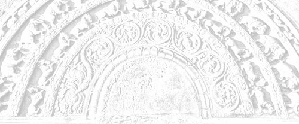

# Sermon 16

> Namo tassa bhagavato arahato sammāsambuddhassa \
> Namo tassa bhagavato arahato sammāsambuddhassa \
> Namo tassa bhagavato arahato sammāsambuddhassa
>
> *Etaṁ santaṁ, etaṁ paṇītaṁ, \
> yadidaṁ sabbasaṅkhārasamatho sabbūpadhipaṭinissaggo \
> taṇhakkhayo virāgo nirodho nibbānaṁ.*[^fn543]
>
> "This is peaceful, this is excellent, \
> namely the stilling of all preparations, the relinquishment of all assets, \
> the destruction of craving, detachment, cessation, extinction."

With the permission of the Most Venerable Great Preceptor and the assembly of
the venerable meditative monks. This is the sixteenth sermon in the series of
sermons on Nibbāna.

In the course of our discussion of the *Bāhiyasutta* in our last sermon, we drew
attention to the wide gap that exists between the sensory experience of the
worldling and that experience the *arahant* gets through the eye of wisdom.

It is the same gap that obtains between the two terms *papañca* and
*nippapañca*. In sensory experience, which is based on worldly expressions,
worldly usages and worldly concepts, there is a discrimination between a thing
to be grasped and the one who grasps, or, in other words, a subject-object
relationship.

There is always a bifurcation, a dichotomy, in the case of sensory perception.
If there is a seen, there has to be something seen and the one who sees. That is
the logic. In the *Bāhiyasutta*, beginning with "in the seen there will be just
the seen", the Buddha proclaimed to the ascetic Bāhiya a brief exhortation on
Dhamma which enables one to transcend the above narrow view point and attain the
state of non-proliferation or *nippapañca*.

There is nothing to see, no one to see, only 'a seen' is there. The cause of all
these conceptual proliferation, or *papañca*, in the world is contact. The
*arahants* understood this by their insight into the fact that the seen, the
heard, the sensed and the cognized are simply so many collocations of conditions
which come together for a moment due to contact, only to break up and get
dispersed the next moment.

What is called the seen, the heard, the sensed and the cognized are for the
worldling so many 'things'. But to the wisdom eye of the *arahants* they appear
as mere conglomerations of conditions, dependent on contact, which momentarily
come together and then get dispersed. This insight into the dependence on
contact, *phassam paṭicca*, is the very essence of the law of dependent arising,
*paṭicca samuppāda*. It is equivalent to seeing the law of dependent arising
itself.

In order to transcend the narrow point of view limited to the bases of sense
contact or the six sense spheres and realize the state of Nibbāna indicated by
the words *viññāṇaṁ anidassanaṁ, anantaṁ sabbato pabhaṁ*,[^fn544] "consciousness
which is non-manifestative, endless, lustrous on all sides", one has to see the
cessation of contact.

In a certain discourse in the *Mucalindavagga* of the *Udāna*, the Buddha has
declared in a verse of uplift that the cessation of contact comes about only by
doing away with that which brings about contact. The wandering ascetics of other
sects grew jealous of the Buddha and his congregation of monks, because of their
own loss of gain and honour, and began to hurl abuse on monks in the village and
in the forest.

A group of monks came and reported this to the Buddha. The Buddha's response to
it was only a paean of joy. *Udāna* actually means a spontaneous utterance of
joy, and the verse he uttered was such a one. But it embodied an instruction on
Dhamma and a norm of Dhamma as well.

> *Gāme araññe sukhadukkhaphuṭṭho,* \
> *nev'attato no parato dahetha,* \
> *phusanti phassā upadhiṁ paṭicca,* \
> *Nirūpadhiṁ kena phuseyyum phassā.*[^fn545]

In the first two lines we get an instruction:

> Touched by pain in village or in forest, \
> Think not in terms of oneself or others

The reason for it is given in the norm of Dhamma which follows:

> Touches can touch one, because of assets, \
> How can touches touch him, who is asset-less?

This is all what the Buddha uttered. From this we can glean another aspect of
the significance of the terms *sabbūpadhipaṭinissagga*, relinquishment of all
assets, and *nirupadhi*, the asset-less, used with reference to Nibbāna.

In a number of previous sermons we happened to explain the concept of *upadhi*
to some extent, as and when the terms *upadhi* and *paṭinissagga* came
up.[^fn546] To refresh our memory, we may summarize all that now. What is the
concept of *upadhi*, or 'assets', recognized by the world?

Whatever that bolsters up the ego, be it gold, silver, pearls, gems, money,
house and property, deposits and assets. All these are reckoned as *upadhi* in
general. But when considered from the point of view of Dhamma, *upadhi* in a
deeper sense stands for this fivefold grasping groups, *pañcupādānakkhandha*.

*Upādānakkhandha* literally means 'groups of grasping'. Groups of grasping do
not necessarily imply that there are material objects to be grasped. But the
worldling, overcome by that triple proliferation of cravings, conceits and
views, and carried away by the worldly conventions, imagines those groups of
grasping as things grasped and deposited.

The concept of *upadhi* as assets has arisen as a result of this tendency to
think of groups of grasping as things grasped and deposited. So it turns out to
be a question of viewpoint.

Cravings, conceits and views prompt one to look upon all what one has grasped so
far and what one hopes to grasp in the future as things one is grasping right
now. One thinks of them as things deposited in a safe. The worldlings are
holding on to such a mass of assets.

Nibbāna is the relinquishment of all such assets, accumulated in the mind. In
order to relinquish these assets there must be some kind of understanding – an
enlightenment. The vanity of all these assets has to be seen through by the
light of wisdom. It is only by seeing their vanity that the assets are
relinquished. In fact it is not so much a deliberate giving up of assets, as a
sequential liquidation.

In a previous sermon we gave an illustration of the situation that precipitates
relinquishment. Let us bring it up again. We found the cinema quite helpful as
an illustration. In explaining the phenomenon of relinquishment of assets with
reference to the cinema, we described how the assets accumulated in the minds of
the audience, that is, the assets proper to the cinema world woven around the
story that is filmed, are automatically abandoned when the cinema hall gets lit
up.[^fn547] Then one understands the illusory nature of what has been going on.
It is that understanding, that enlightenment, which precipitates the giving up
or relinquishment of assets.

To go a step further in this illustration, when lights came on the *saṅkhāras*
or preparations pertaining to the film show got exposed for what they are. In
fact, *saṅkhāra* is a word that has associations with the dramatic tradition in
its relation to the acting of actors and actresses down to their make-up, which
is so artificial and spurious.

When the cinema hall gets lit up all of a sudden, one who has been enjoying the
film show is momentarily thrown out of the cinema world, because those
preparations are pacified or nullified, *sabba saṅkhārasamatho*. As a
consequence of it, the heap of experiences which he had hitherto regarded as
real and genuine, lose their sanction. Those assets get liquidated or
relinquished, *sabbūpadhipaṭinissagga*.

In their absence, that craving necessary for the appreciation or enjoyment of
the scenes to come becomes extinct, *taṇhakkhayo*. When craving is gone, the
floridity of the scenes to come also fades away, *virāga*. With that fading away
or decolouration, the film show ceases for the person concerned, *nirodha*,
though technically the movie is going on. Because of that cessation all the
fires of defilements proper to the cinema world, with which he was burning, get
extinguished, Nibbāna.

So here we have the full gamut of the cinema simile as an illustration for
Nibbāna. This kind of awakening in the cinema world gives us a clue to the fact
that the assets, *upadhi*, are relinquished through an understanding born of
enlightenment in the light of wisdom. This in fact is something that should be
deeply ingrained in our minds. Therefore we shall endeavour to give some more
illustrations to that effect.

In our everyday life, too, we sometimes see and hear of instances where assets
get relinquished due to understanding. Someone heaps up a huge bundle of
currency notes of the highest denomination, deposits it in his safe and keeps
watch and ward over it day and night. One fine morning he wakes up to hear that
for some reason or other that currency note has been fully devalued by law the
previous night. How does he look upon the wads of notes in his safe now? For
him, it is now a mere heap of papers.

The craving, conceit and view he had earlier in regard to the notes are
completely gone. The bank notes are no longer valid. He might as well make a
bonfire of it. So this is some sort of relinquishment of assets in the world,
however temporary it may be.

Another person gets a sudden transfer and is getting ready to leave for his new
station. His immovable assets he is forced to leave behind, but his movable
assets he hurriedly gathers up to take with him. The vehicle has already come
and is tooting impatiently, signalling delay. It is well past time, but his
'preparations' are not finished. Time-pressed, in hot haste, he is running here
and there.

At last, when he can delay no longer, he grabs the utmost he can take
and darts to the doorstep. Just then, he wakes up. It was only a dream! The
transfer came in a dream. No real vehicle, no real preparation, only a panting
for nothing!

So here we have an 'awakening' peculiar to the dream world. This is an instance
of letting go of assets connected with a dream. We go through such experiences
quite often. Of course, we take it for granted that when we pass from the dream
world to the real world, the assets proper to the dream world drop off. But are
we sure that in leaving the dream world we are entering a real world? Is
awakening from a dream a true awakening when considered from the point of view
of the Dhamma? Do we actually open our eyes, when we awaken from a dream?

Terms like Buddha, *bodhi* and *sambodhi* convey the sense of awakening as well
as understanding. Sometimes in the Dhamma the emphasis is on the sense of
awakening. Here then is a kind of awakening.

Expressions like *dhammacakkhu*, 'Dhamma-eye', *paññācakkhu*, 'Wisdom-eye', and
*cakkhuṁ udapādi*, 'the eye arose', bespeak of an arising of some sort of an
eye. We already have eyes, but an eye is said to arise. All this goes to show
that in the context of Nibbāna, where we are concerned with the deeper aspects
of the Dhamma, the awakening from a dream is not a true awakening. It is only a
passage from one dream world to another.

But let us see how the concept of *upadhi*, or assets, goes deeper. What lies
before us is the dream of *saṁsāra*. In order to awaken from this dream, we have
to understand somehow the vanity of all assets connected with the dream that is
*saṁsāra*.

The fact that this understanding also comes through some illumination we have
already explained the other day in our discussion of the paean of joy at the end
of the *Bāhiyasutta*.[^fn548] As we pointed out then, the world of the six
sense-bases which the worldlings regard as 'their world', when examined against
the background of that *Udāna* verse reveals itself to be no more than six
narrow beams of light, appearing through a solidly thick curtain, namely the
darkness of delusion.

We happened to mention the other day that the sun, the moon and the stars shine
precisely because of the presence of darkness. In the non-manifestative
consciousness which is infinite and lustrous all round, *viññāṇaṁ anidassanaṁ,
anantaṁ sabbato pabhaṁ*, sun, moon and stars are not manifest, because there is
absolutely no darkness for them to shine forth. Even the formless, which is the
penumbra of form, disappears in that penetrative lustre of wisdom.

So the relinquishment of all assets, Nibbāna, is not like the other temporary
awakenings already mentioned. Those three instances of awakening are of a
temporary nature. The awakening in the cinema world is extremely short lived.
That film fan, although he became disenchanted with the scenes because of the
unexpected sudden illumination of the cinema hall, when it is dark again,
influxes of sensuality, existence and ignorance so overwhelm him that he gets
engrossed in the cinema world as before.

The case of the devalued currency note is also like that. Though the cravings,
conceits and views about the devalued note are gone, one still runs after notes
that are valid. As for the awakening from a dream, we all know that it is
temporary. When again we go to sleep, we have dreams.

But the awakening in Nibbāna is not of such a temporary character. Why? Because
all the influxes that lead one into the *saṁsāric* slumber with its dreams of
recurrent births are made extinct in the light of that perfect knowledge of
realization. That is why the term *āsavakkhaya*, extinction of influxes, is used
in the discourses as an epithet of Nibbāna. The *arahants* accomplish this feat
in the concentration on the fruit of *arahanthood*, *arahattaphalasamādhi*.

Though there are enough instances of references to this *arahattaphalasamādhi*
in the discourses, they are very often interpreted differently. As we have
already seen in the context of that verse of uplift in the *Bāhiyasutta*, some
discourses alluding to the nature of an *arahant's* mind have been
misinterpreted, so much so that there is a lot of confusion in regard to the
concept of Nibbāna.

As a matter of fact, that concentration peculiar to an *arahant* is of an
extraordinary type. It baffles the worldling's powers of understanding. This can
well be inferred from the following verse of the *Ratanasutta*:

> *Yaṁ Buddhaseṭṭho parivaṇṇayī suciṁ,* \
> *samādhim ānantarikaññam āhu,* \
> *samādhinā tena samo na vijjati,* \
> *idampi Dhamme ratanaṁ paṇītaṁ,* \
> *etena saccena suvatthi hotu*.[^fn549]
>
> That pure concentration, \
>  which the Supremely Awakened One extolled, \
> That concentration which the Noble Ones call 'immediate', \
>  (*ānantarika*) \
> There is no concentration comparable to it, \
> This is the excellent jewel nature of the Dhamma, \
> By the power of this truth may there be well-being.

This incomparable and extraordinary concentration has given rise to many
problems concerning the concept of Nibbāna. The extraordinariness of this
concentration of the *arahant* is to some extent connected with the term
*ānantarika*, referred to above. Now let us turn our attention to the
significance of this term.

The verse says that the concentration of the *arahant* is also known as
*ānantarika*. The term *ānantarika* is suggestive of an extraordinary aspect of
the realization of Nibbāna. Immediately after the extinction of the defilements
through the knowledge of the path of *arahanthood* one realizes Nibbāna, the
cessation of existence or the cessation of the six sense-bases. As we mentioned
earlier, it is as if the results are out as soon as one has written for an
examination.[^fn550] One need not wait for the results. Realization is
immediate.

There is a special term to denote this experience of realization, namely,
*aññā*. It is a highly significant term, derived from *ājānāti*, 'to know
fully'. *Aññā* is 'full comprehension'.

The concentration of the fruit of *arahanthood* is also called
*aññāphalasamādhi* and *aññāvimokkha*.

*Aññā* carries with it a high degree of importance. We come across in the sutta
terminology a number of terms derived from the root *ñā*, 'to know', namely
*saññā, viññāṇa, paññā, ñāṇa, abhiññā, pariññā, aññā*.

*Saññā* is 'perception', \
*viññāṇa* is, radically, 'discriminative knowledge', \
*paññā* is 'distinctive knowledge', \
*ñāṇa* is 'knowledge' as such, \
*abhiññā* is 'specialized knowledge', \
*pariññā* is 'comprehensive knowledge', \
*aññā* is that 'final knowledge' of certitude through realization.

The high degree of importance attached to *aññā* is revealed by the following two verses in the *Itivuttaka*:

> *Sekhassa sikkhamānassa* \
> *ujumaggānusārino* \
> *khayasmiṁ paṭhamaṁ ñāṇaṁ* \
> *tato aññā anantarā*.
>
> *Tato aññā vimuttassa,* \
> *ñāṇaṁ ve hoti tādino* \
> *akuppā me vimuttī'ti* \
> *bhavasaṁyojanakkhaye.*[^fn551]

> To the disciple in higher training, as he fares along \
> Training according to the straight path, \
> There arises first the knowledge of extinction, \
> And then immediately the final knowledge of certitude.
> 
> And to that steadfast such-like-one, \
> Thus released by final knowledge of certitude, \
> There arises the thought: \
>  'Unshakeable is my deliverance', \
> Upon the destruction of fetters of existence.

It is evident from these two verses that the realization referred to is in many
ways final and complete. In point of fact, these two verses have been presented
by the Buddha in this context by way of defining three things relevant to the
realization of Nibbāna. These three are called faculties, *indriya*. They are:

1. *anaññātaññāssāmīt'indriya*
2. *aññindriya*
3. *aññātāvindriya*

The term *aññā* is implicit even in the faculty called
*anaññātaññāssāmīt'indriya*. *Anaññātaññāssāmi* means "I shall know what has not
been fully known".

This is the definition of what in the verse is referred to as *khayasmiṁ
paṭhamaṁ ñāṇaṁ*, "first there is the knowledge of extinction". The knowledge of
the extinction of the defilements is called *anaññātaññāssāmīt'indriya* in this
context.

The words *tato aññā anantarā*, "and then immediately the final knowledge of
certitude", refer to that faculty of final knowledge, or *aññindriya*. The
knowledge that prompts the conviction "unshakeable is my deliverance" is the
knowledge and vision of deliverance, which is defined as *aññātāvindriya.* It
refers to one who is endowed with the final knowledge of certitude.

The difference between *aññindriya* and *aññātāvindriya* is a subtle one. For
instance, the expression *bhuttāvī pavārito*, one has finished eating and made a
sign of refusal, decisively shows that one has had one's fill.[^fn552]

Similarly, it is that *aññātāvindriya* (note the past active participle), which
prompts the words "unshakeable is my deliverance", *akuppā me vimutti*.[^fn553]
The knowledge and vision of deliverance is reassuring to that extent.

As the above quoted verse from the *Ratanasutta* makes it clear, this unique and
extraordinary concentration has been extolled by the Buddha in various
discourses. But for some reason or other, the commentators have simply glossed
over references to it, though they sometimes expatiate on a particle of mere
grammatical interest. Let us now take up for comment a few such discourses.

In the section of the Elevens in the *Aṅguttara Nikāya* there comes a discourse
called *Sandhasutta*. There the Buddha gives to Venerable Sandha a description
of a level of concentration characteristic of an excellent thoroughbred of a
man. It is a strange type of concentration. One who has that concentration is
described as follows:

> *So neva paṭhaviṁ nissāya jhāyati, na āpaṁ nissāya jhāyati, na tejaṁ nissāya
> jhāyati, na vāyaṁ nissāya jhāyati, na ākāsānañcāyatanaṁ nissāya jhāyati, na
> viññāṇañcāyatanaṁ nissāya jhāyati, na ākiñcaññāyatanaṁ nissāya jhāyati, na
> nevasaññānāsaññāyatanaṁ nissāya jhāyati, na idhalokaṁ nissāya jhāyati, na
> paralokaṁ nissāya jhāyati, yam p'idaṁ diṭṭhaṁ sutaṁ mutaṁ viññātaṁ pattaṁ
> pariyesitaṁ anuvicaritaṁ manasā, tam pi nissāya na jhāyati, jhāyati ca pana.*
>
> *Evaṁ jhāyiṁ ca pana, Sandha, bhadraṁ purisājānīyaṁ sa-indā devā sabrahmakā
> sapajapatikā ārakā'va namassanti:*
>
> *Namo te purisājañña,* \
> *namo te purisuttama,* \
> *yassa te nābhijānāma,* \
> *yampi nissāya jhāyasi*.[^fn554]

In this discourse, the Buddha gives, as an illustration, the musing of a
thoroughbred of a horse, which we shall drop for brevity's sake. The musing of
an excellent thoroughbred of a man is described as follows:

> He muses not dependent on earth, water, fire, air, the sphere of infinite
> space, the sphere of infinite consciousness, the sphere of nothingness, the
> sphere of neither-perception-nor-non-perception, he muses not dependent on
> this world or on the world beyond, whatever is seen, heard, sensed, cognized,
> attained, sought after, traversed by the mind, dependent on all that he muses
> not – and yet he does muse.
>
> Moreover, Sandha, to him thus musing the *devas* with *Indra,* with Brahmā
> and with Pajāpati even from afar bow down, saying:
>
> "Homage to you, O thoroughbred of a man, \
> Homage to you, O most excellent of men, \
> For what it is on which you go on musing, \
> We are at a loss to comprehend."

Though all possible objects of concentration are negated, the Buddha affirms
that he does muse. Venerable Sandha, out of curiosity inquires:

> But then how, Lord, does that thoroughbred of a man muse?

The Buddha explains that while in that state of concentration, the perception of
earth in earth, for instance, is gone for him, *pathaviyā pathavīsaññā vibhūtā
hoti*. So also in the case of other objects of the senses, such as water, fire,
air, down to whatever is seen, heard, sensed, cognized, attained, sought after
and traversed by the mind.

The verb *vibhūtā*, repeatedly used in this connection, is however differently
interpreted in the commentary. It is paraphrased by *pākaṭā*, which means
'clearly manifest'.[^fn555] This interpretation seems to distort the meaning of
the entire passage.

It is true that in certain contexts *vibhūta* and *avibhūta* are taken to mean
'manifest' and 'unmanifest', since *vibhava* is a word which seems to have
undergone some semantic development. However, its primary sense is sufficiently
evident in the sutta terminology.

For instance, the twin term *bhava/vibhava* stands for 'existence' and
'non-existence'. In this context, too, *vibhūta* seems to have a negative sense,
rather than the sense of being manifest. Hence our rendering: "The perception of
earth is gone for him".

It is obvious enough by the recurrent negative particle in the first part of the
sutta (*neva paṭhaviṁ nissāya jhāyati, na āpaṁ nissāya jhāyati*, etc.) that all
those perceptions are negated and not affirmed as manifest. The commentator
seems to have missed the true import of the sutta when he interprets *vibhūta*
to mean 'manifest'.

If further proof is required, we may quote instances where the word *vibhūta* is
used in the suttas to convey such senses as 'gone', 'departed' or 'transcended'.

In one of the verses we happened to quote earlier from the *Kalahavivādasutta*,
there was the question posed: *Kismiṁ vibhūte na phusanti phassā?*[^fn556] "When
what is not there, do touches not touch?"

The verse that follows gives the answer: *Rūpe vibhūte na phusanti
phassā.*[^fn557] "When form is not there, touches do not touch." In this
context, too, *vibhūta* implies absence.

A clearer instance comes in the *Posālamāṇavapucchā* of the *Pārāyanavagga* in
the *Sutta Nipāta*, namely the term *vibhūtarūpasaññissa*, occurring in one of
the verses there.[^fn558]

The canonical commentary *Cūḷaniddesa*, which the commentator often draws upon,
also paraphrases the term with the words *vigatā, atikkantā, samatikkantā,
vītivattā,*[^fn559] "gone, transcended, fully transcended, and superseded".

So the word *vibhūta* in the passage in question definitely implies the absence
of all those perceptions in that concentration. This, then, is a unique
concentration. It has none of the objects which the worldlings usually associate
with a level of concentration.

We come across a number of instances in the discourses, in which the Buddha and
some other monks have been interrogated on the nature of this extraordinary
concentration. Sometimes even Venerable Ānanda is seen to confront the Buddha
with a question on this point.

In a discourse included in the section of the Elevens in the *Aṅguttara Nikāya*,
Venerable Ānanda questions on the possibility of attaining to such a
concentration with an air of wonderment:

> *Siyā nu kho, bhante, bhikkhuno tathārūpo samādhipaṭilābho yathā neva
> pathaviyaṁ pathavīsaññī assa, na āpasmiṁ āposaññī assa, na tejasmiṁ tejosaññī
> assa, na vāyasmiṁ vāyosaññī assa, na ākāsānañcāyatane ākāsānañcāyatanasaññī
> assa, na viññāṇañcāyatane viññāṇancāyatanasaññī assa, na ākiñcaññāyatane
> ākiñcaññāyatanasaññī assa, na nevasaññānāsaññāyatane
> nevasaññānāsaññāyatanasaññī assa, na idhaloke idhalokasaññī assa, na paraloke
> paralokasaññī assa, yam p'idaṁ diṭṭhaṁ sutaṁ mutaṁ viññātaṁ pattaṁ pariyesitaṁ
> anuvicaritaṁ manasā tatrāpi na saññī assa, saññī ca pana assa?*[^fn560]
>
> Could there be, Lord, for a monk such an attainment of concentration wherein
> he will not be conscious (literally 'percipient') of earth in earth, nor of
> water in water, nor of fire in fire, nor of air in air, nor will he be
> conscious of the sphere of infinite space in the sphere of infinite space, nor
> of the sphere of infinite consciousness in the sphere of infinite
> consciousness, nor of the sphere of nothingness in the sphere of nothingness,
> nor of the sphere of neither-perception-nor-non-perception in the sphere of
> neither-perception-nor-non-perception, nor will he be conscious of a this
> world in this world, nor of a world beyond in a world beyond, whatever is
> seen, heard, sensed, cognized, attained, sought after, traversed by the mind,
> even of it he will not be conscious – and yet he will be conscious?

Whereas the passage quoted earlier began with *so neva pathaviṁ nissāya
jhāyati*, "he muses not dependent on earth" and ended with the emphatic
assertion *jhāyati ca pana*, "and yet he does muse", here we have a restatement
of it in terms of perception, beginning with *neva pathaviyaṁ pathavīsaññī* and
ending with *saññī ca pana assa*. The Buddha answers in the affirmative and on
being questioned as to how it is possible he gives the following explanation:

> *Idh'Ānanda, bhikkhu, evaṁ saññī hoti: Etaṁ santaṁ, etaṁ paṇītaṁ, yadidaṁ
> sabbasaṅkhārasamatho sabbūpadhipaṭinissaggo taṇhakkhayo virāgo nirodho
> nibbānan'ti. Evaṁ kho, Ānanda, siyā bhikkhuno tathārūpo samādhipaṭilābho* ...
>
> Herein, Ānanda, a monk is thus conscious (*evaṁ saññī*): This is peaceful,
> this is excellent, namely the stilling of all preparations, the relinquishment
> of all assets, the destruction of craving, detachment, cessation, extinction.
> It is thus, Ānanda, that there could be for a monk such an attainment of
> concentration ...

This, in fact, is the theme of all our sermons. Venerable Ānanda, of course,
rejoiced in the Buddha's words, but approached Venerable Sāriputta also and put
forward the same question. Venerable Sāriputta gave the same answer verbatim.

Then Venerable Ānanda gave expression to a joyous approbation:

> *Acchariyaṁ āvuso, abbhutaṁ āvuso, yatra hi nāma satthu ca sāvakassa ca
> atthena atthaṁ vyañjanena vyañjanaṁ saṁsandissati samessati na viggahissati,
> yad idaṁ aggapadasmiṁ.*
>
> Friend, it is wonderful, it is marvellous, that there is perfect conformity
> between the statements of the teacher and the disciple to the letter and to
> the spirit without any discord on the question of the highest level of
> attainment.

These last words, in particular, make it sufficiently clear that this
concentration is *arahattaphalasamādhi*, the concentration proper to an
*arahant*. Here, then, is the experience of Nibbāna, extraordinary and unique.

Quite a number of discourses touch upon this *samādhi*. Let us take up some of
the more important references. Venerable Ānanda is seen to pose the same
question, rephrased, on yet another occasion. It runs thus:

> *Siyā nu kho, bhante, tathārūpo samādhipaṭilābho yathā na cakkhuṁ
> manasikareyya, na rūpaṁ manasikareyya, na sotaṁ manasikareyya, na saddaṁ
> manasikareyya, na ghānaṁ manasikareyya, na gandhaṁ manasikareyya, na jivhaṁ
> manasikareyya, na rasaṁ manasikareyya, na kāyaṁ manasikareyya, na phoṭṭhabbaṁ
> manasikareyya, na pathaviṁ manasikareyya, na āpaṁ manasikareyya, na tejaṁ
> manasikareyya, na vāyaṁ manasikareyya, na ākāsānañcāyatanaṁ manasikareyya, na
> viññāṇañcāyatanaṁ manasikareyya, na ākiñcaññāyatanaṁ manasikareyya, na
> nevasaññānāsaññāyatanaṁ manasikareyya, na idhalokaṁ manasikareyya, na
> paralokaṁ manasikareyya, yam p'idaṁ diṭṭhaṁ sutaṁ mutaṁ viññātaṁ pattaṁ
> pariyesitaṁ anuvicaritaṁ manasā tam pi na manasikareyya, manasi ca pana
> kareyya?*[^fn561]
>
> Could there be, Lord, for a monk such an attainment of concentration wherein
> he will not be attending to the eye, nor to form, nor to the ear, nor to
> sound, nor to the nose, nor to smell, nor to the tongue, nor to taste, nor to
> the body, nor to touch, nor to earth, nor to water, nor to fire, nor to air,
> nor to the sphere of infinite space, nor to the sphere of infinite
> consciousness, nor to the sphere of nothingness, nor to the sphere of
> neither-perception-nor-non-perception, nor to this world, nor to the world
> beyond, whatever is seen, heard, sensed, cognized, attained, sought after,
> traversed by the mind, even to that he will not be attending – and yet he will
> be attending?

"There could be such a concentration", says the Buddha, and Venerable Ānanda
rejoins with his inquisitive: "How, Lord, could there be?" Then the Buddha gives
the following explanation, which tallies with the one earlier given:

> *Idh'Ānanda, bhikkhu evaṁ manasi karoti: Etaṁ santaṁ, etaṁ paṇītaṁ, yadidaṁ
> sabbasaṅkhārasamatho sabbūpadhipaṭinissaggo taṇhakkhayo virāgo nirodho
> nibbānan'ti. Evaṁ kho, Ānanda, siyā bhikkhuno tathārūpo samādhipaṭilābho* ...
>
> Herein, Ānanda , a monk attends thus: This is peaceful, this is excellent,
> namely the stilling of all preparations, the relinquishment of all assets, the
> destruction of craving, detachment, cessation, extinction. It is thus, Ānanda,
> that there could be such an attainment of concentration ...

In the light of the foregoing discussion, we are now in a position to take up
for comment that enigmatic verse of the *Kalahavivādasutta*, which in a previous
sermon we left unexplained, giving only a slight hint in the form of a
simile.[^fn562]

> *Na saññasaññī na visaññasaññī,* \
> *no pi asaññī na vibhūtasaññī,* \
> *evaṁ sametassa vibhoti rūpaṁ,* \
> *saññānidānā hi papañcasaṅkhā.*[^fn563]

The general trend of this verse seems to imply something like this: The
worldlings usually believe that one has to have some form of perception or
other. But the one referred to in this verse is not percipient with any such
perception, *na saññasaññī*.

As if to forestall the question, whether he is then in a swoon, there is the
negation *na visaññasaññī*. A possible alternative, like a plane of existence
devoid of perception, is also avoided by the emphatic assertion *no pi asaññī*.
Yet another possibility, that he has gone beyond perception or rescinded it, is
rejected as well with the words *na vibhūtasaññī*.

The third line says that it is to one thus endowed that form ceases to exist,
while the last line seems to give an indication as to why it is so:

> *Saññānidānā hi papañcasaṅkhā*,
>
> for reckonings born of proliferation have perception as their source.

The nature of these reckonings we have already discussed at length. The
conclusion here given is that they are rooted in *papañca*. Now the passages we
have so far quoted are suggestive of such a state of consciousness. Briefly
stated, even the emphatic tone characteristic of these discourses is sufficient
proof of it.

For instance, in the first discourse we took up for discussion, there is the
recurrent phrase *na jhāyati*, "does not muse", with reference to all the
possible objects of the senses, but at the end of it all comes the emphatic
assertion *jhāyati ca pana*, "nevertheless, he does muse".

Similarly the passage dealing with the *saññā* aspect starts with *neva
pathaviyaṁ pathavisaññī*, "he is neither conscious (literally 'percipient') of
earth in earth", followed by a long list of negations, only to end up with an
emphatic *saññī ca pana assa*, "but nevertheless he is conscious".

So also in the passage which takes up the attending aspect and winds up with the
assertion *manasi ca pana kareyya*, "and yet he will be attending".

All this evidence is a pointer to the fact that we have to interpret the
reference to the paradoxical state of consciousness implied by *na saññasaññī na
visaññasaññī* etc. in the *Kalahavivādasutta* in the light of that unique
concentration of the *arahant* - the *arahattaphalasamādhi*.

This is obvious enough even if we take into consideration the occurrence of the
term *papañcasaṅkhā* in the last line of the verse in question. The worldly
concepts born of the prolific tendency of the mind are rooted in perception.
That is precisely why perception has to be transcended. That is also the reason
for our emphasis on the need for freedom from the six sense-bases and from
contact. The abandonment of *papañcasaṅkhā* is accomplished at this
extraordinary level of concentration.

The immense importance attached to the *arahattaphalasamādhi* comes to light in
the passages we have quoted. These discourses are abundant proof of the fact
that the Buddha has extolled this *samādhi* in various ways. The verse beginning
with *na saññasaññī na visaññasaññī* in particular points to this fact.

On an earlier occasion we gave only a clue to its meaning in the form of an
allusion to our simile of the cinema. That is to say, while one is watching a
film show, if the cinema hall is fully illuminated all of a sudden, one
undergoes such an internal transformation, that it becomes questionable whether
he is still seeing the film show. This is because his perception of the film
show has undergone a peculiar change. He is no longer conscious of a film show,
nor has he put an end to consciousness. It is a strange paradox. His gaze is
actually a vacant gaze.

The verse in question expresses such a vacant gaze. When the six sense-bases of
the *arahant* cease and the lustre of wisdom comes up, giving the conviction
that all assets in the world are empty, the vision in the *arahattaphalasamādhi*
is as vacant as that gaze of the man at the cinema. It is neither conscious, nor
unconscious, nor non-conscious, nor totally devoid of consciousness. At that
level of concentration even this material form is abandoned.

The line in the paean of joy in the *Bāhiyasutta*, which we came across the
other day, *atha rūpā arūpā ca, sukhadukkhā pamuccati*,[^fn564] "and then from
form and formless and from pleasure and pain is he freed", can be better
appreciated in the light of the foregoing discussion.

With the relinquishment of all assets, even this body and the experience of a
form and of a formless, as well as pleasure and pain, cease altogether due to
the cessation of contact. That is why Nibbāna is called a bliss devoid of
feeling, *avedayita sukha*.[^fn565]

Now as to this vacant gaze, there is much to be said, though one might think
that it is not at all worth discussing about. If someone asks us: "What is the
object of the gaze of one with such a vacant gaze", what shall we say? The
vacant gaze is, in fact, not established anywhere (*appatiṭṭham*). It has no
existence (*appavattaṁ*) and it is object-less (*anārammaṇaṁ*). Even at the
mention of these three terms, *appatiṭṭham, appavattaṁ* and *anārammaṇaṁ*, some
might recall those highly controversial discourses on Nibbāna.[^fn566]

Why do we call the vision of the *arahant* a vacant gaze? At the highest point
of the development of the three characteristics impermanence, suffering and
not-self, that is, through the three deliverances *animitta, appaṇihita* and
*suññata*, the 'signess', the 'undirected' and the 'void', the *arahant* is now
looking at the object with a penetrative gaze. That is why it is not possible to
say what he is looking at. It is a gaze that sees the cessation of the object, a
gaze that penetrates the object, as it were.

When the cinema hall is fully illuminated, the mind of the one with that vacant
gaze at the film show does not accumulate the stuff that makes up a film. Why?
Because all those cinema preparations are now stilled, cinema assets are
relinquished and the craving and the passion for the cinema film have gone down,
at least temporarily, with the result that the cinema film has 'ceased' for him
and he is 'extinguished' within. That is why he is looking on with a vacant
gaze. With this illustration one can form an idea about the inner transformation
that occurs in the *arahant*.

From the very outset the meditator is concerned with *saṅkhāras*, or
preparations. Hence the term *sabbasaṅkhārasamatha*, the stilling of all
preparations, comes first. Instead of the arising aspect of preparations, he
attends to the cessation aspect, the furthest limit of which is Nibbāna. It is
for that reason that the term *nirodha* is directly applied to Nibbāna.

Simply because we have recapitulated the terms forming the theme of our sermons,
some might think that the formula as such is some form of a gross object of the
mind. This, in fact, is the root of the misconception prevalent today.

It is true that the Buddha declared that the *arahant* has as his perception,
attention and concentration the formula beginning with *etaṁ santaṁ etaṁ
paṇītaṁ* etc. But this does not mean that the *arahant* in his *samādhi* goes on
reciting the formula as we do at the beginning of every sermon.

What it means is that the *arahant* reverts to or re-attains the realization he
has already won through the lustre of wisdom, namely the realization of the
stilling of all preparations, the relinquishment of all assets, the total
abandonment of the five aggregates, the destruction of craving, dispassion,
cessation and extinguishment. That is what one has to understand by the saying
that the *arahant* attends to Nibbāna as his object.

The object is cessation, *nirodha*. Here is something that Māra cannot grasp,
that leaves him utterly clueless. This is why Venerable Nandiya in the
*Nandiyatheragāthā* challenges Māra in the following verse:

> *Obhāsajātaṁ phalagaṁ,* \
> *cittaṁ yassa abhiṇhaso,* \
> *tādisam bhikkhum āsajja* \
> *kaṇha dukkhaṁ nigacchasi.*[^fn567]
>
> The monk whose mind is always bright, \
> And gone to the fruit of *arahanthood*, \
> Should you dare to challenge that monk, \
> O Blackie, you only come to grief.

Kaṇha, Blackie, is one of the epithets of Māra. Even gods and Brahmas are unable
to find out the object of the *arahant's* mind when he is in the
*phalasamāpatti*, the attainment to the fruit. Māra can never discover it. That
is why this attainment is said to leave Māra clueless or deluded (*Mārassetaṁ
pamohanaṁ*).[^fn568] All this is due to the uniqueness of this level of
concentration.

The three deliverances *animitta, appaṇihita* and *suññata*, are indeed
extraordinary and the verse *na saññā saññī* refers to this
*arahattaphalasamādhi*, which is signless, undirected and void.

Usually one's vision alights somewhere or picks up some object or other, but
here is a range of vision that has no horizon. In general, there is a horizon at
the furthest end of our range of vision. Standing by the seaside or in a plain,
one gazes upon a horizon where the earth and sky meet. The worldling's range of
vision, in general, has such a horizon. But the *arahant's* range of vision, as
here described, has no such horizon. That is why it is called *anantaṁ*, endless
or infinite. *Viññāṇaṁ anidassanaṁ, anantaṁ sabbato pabhaṁ*, "the
non-manifestative consciousness, endless, lustrous on all sides."

That vacant gaze is an 'endless' perception. One who has it cannot be called
conscious, *saññī*. Nor can he be called unconscious, *visaññī* – in the worldly
sense of the term. Nor is he devoid of consciousness, *asaññī*. Nor has he put
an end to consciousness, *vibhūtasaññī*.

Let us now take up two verses which shed a flood of light on the foregoing
discussion and help illuminate the meaning of canonical passages that might come
up later. The two verses are from the *Arahantavagga* of the *Dhammapada*.

> *Yesaṁ sannicayo natthi,* \
> *ye pariññāta bhojanā,* \
> *suññato animitto ca,* \
> *vimokkho yesa gocaro,* \
> *ākāse va sakuntānaṁ,* \
> *gati tesaṁ durannayā.*
>
> *Yass'āsavā parikkhīṇā,* \
> *āhāre ca anissito,* \
> *suññato animitto ca,* \
> *vimokkho yassa gocaro,* \
> *ākāse va sakuntānaṁ,* \
> *padaṁ tassa durannayaṁ.*[^fn569]
>
> Those who have no accumulations, \
> And understood fully the subject of food, \
> And whose feeding ground \
> Is the void and the signless, \
> Their track is hard to trace, \
> Like that of birds in the sky.
>
> He whose influxes are extinct, \
> And is unattached to nutriment, \
> Whose range is the deliverance, \
> Of the void and the signless, \
> His path is hard to trace, \
> Like that of birds in the sky.

The accumulation here meant is not of material things, such as food. It is the
accumulation of karma and *upadhi*, assets. The comprehension of food could be
taken to imply the comprehension of all four nutriments, namely gross material
food, contact, will and consciousness. The feeding ground of such *arahants* is
the void and the signless. Hence their track is hard to trace, like that of
birds in the sky.

The term *gati*, which we rendered by 'track', has been differently interpreted
in the commentary. For the commentary *gati* is the place where the *arahant*
goes after death, his next bourne, so to speak.[^fn570]

But taken in conjunction with the simile used, *gati* obviously means the
'path', *padaṁ*, taken by the birds in the sky. It is the path they take that
cannot be traced, not their destination.

Where the birds have gone could perhaps be traced, with some difficulty. They
may have gone to their nests. It is the path they went by that is referred to as
*gati* in this context. Just as when birds fly through the sky they do not leave
behind any trace of a path, even so in this concentration of the *arahant* there
is no object or sign of any continuity.

The second verse gives almost the same idea. It is in singular and speaks of an
*arahant* whose influxes are extinct and who is unattached to nutriment. Here,
in the simile about the birds in the sky, we find the word *padaṁ*, 'path', used
instead of *gati*, which makes it clear enough that it is not the destiny of the
*arahant* that is spoken of.

The commentary, however, interprets both *gati* and *padaṁ* as a reference to
the *arahant's* destiny. There is a tacit assumption of some mysterious
*anupādisesa Nibbānadhātu*. But what we have here is a metaphor of considerable
depth. The reference is to that unique *samādhi*.

The bird's flight through the air symbolizes the flight of the mind. In the case
of others, the path taken by the mind can be traced through the object it takes,
but not in this case. The key word that highlights the metaphorical meaning of
these verses is *gocaro*. *Gocara* means 'pasture'. Now, in the case of cattle
roaming in their pasture one can trace them by their footsteps, by the path
trodden. What about the pasture of the *arahants*?

Of course, they too consume food to maintain their bodies, but their true
'pasture' is the *arahattaphalasamādhi*. As soon as they get an opportunity,
they take to this pasture. Once they are well within this pasture, neither gods
nor Brahmas nor Māra can find them. That is why the path taken by the *arahants*
in the *phalasamādhi* cannot be traced, like the track of birds in the sky.

We have yet to discuss the subject of *sa-upādisesa* and *anupādisesa
Nibbānadhātu*. But even at this point some clarity of understanding might
emerge. When the *arahant* passes away, at the last moment of his life span, he
brings his mind to this *arahattaphalasamādhi*. Then not even Māra can trace
him. There is no possibility of a rebirth and that is the end of all. It is this
'extinction' that is referred to here.

This extinction is not something one gets in a world beyond. It is a realization
here and now, in this world. And the *arahant*, by way of blissful dwelling here
and now, enjoys in his every day life the supreme bliss of Nibbāna that he had
won through the incomparable deliverances of the mind.

[^fn543]: [MN 64 / M I 436](https://suttacentral.net/mn64/pli/ms), *Mahāmālunkyasutta*

[^fn544]: [DN 11 / D I 223](https://suttacentral.net/dn11/pli/ms), *Kevaḍḍhasutta*

[^fn545]: Ud 12, *Sakkārasutta*

[^fn546]: See *Sermon 8*

[^fn547]: See *Sermons 5, 7, 9, 11, 15*

[^fn548]: Ud 9, *Bāhiyasutta*; see *Sermon 15*

[^fn549]: Sn 226, *Ratanasutta*

[^fn550]: See *Sermon 1*

[^fn551]: [Iti 62 / It 53](https://suttacentral.net/iti62/pli/ms), *Indriyasutta*

[^fn552]: Vin IV 82, *Pācittiya* 35

[^fn553]: E.g. [MN 26 / M I 167](https://suttacentral.net/mn26/pli/ms), *Ariyapariyesanasutta*

[^fn554]: A V 324, *Sandhasutta*

[^fn555]: Mp V 80

[^fn556]: Sn 871, *Kalahavivādasutta*; see *Sermon 11*

[^fn557]: Sn 872, *Kalahavivādasutta*

[^fn558]: Sn 1113, *Posālamāṇavapucchā*

[^fn559]: Nid II 166 (Burmese ed.)

[^fn560]: A V 318, *Saññāsutta*

[^fn561]: A V 321, *Manasikārasutta*

[^fn562]: See *Sermon 11*

[^fn563]: [Snp 4.11 / Sn 874](https://suttacentral.net/snp4.11/pli/ms), *Kalahavivādasutta*

[^fn564]: Ud 9, *Bāhiyasutta*; see *Sermon 15*

[^fn565]: Ps III 115, *aṭṭhakathā* on the *Bahuvedanīyasutta*

[^fn566]: [Ud 8.2 / Ud 80](https://suttacentral.net/ud8.2/pli/ms), *Paṭhamanibbānapaṭisaṁyuttasutta*

[^fn567]: Th 25, *Nandiyatheragāthā*

[^fn568]: Dhp 274, *Maggavagga*

[^fn569]: [Dhp 92-93](https://suttacentral.net/dhp90-99/pli/ms), *Arahantavagga*

[^fn570]: Dhp-a II 172
