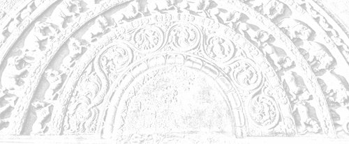

# Sermon 17

> Namo tassa bhagavato arahato sammāsambuddhassa \
> Namo tassa bhagavato arahato sammāsambuddhassa \
> Namo tassa bhagavato arahato sammāsambuddhassa
>
> *Etaṁ santaṁ, etaṁ paṇītaṁ, \
> yadidaṁ sabbasaṅkhārasamatho sabbūpadhipaṭinissaggo \
> taṇhakkhayo virāgo nirodho nibbānaṁ.*[^fn571]
>
> "This is peaceful, this is excellent, \
> namely the stilling of all preparations, the relinquishment of all assets, \
> the destruction of craving, detachment, cessation, extinction."

With the permission of the Most Venerable Great Preceptor and the assembly of
the venerable meditative monks. This is the seventeenth sermon in the series of
sermons on Nibbāna.

In our last sermon, we tried to analyse some discourses that give us a clue to
understand what sort of an experience an *arahant* has in his realization of the
cessation of existence in the *arahattaphalasamādhi*.

We happened to mention that the *arahant* sees the cessation of existence with a
deeply penetrative vision of the void that may be compared to a gaze that knows
no horizon. We also dropped the hint that the non-manifestative consciousness,
endless and lustrous on all sides, we had spoken of in an earlier
sermon,[^fn572] is an explicit reference to this same experience.

How the *arahant*, ranging in his triple pasture of the signless deliverance,
the undirected deliverance and the void deliverance, *animitta vimokkha*,
*appaṇihita vimokkha* and *suññata vimokkha*, gets free from the latency to
perception, transcends the duality of form and formless, and crosses over this
ocean of existence unhindered by Māra, has been described in various ways in
various discourses.

Let us now take up for discussion in this connection three significant verses
that are found in the *Itivuttaka*.

> *Ye ca rūpūpagā sattā* \
> *ye ca arūpaṭṭhāyino,* \
> *nirodhaṁ appajānantā* \
> *āgantāro punabbhavaṁ.*
>
> *Ye ca rūpe pariññāya,* \
> *arūpesu asaṇṭhitā,* \
> *nirodhe ye vimuccanti,* \
> *te janā maccuhāyino.*
>
> *Kāyena amataṁ dhātuṁ,* \
> *phusaytivā nirūpadhiṁ,* \
> *upadhipaṭinissaggaṁ,* \
> *sacchikatvā anāsavo,* \
> *deseti sammāsambuddho,* \
> *asokaṁ virajaṁ padaṁ.*[^fn573]
>
> Those beings that go to realms of form, \
> And those who are settled in formless realms, \
> Not understanding the fact of cessation, \
> Come back again and again to existence.
>
> Those who, having comprehended realms of form, \
> Do not settle in formless realms, \
> Are released in the experience of cessation, \
> It is they that are the dispellers of death.
>
> Having touched with the body the deathless element, \
> Which is asset-less, \
> And realized the relinquishment of assets, \
> Being influx-free, the perfectly enlightened one, \
> Proclaims the sorrow-less, taintless state.

The meaning of the first verse is clear enough. Those who are in realms of form
and formless realms are reborn again and again due to not understanding the fact
of cessation.

In the case of the second verse, there is some confusion as to the correct
reading. We have mentioned earlier, too, that some of the deep discourses
present considerable difficulty in determining what the correct reading
is.[^fn574] They have not come down with sufficient clarity. Where the meaning
is not clear enough, there is a likelihood for the oral tradition to become
corrupt. Here we accepted the reading *asaṇṭhitā*.

> *Ye ca rūpe pariññāya,* \
> *arūpesu asaṇṭhitā,*
> 
> Those who, having comprehended realms of form, \
> Do not settle in formless realms.

But there is the variant reading *susaṇṭhitā*, which gives the meaning 'settled
well'. The two readings contradict each other and so we have a problem here. The
commentary accepts the reading *asaṇṭhitā*.[^fn575] We too followed it, for some
valid reason and not simply because it accords with the commentary.

However, in several modern editions of the text, the reading *asaṇṭhitā* has
been replaced by *susaṇṭhitā*, probably because it seems to make sense, prima
facie.

But, as we pointed out in this series of sermons, there is the question of the
dichotomy between the form and the formless. The formless, or *arūpa*, is like
the shadow of form, *rūpa*. Therefore, when one comprehends form, one also
understands that the formless, too, is not worthwhile settling in. It is in that
sense that we brought in the reading *asaṇṭhitā* in this context.

Those who have fully comprehended form, do not depend on the formless either,
and it is they that are released in the realization of cessation. They transcend
the duality of form and formless and, by directing their minds to the cessation
of existence, attain emancipation.

In the last verse it is said that the Buddha realized the relinquishment of
assets known as *nirupadhi*, the 'asset-less'. It also says that he touched the
deathless element with the body. In a previous sermon we happened to quote a
verse from the *Udāna* which had the conclusive lines:

> *Phusanti phassā upadhiṁ paṭicca,* \
> *Nirupadhiṁ kena phuseyyum phassā.*[^fn576]
>
> Touches touch one because of assets, \
> How can touches touch him who is asset-less?

According to this verse, it seems that here there is no touch. So what we have
stated above might even appear as contradictory. The above verse speaks of a
'touching' of the deathless element with the body. One might ask how one can
touch, when there is no touch at all? But here we have an extremely deep idea,
almost a paradox.

To be free from touch is in itself the 'touching' of the deathless element.

What we mean to say is that, as far as the fear of death is concerned, here we
have the freedom from the pain of death and in fact the freedom from the concept
of death itself.

The Buddha and the *arahants*, with the help of that wisdom, while in that
*arahattaphalasamādhi* described as *anāsavā cetovimutti paññāvimutti*,[^fn577]
or *akuppā cetovimutti*,[^fn578] let go of their entire body and realized the
cessation of existence, thereby freeing themselves from touch and feeling. That
is why Nibbāna is called a bliss devoid of feeling, *avedayita sukha*.[^fn579]

This giving up, this letting go when Māra is coming to grab and seize, is a very
subtle affair. To give up and let go when Māra comes to grab is to touch the
deathless, because thereby one is freed from touch and feelings. Here, then, we
have a paradox. So subtle is this Dhamma!

How does one realize cessation? By attending to the cessation aspect of
preparations.

As we have already mentioned, to arise and to cease is of the nature of
preparations, and here the attention is on the ceasing aspect. The worldlings in
general pay attention to the arising aspect. They can see only that aspect. The
Buddhas, on the other hand, have seen the cessation of existence in a subtle
way. The culmination of the practice of paying attention to the cessation aspect
of preparations is the realization of the cessation of existence.

*Bhava*, or existence, is the domain of Māra. How does one escape from the grip
of Māra? By going beyond his range of vision, that is to say by attending to the
cessation of existence, *bhavanirodha*.

All experiences of pleasure and pain are there so long as one is in *bhava*. The
*arahant* wins to the freedom from form and formless and from pleasure and pain,
as it was said in a verse already quoted:

> *Atha rūpā arūpā ca,* \
> *sukhadukkhā pamuccati*.[^fn580]
>
> And then from form and formless, \
> And from pleasure and pain is he freed.

We explained that verse as a reference to *arahattaphalasamādhi*. Here, too, we
are on the same point. The concept of the cessation of existence is indeed very
deep. It is so deep that one might wonder whether there is anything worthwhile
in Nibbāna, if it is equivalent to the cessation of existence.

As a matter of fact, we do come across an important discourse among the Tens of
the *Aṅguttara Nikāya*, where Nibbāna is explicitly called *bhavanirodha*. It is
in the form of a dialogue between Venerable Ānanda and Venerable Sāriputta. As
usual, Venerable Ānanda is enquiring about that extraordinary *samādhi*.

> *Siyā nu kho, āvuso Sāriputta, bhikkhuno tathārūpo samādhipaṭilābho yathā neva
> pathaviyaṁ pathavisaññī assa, na āpasmiṁ āposaññī assa, na tejasmiṁ tejosaññī
> assa, na vāyasmiṁ vāyosaññī assa, na ākāsānañcāyatane ākāsānañcāyatanasaññī
> assa, na viññāṇañcāyatane viññāṇancāyatanasaññī assa, na ākiñcaññāyatane
> ākiñcaññāyatanasaññī assa, na nevasaññānāsaññāyatane
> nevasaññānāsaññāyatanasaññī assa, na idhaloke idhalokasaññī assa, na paraloke
> paralokasaññī assa, – saññī ca pana assa?*[^fn581]
>
> Could there be, friend Sāriputta, for a monk such an attainment of
> concentration wherein he will not be conscious of earth in earth, nor of water
> in water, nor of fire in fire, nor of air in air, nor will he be conscious of
> the sphere of infinite space in the sphere of infinite space, nor of the
> sphere of infinite consciousness in the sphere of infinite consciousness, nor
> of the sphere of nothingness in the sphere of nothingness, nor of the sphere
> of neither-perception-nor-non-perception in the sphere of
> neither-perception-nor-non-perception, nor of a this world in this world, nor
> of a world beyond in a world beyond – and yet he will be conscious?

Venerable Sāriputta's reply to it is: "There could be, friend Ānanda." Then
Venerable Ānanda asks again: "But then, friend Sāriputta, in which manner could
there be such an attainment of concentration for a monk?"

At that point Venerable Sāriputta comes out with his own experience, revealing
that he himself once attained to such a *samādhi*, when he was at *Andhavana* in
*Sāvatthī*. Venerable Ānanda, however, is still curious to ascertain what sort
of perception he was having, when he was in that *samādhi*. The explanation
given by Venerable Sāriputta in response to it, is of utmost importance. It
runs:

> *Bhavanirodho nibbānaṁ, bhavanirodho nibbānan'ti kho me, avuso, aññā'va saññā
> uppajjati aññā'va saññā nirujjhati.*
>
> *Seyyathāpi, āvuso, sakalikaggissa jhāyamānassa aññā'va acci uppajjati,
> aññā'va acci nirujjhati, evam eva kho me āvuso bhavanirodho nibbānaṁ,
> bhavanirodho nibbānam'ti aññā'va saññā uppajjati aññā'va saññā nirujjhati,
> bhavanirodho nibbānaṁ saññī ca panāhaṁ, āvuso, tasmiṁ samaye ahosiṁ.*
>
> One perception arises in me, friend: 'cessation of existence is Nibbāna',
> 'cessation of existence is Nibbāna', and another perception fades out in me:
> 'cessation of existence is Nibbāna', 'cessation of existence is Nibbāna'.
>
> Just as, friend, in the case of a twig fire, when it is burning one flame
> arises and another flame fades out. Even so, friend, one perception arises in
> me: 'cessation of existence is Nibbāna', 'cessation of existence is Nibbāna',
> and another perception fades out in me: 'cessation of existence is Nibbāna',
> 'cessation of existence is Nibbāna', at that time, friend, I was of the
> perception 'cessation of existence is Nibbāna'.

The true significance of the simile of the twig fire is that Venerable Sāriputta
was attending to the cessation aspect of preparations. As we mentioned in
connection with the formula *etaṁ santaṁ, etaṁ paṇītaṁ,* "this is peaceful, this
is excellent", occurring in a similar context, we are not to conclude that
Venerable Sāriputta kept on repeating "cessation of existence is Nibbāna".

The insight into a flame could be different from a mere sight of a flame.
Worldlings in general see only a process of burning in a flame. To the insight
meditator it can appear as an intermittent series of extinctions. It is the
outcome of a penetrative vision. Just like the flame, which simulates
compactness, existence, too, is a product of *saṅkhāras*, or preparations.

The worldling who attends to the arising aspect and ignores the cessation aspect
is carried away by the perception of the compact. But the mind, when steadied,
is able to see the phenomenon of cessation:

> *Ṭhitaṁ cittaṁ vippamuttaṁ, vayañcassānupassati*,[^fn582]
>
> the mind steadied and released contemplates its own passing away.

With that steadied mind the *arahant* attends to the cessation of preparations.
At its climax, he penetrates the gamut of existence made up of preparations, as
in the case of a flame, and goes beyond the clutches of death.

As a comparison for existence, the simile of the flame is quite apt. We happened
to point out earlier, that the word *upādāna* can mean "grasping" as well as
"fuel".[^fn583] The totality of existence is sometimes referred to as a
fire.[^fn584] The fuel for the fire of existence is grasping itself. With the
removal of that fuel, one experiences extinction.

The dictum *bhavanirodho nibbānam* clearly shows that Nibbāna is the cessation
of existence. There is another significant discourse which equates Nibbāna to
the experience of the cessation of the six sense-bases, *saḷāyatananirodha*. The
same experience of realization is viewed from a different angle. We have already
shown that the cessation of the six sense-bases, or the six sense-spheres, is
also called Nibbāna.[^fn585]

The discourse we are now going to take up is one in which the Buddha presented
the theme as some sort of a riddle for the monks to work out for themselves.

> *Tasmātiha, bhikkhave, se āyatane veditabbe yattha cakkhuñca nirujjhati
> rūpasaññā ca virajjati, se āyatane veditabbe yattha sotañca nirujjhati
> saddasaññā ca virajjati, se āyatane veditabbe yattha ghānañca nirujjhati
> gandhasaññā ca virajjati, se āyatane veditabbe yattha jivhā ca nirujjhati
> rasasaññā ca virajjati, se āyatane veditabbe yattha kāyo ca nirujjhati
> phoṭṭabbasaññā ca virajjati, se āyatane veditabbe yattha mano ca nirujjhati
> dhammasaññā ca virajjati, se āyatane veditabbe, se āyatane veditabbe.*[^fn586]
>
> Therefore, monks, that sphere should be known wherein the eye ceases and
> perceptions of form fade away, that sphere should be known wherein the ear
> ceases and perceptions of sound fade away, that sphere should be known wherein
> the nose ceases and perceptions of smell fade away, that sphere should be
> known wherein the tongue ceases and perceptions of taste fade away, that
> sphere should be known wherein the body ceases and perceptions of the tangible
> fade away, that sphere should be known wherein the mind ceases and perceptions
> of mind objects fade away, that sphere should be known, that sphere should be
> known.

There is some peculiarity in the very wording of the passage, when it says, for
instance, that the eye ceases, *cakkhuñca nirujjhati* and perceptions of form
fade away, *rūpasaññā ca virajjati*. As we once pointed out, the word *virāga*,
usually rendered by 'detachment', has a nuance equivalent to 'fading away' or
'decolouration'.[^fn587] Here that nuance is clearly evident. When the eye
ceases, perceptions of forms fade away.

The Buddha is enjoining the monks to understand that sphere, not disclosing what
it is, in which the eye ceases and perceptions of form fade away, and likewise
the ear ceases and perceptions of sound fade away, the nose ceases and
perceptions of smell fade away, the tongue ceases and perceptions of taste fade
away, the body ceases and perceptions of the tangible fade away, and last of all
even the mind ceases and perceptions of mind objects fade away. This last is
particularly noteworthy.

Without giving any clue to the meaning of this brief exhortation, the Buddha got
up and entered the monastery, leaving the monks perplexed. Wondering how they
could get it explained, they approached Venerable Ānanda and begged him to
comment at length on what the Buddha had preached in brief.

With some modest reluctance, Venerable Ānanda complied, urging that his comment
be reported to the Buddha for confirmation. His comments, however, amounted to
just one sentence:

> *Saḷāyatananirodhaṁ, kho āvuso, Bhagavatā sandhāya bhāsitaṁ.*
>
> Friends, it is with reference to the cessation of the six sense-spheres that
> the Exalted One has preached this sermon.

When those monks approached the Buddha and placed Venerable Ānanda's explanation
before him, the Buddha ratified it. Hence it is clear that the term *āyatana* in
the above passage refers not to any one of the six sense-spheres, but to
Nibbāna, which is the cessation of all of them.

The commentator, Venerable Buddhaghosa, too accepts this position in his
commentary to the passage in question.

> *Saḷāyatananirodhan'ti saḷāyatananirodho vuccati nibbānam, tam sandhāya
> bhāsitan ti attho*,[^fn588]
>
> the cessation of the six sense-spheres, what is called the cessation of the
> six sense-spheres is Nibbāna, the meaning is that the Buddha's sermon is a
> reference to it.

The passage in question bears testimony to two important facts. Firstly that
Nibbāna is called the cessation of the six sense-spheres. Secondly that this
experience is referred to as an *āyatana*, or a 'sphere'.

The fact that Nibbāna is sometimes called *āyatana* is further corroborated by a
certain passage in the *Saḷāyatanvibhaṅgasutta*, which defines the term
*nekkhammasita domanassa*.[^fn589] In that discourse, which deals with some
deeper aspects of the Dhamma, the concept of *nekkhammasita domanassa*, or
"unhappiness connected with renunciation", is explained as follows:

If one contemplates with insight wisdom the sense-objects like forms and sounds
as impermanent, suffering-fraught and transient, and develops a longing for
Nibbāna, due to that longing or expectation one might feel an unhappiness. It is
such an unhappiness which, however, is superior to an unhappiness connected with
the household life, that is called *nekkhammasita domanassa*, or "unhappiness
connected with renunciation".

How such an unhappiness may arise in a monk is described in that discourse in
the following manner:

> *'Kudāssu nāmāhaṁ tadāyatanaṁ upasampajja viharissāmi yadariyā etarahi āyatanaṁ
> upasampajja viharanti?' iti anuttaresu vimokkhesu pihaṁ upaṭṭhāpayato
> uppajjati pihāpaccayā domanassaṁ. Yaṁ evarūpaṁ domanassaṁ idaṁ vuccati
> nekkhammasitadomanassaṁ.*
>
> 'O, when shall I attain to and dwell in that sphere to which the Noble Ones
> now attain and dwell in?' Thus, as he sets up a longing for the incomparable
> deliverances, there arises an unhappiness due to that longing. It is such an
> unhappiness that is called unhappiness connected with renunciation.

What are called 'incomparable deliverances' are the three doorways to Nibbāna,
the signless, the undirected and the void. We can therefore conclude that the
sphere to which this monk aspires is none other than Nibbāna. So here we have a
second instance of a reference to Nibbāna as a 'sphere' or *āyatana*.

Now let us bring up a third:

> *Atthi, bhikkhave, tad āyatanaṁ, yattha n'eva pathavī na āpo na tejo na vāyo
> na ākāsānañcāyatanaṁ na viññāṇānañcāyatanaṁ na ākiñcaññāyatanaṁ na
> nevasaññānāsaññāyatanaṁ na ayaṁ loko na paraloko na ubho candimasūriyā. Tatra
> p'ahaṁ bhikkhave, n'eva āgatiṁ vadāmi na gatiṁ na ṭhitiṁ na cutiṁ na
> upapattiṁ, appatiṭṭhaṁ appavattaṁ anārammaṇaṁ eva taṁ. Es'ev'anto
> dukkhassā'ti*.[^fn590]

Incidentally, this happens to be the most controversial passage on Nibbāna.
Scholars, both ancient and modern, have put forward various interpretations of
this much vexed passage. Its riddle-like presentation has posed a challenge to
many a philosopher bent on determining what Nibbāna is.

This brief discourse comes in the *Udāna* as an inspired utterance of the Buddha
on the subject of Nibbāna, *Nibbānapaṭisamyuttasutta*. To begin with, we shall
try to give a somewhat literal translation of the passage:

> Monks, there is that sphere, wherein there is neither earth, nor water, nor
> fire, nor air; neither the sphere of infinite space, nor the sphere of
> infinite consciousness, nor the sphere of nothingness, nor the sphere of
> neither-perception-nor-non-perception; neither this world nor the world
> beyond, nor the sun and the moon. There, monks, I say, is no coming, no going,
> no staying, no passing away and no arising; it is not established, it is not
> continuing, it has no object. This, itself, is the end of suffering.

Instead of getting down to the commentarial interpretation at the very outset,
let us try to understand this discourse on the lines of the interpretation we
have so far developed. We have already come across two references to Nibbāna as
an *āyatana* or a sphere. In the present context, too, the term *āyatana* is an
allusion to *arahattaphalasamādhi*. Its significance, therefore, is
psychological.

First of all we are told that earth, water, fire and air are not there in that
*āyatana*. This is understandable, since in a number of discourses dealing with
*anidassana viññāṇa* and *arahattaphalasamādhi* we came across similar
statements.

It is said that in *anidassana viññāṇa*, or non-manifestative consciousness,
earth, water, fire and air do not find a footing. Similarly, when one is in
*arahattaphalasamādhi*, one is said to be devoid of the perception of earth in
earth, for instance, because he does not attend to it. So the peculiar negative
formulation of the above *Udāna* passage is suggestive of the fact that these
elements do not exercise any influence on the mind of one who is in
*arahattaphalasamādhi*.

The usual interpretation, however, is that it describes some kind of a place or
a world devoid of those elements. It is generally believed that the passage in
question is a description of the 'sphere' into which the *arahant* passes away,
that is, his after death 'state'. This facile explanation is often presented
only as a tacit assumption, for fear of being accused of heretical views. But it
must be pointed out that the allusion here is to a certain level of experience
of the living *arahant*, namely the realization, here and now, of the cessation
of existence, *bhavanirodha*.

The four elements have no part to play in that experience. The sphere of
infinite space, the sphere of infinite consciousness etc. also do not come in,
as we have already shown with reference to a number of discourses. So it is free
from both form and formless.

The statement that there is neither this world nor a world beyond could be
understood in the light of the phrase,

> *na idhaloke idhalokasaññī, na paraloke paralokasaññī*,
>
> percipient neither of a this world in this world, nor of a world beyond in a
> world beyond

that came up in a passage discussed above.

The absence of the moon and the sun, *na ubho candima sūriyā*, in this sphere,
is taken as the strongest argument in favour of concluding that Nibbāna is some
kind of a place, a place where there is no moon or sun.

But as we have explained in the course of our discussion of the term *anidassana
viññāṇa*, or non-manifestative consciousness, with the cessation of the six
sense-spheres, due to the all lustrous nature of the mind, sun and moon lose
their lustre, though the senses are all intact. Their lustre is superseded by
the lustre of wisdom. They pale away and fade into insignificance before it. It
is in this sense that the moon and the sun are said to be not there in that
sphere.

Why there is no coming, no going, no staying, no passing away and no arising,
can be understood in the light of what we have observed in earlier sermons on
the question of relative concepts.

The verbal dichotomy characteristic of worldly concepts is reflected in this
reference to a coming and a going etc. The *arahant* in *arahattaphalasamādhi*
is free from the limitations imposed by this verbal dichotomy.

The three terms *appatiṭṭhaṁ, appavattaṁ* and *anārammaṇaṁ*, 'not established',
'not continuing' and 'objectless', are suggestive of the three doorways to
deliverance.

*Appatiṭṭhaṁ* refers to *appaṇihita vimokkha*, 'undirected deliverance', which
comes through the extirpation of craving.

*Appavattaṁ* stands for *suññata vimokkha*, the 'void deliverance', which is the
negation of continuity.

*Anārammaṇaṁ* is clearly enough a reference to *animitta vimokkha*, the
'signless deliverance'. Not to have an object is to be signless.

The concluding sentence "this itself is the end of suffering" is therefore a
clear indication that the end of suffering is reached here and now. It does not
mean that the *arahant* gets half of Nibbāna here and the other half 'there'.

Our line of interpretation leads to such a conclusion, but of course, in case
there are shortcomings in it, we could perhaps improve on it by having recourse
to the commentarial interpretation.

Now as to the commentarial interpretation, this is how the *Udāna* commentary
explains the points we have discussed:[^fn591] It paraphrases the term *āyatana*
by *kāraṇa*, observing that it means reason in this context. Just as much as
forms stand in relation of an object to the eye, so the *asaṅkhata dhātu*, or
the 'unprepared element', is said to be an object to the *arahant's* mind, and
here it is called *āyatana*.

Then the commentary raises the question, why earth, water, fire and air are not
there in that *asaṅkhata dhātu*. The four elements are representative of things
prepared, *saṅkhata*. There cannot be any mingling or juxtaposition between the
*saṅkhata* and the *asaṅkhata*. That is why earth, water, fire and air are not
supposed to be there, in that *āyatana*.

The question why there are no formless states, like the sphere of infinite
space, the sphere of infinite consciousness, the sphere of nothingness, the
sphere of neither-perception-nor-non-perception, is similarly explained, while
asserting that Nibbāna is nevertheless formless.

Since in Nibbāna one has transcended the sensuous sphere, *kāmaloka*, the
concepts of a this world and a world beyond are said to be irrelevant. As to why
the sun and the moon are not there, the commentary gives the following
explanation:

In realms of form there is generally darkness, to dispel which there must be a
sun and a moon. But Nibbāna is not a realm of form, so how could sun and moon
come in?

Then what about the reference to a coming, a going, a staying, a passing away
and an arising? No one comes to Nibbāna from anywhere and no one goes out from
it, no one stays in it or passes away or reappears in it.

Now all this is mystifying enough. But the commentary goes on to interpret the
three terms *appatiṭṭhaṁ, appavattaṁ* and *anārammaṇaṁ* also in the same vein.
Only that which has form gets established and Nibbāna is formless, therefore it
is not established anywhere. Nibbāna does not continue, so it is *appavattaṁ*,
or non-continuing. Since Nibbāna takes no object, it is objectless,
*anārammaṇaṁ*. It is as good as saying that, though one may take Nibbāna as an
object, Nibbāna itself takes no object.

So this is what the traditional interpretation amounts to. If there are any
shortcomings in our explanation, one is free to go for the commentarial. But it
is obvious that there is a lot of confusion in this commentarial trend.
Insufficient appreciation of the deep concept of the cessation of existence
seems to have caused all this confusion.

More often than otherwise, commentarial interpretations of Nibbāna leaves room
for some subtle craving for existence, *bhavataṇhā*. It gives a vague idea of a
place or a sphere, *āyatana*, which serves as a surrogate destination for the
*arahants* after their demise. Though not always explicitly asserted, it is at
least tacitly suggested. The description given above is ample proof of this
trend. It conjures up a place where there is no sun and no moon, a place that is
not a place. Such confounding trends have crept in probably due to the very
depth of this Dhamma.

Deep indeed is this Dhamma and hard to comprehend, as the Buddha once confided
in Venerable Sāriputta with a trace of tiredness:

> *Saṅkhittenapi kho ahaṁ, Sāriputta, dhammaṁ deseyyaṁ, vitthārenapi kho ahaṁ,
> Sāriputta, dhammaṁ deseyyaṁ, saṅkhittenavitthārenapi kho ahaṁ, Sāriputta,
> dhammaṁ deseyyaṁ, aññātāro ca dullabhā*.[^fn592]
>
> Whether I were to preach in brief, Sāriputta, or whether I were to preach in
> detail, Sāriputta, or whether I were to preach both in brief or in detail,
> Sāriputta, rare are those who understand.

Then Venerable Sāriputta implores the Buddha to preach in brief, in detail and
both in brief and in detail, saying that there will be those who understand. In
response to it the Buddha gives the following instruction to Venerable
Sāriputta:

> *Tasmātiha, Sāriputta, evaṁ sikkhitabbaṁ: 'Imasmiñca saviññāṇake kāye
> ahaṅkāramamaṅkāramānānusayā na bhavissanti, bahiddhā ca sabbanimittesu
> ahaṅkāramamaṅkāramānānusayā na bhavissanti, yañca cetovimuttiṁ paññāvimuttiṁ
> upasampajja viharato ahaṅkāramamaṅkāramānānusayā na honti, tañca cetovimuttiṁ
> paññāvimuttiṁ upasampajja viharissāmā'ti. Evañhi kho, Sāriputta,
> sikkhitabbaṁ,*
>
> If that is so, Sāriputta, you all should train yourselves thus: In this
> conscious body and in all external signs there shall be no latencies to
> conceits in terms of I-ing and my-ing, and we will attain to and dwell in that
> deliverance of the mind and that deliverance through wisdom whereby no such
> latencies to conceits of I-ing and my-ing will arise. Thus should you all
> train yourselves!

The Buddha goes on to declare the final outcome of that training:

> *Ayaṁ vuccati, Sāriputta, bhikkhu acchecchi taṇhaṁ vāvattayi saṁyojanaṁ sammā
> mānābhisamayā antam akāsi dukkhassa*.
>
> Such a monk, Sāriputta, is called one who has cut off craving, turned back
> the fetters, and by rightly understanding conceit for what it is, has made an
> end of suffering.

We find the Buddha summing up his exhortation by quoting two verses from a sutta
in the *Pārāyanavagga* of the *Sutta Nipāta*, which he himself had preached to
the Brahmin youth Udaya.

We may mention in passing that among canonical texts, the *Sutta Nipāta* was
held in high esteem so much so that in a number of discourses the Buddha is seen
quoting from it, particularly from the two sections *Aṭṭhakavagga* and
*Pārāyanavagga*. Now the two verses he quotes in this instance from the
*Pārāyanavagga* are as follows:

> *Pahānaṁ kāmacchandānaṁ,* \
> *domanassāna cūbhayaṁ,* \
> *thīṇassa ca panūdanaṁ,* \
> *kukkuccānaṁ nivāraṇaṁ,*
>
> *Upekhāsatisaṁsuddhaṁ,* \
> *dhammatakkapurejavaṁ,* \
> *aññāvimokhaṁ pabrūmi,* \
> *avijjāyappabhedanaṁ.*[^fn593]
>
> The abandonment of both sensuous perceptions, \
> And unpleasant mental states, \
> The dispelling of torpidity, \
> And the warding off of remorse,
>
> The purity born of equanimity and mindfulness, \
> With thoughts of Dhamma forging ahead, \
> And blasting ignorance, \
> This I call the deliverance through full understanding.

This is ample proof of the fact that the *arahattaphalasamādhi* is also called
*aññāvimokkha*. Among the Nines of the *Aṅguttara Nikāya* we come across another
discourse which throws more light on the subject. Here Venerable Ānanda is
addressing a group of monks.

> *Acchariyaṁ, āvuso, abbhutam, āvuso, yāvañcidaṁ tena Bhagavatā jānatā passatā
> arahatā sammāsambuddhena sambādhe okāsādhigamo anubuddho sattānaṁ visuddhiyā
> sokapariddavānaṁ samatikkamāya dukkhadomanassānaṁ atthaṅgamāya ñāyassa
> adhigamāya nibbānassa sacchikiriyāya.*
>
> *Tadeva nāma cakkhuṁ bhavissati te rūpā tañcāyatanaṁ no paṭisaṁvedissati.
> Tadeva nāma sotaṁ bhavissati te saddā tañcāyatanaṁ no paṭisaṁvedissati. Tadeva
> nāma ghānaṁ bhavissati te gandhā tañcāyatanaṁ no paṭisaṁvedissati. Sā ca nāma
> jivhā bhavissati te rasā tañcāyatanaṁ no paṭisaṁvedissati. So ca nāma kāyo
> bhavissati te phoṭṭhabbā tañcāyatanaṁ no paṭisaṁvedissati.*[^fn594]
>
> It is wonderful, friends, it is marvellous, friends, that the Exalted One who
> knows and sees, that Worthy One, fully enlightened, has discovered an
> opportunity in obstructing circumstances for the purification of beings, for
> the transcending of sorrow and lamentation, for the ending of pain and
> unhappiness, for the attainment of the right path, for the realization of
> Nibbāna.
>
> In as much as that same eye will be there, those forms will be there, but one
> will not be experiencing the appropriate sense-sphere. That same ear will be
> there, those sounds will be there, but one will not be experiencing the
> appropriate sense-sphere. That same nose will be there, those smells will be
> there, but one will not be experiencing the appropriate sense-sphere. That
> same tongue will be there, those flavours will be there, but one will not be
> experiencing the appropriate sense-sphere. That same body will be there, those
> tangibles will be there, but one will not be experiencing the appropriate
> sense-sphere.

What is so wonderful and marvellous about this newly discovered opportunity is
that, though apparently the senses and their corresponding objects come
together, there is no experience of the appropriate spheres of sense contact.
When Venerable Ānanda had described this extraordinary level of experience in
these words, Venerable Udāyī raised the following question:

> *Saññīmeva nu kho āvuso Ānanda, tadāyatanaṁ no paṭisaṁvedeti udāhu asaññī?*
>
> Friend, is it the fact that while being conscious one is not experiencing that
> sphere or is he unconscious at that time?

Venerable Ānanda affirms that it is while being conscious, *saññīmeva*, that
such a thing happens. Venerable Udāyī's cross-question gives us a further clue
to the riddle like verse we discussed earlier, beginning with *na sañña saññī na
visañña saññī*.

It is indeed puzzling why one does not experience those sense-objects, though
one is conscious. As if to drive home the point, Venerable Ānanda relates how he
once answered a related question put to him by the nun *Jaṭilagāhiyā* when he
was staying at the Deer park in *Añjanavana* in *Sāketa*. The question was:

> *Yāyaṁ, bhante Ānanda, samādhi na cābhinato na cāpanato na ca
> sasaṅkhāraniggayhavāritavato, vimuttattā ṭhito, ṭhitattā santusito,
> santusitattā no paritassati. Ayaṁ, bhante, samādhi kiṁphalo vutto Bhagavatā?*
>
> That concentration, Venerable Ānanda, which is neither turned towards nor
> turned outwards, which is not a vow constrained by preparations, one that is
> steady because of freedom, contented because of steadiness and not hankering
> because of contentment, Venerable Sir, with what fruit has the Exalted One
> associated that concentration?

The question looks so highly compressed that the key words in it might need some
clarification. The two terms *abhinata* and *apanata* are suggestive of lust and
hate, as well as introversion and extroversion. This concentration is free from
these extreme attitudes.

Whereas in ordinary concentration *saṅkhāras*, or preparations, exercise some
degree of control as the term *vikkhambhana*, 'propping up', 'suppression',
suggests, here there is no implication of any forcible action as in a vow. Here
the steadiness is born of freedom from that very constriction.

Generally, the steadiness characteristic of a level of concentration is not much
different from the apparent steadiness of a spinning top. It is the spinning
that keeps the top up. But here the very freedom from that spinning has brought
about a steadiness of a higher order, which in its turn gives rise to
contentment.

The kind of peace and contentment that comes with *samādhi* in general is
brittle and irritable. That is why it is sometimes called *kuppa paṭicca santi*,
"peace subject to irritability".[^fn595] Here, on the contrary, there is no such
irritability.

We can well infer from this that the allusion is to *akuppā cetovimutti*,
"unshakeable deliverance of the mind". The kind of contentment born of freedom
and stability is so perfect that it leaves no room for hankering, *paritassanā*.

However, the main point of the question posed by that nun amounts to this: What
sort of a fruit does a *samādhi* of this description entail, according to the
words of the Exalted One?

After relating the circumstances connected with the above question as a flash
back, Venerable Ānanda finally comes out with the answer he had given to the
question:

> *Yāyaṁ, bhagini, samādhi na cābhinato na cāpanato na ca
> sasaṅkhāraniggayhavāritavato, vimuttattā ṭhito, ṭhitattā santusito,
> santusitattā no paritassati, ayaṁ, bhagini, samādhi aññāphalo vutto
> Bhagavatā*.
>
> Sister, that concentration which is neither turned towards nor turned
> outwards, which is not a vow constrained by preparations, one that is steady
> because of freedom, contented because of steadiness and not hankering because
> of contentment, that concentration, sister, has been declared by the Buddha to
> have full understanding as its fruit.

*Aññā*, or full understanding, is one that comes with realization conferring
certitude and it is the fruit of the concentration described above. Then, as if
coming back to the point, Venerable Ānanda adds:

> *Evaṁ saññīpi kho, āvuso, tad āyatanaṁ no paṭisaṁvedeti.*
>
> Being thus conscious, too, friend, one does not experience an appropriate
> sphere of sense.

So now we have garnered sufficient evidence to substantiate the claims of this
extraordinary *arahattaphalasamādhi*. It may also be mentioned that sometimes
this realization of the *arahant* is summed up in a sentence like

> *anāsavaṁ cetovimuttiṁ paññāvimuttiṁ diṭṭheva dhamme sayaṁ abhiññā sacchikatvā
> upasampajja viharati*,[^fn596]
>
> having realized by himself through higher knowledge here and now the
> influx-free deliverance of the mind and deliverance through wisdom, he dwells
> having attained to it.

There is another significant discourse in the section of the Fours in the
*Aṅguttara Nikāya* which throws some light on how one should look upon the
*arahant* when he is in *arahattaphalasamādhi*. The discourse deals with four
types of persons, namely:

1. *anusotagāmī puggalo,* "downstream bound person"
2. *paṭisotagāmī puggalo,* "upstream bound person"
3. *ṭhitatto puggalo,* "stationary person"
4. *tiṇṇo pāragato thale tiṭṭhati brāhmaṇo,* "the Brahmin standing on dry ground
   having crossed over and gone beyond".[^fn597]

The first type of person indulges in sense pleasures and commits evil deeds and
is thus bound downstream in *saṁsāra*.

The second type of person refrains from indulgence in sense pleasures and from
evil deeds. His upstream struggle is well expressed in the following sentence:

> *Sahāpi dukkhena sahāpi domanassena assumukhopi rudamāno paripuṇṇaṁ
> parisuddhaṁ brahmacariyaṁ carati,*
>
> even with pain, even with displeasure, with tearful face and crying he leads
> the holy life in its fullness and perfection.

The third type, the stationary, is the non-returner who, after death, goes to
the Brahma world and puts and end to suffering there, without coming back to
this world.

It is the fourth type of person who is said to have crossed over and gone to the
farther shore, *tiṇṇo pāragato*, and stands there, *thale tiṭṭhati*.

The word *brahmin* is used here as an epithet of an *arahant*. This riddle-like
reference to an *arahant* is explained there with the help of the more thematic
description

> *āsavānaṁ khayā anāsavaṁ cetovimuttiṁ paññāvimuttiṁ diṭṭheva dhamme sayaṁ
> abhiññā sacchikatvā upasampajja viharati*,
>
> with the extinction of influxes he attains to and abides in the influx free
> deliverance of the mind and deliverance through wisdom.

This brings us to an extremely deep point in our discussion on Nibbāna. If the
*arahant* in *arahattaphalasamādhi* is supposed to be standing on the farther
shore, having gone beyond, what is the position with him when he is taking his
meals or preaching in his every day life? Does he now and then come back to this
side?

Whether the *arahant*, having gone to the farther shore, comes back at all is a
matter of dispute. The fact that it involves some deeper issues is revealed by
some discourses touching on this question.

The last verse of the *Paramaṭṭhakasutta* of the *Sutta Nipāta*, for instance,
makes the following observation:

> *Na kappayanti na purekkharonti,* \
> *dhammā pi tesaṁ na paṭicchitāse,* \
> *na brāhmaṇo sīlavatena neyyo,* \
> *pāraṁgato na pacceti tādi.*[^fn598]
>
> They, the *arahants*, \
>  do not formulate or put forward views, \
> They do not subscribe to any views, \
> The true Brahmin is not liable to be led astray \
>  by ceremonial rites and ascetic vows, \
> The Such like One, \
>  who has gone to the farther shore, comes not back.

It is the last line that concerns us here. For the *arahant* it uses the term
*tādī*, a highly significant term which we came across earlier too. The rather
literal rendering 'such-like' stands for steadfastness, for the unwavering
firmness to stand one's ground.

So, the implication is that the *arahant*, once gone beyond, does not come back.
The steadfastness associated with the epithet *tādī* is reinforced in one
*Dhammapada* verse by bringing in the simile of the firm post at the city gate:

> *Indakhīlūpamo tādi subbato*,[^fn599]
>
> who is steadfast and well conducted like the pillar at the city gate.

The verse in question, then, points to the conclusion that the steadfast one,
the *arahant*, who has attained supramundane freedom, does not come back.

[^fn571]: [MN 64 / M I 436](https://suttacentral.net/mn64/pli/ms), *Mahāmālunkyasutta*

[^fn572]: See especially *Sermon 7*

[^fn573]: It 62, *Santatarasutta*

[^fn574]: See *Sermon 7*

[^fn575]: It-a II 42

[^fn576]: [Ud 2.4 / Ud 12](https://suttacentral.net/ud2.4/pli/ms), *Sakkārasutta*; see *Sermon 16*

[^fn577]: This expression occurs e.g. at M I 35, *Ākaṅkheyyasutta*

[^fn578]: This expression occurs e.g. at S IV 297, *Godattasutta*

[^fn579]: Ps III 115, *aṭṭhakathā* on MN 59, *Bahuvedanīyasutta*

[^fn580]: [Ud 1.10 / Ud 9](https://suttacentral.net/ud1.10/pli/ms), *Bāhiyasutta*; see *Sermon 15*

[^fn581]: A V 8, *Sāriputtasutta*

[^fn582]: A III 379, *Soṇasutta*

[^fn583]: See *Sermon 1*

[^fn584]: S IV 19, *Ādittasutta*

[^fn585]: See *Sermon 9 and 15*

[^fn586]: S IV 98, *Kāmaguṇasutta*

[^fn587]: See *Sermon 5*

[^fn588]: Spk II 391

[^fn589]: M III 217, *Saḷāyatanavibhaṅgasutta*

[^fn590]: [Ud 8.2 / Ud 80](https://suttacentral.net/ud8.2/pli/ms), *Paṭhamanibbānapaṭisaṁyuttasutta*

[^fn591]: Ud-a 389

[^fn592]: A I 133, *Sāriputtasutta*

[^fn593]: Sn 1106-1107, *Udayamāṇavapucchā*

[^fn594]: A IV 426, *Ānandasutta*

[^fn595]: [Snp 4.3 / Sn 784](https://suttacentral.net/snp4.3/pli/ms), *Duṭṭhaṭṭhakasutta*

[^fn596]: E.g. D I 156, *Mahālisutta*

[^fn597]: A II 5, *Anusotasutta*

[^fn598]: Sn 803, *Paramaṭṭhakasutta*

[^fn599]: Dhp 95, *Arahantavagga*
