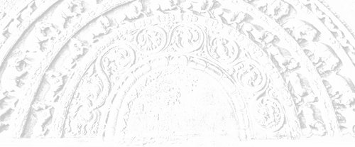

# Sermon 23

> Namo tassa bhagavato arahato sammāsambuddhassa \
> Namo tassa bhagavato arahato sammāsambuddhassa \
> Namo tassa bhagavato arahato sammāsambuddhassa
>
> *Etaṁ santaṁ, etaṁ paṇītaṁ, \
> yadidaṁ sabbasaṅkhārasamatho sabbūpadhipaṭinissaggo \
> taṇhakkhayo virāgo nirodho nibbānaṁ.*[^fn753]
>
> "This is peaceful, this is excellent, \
> namely the stilling of all preparations, the relinquishment of all assets, \
> the destruction of craving, detachment, cessation, extinction."

With the permission of the Most Venerable Great Preceptor and the assembly of
the venerable meditative monks. This is the twentythird sermon in the series of
sermons on Nibbāna.

The other day, we brought up quotations to prove that Nibbāna, as the cessation
of becoming, carries no implications of a nihilist or annihilationist view
because the Tathāgata has transcended the concept of a being.

It became evident, from those quotations, that to assert with an eternalist
bias, the proposition that the Tathāgata exists after death, simply because he
is referred to as a being, or a person, in the discourses, is contrary to the
spirit of the Dhamma. The fact that the *arahant*, who has done away with the
latencies to conceits of 'I' and 'mine', still continues to use even the words
'I' and 'mine', only as a concession to worldly conventions and common parlance,
came to light from the *Arahantasutta* of the *Saṁyutta Nikāya*, quoted on an
earlier occasion.

To remind ourselves of the relevant section of that quotation, we may hark back
to the following lines:

> *'Ahaṁ vadāmī'ti pi so vadeyya,* \
> *'Mamaṁ vadantī'ti pi so vadeyya,* \
> *Loke samaññaṁ kusalo viditvā,* \
> *Vohāramattena so vohareyya.*[^fn754]
>
> He might still say: 'I speak', \
> He might also say: 'They speak to me', \
> Being skilful in knowing the worldly parlance, \
> He uses such terms merely as a convention.

The philosophy of voidness that emerges from those discourses which declare that
in reality there is no Tathāgata, we compared to the blazing flames arising from
the fistfuls of a highly inflammable incense powder at the end of an all-night's
ceremony of devil dancing. Generally this fire ordeal is horrifying to the
onlookers. The Buddha also had to stage a similar fire ordeal in the
*Dhammayāga*, or the 'Dhamma-sacrifice', he administered to exorcize the
malignant personality view, *sakkāyadiṭṭhi*, ingrained in the minds of
worldlings.

Of course there is no explicit reference to such a fire ordeal in the
discourses. However, we do come across a word somewhat suggestive of this kind
of exorcism. The word *vidhūpeti*, derived from the word *dhūpa*, 'incense', is
suggestive of 'fumigating' or 'smoking out'. For instance, we find the following
verse in the *Bodhivagga* of the *Udāna* with reference to the stages of
reflection on the law of dependent arising, in direct and reverse order, that
the Buddha had gone through just after his enlightenment.

> *Yadā have pātubhavanti dhammā,* \
> *Ātāpino jhāyato brāhmaṇassa,* \
> *Vidhūpayaṁ tiṭṭhati Mārasenaṁ,* \
> *Suriyo 'va obhāsayam antalikkhaṁ.*[^fn755]
> 
> When *dhammas* manifest themselves, \
> To the resolutely meditating Brahmin, \
> He stands fumigating the hordes of Māra, \
> Like the sun irradiating the firmament.

The dispelling of the hordes of Māra is rather suggestive of a smoking out. In
some other discourses, this verb *vidhūpeti* is found contrasted with
*sandhūpeti*. The meaning of both these verbs, which have the *dhūpa* element in
common, is not quite clear. It is likely that the two words imply two functions
of the ritual associated with incense. While some fragrant kinds of incense are
used for propitiating benevolent spirits, certain caustic types are utilized for
exorcising evil spirits.

For instance in the *Khajjanīyasutta* of the *Saṁyutta Nikāya*, with reference
to the noble disciple, the phrase *vidhūpeti na sandhūpeti* occurs.[^fn756]
Since the implicit reference is again to the hordes of Māra, the phrase could be
rendered as "he exorcises and does not propitiate".

The ordinary worldling's mode of recognition of the Tathāgata is comparable to
the recognition of a vortex that has already ceased with the help of the flotsam
and jetsam lightly floating around it. Even after the vortex has ceased, flotsam
and jetsam could still go on rotating, giving the wrong impression that the
vortex is still there.

If one understands that the vortex has actually ceased deep down at its centre,
and that what remains there, now, is the great ocean, undifferentiated and
unique, one can get rid of the unfounded fear arising from the statement that
there is no Tathāgata in truth and fact.

The cessation of the puny centre of the whirlpool is equivalent to inheriting an
expansive great ocean. It is where a vortex ceases that the great ocean prevails
unhindered. To give up the limitations of a vortex, is to inherit the limitless
ocean.

The irony arising from these statements is already implicit in the term
*arahant*. We use this term with reference to the Buddha as well as the
*arahants*. Though the commentators later attributed various other meanings to
the term, the basic sense is 'to be worthy of gifts'. In fact, it is being
worthy of receiving everything.

**It is by giving up all that one becomes worthy of all.**

Here too, we have a paradox. To become an *arahant* is to let go of everything.
Craving has to be fully abandoned. It is when all desires are gone, when
everything is given up, that one becomes worthy of receiving everything. This is
the deeper side of the significance of the term *arahant*.

There are six modes of measuring in accordance with the conceit 'am',
*asmimāna*. What is known as *saḷāyatana*, or the six sense-bases, comprise the
six scales of measurement, asserting the conceit 'am'. At whatever point of time
the measuring, evaluating and assessing done by the six sense-bases, such as the
eye, ear, nose etc., ceases, the person concerned thereby becomes immeasurable,
invaluable and boundless. It is here that the simile of the vortex and the ocean
becomes meaningful. So the only way of becoming immeasurable and boundless is to
abandon all those scales of measurement. This might sound extremely strange.

With the cessation of a vortex, the attention of one who has been looking at it
turns towards the depth, immeasurability and boundlessness of the great ocean.
This line of reflection might even enable one to get a glimpse of an unworldly
beauty in this philosophy of the void, which drives an unfounded fear into the
minds of the worldlings.

We do get positive proof of this fact in such sections of the *Dhammapada* as
those entitled The Flowers, The Worthy, The Buddha and The Brahmin, as well as
in a number of discourses in the *Sutta Nipāta*, where we come across
marvellously scintillating verses. This is understandable, since the dawn of
that wisdom which sees the voidness of a self and of everything belonging to a
self, and the attainment of the fruits of the path in the light of that wisdom,
marks the efflorescence as well as the fruition of the *saṁsāric* existence of a
being.

This idea comes up, for instance, in the section on flowers in the *Dhammapada*.

> *Yathā saṅkāradhānasmiṁ,* \
> *Ujjhitasmiṁ mahāpathe,* \
> *Padumaṁ tattha jāyetha,* \
> *Sucigandhaṁ manoramaṁ.*
>
> *Evaṁ saṅkārabhūtesu,* \
> *andhabhūte puthujjane,* \
> *atirocati paññāya,* \
> *sammāsambuddhasāvako.*[^fn757]
>
> As on top of a rubbish heap, \
> Dumped by the highway side, \
> There blossoms forth a lotus, \
> Pure in fragrance and charming.
>
> So amidst the worldlings blind, \
> The Fully Awakened One's disciple, \
> Outshines them in marked contrast, \
> In point of wisdom bright.

So, then, the *arahant* is that charming lotus, arising out of the cesspool of
*saṁsāra*. Surely there cannot be anything frightful about it. There is nothing
to get scared about this prospect.

In our last sermon we quoted from a discourse that gives some new definitions
and new concepts of the world.[^fn758] We brought up two statements from the
*Lokakāmaguṇasutta* (No. 1) of the *Saḷāyatanavagga* in the *Saṁyutta Nikāya*.
The first statement is somewhat riddle-like. There the Buddha addresses the
monks and declares:

> *Nāhaṁ, bhikkhave, gamanena lokassa antaṁ ñātayyaṁ, daṭṭhayyaṁ, pattayyan'ti
> vadāmi. Na ca panāhaṁ, bhikkhave, appatvā lokassa antaṁ dukkhassa antakiriyaṁ
> vadāmi.*[^fn759]
>
> Monks, I do not say that by travelling one can come to know or see or reach
> the end of the world. Nor do I say that without reaching the end of the world
> one can put an end to suffering.

We also mentioned, the other day, the explanation given by Venerable Ānanda to
this cryptic statement at the request of those monks who approached him to get
it clarified. That explanation embodies the definition given by the Buddha to
the term world. It is not the common concept of the world.

> *Yena kho, āvuso, lokasmiṁ lokasaññī hoti lokamānī, ayaṁ vuccati ariyassa
> vinaye loko. Kena c'āvuso lokasmiṁ lokasaññī hoti lokamānī?*
>
> *Cakkhunā kho, āvuso, lokasmiṁ lokasaññī hoti lokamānī, sotena ... ghānena
> ... jivhāya ... kāyena ... manena kho, āvuso, lokasmiṁ lokasaññī hoti
> lokamānī. Yena kho, āvuso, lokasmiṁ lokasaññī hoti lokamānī, ayaṁ vuccati
> ariyassa vinaye loko.*
>
> Friends, that by which one has a perception of the world and has a conceit of
> the world, that in this discipline of the Noble Ones is called 'the world'. By
> what, friends, has one a perception of the world and a conceit of the world?
>
> By the eye, friends, one has a perception of the world and a conceit of the
> world, by the ear ... by the nose ... by the tongue ... by the body ... by the
> mind ... That, friends, by which one has a perception of the world and a
> conceit of the world, that in this discipline of the Noble Ones is called 'the
> world'.

That with which the world is measured, that itself is called 'the world'. The
above-mentioned measuring rods, namely the eye, the ear, the nose, the tongue,
the body and the mind, give us a conceit of the world and a perception of the
world. Apart from these six there is no way of knowing a world. All theories
about the world are founded on these six sense-bases.

By way of a simple illustration, we alluded to the fact that in the absence of
any standard measuring rod, we resort to the primordial scales based on this
physical frame of ours, such as the inch, the span, the foot and the fathom.

The subtlest scale of measurement, however, is that based on the mind. It is in
this mode of measuring and reckoning that concepts and designations play their
part. But the Buddha's philosophy of the void goes against all these mental
modes. His exorcism by the vision of the void fumigates all concepts and
designations.

The six sense-bases are therefore so many scales of measurement. It is with the
help of these that the world is measured. So the above definition of the world
brings out the 'prepared', *saṅkhata*, nature of the world. It is a
thought-construct.

This does not amount to a negation of the role of materiality. All we mean to
say is that the concept of the world is actually an outcome of these six sense
bases. To that extent it is something prepared, a thought-construct.

While discussing the ten indeterminate points on a previous occasion, we
happened to mention that the first four among them concern the world.[^fn760]

1. "The world is eternal."
2. "The world is not eternal."
3. "The world is finite."
4. "The world is infinite."

What those theorists meant by the term world in this context is none other than
that prepared world which is constructed by the six sense-bases. That is to say,
it is just the concept of the world.

However, they were not aware of the fact that their concept of the world is a
thought-construct, because they had no insight into the law of dependent
arising. They did not understand that these are mere preparations.

The fallacy involved here, that is, the inability to understand that their
concept of the world is the outcome of wrong attention, we illustrated by the
simile of the magic kettle.

In an exhibition a magic kettle is displayed from which water keeps on flowing
into a basin. One curious onlooker is waiting to see the kettle empty, while the
other is waiting to see the basin overflowing. Both are unaware of the fact that
a hidden tube conveys the water back again to the kettle, unseen through the
same flow of water.

The ordinary concept of the world carries with it the same fallacy. The
worldlings under the sway of defilements, which thrive on the perception of the
compact, *ghanasaññā*, have the habit of grasping everything. The ordinary man
of the world, fully overcome by craving and grasping, entertains a perception of
permanence since he has no insight. That is why he regards the world as a unit
due to his perception of the compact, as he takes cognizance only of the arising
aspect, ignoring the decaying aspect.

Whether such a world is eternal or not, is the point at issue in the case of the
first set of questions mentioned above, while the next set poses the dilemma
whether it is finite or infinite. What is at the root of all those ill-conceived
notions, is the premise that it is possible to posit an absolute existence or an
absolute non-existence. In other words, the two extreme views 'everything
exists' and 'nothing exists'.

The unique norm of dependent arising, which the Buddha discovered, dismisses
both those extreme views. It is set forth in the *Kaccāyanagottasutta* of the
*Nidānasaṁyutta* in the *Saṁyutta Nikāya*, which we have quoted earlier
too.[^fn761] We shall, however, bring up again the relevant section to elucidate
this point.

> *Dvayanissito khvāyaṁ, Kaccāyana, loko yebhuyyena: atthitañceva natthitañca.
> Lokasamudayaṁ kho, Kaccāyana, yathābhūtaṁ sammappaññāya passato yā loke
> natthitā sā na hoti. Lokanirodhaṁ kho, Kaccāyana, yathābhūtaṁ sammappaññāya
> passato yā loke atthitā sā na hoti.*[^fn762]
>
> This world, Kaccāyana, for the most part, bases its views on two things: on
> existence and non-existence. Now, Kaccāyana, to one who with right wisdom sees
> the arising of the world as it is, the view of non-existence regarding the
> world does not occur. And to one who with right wisdom sees the cessation of
> the world as it really is, the view of existence regarding the world does not
> occur.

This is where our simile of the magic kettle becomes meaningful. Had both
onlookers understood that the magic kettle is getting filled at the same time it
gets emptied, and that the basin also gets filled while it is being emptied,
they would not have the curiosity to go on looking at it.

In contradistinction to both these viewpoints, the law of dependent arising
promulgated by the Buddha transcends them by penetrating into the concept as
such. The Buddha explained the arising of the world in terms of the twelve
factors, beginning with "dependent on ignorance preparations", precisely because
it cannot be presented in one word.

Usually, the formula of dependent arising is summed up with the words *ayaṁ
dukkhasamudayo*, "this is the arising of suffering", or with the more conclusive
statement *evam etassa kevalassa dukkhakkhandhassa samudayo hoti*, "thus is the
arising of this entire mass of suffering".

There are also instances of explaining the arising of the world through the
principle underlying the norm of dependent arising. The world arises in the six
sense-bases. It is at the same time the arising of suffering. The arising of
suffering is almost synonymous with the arising of the world.

The law of dependent arising is an explanation of the way a concept of the world
comes about. This is an extremely subtle point. Since the concept of the world
is a product of wrong reflection, it is *saṅkhata*, or 'prepared'. It is like
something imagined. The *saṅkhata*, or the 'prepared', has a certain circularity
about it.

In fact, the two dilemmas mentioned above involve the question of time and
space. The question whether the world is eternal or not eternal concerns time,
whereas the question whether the world is finite or infinite relates to space.

Both time and space involve a circularity. The furthest limit of the forenoon is
the nearest limit of the afternoon, and the furthest limit of the afternoon is
the nearest limit of the forenoon. This is how the cycle of the day turns round.
Where the forenoon ends is the afternoon, where the afternoon ends is the
forenoon.

A similar time cycle is to be found even in one moment. Rise and fall occur as a
cycle even within a single moment. The same process goes on within an aeon. That
is why an aeon is said to have the two aspects called *saṁvatta,* 'contraction',
and *vivaṭṭa*, 'expansion'. World systems go on contracting and expanding.

The so-called existence of the world is a continuous process of contraction and
expansion. Therefore it is impossible to find any beginning or end. The very
question of a first beginning is ill conceived. It is like an attempt to find a
starting point in a cycle. It is a problem that cannot be solved by speculation.

Because of the cyclic nature of existence, rise and fall is characteristic of
every single moment. It is by ignoring the decaying aspect inherent in one
moment that wrong reflection gives rise to the inference that there must be an
absolute end of the world.

Because the visible world gets destroyed, one conceives of an absolute end of
the world. But when one world system gets destroyed, another world system gets
crystallized somewhere else. Speculative views and standpoints about the
universe, current among the worldlings, are of such a misleading nature that any
reasoning based on them leads to a circularity of argument as is evident from
the *Lokāyatikābrāhmaṇāsutta* among the Nines of the *Aṅguttara Nikāya*.

This discourse is about two *Lokāyatikābrāhmins.* The term *Lokāyatika* is a
derivative from *lokāyata*, which signifies a branch of knowledge dealing with
the length and breadth of the world, perhaps a prototype of modern science,
though it relied more on logic than on experiment. The two Brahmins were
probably students of such a branch of learning. One day they came to the Buddha
and posed this question:

> Sire Gotama, now there is this teacher Pūraṇa Kassapa who claims omniscience,
> saying that he sees everything and has knowledge and vision of everything
> while walking or standing, whether asleep or awake. With these claims to
> omniscience, he makes the following declaration:
>
> *Ahaṁ anantena ñāṇena anantaṁ lokaṁ jānaṁ passaṁ viharāmi*.[^fn763]
>
> "I dwell knowing and seeing an infinite world with an infinite knowledge."
>
> But then there is this teacher Nigaṇṭha Nāṭaputta who also has similar claims
> to omniscience, but declares:
>
> *Ahaṁ antavantena ñāṇena antavantaṁ lokaṁ jānaṁ passaṁ viharāmi*.
>
> "I dwell knowing and seeing a finite world with a finite knowledge."

Then the two Brahmins ask the Buddha which of these two teachers claiming
omniscience in such contradictory terms is correct. But the Buddha's reply was:

> *Alaṁ brāhmaṇā, tiṭṭhat' etaṁ ... Dhammaṁ vo desissāmi*,
>
> enough, brahmins, let that question be ... I shall preach to you the Dhamma.

The expression used here is suggestive of the fact that the question belongs to
the category of unexplained points. Terms like *ṭhapita*, 'left aside', and
*ṭhapanīya*, 'should be left aside', are used with reference to indeterminate
points.

Why did the Buddha leave the question aside? We can guess the reason, though it
is not stated as such.

Now the standpoint of Pūraṇa Kassapa is: "I dwell knowing and seeing an infinite
world with an infinite knowledge." One can question the validity of his claim
with the objection: You see an infinite world, because your knowledge is not
finite, that is to say, incomplete. If it is complete, there must be an end.
Therefore, going by the sense of incompleteness in the word *anantaṁ*, one can
refute the former view. Why you see the world as infinite is because your
knowledge lacks finality.

Nigaṇṭha Nāṭaputta, on the other hand, is asserting that he sees a finite world
with a finite knowledge. But the followers of Pūraṇa Kassapa can raise the
objection: You are seeing the world as finite because your knowledge is limited.
Your knowledge has an end, that is why you see a finite world. So here, too, we
have a circle, or rather a circularity of argument. The two terms *anta* and
*ananata* are ambiguous. That must be the reason why the Buddha rejected the two
standpoints in question.

Then he declares: "I shall preach to you the Dhamma", and brings up as a simile
an illustration which could be summed up as follows. Four persons endowed with
the highest ability to walk, the highest speed and the widest stride possible,
stand in the four directions. Their speed is that of an arrow and their stride
is as wide as the distance between the eastern ocean and the western ocean. Each
of them tells himself: "I will reach the end of the world by walking" and goes
on walking for hundred years, that being his full life-span, resting just for
eating, drinking, defecating, urinating and giving way to sleep or fatigue, only
to die on the way without reaching the end of the world.

"But why so?", asks the Buddha rhetorically and gives the following explanation.

> "I do not say, O! Brahmins, that the end of the world can be known, seen or
> reached by this sort of running. Nor do I say that there is an ending of
> suffering without reaching the end of the world."

Then he declares:

> "Brahmins, it is these five strands of sense pleasures that in the Noble One's
> discipline are called 'the world'".

In this particular context, the Buddha calls these five kinds of sense-pleasures
'the world' according to the Noble One's terminology. This does not contradict
the earlier definition of the world in terms of the six sense-bases, for it is
by means of these six sense-bases that one enjoys the five strands of
sense-pleasures. However, as an art of preaching, the Buddha defines the world
in terms of the five strands of sense-pleasures in this context.

Then he goes on to proclaim the way of transcending this world of the five sense
pleasures in terms of *jhānic* attainments. When one attains to the first
*jhāna*, one is already far removed from that world of the five sense-pleasures.
But about him, the Buddha makes the following pronouncement:

> *Aham pi, brāhmaṇā, evaṁ vadāmi: 'ayam pi lokapariyāpanno, ayam pi anissaṭo
> lokamhā'ti*,
>
> "And I too, O! Brahmins, say this: 'This one, too, is included in the world,
> this one, too, has not stepped out of the world'".

The Buddha makes the same pronouncement with regard to those who attain to the
other *jhānic* levels. But finally he comes to the last step with these words:

> *Puna ca paraṁ, brāhmaṇā, bhikkhu sabbaso nevasaññānāsaññāyatanaṁ samatikkama
> saññāvedayitanirodhaṁ upasampajja viharati, paññāya c'assa disvā āsavā
> parikkhīṇā honti. Ayaṁ vuccati, brāhmaṇā, bhikkhu lokassa antam āgamma lokassa
> ante viharati tiṇṇo loke visattikaṁ.*
>
> "But then, O! Brahmins, a monk, having completely transcended the sphere of
> neither-perception-nor-non-perception, attains to and abides in the cessation
> of perceptions and feelings, and in him, having seen with wisdom, the influxes
> are made extinct. This one, O! Brahmins, is known as one who, on reaching the
> end of the world, is dwelling at its very end, having crossed over the
> agglutinative craving".

Going by these discourses, one might conclude that the cessation of perceptions
and feelings is actually Nibbāna itself. But the most important part of the
above quotation is the statement:

> *paññāya c'assa disvā āsavā parikkhīṇā honti*,
>
> having seen with wisdom, the influxes are made extinct in him.

While in the attainment of the cessation of perceptions and feelings, all
preparations subside and it is on rising from it that all influxes are made
extinct by the vision of wisdom.

This fact comes to light in the following answer of Venerable Dhammadinnā Therī
to the question raised by the lay-follower Visākha, her former husband, in the
*Cūḷavedallasutta*.

> *Saññāvedayitanirodhasamāpattiyā vuṭṭhitaṁ, kho āvuso Visākha, bhikkhuṁ tayo
> phassā phusanti: suññato phasso, animitta phasso, appaṇihito phasso.*[^fn764]
>
> Friend Visākha, when a monk has emerged from the attainment of the cessation
> of perceptions and feelings, three kinds of contact touch him: voidness
> contact, signless contact, desireless contact.

On this point, the commentary too, gives the explanation *suññatā nāma
phalasamāpatti*,[^fn765] "'voidness' means the attainment of the fruit of
*arahanthood*".

In answer to another question, Venerable Dhammadinnā Therī says,

> *Saññāvedayitanirodhasamāpattiyā vuṭṭhitassa, kho āvuso Visākha, bhikkhuno
> vivekaninnaṁ cittaṁ hoti vivekapoṇaṁ vivekapabbhāraṁ*,
>
> Friend Visākha, when a monk has emerged from the attainment of the cessation
> of perceptions and feelings, his mind inclines to seclusion, slants to
> seclusion, tends to seclusion.

Here the commentary explains *nibbānaṁ viveko nāma*, "what is called seclusion
is Nibbāna".

So it is on emerging from the attainment of the cessation of perceptions and
feelings, that is in the *arahattaphalasamādhi*, references to which we have
cited earlier,[^fn766] that Nibbāna is realized. It is then that one actually
sees the end of the world.

So from this we can well infer that in advancing a new definition of the world,
in introducing a new concept of the world, the Buddha was not trying to
sidetrack the moot point of the worldlings by bringing in something totally
irrelevant. He was simply rejecting for some sound reason the worldlings'
concept of the world, which is born of wrong reflection, and illustrating the
correct measuring rod, the true criterion of judgement regarding the origin of
the concept of the world according to radical reflection.

Out of all the discourses dealing with the question of the end of the world and
the end of suffering, perhaps the most significant is the *Rohitassasutta*,
which is found in the *Sagāthakasaṁyutta* of the *Saṁyutta Nikāya*, as well as
in the section of the Fours in the *Aṅguttara Nikāya*.

Once when the Buddha was staying at the Jetavana monastery at Sāvatthī, a deity
named Rohitassa visited him in the night and asked the following question:

> "Where Lord one does not get born, nor grow old, nor die, nor pass away, nor
> get reborn, is one able, Lord, by travelling to come to know that end of the
> world or to see it or to get there?"

The Buddha replies:

> "Where, friend, one does not get born, nor grow old, nor die, nor pass away,
> nor get reborn, that end of the world, I say, one is not able by travelling to
> come to know or to see or to arrive at."

When the Buddha gave this brief answer, the deity Rohitassa praised him with the
following words of approbation:

> *Acchariyaṁ bhante, abbhutaṁ bhante, yāva subhāsitam idaṁ bhagavatā,*[^fn767]
>
> "it is wonderful, Lord, it is marvellous, Lord, how well it is said by the
> Exalted One."

Why did he express his approbation? Because he had already realized the truth of
the Buddha's statement by his own experience. Then he goes on to relate the
whole story of his past life.

> "In times past, Lord, I was a seer, Rohitassa by name, son of Bhoja, gifted so
> that I could fly through the air, and so swift, Lord, was my speed that I
> could fly just as quickly as a master of archery, well-trained, expert,
> proficient, a past master in his art, armed with a strong bow, could without
> difficulty send a light arrow far past the area coloured by a palm tree's
> shadow; and so great, Lord, was my stride that I could step from the eastern
> to the western ocean. In me, Lord, arose such a wish as this: 'I will arrive
> at the end of the world by walking'. And though such, Lord, was my speed and
> such my stride, and though with a life span of a century, living for a hundred
> years, I walked continuously for hundred years, except for the times spent in
> eating, drinking, chewing or tasting, or in answering calls of nature, and the
> time I gave to way to sleep or fatigue, yet I died on the way, without
> reaching the end of the world. Wonderful is it, O! Lord, marvellous is it,
> Lord, how well it is said by the Exalted One:
>
> Where, friend, one does not get born, nor grow old, nor die, nor pass away,
> nor get reborn, that end of the world, I say, one is not able by travelling to
> come to know or to see or to arrive at."

It is at this point, that the Buddha comes out with a momentous declaration,
while granting Rohitassa's approbation.

> *Yattha kho, āvuso, na jāyati na jīyati na mīyati na cavati na upapajjati,
> nāhaṁ taṁ 'gamanena lokassa antaṁ ñāteyyaṁ daṭṭheyyaṁ patteyyan'ti vadāmi. Na
> cāhaṁ, āvuso, appatvā lokassa antaṁ dukkhassantakiriyaṁ vadāmi. Api c'āhaṁ,
> āvuso, imasmiṁ yeva byāmamatte kaḷevare sasaññimhi samanake lokañca paññāpemi
> lokasamudayañca lokanirodhañca lokanirodhagāminiñca paṭipadaṁ*.
>
> "Where, friend, one does not get born, nor grow old, nor die, nor pass away,
> nor get reborn, that end of the world, I say, one is not able by travelling to
> come to know or to see or to arrive at. But neither do I say, friend, that
> without having reached the end of the world there could be an ending of
> suffering. It is in this very fathom-long physical frame with its perceptions
> and mind, that I declare lies the world, the arising of the world, the
> cessation of the world, and the path leading to the cessation of the world."

This momentous declaration, which is comparable to a fearless lion's roar that
puts all religious and philosophical systems to flight, has been misinterpreted
by some who have not grasped its true significance. They say that according to
this discourse the cessation of the world is not here and that only the other
three are to be found in this fathom-long body.

Such misinterpretations are the result of taking seriously various far-fetched
speculations of later origin about Nibbāna. According to them, Nibbāna is some
mysterious non-descript place of rest for the *arahants* after their demise. One
who goes by that kind of speculation is not ready to accept the Buddha's
declaration that it is in this very fathom-long body with its perceptions and
mind that a cessation of the world can be realized.

The commentary in this context simply observes that the four noble truths are to
be found not in grass and twigs outside, but in this body consisting of the four
elements.[^fn768] It has nothing more to add. A certain modern scholar has
rightly pointed out that the commentator has missed a great opportunity for
exegesis.[^fn769] The reason for the commentator's lack of interest, in the case
of such a discourse of paramount importance, is probably his predilection for
these later speculations on Nibbāna.

All what we have so far stated in explaining the significance of discourses
dealing with the subject of Nibbāna, could even be treated as a fitting
commentary to the *Rohitassasutta*.

The point of relevance is the couple of words *sasaññimhi samanake*, occurring
in the discourse in question. This fathom-long physical frame is here associated
with perceptions and mind. The expression used by the Buddha in this context is
full of significance.

As we saw above, Venerable Ānanda defines the term 'world' as follows:

> *yena kho, āvuso, lokasmiṁ lokasaññī hoti lokamānī, ayaṁ vuccati ariyassa
> vinaye loko.*
>
> Friends, that by which one has a perception of the world and has a conceit of
> the world that in the discipline of the Noble Ones is called 'the world'.

The conceit of the world is a form of measuring with the mind. So the two words
*sasaññimhi samanake* are suggestive of the concept of the world in the Noble
Ones' discipline.

While discussing the significance of *arahattaphalasamāpatti*, also known as
*aññāphalasamādhi*, and *aññāvimokkha*, we had occasion to bring up such
quotations as the following:

> *Siyā nu kho, bhante, bhikkhuno tathārūpo samādhipaṭilābho yathā neva
> paṭhaviyaṁ paṭhavīsaññī assa, na āpasmiṁ āposaññī assa, na tejasmiṁ tejosaññī
> assa, na vāyasmiṁ vāyosaññī assa, na ākāsānañcāyatane ākāsānañcāyatanasaññī
> assa, na viññāṇañcāyatane viññāṇancāyatanasaññī assa, na ākiñcaññāyatane
> ākiñcaññāyatanasaññī assa, na nevasaññānāsaññāyatane
> nevasaññānāsaññāyatanasaññī assa, na idhaloke idhalokasaññī assa, na paraloke
> paralokasaññī assa, yam p'idaṁ diṭṭhaṁ sutaṁ mutaṁ viññātaṁ pattaṁ pariyesitaṁ
> anuvicaritaṁ manasā tatrāpi na saññī assa, saññī ca pana assa?*[^fn770]
>
> Could there be, Lord, for a monk such an attainment of concentration wherein
> he will not be conscious (literally: 'percipient') of earth in earth, nor of
> water in water, nor of fire in fire, nor of air in air, nor will he be
> conscious of the sphere of infinite space in the sphere of infinite space, nor
> of the sphere of infinite consciousness in the sphere of infinite
> consciousness, nor of the sphere of nothingness in the sphere of nothingness,
> nor of the sphere of neither-perception-nor-non-perception in the sphere of
> neither-perception-nor-non-perception, nor will he be conscious of a this
> world in this world, nor of a world beyond in a world beyond, whatever is
> seen, heard, sensed, cognized, attained, sought after, traversed by the mind,
> even of that he will not be conscious – and yet he will be conscious?

The *arahattaphalasamādhi* is so extraordinary that while in it one has no
perception of earth, water, fire and air, or of this world, or of the other
world, of whatever is seen, heard, sensed and cognized, but one is all the same
percipient or conscious, *saññī ca pana assa*.

To the question: "Of what is he percipient?", *kiṁ saññī?*, once Venerable
Sāriputta gave the answer that the perception is of Nibbāna as the cessation of
existence, *bhavanirodho nibbānaṁ*.[^fn771]

In another discourse that we happened to quote, the mode of questioning has the
following sequence: "Could there be, Lord, for a monk such an attainment of
concentration wherein he will not be attending to the eye, nor to form, nor to
the ear, nor to sound" etc., but ends with the riddle like phrase "and yet he
will be attending", *manasi ca pana kareyya*.[^fn772]

When the Buddha grants the possibility of such a concentration, Venerable Ānanda
rejoins with an inquisitive "how could there be, Lord?", and the Buddha explains
that what a monk attends to while in that attainment could be summed up in the
stereotyped phrase:

> *Etaṁ santaṁ, etaṁ paṇītaṁ, yadidaṁ sabbasaṅkhārasamatho
> sabbūpadhipaṭinissaggo taṇhakkhayo virāgo nirodho nibbānaṁ*
>
> This is peaceful, this is excellent, namely the stilling of all preparations,
> the relinquishment of all assets, the destruction of craving, detachment,
> cessation, extinction.

It is Nibbāna, then, that one attends to while in that attainment. So we find
even the terms 'perception', *saññā*, and 'attention', *manasikāra*, being used
in the context of *arahattaphalasamāpatti*, or 'attainment to the fruit of
*arahanthood*'.

Therefore, Nibbāna is not an experience as dry as a log of wood, but a state of
serene awareness of its true significance. It is a transcendence of the world by
realization of its cessation. That is why the two words *sasaññimhi samanake*,
'with its perceptions and mind', have been used to qualify, *kaḷevare*,
'physical frame', or 'body', in the momentous declaration.

We also came across some instances in the discourses where the Buddha calls the
cessation of the six sense-spheres itself Nibbāna. The most notable instance is
perhaps the *Kāmaguṇasutta* we had already quoted.[^fn773] As we saw, even its
presentation is rather enigmatic. It runs:

> *Tasmātiha, bhikkhave, se āyatane veditabbe yattha cakkhuñca nirujjhati
> rūpasaññā ca virajjati, se āyatane veditabbe yattha sotañca nirujjhati
> saddasaññā ca virajjati, se āyatane veditabbe yattha ghānañca nirujjhati
> gandhasaññā ca virajjati, se āyatane veditabbe yattha jivhā ca nirujjhati
> rasasaññā ca virajjati, se āyatane veditabbe yattha kāyo ca nirujjhati
> phoṭṭabbasaññā ca virajjati, se āyatane veditabbe yattha mano ca nirujjhati
> dhammasaññā ca virajjati, se āyatane veditabbe.*[^fn774]
>
> Therefore, monks, that sphere should be known wherein the eye ceases and the
> perception of forms fades away, the ear ceases and the perception of sounds
> fades away, the nose ceases and the perception of smells fades away, the
> tongue ceases and the perception of tastes fades away, the body ceases and the
> perception of tangibles fades away, the mind ceases and the perception of
> ideas fades away, that sphere should be known.

Venerable Ānanda, commenting on this riddle-like sermon of the Buddha, concludes
that the Buddha is here referring to the cessation of the six sense-spheres,

> *saḷāyatananirodhaṁ, āvuso, Bhagavatā sandhāya bhāsitaṁ.*
>
> Friends, it is with reference to the cessation of the six sense-spheres that
> the Exalted One has preached this sermon.

The cessation of the six sense-spheres is Nibbāna.

All this goes to show that the concept of a world is the product of the six
sense-spheres. Those six measuring rods have measured out a world for us.

**Since the world is built up by the six sense-spheres, it has also to cease by
the cessation of those six sense-spheres.** That is why Nibbāna is defined as
the cessation of the six sense-spheres, *saḷāyatananirodho Nibbānaṁ*. All those
measuring rods and scales lose their applicability with the cessation of the six
sense-spheres.

How can there be an experience of cessation of the six sense-spheres? The
cessation here meant is actually the cessation of the spheres of contact. A
sphere of contact presupposes a duality. Contact is always between two things,
between eye and forms, for instance. It is because of a contact between two
things that one entertains a perception of permanence in those two things.

Dependent on that contact, feelings and perceptions arise, creating a visual
world. The visual world of the humans differs from that of animals. Some things
that are visible to animals are not visible to humans. That is due to the
constitution of the eye-faculty. It is the same with regard to the ear-faculty.
These are the measuring rods and scales which build up a world.

Now this world, which is a product of the spheres of sense-contact, is a world
of *papañca*, or 'proliferation'. Nibbāna is called *nippapañca* because it
transcends this proliferation, puts an end to proliferation. The end of
proliferation is at the same time the end of the six sense-spheres.

There is a discourse in the section of the Fours in the *Aṅguttara Nikāya* which
clearly brings out this fact. There we find Venerable Mahā Koṭṭhita putting a
question to Venerable Sāriputta on this point. Venerable Mahā Koṭṭhita and
Venerable Sāriputta are often found discussing intricate points in the Dhamma,
not because they are in doubt, but in order to clarify matters for us. They are
thrashing out problems for our sake. In this particular instance, Venerable Mahā
Koṭṭhita puts the following question to Venerable Sāriputta:

> *Channaṁ, āvuso, phassāyatanānaṁ asesavirāganirodhā atth'aññaṁ kiñci?*[^fn775]
>
> Friend, with the remainderless fading away and cessation of the six spheres of
> sense-contact, is there something left?

Venerable Sāriputta's response was: *Mā hevaṁ āvuso*, "Do not say so, friend."

Venerable Mahā Koṭṭhita follows it up with three other possible alternatives,
all of which Venerable Sāriputta dismisses with the same curt reply. The three
alternatives are:

> *Channaṁ, āvuso, phassāyatanānaṁ asesavirāganirodhā natth'aññaṁ kiñci?*
>
> Friend, with the remainderless fading away and cessation of the six spheres
> of sense-contact, is there nothing left?
>
> *Channaṁ, āvuso, phassāyatanānaṁ asesavirāganirodhā atthi ca natthi ca aññaṁ
> kiñci?*
>
> Friend, with the remainderless fading away and cessation of the six spheres of
> sense-contact, is it the case that there is and is not something left?
>
> *Channaṁ, āvuso, phassāyatanānaṁ asesavirāganirodhā nev'atthi no natth'aññaṁ kiñci?*
>
> Friend, with the remainderless fading away and cessation of the six spheres of
> sense-contact, is it the case that there neither is nor is not something left?

The mode of questioning takes the form of a tetralemma and Venerable Sāriputta
dismisses all the four alternatives as inapplicable. Then Venerable Mahā
Koṭṭhita asks why all these four questions were ruled out, and Venerable
Sāriputta explains:

> *'Channaṁ, āvuso, phassāyatanānaṁ asesavirāganirodhā atth'aññaṁ kiñcī'ti, iti
> vadaṁ appapañcaṁ papañceti.*
> 
> *'Channaṁ, āvuso, phassāyatanānaṁ asesavirāganirodhā natth'aññaṁ kiñcī'ti, iti
> vadaṁ appapañcaṁ papañceti.*
> 
> *'Channaṁ, āvuso, phassāyatanānaṁ asesavirāganirodhā atthi ca natthi ca aññaṁ
> kiñcī'ti, iti vadaṁ appapañcaṁ papañceti.*
> 
> *'Channaṁ, āvuso, phassāyatanānaṁ asesavirāganirodhā nev'atthi no natth'aññaṁ
> kiñcī'ti, iti vadaṁ appapañcaṁ papañceti.*
> 
> *Yāvatā, āvuso, channaṁ phassāyatanānaṁ gati tāvatā papañcassa gati, yāvatā
> papañcassa gati tāvatā channaṁ phassāyatanānaṁ gati.*
> 
> *Channaṁ, āvuso, phassāyatanānaṁ asesavirāganirodhā papañcanirodho
> papañcavūpasamo.*
>
> Friend, he who says: 'With the remainderless fading away and cessation of the
> six spheres of sense-contact, there is something left' is conceptually
> proliferating what should not be proliferated conceptually.
>
> Friend, he who says: 'With the remainderless fading away and cessation of the
> six spheres of sense-contact, there is nothing left' is conceptually
> proliferating what should not be proliferated conceptually.
>
> Friend, he who says: 'With the remainderless fading away and cessation of the
> six spheres of sense-contact, there is and is not something left' is
> conceptually proliferating what should not be proliferated conceptually.
>
> Friend, he who says: 'With the remainderless fading away and cessation of the
> six spheres of sense-contact, there neither is nor is not something left' is
> conceptually proliferating what should not be proliferated conceptually.
>
> Friend, whatever is the range of the six spheres of sense-contact, that itself
> is the range of conceptual proliferation, and whatever is the range of
> conceptual proliferation, that itself is the range of the six spheres of
> sense-contact.
>
> By the remainderless fading away and cessation of the six spheres of
> sense-contact, there comes to be the cessation and appeasement of conceptual
> proliferation.

The commentator gives the following explanation to the expression *atth'aññaṁ
kiñci*, "Is there something left?": *'tato paraṁ koci appamattako pi kileso
atthī'ti pucchati*.[^fn776] According to him, Venerable Mahā Koṭṭhita is asking
whether there is even a little defilement left after the cessation of the six
spheres of sense-contact.

But the question is obviously not about the remaining defilements, in which case
even a categorical negative could have been the correct answer. The question
here is about the very usage of the expressions 'is' and 'is not'.

With the cessation of the six spheres of sense-contact all four propositions of
the tetralemma, based on the two standpoints 'is' and 'is not', lose their
applicability. They are rejected in toto. Here the *papañca*, or 'conceptual
proliferation', implied, is the very discrimination between 'is' and 'is not'.

The entire world is built up on the two concepts 'is' and 'is not'. Being
unaware of the *saṅkhata*, or 'prepared', nature of these concepts, we are
accustomed to say 'this is' as occasion demands. This recording machine before
us 'is there'. So also are the things which we presume to exist. We ourselves do
exist, do we not? One could say 'I am'.

Out of the two rapid processes going on within us every moment, namely arising
and passing away, we are most of the time dwelling on the side of arising. The
two concepts 'is' and 'is not' are structured on the six spheres of
sense-contact. Not only 'is' and 'is not', but also the entire logical structure
connecting these two postulates is founded on these six spheres. Here, then, we
see the fistfuls of inflammable incense powder the Buddha had directed towards
language and logic, setting all that ablaze.

What this discourse highlights is the fact that by the very cessation of the six
spheres of sense-contact the cessation of conceptual proliferation is brought
about. With reference to speculative views, particularly to those wrong views
that were put aside as unexplained points, the Buddha uses the term
*diṭṭhipariḷāha*, 'delirium of views'.[^fn777] *Pariḷāha* means 'delirious
fever'.

Patients in delirium cry out for water. The worldlings, in general, are in high
delirium. Even such teachers like Pūraṇa Kassapa and Nigaṇṭha Nātaputta, who
were trying to solve these speculative problems about the world by logic, were
also in delirium. Their views, based on wrong reflections, were mere
hallucinations. They kept on raising such questions, because they had no insight
into the nature of *saṅkhāras*, or 'preparations'.

The worldlings spend their whole lifetime running in search of the world's end.
All that is *papañca*, conceptual proliferation. In fact, the term *papañca* is
so pervasive in its gamut of meaning that it encompasses the entire world.
Usually, the term is glossed over by explaining it with reference to *taṇhā,
māna* and *diṭṭhi*, bringing in craving, conceits and views as illustrations of
*papañca*. But that does not amount to an explanation proper. It is only a
definition in extension by giving three instances of *papañca*. To rattle off
the three instances is not a fit answer to the question 'what is *papañca*'.

The primary significance of *papañca* is traceable to the linguistic medium. We
have already shown how the network of grammar spreads as soon as the peg 'am' is
driven down to earth, as it were.[^fn778] The reality in the first person in
grammar beckons a second and a third person to complete the picture. In logic,
too, a similar legerdemain takes place. The interminable questions of identity
and difference lead the logician up the garden path.

**The 'world' is precariously perched on a fictitious network of grammar and
logic.**

It is as a solution to all this that the Buddha came out with the extraordinary
prospect of a cessation of the six spheres of sense-contact. This, then, is a
level of experience realizable here and now. That is why the Buddha declared
that the world is in this very fathom-long body with its perceptions and mind.

Now as to the questions about the world, we have already pointed out that there
is a circularity involved. Though one cannot find an end in something of a
cyclic nature, there is still a solution possible. There is only one solution,
that is, to break the cycle. That is what the term *vaṭṭupaccheda* means. One
can breach the cycle.

The cycle cannot be discovered by travelling. It is not out there, but in this
very stream of consciousness within us. We have already described it as the
vortex between consciousness and name-and-form. An allusion to the breach of the
vortex is found in the following verse, which we had already discussed in
connection with Nibbāna.

> *Viññāṇaṁ anidassanaṁ,* \
> *anantaṁ sabbato pabhaṁ,* \
> *ettha āpo ca paṭhavī,* \
> *tejo vāyo na gādhati.*
>
> *Ettha dīghañca rassañca,* \
> *aṇuṁ thūlaṁ subhāsubhaṁ,* \
> *ettha nāmañca rūpañca,* \
> *asesaṁ uparujjhati,* \
> *viññāṇassa nirodhena,* \
> *etth'etaṁ uparujjhati.*[^fn779]
> 
> Consciousness, which is non-manifestative, \
> Endless, lustrous on all sides, \
> Here it is that earth and water, \
> Fire and air no footing find.
>
> Here it is that long and short, \
> Fine and coarse, pleasant, unpleasant, \
> And Name-and-form are cut off without exception, \
> When consciousness has surceased, \
> These are held in check herein.

Here one can see how name-and-form are cut off.

> *Viññāṇaṁ anidassanaṁ, anantaṁ sabbato pabhaṁ,*
>
> "consciousness, which is non-manifestative, infinite and lustrous on all
> sides".

In this consciousness even the four great primaries earth, water, fire and air,
do not find a footing.

*Cakkavāla*, or a world-system, is supposed to be made up of these four primary
elements. Even the term *cakkavāla* implies something cyclic. The world is a
product of these primary elements, but these are not there in that
non-manifestative consciousness.

Such relative distinctions as long and short, subtle and gross, have no place in
it. Name-and-form cease there, leaving no residue. Like an expert physician, who
treats the germ of a disease and immunizes the patient, the Buddha effected a
breach in the *saṁsāric* vortex by concentrating on its epicycle within this
fathom-long body.

The ever recurrent process of mutual interrelation between consciousness and
name-and-form forming the epicycle of the *saṁsāric* vortex was breached. With
the cessation of consciousness comes the cessation of name-and-form. With the
cessation of name-and-form comes the cessation of consciousness. That is the
dictum of the *Naḷakalāpīsutta*.[^fn780]

Out of the two bundles of reeds left standing, supporting each other, when one
is drawn the other falls down. Even so, with the cessation of consciousness
comes the cessation of name-and-form. With the cessation of name-and-form comes
the cessation of consciousness. That is how the Buddha solved this problem.

[^fn753]: [MN 64 / M I 436](https://suttacentral.net/mn64/pli/ms), *Mahāmālunkyasutta*

[^fn754]: S I 14, *Arahantasutta*, see *Sermon 13*

[^fn755]: Ud 3, *Bodhivagga*

[^fn756]: S III 89, *Khajjanīyasutta*

[^fn757]: Dhp 58-59, *Pupphavagga*

[^fn758]: See *Sermon 22*

[^fn759]: S IV 93, *Lokakāmaguṇasutta*

[^fn760]: See *Sermon 20*

[^fn761]: See *Sermons 4 and 22*

[^fn762]: S II 17, *Kaccāyanagottasutta*

[^fn763]: [AN 9.37 / A IV 428](https://suttacentral.net/an9.37/pli/ms), *Lokāyatikābrāhmaṇāsutta*

[^fn764]: M I 302, *Cūḷavedallasutta*

[^fn765]: Ps II 367

[^fn766]: See *Sermons 16 and 17*

[^fn767]: S I 61 and A II 49 *Rohitassasutta*

[^fn768]: Spk I 118 and Mp III 89

[^fn769]: Mrs. Rhys Davids: *The Book of the Kindred Sayings*, PTS 1979, p 86 n 3

[^fn770]: A V 318, *Saññāsutta*, see also *Sermon 16*

[^fn771]: A V 9, *Sāriputtasutta*, see also *Sermon 17*

[^fn772]: A V 321, *Manasikārasutta*, see also *Sermon 16*

[^fn773]: See *Sermon 17*

[^fn774]: S IV 98, *Kāmaguṇasutta*

[^fn775]: A II 161, *Mahā Koṭṭhitasutta*

[^fn776]: Mp III 150

[^fn777]: A II 11, *Yogasutta*

[^fn778]: See *Sermons 13 and 15*

[^fn779]: D I 223, *Kevaḍḍhasutta*, see also *Sermon 6*

[^fn780]: [SN 12.67 / S II 114](https://suttacentral.net/sn12.67/pli/ms), *Naḷakalāpīsutta*, see also *Sermon 3*
