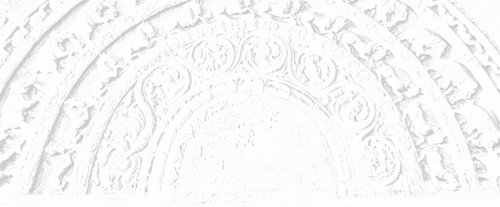

# Sermon 25

> Namo tassa bhagavato arahato sammāsambuddhassa \
> Namo tassa bhagavato arahato sammāsambuddhassa \
> Namo tassa bhagavato arahato sammāsambuddhassa
>
> *Etaṁ santaṁ, etaṁ paṇītaṁ, \
> yadidaṁ sabbasaṅkhārasamatho sabbūpadhipaṭinissaggo \
> taṇhakkhayo virāgo nirodho nibbānaṁ.*[^fn807]
>
> "This is peaceful, this is excellent, \
> namely the stilling of all preparations, the relinquishment of all assets, \
> the destruction of craving, detachment, cessation, extinction."

With the permission of the Most Venerable Great Preceptor and the assembly of
the venerable meditative monks. This is the twentyfifth sermon in the series of
sermons on Nibbāna. The other day we made an attempt to understand, in the light
of the *Kāḷakārāmasutta*, the enlightened attitude of the Tathāgata, who has
realized the cessation of the six bases of sense-contact, towards the
view-points of the worldlings, who find themselves confined within those six
bases.

In that discourse, the Buddha declared with the words *tam ahaṁ jānāmi*, "[all]
that do I know",[^fn808] the fact that he has understood all what the world with
its gods, Māras and Brahmas, and the progeny consisting of recluses and
Brahmins, gods and men, have seen, heard, sensed, cognized, thought after and
pondered over by the mind.

By his next assertion *tam ahaṁ abbhaññāsiṁ*, the Buddha proclaimed that he not
only knows all that, but knows it thoroughly in some special way. With the words
*taṁ tathāgatassa viditaṁ*, he declares that by virtue of this special knowledge
he has understood all what the world claims to know. Despite this special
knowledge and understanding, the Tathāgata takes no stance and has no
inclination or partiality towards those sensory data, as is evident from the
expression *taṁ tathāgato na upaṭṭhāsi.*

Worldings in general are in the habit of asserting dogmatically "I know, I see,
it is verily so", *jānāmi passāmi tath' eva etaṁ*,[^fn809] when they have a
special knowledge or understanding of something or other.

But according to this discourse, it seems that the Buddha takes no stance and
has no inclination or partiality towards those sensory data, precisely because
he has a special knowledge and understanding with regard to them. This fact is
highlighted by the concluding summary verses, particularly by the lines:

> *Jānāmi passāmi tath' eva etaṁ,* \
> *ajjhositaṁ n' atthi tathāgatānaṁ.*
>
> I know, I see, 'tis verily so. \
> No such clinging for the *tathāgatas*.

In order to explain this strange difference of attitude, we quoted the other day
two significant terms from the *Mūlapariyāyasutta* of the *Majjhima-nikāya*,
namely *sañjānāti* and *abhijānāti*. They represent two levels of knowledge in
the context of that particular discourse.

*Sañjānāti* stands for perceptual knowledge, whereas *abhijānāti* conveys the
idea of some special understanding of a higher order. The level of knowledge
implied by the term *sañjānāti* is that which characterizes the ordinary
worldling's world view. He is deluded by the mirage-like perception in his view
of the world and goes on imagining, *maññanā*, a real world enslaved to the
patterns of the grammatical structure.

But the Tathāgata has penetrated into the true nature of those seens, heards,
sensed and the like, with his extraordinary level of higher knowledge,
*abhiññā*, yielding full comprehension. Therefore, he does not take his stand
upon any of them. He has no stance to justify the usage of the term *upaṭṭhāsi*,
since he does not entertain imaginings, *maññanā*.

What is called *maññanā* is the imagining in egoistic terms, imparting reality
to illusory things. It is this principle of refraining from vain imaginings that
is indicated by the term *na upaṭṭhāsi*, "does not take his stand upon".

*Tathāgatas* have no clinging or entanglement, *ajjhositaṁ*, precisely because
they entertain no imaginings. In regard to things seen, heard, etc. the
*tathāgatas* have no clinging, binding or entanglement by way of craving, conceit
and views, respectively.

We happened to mention the other day that those peculiar declarations, with
which the *Kāḷakārāmasutta* opens, bear some resemblance to the tetralemma
discussed in our treatment of the undetermined points.[^fn810]

The set of four alternative propositions concerning the Tathāgata's after death
state may be cited as a paradigm for the tetralemma.

1. *Hoti tathāgato paraṁ maraṇā*, \
"the Tathāgata exists after death";
2. *na hoti tathāgato paraṁ maraṇā,* \
"the Tathāgata does not exist after death";
3. *hoti ca na ca hoti tathāgato paraṁ maraṇā,* \
"the Tathāgata both exists and does not exist after death";
4. *n'eva hoti na na hoti tathāgato paraṁ maraṇā,* \
"the Tathāgata neither exists nor does not exist after death".[^fn811]

The declarations found in this discourse bear some affinity to the
above-mentioned tetralemma. However, we find here the Buddha making the first
declaration in several stages. Firstly, he makes the statement that whatever is
seen, heard, sensed, and cognized, thought after and pondered over by all beings
in the world, that he knows.

In the second statement he affirms that he has a higher knowledge of all that.
Then comes a sentence which reaffirms that the Tathāgata has understood, but
ends with the statement "the Tathāgata does not take his stand upon it".

Generally, when confronted with the tetralemma, the Buddha summarily dismisses
all the four alternative propositions. But here the peculiarity is in not
dismissing the first proposition at once. He declares that he knows, that he has
a higher knowledge, and that he has understood all that.

Apparently he is affirming the first proposition, granting the validity of
sensory data. But then comes the concluding statement to the effect that he does
not take his stand upon them, *na upaṭṭhāsi*, which amounts to a negation.

The secret behind this peculiar presentation will emerge when we bring up the
proper similes and parables. Till then, what can be gleaned from the context is
that the Tathāgata has no stance, not because he is ignorant, but due to the
very fact that he knows full well and has understood the nature of the sum total
of sensory data.

The worldlings are prone to think that it is when convincing knowledge is
lacking that one has no such stance. But the Buddha declares here that he takes
no stance in regard to what is seen, heard, sensed etc., precisely because he
has a special understanding, a penetrative knowledge of the essence-lessness of
the data obtained through the six sense-bases.

So it seems, in this context too, we have the negation of the first alternative,
as is usual in the case of a tetralemma, only that the negation is expressed
here in a very peculiar way. Let us now take up the second declaration.

> *Yaṁ, bhikkhave, sadevakassa lokassa samārakassa sabrahmakassa
> sassamaṇabrāhmaṇiyā pajāya sadevamanussāya diṭṭhaṁ sutaṁ mutaṁ viññātaṁ pattaṁ
> pariyesitaṁ anuvicaritaṁ manasā, tam ahaṁ 'na jānāmī'ti vadeyyaṁ, taṁ mama
> assa musā.*
>
> If I were to say, monks, whatsoever in the world, with its gods, Māras and
> Brahmas, among the progeny consisting of recluses and Brahmins, gods and men,
> whatsoever is seen, heard, sensed, and cognized, thought after and pondered
> over by the mind, all that I do not know, it would be a falsehood in me.

There is a difference of opinion as to the correct reading of this second
declaration. Deep suttas often present difficulties in determining the exact
reading, and this is especially the case with the *Kāḷakārāmasutta*.

In this instance, the commentary has followed the reading *tam ahaṁ 'jānāmī'ti
vadeyyaṁ, taṁ mama assa musā*, "if I were to say 'that I know', it would be a
falsehood in me". But as we have pointed out earlier, this reading is not
meaningful.[^fn812] That is probably why the *Chaṭṭhasaṅgīti-piṭaka* edition has
followed the variant reading *tam ahaṁ 'na jānāmī'ti vadeyyaṁ*, "if I were to
say 'that I do not know'". This departure from the commentarial tradition seems
justifiable, since the Buddha has already declared that he knows all that.

It stands to reason, therefore, that in the second declaration he makes it clear
that to say "I do not know" would be a contradiction, a falsehood. But why this
clarification?

Generally the worldlings expect one to unequivocally assert and take one's stand
upon one's viewpoint in categorical terms, as expressed by the dictum *idam eva
saccaṁ, mogham aññaṁ*, "this alone is true, all else is false".[^fn813] Failure
to do so is recognized as a lack of knowledge or precision.

The second declaration is meant to forestall such an objection, since the first
declaration ends with the clause *taṁ tathāgato na upaṭṭhāsi*, but "the
Tathāgata has not taken his stand upon it". So it amounts to a statement like
"it is not because I do not know that I take no stance". In the same strain, we
can explain the declarations that follow.

It seems, then, that the second declaration,

> *tam ahaṁ 'na jānāmī'ti vadeyyaṁ, taṁ mama assa musā*,
>
> if I were to say, "all that I do not know", it would be a falsehood in me,

amounts to the second alternative of the tetralemma.

The next declaration follows the same trend. To quote the relevant portion,

> *tam ahaṁ 'jānāmi ca na ca jānāmī'ti vadeyyaṁ, taṁ p' assa tādisam eva,*
>
> if I were to say "I both know it and do not know it", that too would be a
> falsehood in me.

In regard to the aforesaid seens, heards, sensed etc., if I were to say that I
know, I do not know, or even a combination of both those statements as "I both
know and do not know", it would be a falsehood on my part.

Why? Because the world is accustomed to put down such a vacillation to a lack of
certitude. To say "I both know it and know it not" looks like a confession of
partial knowledge, since it can mean knowledge and ignorance going fifty-fifty.
So the Buddha says, in this instance, too, that it would likewise be a
falsehood, *taṁ p' assa tādisam eva*.

Now we come to the fourth statement. The Buddha declares,

> if I were to say "I neither know it, nor am ignorant of it", it would be a
> fault in me,
>
> *tam ahaṁ 'neva jānāmi na na jānāmī'ti vadeyyaṁ, taṁ mama assa kali*.

We can understand that position, too. Generally the worldlings think that a
refusal to make a categorical statement is either due to partial knowledge, or
to an attitude of wriggling out. In fact, this attitude of wriggling out had
already assumed the status of a philosophy in itself in Sañjaya Belaṭṭhiputta, a
contemporary of the Buddha.

When he was interrogated, he would respond with such a series of negations like
"I do not say it is, I do not say it is thus, I do not say it is otherwise, nor
do I say it is neither", etc.[^fn814] The attempt here is to evade the issue by
a sort of 'eel-wriggling'. That school of philosophy, which resorted to such an
evasive legerdemain, came to be known as *amarā-vikkhepa-vāda*. The Buddha
refuses to subscribe to such tactical sophistry by rejecting the fourth
alternative 'I neither know it, nor am ignorant of it'.

Here, then, we have the same tetralemma, presented in a different guise. It
smacks of a riddle that the Buddha was confronted with – the riddle of coming to
terms with worldly parlance. As we have already mentioned, the commentary
analyses the main theme of the discourse into five planes. It also records that
the earth shook at five points of the discourse, that is, at the end of the
proclamation for each plane.[^fn815]

According to the commentary, the first plane is the plane of omniscience,
*sabbaññutabhūmi*. The phrases representative of that plane are said to be:

- *tam ahaṁ jānāmi,* "that I know",
- *tam aham abbhaññāsiṁ*, "that have I fully understood", and
- *taṁ tathāgatassa viditaṁ*, "that is known to the Tathāgata".

Then comes the plane of the influx-free one, *khīṇāsavabhūmi*, represented by
the section ending with the phrase:

- *na upaṭṭhāsi*, "does not take his stand upon it".

It is so called because that phrase brings out the characteristic of not taking
a stance by way of cravings, conceits and views in the case of an influx-free
one.

The three phrases:

- *taṁ mama assa musā*, "it would be a falsehood on my part",
- *taṁ p' assa tādisam eva*, "likewise, that too would be a falsehood in me", and
- *taṁ mama assa kali*, "it would be a fault in me",

are interpreted by the commentary as representing the third plane of truth,
*saccabhūmi*. We have now dealt with that, too.

What comes next as the fourth plane is the deepest of all. The commentary calls
it the plane of the void, *suññatābhūmi*. It is with good reason that it is so
called. The paragraph that follows is said to represent that plane; it runs:

> *Iti kho, bhikkhave, tathāgato diṭṭhā daṭṭhabbaṁ diṭṭhaṁ na maññati, adiṭṭhaṁ
> na maññati, daṭṭhabbaṁ na maññati, daṭṭhāraṁ na maññati. Sutā sotabbaṁ sutaṁ
> na maññati, asutaṁ na maññati, sotabbaṁ na maññati, sotāraṁ na maññati. Mutā
> motabbaṁ mutaṁ na maññati, amutaṁ na maññati, motabbaṁ na maññati, motāraṁ na
> maññati. Viññātā viññātabbaṁ viññātaṁ na maññati, aviññātaṁ na maññati,
> viññātabbaṁ na maññati, viññātāraṁ na maññati.*

Here, too, we are confronted with the question of variant readings. To begin
with, here we have given the phrase *diṭṭhā daṭṭhabbaṁ diṭṭhaṁ*, whereas the
commentary takes it as *daṭṭhā daṭṭhabbaṁ diṭṭhaṁ*. According to the commentary,
*daṭṭhā* is a hypothetical variant of the absolutive form *disvā*, for it
paraphrases *'daṭṭhā daṭṭhabban'ti disvā daṭṭhabbaṁ*,[^fn816] that is, "*daṭṭhā
daṭṭhabbaṁ* stands for *disvā daṭṭhabbaṁ*". So the whole sentence in question is
said to convey the sense "having seen, he does not imagine a seen worth seeing".
But the variant reading *diṭṭha* is granted, though the commentator prefers the
reading *daṭṭha* as it is suggestive of an absolutive *dṛṣṭvā*.

Taking the cue from this commentarial preference, the Burmese *Chaṭṭhasaṅgīti*
edition goes a step further in substituting *sutvā, mutvā* and *viññatvā* rather
arbitrarily to give an absolutive twist to the three phrases that follow as
*sutvā sotabbaṁ sutaṁ*, *mutvā motabbaṁ mutaṁ*, and *viññatvā viññātabbaṁ
viññātaṁ*. Probably the editors thought that in this context the terms *diṭṭha
suta muta* and *viññāta* could not be interpreted as they are.

But we may point out that, in keeping with the line of interpretation we have
followed so far, these three terms may be said to stand for an extremely deep
dimension of this discourse, dealing with the void. The other day we simply gave
a sketch of a possible rendering.

The statement:

> *diṭṭhā daṭṭhabbaṁ diṭṭhaṁ na maññati*

has to be interpreted as an assertion that the Tathāgata

> does not imagine a sight worthwhile seeing as apart from the seen,

that there is nothing substantial in the seen. So also the other statements,

> *sutā sotabbaṁ sutaṁ na maññati*,
>
> does not imagine a worthwhile hearing apart from the heard;
>
> *mutā motabbaṁ mutaṁ na maññati*,
>
> does not imagine a worthwhile sensing apart from the sensed;
>
> *viññātā viññātabbaṁ viññātaṁ na maññati*,
>
> does not imagine a worthwhile cognition apart from the cognized.

In case our interpretation still appears problematic, we may hark back to the
*Bāhiyasutta* we have already explained at length.[^fn817] The philosophy behind
the Buddha's exhortation to the ascetic Bāhiya could be summed up in the words

> *diṭṭhe diṭṭhamattaṁ bhavissati, sute sutamattaṁ bhavissati, mute mutamattaṁ
> bhavissati, viññāte viññātamattaṁ bhavissati*,[^fn818]
>
> in the seen there will be just the seen, in the heard there will be just the
> heard, in the sensed there will be just the sensed, in the cognized there will
> be just the cognized.

What is meant is that one has to stop at just the seen, without discursively
imagining that there is some-'thing' seen, some-'thing' substantial behind the
seen. Similarly in regard to the heard, one has to take it as just a heard, not
some-'thing' heard.

In the case of the phrase *diṭṭhā daṭṭhabbaṁ diṭṭhaṁ na maññati* the word
*diṭṭhā*, being in the ablative case, we may render it as "does not imagine a
sight worthwhile seeing 'as apart from' the seen".

By way of further clarification of this point, we may revert to the simile of
the dog on the plank, which we gave in our explanation of *nāma-rūpa*.[^fn819]
The simile, of course, is not canonical, but of fable origin.

When a dog, while crossing a stream, stops halfway on the plank and starts
wagging its tail and peeping curiously down, the reason is the sight of its own
image in the water. It imagines a dog there, a 'water-dog'. The dog thinks that
there is something worthwhile seeing, apart from the seen.

It is unaware of the fact that it is seeing what it sees because it is looking.
It thinks that it is looking because there is something out there to be seen.
The moment it realizes that it is seeing because it is looking, it will stop
looking at its own image in the water.

We have here a very subtle point in the law of dependent arising, one that is
integral to the analysis of name-and-form. So, then, due to the very ignorance
of the fact that it is seeing because it is looking, the dog imagines another
dog, there, in the water. What is called *maññanā* is an imagining of that sort.

No such imagining is there in the Tathāgata, *diṭṭhā daṭṭhabbaṁ diṭṭhaṁ na
maññati*, "he does not imagine a sight worth seeing as apart from the seen". In
short, for him the seen is the be all and the end all of it.

The seen is dependently arisen, it comes about due to a collocation of
conditions, apart from which it has no existence per se. Every instance of
looking down at the water is a fresh experience and every time an image of the
dog in the water and of another looking at it is created. The dog is seeing its
own image. Everything is dependently arisen, *phassapaccayā*, says the
*Brahmajāla-sutta*, 'dependent on contact'.[^fn820]

Here there is something really deep. It is because of the personality-view,
*sakkāyadiṭṭhi*, that the world is carried away by this illusion. One goes on
looking saying that one is doing so as there is something to be seen. But the
seen is there because of the looking.

This, then, is the moral behind the statement *diṭṭhā daṭṭhabbaṁ diṭṭhaṁ na
maññati*, "does not imagine a seen worthwhile seeing as apart from the seen
itself". This is the dictum implicit in the *Bāhiya-sutta*, too, which could be
illustrated by the simile of the dog on the plank. The Tathāgata does not
imagine a sight as existing from the bare act of seeing.

If further illustrations are needed, let us take the case of hearing music from
a distance. One imagines a thing called 'music' and with the idea of listening
to the same music goes to the place where the music is going on. One is not
aware of the fact that at each step in that direction one is hearing a different
music. Why? Because one is ignorant of the law of dependent arising. Just as in
the former case the dog seen is dependent on the dog looking, here too, the
auditory consciousness of a music is the outcome of a dependence between ear and
sound.

So, deluded as he is, he goes to the music hall to listen better to the same
music. He will realize the extent of his delusion if he happens to put his ear
to the musical instrument. When he does so, he will hear not a music, but a set
of crude vibrations.

But this is what is going on in the world. The world is steeped in the delusion
of imagining that it is the same music one is hearing, though at each step in
that direction the music changes. This is due to the fact that it is dependently
arisen. Actually, there is no person hearing, but only a state of affairs
dependent on the ear and sound, a conditioned arising dependent on contact. In
the present textual context, the terms *diṭṭha suta muta* and *viññāta*, seen,
heard, sensed and cognized, have to be understood in this light.

So this is how the phrase *diṭṭhā daṭṭhabbaṁ diṭṭhaṁ na maññati* has to be
interpreted. But the commentary does not seem to have appreciated the relevance
of this paragraph to the Buddha's teachings on voidness. While commenting on
*diṭṭhaṁ na maññati* it expatiates *'ahaṁ mahājanena diṭṭhameva passāmī'ti
taṇhāmānadiṭṭhīhi na maññati*. According to it, what is meant is that the
Tathāgata does not imagine by way of cravings, conceits and views that he is
seeing just what the common people have seen. This is an oversimplification, a
rather shallow interpretation.

The next phrase, *adiṭṭhaṁ na maññati*, is similarly explained, *'adiṭṭhaṁ na
maññatī'ti 'ahaṁ mahājanena adiṭṭhameva etaṁ passāmī'ti evampi taṇhādihi
maññanāhi na maññati*, "he does not imagine an unseen" means that the Tathāgata
does not imagine by way of imaginings through craving etc. that he is seeing
something unseen by the common people. The commentary, it seems, has gone at a
tangent, bypassing the deeper sense.

We have already explained the deeper significance of the phrase, *diṭṭhaṁ na
maññati*, "does not imagine a seen". Now what does *adiṭṭhaṁ na maññati* mean?

In terms of our simile of the dog on the plank, *diṭṭhaṁ na maññati* means that
the Tathāgata does not imagine a dog in the water.

*Adiṭṭhaṁ na maññati* could therefore mean that the Tathāgata does not imagine
that the dog has not seen. Why he does not treat it as an unseen should be clear
from that declaration we had already cited, ending with *tam ahaṁ 'na jānāmī'ti
vadeyyaṁ, taṁ mama assa musā,* "if I were to say 'that I do not know', it would
be a falsehood in me".

The fact of seeing is not denied, though what is seen is not taken as a dog, but
only as an image of one, that is dependently arisen. Since the understanding of
it as a dependently arisen phenomenon is there, the Tathāgata does not imagine
an unseen either, *adiṭṭhaṁ na maññati*.

The phrase *daṭṭhabbaṁ na maññati*, is also explicable in the light of the
foregoing discussion. Now, the dog on the plank keeps on looking down at the
water again and again because it thinks that there is something worthwhile
seeing in the water. Such a delusion is not there in the Tathāgata. He knows
that at each turn it is a phenomenon of a seen dependently arisen, dependent on
contact, *phassapaccayā*.

Every time it happens, it is a fresh sight, a new preparation, *saṅkhāra*. So
there is nothing to look for in it. Only a looking is there, nothing worth
looking at. Only a seeing is there, nothing to be seen. Apart from the bare act
of hearing, there is nothing to be heard. It is the wrong view of a self that
gives a notion of substantiality. The above phrase, therefore, is suggestive of
insubstantiality, essencelessness, and voidness.

Music is just a word. By taking seriously the concept behind that word, one
imagines a thing called 'music'. The pandemonium created by a number of musical
instruments is subsumed under the word 'music'. Then one goes all the way to
listen to it. The same state of affairs prevails in the case of the seen. It is
because the Tathāgata has understood this fact that he does not imagine a thing
worth seeing or hearing. The same applies to the other sensory data.

Then comes the phrase *daṭṭhāraṁ na maññati*, "does not imagine a seer". Here we
have the direct expression of voidness – the voidness of a self or anything
belonging to a self. Now that dog on the plank has not understood the fact that
there is a mutual relationship between the looking dog and the seen dog. It is
because of the looking dog that the seen dog is seen. There is a conditioned
relationship between the two.

In other words, dependent on eye and forms arises eye-consciousness, *cakkhuñca
paṭicca rūpe ca uppajjati cakkhuviññāṇaṁ*.[^fn821] The mere presence of the eye
is not enough for eye consciousness to arise, but dependent on eye and forms,
arises eye-consciousness.

Though stated simply, it has a depth that is not easy to fathom. To say that it
is dependent on eye and form is to admit that it is dependently arisen. The law
of dependent arising is already implicated. There is therefore no seer, apart
from the phenomenon of seeing, according to the Tathāgata. He does not imagine a
seer, *daṭṭhāraṁ na maññati*. For the worldling, the bare act of seeing carries
with it a perception of 'one who sees'. He has a notion of a self and something
belonging to a self.

The same teaching is found in the *Bāhiya-sutta*. After instructing Bāhiya to
stop at just the seen, the heard, the sensed and the cognized, the Buddha goes
on to outline the end result of that training.

> *Yato kho te, Bāhiya, diṭṭhe diṭṭhamattaṁ bhavissati, sute sutamattaṁ
> bhavissati, mute mutamattaṁ bhavissati, viññāte viññātamattaṁ bhavissati, tato
> tvaṁ Bāhiya na tena. Yato tvaṁ Bāhiya na tena, tato tvaṁ Bāhiya na tattha.
> Yato tvaṁ Bāhiya na tattha, tato tvaṁ Bāhiya nev' idha na huraṁ na
> ubhayamantarena. Es' ev' anto dukkhassa*.[^fn822]
>
> And when to you, Bāhiya, there will be in the seen just the seen, in the heard
> just the heard, in the sensed just the sensed, in the cognized just the
> cognized, then, Bāhiya, you are not by it. And when, Bāhiya, you are not by
> it, then, Bāhiya, you are not in it. And when, Bāhiya, you are not in it,
> then, Bāhiya, you are neither here nor there nor in between. This, itself, is
> the end of suffering.

That is to say, when, Bāhiya, you have gone through that training of stopping at
just the seen, the heard, the sensed and the cognized, then you would not be
imagining in terms of them. The algebraic – like expressions *na tena* and *na
tattha* have to be understood as forms of egoistic imagining, *maññanā*.

When you do not imagine in terms of them, you would not be in them. There would
be no involvement in regard to them. In the case of that music, for instance,
you would not be in the orchestra. The egoistic imagining, implicating
involvement with the music, presupposes a hearer, *sotaraṁ*, dwelling in the
orchestra.

When, Bāhiya, you do not dwell in it, *yato tvaṁ Bāhiya na tattha*, then,
Bāhiya, you are neither here, nor there, nor in between the two, *tato tvaṁ
Bāhiya nev' idha na huraṁ na ubhayamantarena*. This itself is the end of
suffering. In other words, you would have realized voidness, *suññatā*.

The expression *daṭṭhāraṁ na maññati*, "does not imagine a seer"; *sotāraṁ na
maññati*, "does not imagine a hearer"; *motāraṁ na maññati*, "does not imagine a
sensor"; and *viññātāraṁ na maññati*, "does not imagine a knower", have to be
understood in this light. The Tathāgata does not even imagine a thinker apart
from thought. This is the plane of the void, *suññatābhūmi*, the perfect
realization of the corelessness or essencelessness of the seen, the heard, the
sensed and the cognized.

The very absence of *maññanā*, or 'egoistic imagining', is to be understood by
*suññatābhūmi*, or 'the plane of the void'. The worldling takes seriously the
subject-object relationship in the grammatical structure, as it seems the
simplest explanation of phenomena. Because there is something to be seen, there
is someone who sees. Because there is someone who sees, there is something to be
seen.

There is a duality between these two. To understand the law of dependent arising
is to be free from this duality. It is the ability to see a concatenation of
conditions, a conglomeration of causal factors – an assemblage instead of a
bifurcation.

The way of the worldlings, however, is to follow the subject-object
relationship, a naive acceptance of the grammatical structure, which is the
easiest mode of communication of ideas. They are misled by it to take seriously
such notions as 'one who sees' and a 'thing seen', 'one who hears' and a 'thing
heard', but the Tathāgata is free from that delusion.

Now we come to the fifth section of the discourse, known as *tādibhūmi*, the
'plane of the such'. It runs:

> *Iti kho, bhikkhave, tathāgato diṭṭha-suta-muta-viññātabbesu dhammesu tādī
> yeva tādī, tamhā ca pana tādimhā añño tādī uttaritaro vā paṇītataro vā
> natthī'ti vadāmi*.
>
> Thus, monks, the Tathāgata, being such in regard to all phenomena, seen,
> heard, sensed and cognized, is such. Moreover than he who is such there is
> none other higher or more excellent, I declare.

The most difficult word, here, is *tādī*. We have already explained it to some
extent. It can be rendered by 'such' or 'thus'. The commentary explains it by
the phrase *tāditā nāma ekasadisatā*,[^fn823] "suchness means to be always
alike".

By way of illustration, the commentary states *Tathāgato ca yādiso lābhādīsu,
tādisova alābhādīsu*, "as he is in regard to gain etc., so is the Tathāgata in
regard to loss etc.". The allusion here is to the eight worldly vicissitudes,
gain/loss, fame/ill-fame, praise/blame, and pleasure/pain.[^fn824]

But this explanation is rather misleading, as it ignores a certain deep
dimension of the meaning of the term *tādī*. When it is said "as he is in regard
to gain, so is he in regard to loss", one can ask: "how is he in regard to
gain?" This is imprecise as a meaning.

However, the commentator happens to quote from the *Mahāniddesa* another
explanation, which is more to the point. It is briefly stated as *iṭṭhāniṭṭhe
tādī*, "such in regard to the desirable and the undesirable"; and explained as:

> *lābhepi tādī, alābhepi tādī, yasepi tādī, ayasepi tādī, nindāyapi tādī,
> pasaṁsāyapi tādī, sukhepi tādī, dukkhepi tādī*,[^fn825]
>
> he is such in gain as well as in loss, he is such in fame as well as in
> ill-fame ... etc.

That is the correct explanation. Instead of saying "as he is in gain, so is he
in loss", we have here a continuous suchness in regard to all vicissitudes. He
is such in gain as well as in loss, he is such in fame as well as in ill-fame,
he is such in praise as well as in blame, he is such in pleasure as well as in
pain.

The reason for this suchness we have explained on an earlier occasion.[^fn826]
In one sense, the term *tādī* stands for the understanding of the norm called
*tathatā*. The other implication is the abstinence from the tendency towards
identification or acquisition, meant by *tammayatā*. This exemplary trait is
called *atammayatā*. This is an extremely important term, occurring in the
discourses, which, however, has fallen into neglect at present.

In the case of music, for instance, *tammayatā* would imply an attachment to it
that amounts to an identification with it. *Tammayo* means 'made of that', as in
*suvaṇṇamaya*, 'made of gold', and *rajatamaya*, 'made of silver'. To be free
from this *tammayatā*, is to be *tādī*, 'such', that is to say, not to be of
that stuff, *atammayatā*. The attitude of not leaning on or grasping is meant by
it.

The quality of being *tādī*, or 'such', is often rendered by 'firmness',
'steadfastness', and 'immovability'. Generally, one associates firmness,
immovability or stability with holding on or leaning on. But here we have just
the contrary. Not to hold on to anything, is to be 'such'. This suchness has a
flexibility of a higher order, or an adaptability. The adaptability
characteristic of the sage who lives on *piṇḍapāta*, or alms-food, is
highlighted in the following verse:

> *Alatthaṁ yadidaṁ sādhu,* \
> *nālatthaṁ kusalām iti,* \
> *ubhayeneva so tādī,* \
> *rukkhaṁ va upanivattati.*[^fn827]
>
> Suppose I got it, well and good, \
> Suppose I didn't get, that's fine too, \
> In both circumstances he is such, \
> And comes back [like one who walks up to a] tree.

This kind of adaptability and resilience is also implied by the term *tādī*.
Though the term is sometimes rendered by the word 'steadfast', it does not stand
for any rigidity. Instead, it carries implications of a non-rigid resilience.

This is a wonderful quality in *tathāgatas* and *arahants*. We may compare it to a
revolving swing in a children's playground. One who is seated in a revolving
swing has nothing to get upset about falling headlong when the swing goes up.
The seats are hung in such a way that they also turn with the revolving motion
of the swing. Had they been rigidly fixed, one seated there would fall off the
seat when it goes up. It is that kind of resilience that is characteristic of
the quality of *tāditā*, or 'suchness'. This is how we have to understand the
famous lines in the *Mahāmaṅgalasutta*.

> *Phuṭṭhassa lokadhammehi,* \
> *cittam yassa na kampati,*[^fn828]
>
> Whose mind remains unshaken, \
> When touched by worldly vicissitudes.

This quality of being unshaken, this immovability, is the result of not
grasping. It comes when there is no tenacious clinging. It is to one who rests
on or leans on something that there is dislodgement or instability.

Now I am leaning on the wall, if someone does damage to the wall, I would get
shaken, that is what is suggested by the axiom:

> *nissitassa calitaṁ, anissitassa calitaṁ natthi*,[^fn829]
>
> to one who is attached, there is dislodgement, to the one detached, there is
> no dislodgement.

The worldling, on the other hand, thinks that to lean on or to rely on something
is the mark of stability.

So it seems that the term *tādī* has an extraordinary dimension of meaning. In
this particular context, however, the suchness spoken of does not concern the
eight worldly vicissitudes like gain and loss. Here it carries a special nuance
as is evident from the statement:

> *Iti kho, bhikkhave, tathāgato diṭṭha-suta-muta-viññātabbesu dhammesu tādī
> yeva tādī.*
>
> Thus, monks, the Tathāgata, being such in regard to all phenomena, seen,
> heard, sensed and cognized, is such.

The suchness here meant is about the views adhered to by the worldlings. In
regard to things seen, heard, sensed and cognized, the worldlings go on
asserting dogmatically *idam eva saccaṁ, mogham aññaṁ*, "this alone is true, all
else is false". But the Tathāgata has no such dogmatic involvement. He only
analytically exposes them for what they are.

As we tried to illustrate by the simile of the dog on the plank, the Tathāgata
simply penetrates into their dependently arisen nature and declares that all
those views are dependent on contact, *phassapaccayā*. That is the *tādī*
quality meant here.

If we are to understand the plane of suchness, *tādībhūmi*, in a deeper sense,
this is how we have to appreciate its significance. Now we come to the couplet
forming the grand finale to the *Kāḷakārāmasutta*.

> *Yaṁ kiñci diṭṭhaṁ va sutaṁ mutaṁ vā,* \
> *ajjhositaṁ saccamutaṁ paresaṁ,* \
> *na tesu tādī sayasaṁvutesu,* \
> *saccaṁ musā vā pi paraṁ daheyyaṁ.*
> 
> *Etañca sallaṁ paṭigacca disvā,* \
> *ajjhositā yattha pajā visattā,* \
> *jānāmi passāmi tath' eva etaṁ,* \
> *ajjhositaṁ natthi tathāgatānaṁ.*

In the first verse, we have the difficult term *sayasaṁvutesu*, which we
rendered by "amidst those who are entrenched in their own views". The term
carries insinuations of philosophical in-breeding, which often accounts for
dogmatic adherence to views.

The Tathāgata declares that he does not hold as true or false any of the
concepts of individual truths based on what is seen, heard, sensed and cognized
by others, because of his suchness. Being such, he does not categorically label
any of those views as true or false. He penetrates into and analyses the
psychological background of all those dogmatic views and understands them as
such.

In the final verse, he declares that he has seen well in advance "the barb on
which mankind is hooked impaled". The barb is none other than the dogmatic
assertion, "I know, I see, it is verily so". Having seen this barb, well in
advance, the Tathāgata entertains no dogmatic involvement of that sort.

The precise meaning of some words and phrases here is a matter of controversy. A
discussion of them might throw more light on their deeper nuances. The most
difficult term seems to be *sayasaṁvuta*. The commentary gives the following
explanation:

> *'Sayasaṁvutesu'ti 'sayameva saṁvaritvā piyāyitvā gahitagahaṇesu
> diṭṭhigatikesū'ti attho. Diṭṭhigatikā hi 'sayaṁ saṁvutā'ti vuccanti.*[^fn830]
>
> *Sayasaṁvutesu* means among those dogmatic view-holders, who have grasped
> those views, having recollected them and cherished them. Dogmatic view-holders
> are called *sayasaṁvuta*.

According to the commentary, the term *sayasaṁvuta* refers to persons who hold
dogmatic views. But we interpreted it as a reference to such views themselves.

By way of clarification, we may allude to some discourses in the *Aṭṭhakavagga*
of the *Suttanipāta*, which bring up a wealth of material to substantiate the
salient points in the *Kāḷakārāmasutta*, while throwing more light on the
particular term in question.

The chapter called *Aṭṭhakavagga* in the *Suttanipāta* in particular embodies a
deep analysis of the controversies among contemporary dogmatists.

Let us, first of all, take up for comment some verses that throw more light on
the meaning of the term *sayasaṁvuta* from the *Cūḷaviyūhasutta*. That discourse
unfolds itself in the form of question and answer. The commentary explains, that
this medium of dialogue was adopted by the Buddha to resolve the clash of
philosophical moot points current in the society, and that the interlocutor is a
replica of the Buddha himself, created by his psychic power.[^fn831] Be that as
it may, the relevant question for the present context is presented as follows.

> *Kasmā nu saccāni vadanti nānā,* \
> *pavādiyāse kusalā vadānā,* \
> *saccāni su tāni bahūni nānā,* \
> *udāhu te takkam anussaranti.*[^fn832]
>
> Why do they proclaim various truths, \
> Claiming to be experts each in his field, \
> Are there several and various truths, \
> Or do they merely follow logical consistency?

The Buddha's reply to it is as follows.

> *Na h'eva saccāni bahūni nānā,* \
> *aññatra saññāya niccāni loke,* \
> *takkañ ca diṭṭhīsu pakappayitvā,* \
> *'saccaṁ musā'ti dvayadhammam āhu.*
>
> There are no several and various truths, \
> That are permanent in the world, apart from perception, \
> It is by manipulating logic in speculative views, \
> That they speak of two things called 'truth and falsehood'.

There is no plurality in the concept of truth, apart from the perception based
on which they declare various speculative views. It seems that the Buddha grants
the possibility of various levels of perception as a truth for all times, though
he does not accept a plurality of truths, arising out of a variety of
speculative views based on them.

He understands the psychology of logic, having seen penetratively the perceptual
background of each and every view. He accepts as a psychological fact that such
and such a perception could precipitate such and such a view. Therefore, in a
limited or relative sense, they are 'true'.

The dichotomy between truth and falsehood has arisen in the world due to a
manipulation of logic on individual viewpoints. This fact comes up for further
comment in the *Mahāviyūhasutta* that follows.

> *Sakaṁ hi dhammaṁ paripuṇṇam āhu,* \
> *aññasssa dhammaṁ pana hīnaṁ āhu,* \
> *evam pi viggayha vivādiyanti,* \
> *sakaṁ sakaṁ sammutim āhu sacaṁ.*[^fn833]

This verse describes how debating parties go on clashing with each other. They
call their own system of thought perfect, and the other system of thought
inferior. Thus they quarrel and dispute. Their own individual viewpoint they
assert as true. The phrase *sakaṁ sakaṁ sammutim*, "each his own viewpoint", is
somewhat suggestive of *sayasaṁvutesu*, the problematic term in the
*Kāḷakārāmasutta*.

Yet another verse from the *Pasūrasutta* in the *Aṭṭhakavagga* exposes the
biases and prejudices underlying these individual truths.

> *'Idh'eva suddhi' iti vādiyanti,* \
> *nāññesu dhammesu visuddhim āhu,* \
> *yaṁ nissitā tattha subhaṁ vadānā,* \
> *paccekasaccesu puthū niviṭṭhā.*[^fn834]
>
> 'Here in this system is purity', they assert polemically, \
> They are not prepared to grant purity \
>  in other systems of thought, \
> Whatever view they lean on, that they speak in praise of, \
> They are severally entrenched in their own individual truths.

The last line is particularly relevant, as it brings up the concept of
*paccekasacca*. To be a *Paccekabuddha* means to be enlightened for oneself. So
the term *paccekasacca* can mean 'truth for oneself'. Those who hold conflicting
views go on debating entrenched each in his own concept of truth.

The three expressions *pacekasacca, sakaṁ sakaṁ sammutim* and *sayasaṁvutesu*
convey more or less the same idea. The words *tesu sayasaṁvutesu* refer to those
narrow viewpoints to which they are individually confined, or remain closeted
in. The Tathāgata does not hold as true or false any of those views limited by
the self-bias.

Another lapse in the commentary to the *Kāḷakārāmasutta* is its comment on the
phrase *paraṁ daheyyaṁ*. It takes the word *paraṁ* in the sense of 'supreme',
*uttamaṁ katvā*, whereas in this context it means 'the other'. Here, too, we may
count on the following two lines of the *Cūḷaviyūhasutta* of the *Suttanipāta*
in support of our interpretation.

> *Yen' eva 'bālo'ti paraṁ dahāti,* \
> *tenātumānaṁ 'kusalo'ti cāha.*[^fn835]
>
> That by which one dubs the other a fool, \
> By that itself one calls oneself an expert.

From this it is clear that the phrase *paraṁ dahāti* means 'dubs another'. The
last two lines of the *Kāḷakārāmasutta* are of utmost importance.

> *Jānāmi passāmi tath' eva etaṁ,* \
> *ajjhositaṁ natthi tathāgatānaṁ*.
>
> I know I see, it is verily so, \
> No such clinging for the *tathāgatas*.

Worldlings dogmatically grasp the data heaped up by their six sense-bases, but
the *tathāgatas* have no such entanglements in regard to sensory knowledge. Why
so? It is because they have seen the cessation of the six sense-bases.

By way of illustration, we may compare this seeing of the cessation of the six
sense-bases to an exposure of the inner mechanism of a high-speed engine by
removing the bonnet. In the *Dvayamsutta*, from which we quoted in our last
sermon, the Buddha showed us the functioning of the gigantic machine called the
six-fold sense-base, its vibrations, revolutions, beats and running gears. The
discourse analyses the mechanism in such words as:

> *Cakkhu aniccaṁ vipariṇāmi aññathābhāvi. Rūpā aniccā vipariṇāmino
> aññathābhāvino. Itthetaṁ dvayaṁ calañceva vyayañca aniccaṁ vipariṇāmi
> aññathābhāvi.*[^fn836]
>
> Eye is impermanent, changing, becoming otherwise. Forms are impermanent,
> changing, becoming otherwise. Thus this dyad is unstable, evanescent,
> impermanent, changing, becoming otherwise.

The discourse proceeds in this vein and concludes with the words:

> *Phuṭṭho, bhikkhave, vedeti, phuṭṭho ceteti, phuṭṭho sañjānāti. Itthete pi
> dhammā calā ceva vayā ca aniccā vipariṇāmino aññathābhāvino.*
>
> Contacted, monks, one feels, contacted one intends, contacted one perceives.
> Thus these things, too, are unstable, evanescent, impermanent, changing and
> becoming otherwise.

The concluding reference is to the products of the six sense-bases. Feelings,
intentions and perceptions, arising due to contact, are also unstable,
evanescent, impermanent, changing and becoming otherwise.

The sum total of percepts is indicated by the words *diṭṭha suta muta* and
*viññāta*. The totality of percepts are made up or 'prepared', *saṅkhata*. The
term *saṅkhata* has nuances suggestive of 'production'. If we take the six-fold
sense-base as a high-speed machine, productive of perceptions, the Buddha has
revealed to us the workings of its intricate machinery. Each and every part of
this machine is unstable, evanescent, impermanent, changing and becoming
otherwise.

The Buddha understood the made up or prepared nature, *saṅkhata*, of all these,
as well as the preparations, *saṅkhārā*, that go into it. That is why the Buddha
has no dogmatic involvement in regard to the products of this machine, the
totality of all what is seen, heard, sensed and cognized, *diṭṭha suta muta
viññāta.* None of them is substantial. They are essenceless and insubstantial.
There is nothing worthwhile grasping here as apart from the activities or
preparations that are dynamic in themselves.

So far we have tried to understand the state of affairs with reference to this
discourse. But now let us take up a canonical simile that facilitates our
understanding. The Buddha has compared consciousness to a magic show in the
*Pheṇapiṇḍūpamasutta* of the *Khandhasaṁyutta* we had already cited.

> *Pheṇapiṇḍūpamaṁ rūpaṁ,* \
> *vedanā bubbuḷūpamā,* \
> *marīcikūpamā saññā,* \
> *saṅkhārā kadalūpamā,* \
> *māyūpamañca viññāṇaṁ,* \
> *dīpitādiccabandhunā.*[^fn837]
>
> Form is like a mass of foam, \
> And feeling but an airy bubble, \
> Perception is like a mirage, \
> And formations a banana trunk, \
> Consciousness is a magic show [a juggler's trick entire], \
> [All these similes] were made known by the kinsman of the sun.

As a matter of fact, the verse itself is a mnemonic summary of a certain sermon
delivered by the Buddha. According to it, the Buddha, the kinsman of the sun,
has compared form to a mass of foam, feeling to a water bubble, perception to a
mirage, preparations to a banana trunk, and consciousness to a magic show.

What is of relevance to us here is the comparison of consciousness to a magic
show. The simile of the magic show is presented in that sutta in the following
words:

> *Seyyathāpi, bhikkhave, māyākāro vā māyākārantevāsī vā cātummahāpathe māyaṁ
> vidaṁseyya. Tam enaṁ cakkhumā puriso passeyya nijjhāyeyya yoniso
> upaparikkheyya. Tassa taṁ passato nijjhāyato yoniso upaparikkhato rittakaññeva
> khāyeyya tucchakaññeva khāyeyya asārakaññeva khāyeyya. Kiñhi siyā, bhikkhave,
> māyāya sāro?*
>
> *Evam eva kho, bhikkhave, yaṁ kiñci viññāṇaṁ atītānāgatapaccuppannaṁ,
> ajjhattaṁ vā bahiddhā vā, oḷārikaṁ vā sukhumaṁ vā, hīnaṁ vā paṇītaṁ vā, yaṁ
> dūre santike vā, taṁ bhikkhu passati nijjhāyati yoniso upaparikkhati. Tassa
> taṁ passato nijjhāyato yoniso upaparikkhato rittakaññeva khāyati tucchakaññeva
> khāyati asārakaññeva khāyati. Kiñhi siyā, bhikkhave, viññāṇe sāro?*
>
> Suppose, monks, a magician or a magician's apprentice should hold a magic show
> at the four cross-roads and a keen-sighted man should see it, ponder over it
> and reflect on it radically. Even as he sees it, ponders over it and reflects
> on it radically, he would find it empty, he would find it hollow, he would
> find it void of essence. What essence, monks, could there be in a magic show?
>
> Even so, monks, whatever consciousness, be it past, future or present, in
> oneself or external, gross or subtle, inferior or superior, far or near, a
> monks sees it, ponders over it and reflects on it radically. And even as he
> sees it, ponders over it and reflects on it radically, he finds it empty, he
> finds it hollow, he finds it void of essence. What essence, monks, could there
> be in a consciousness?

[^fn807]: [MN 64 / M I 436](https://suttacentral.net/mn64/pli/ms), *Mahāmālunkyasutta*

[^fn808]: [AN 4.24 / A II 25](https://suttacentral.net/an4.24/pli/ms), *Kāḷakārāmasutta*

[^fn809]: [Snp 4.13 / Sn 908](https://suttacentral.net/snp4.13/pli/ms), *Mahāviyūhasutta*

[^fn810]: See esp. *Sermon 20*

[^fn811]: E.g. at [MN 72 / M I 484](https://suttacentral.net/mn72/pli/ms), *Aggivacchagottasutta*

[^fn812]: See *Sermon 24*

[^fn813]: E.g. at [MN 72 / M I 484](https://suttacentral.net/mn72/pli/ms), *Aggivacchagottasutta*

[^fn814]: [DN 2 / D I 58](https://suttacentral.net/dn2/pli/ms), *Sāmaññaphalasutta*

[^fn815]: Mp III 38

[^fn816]: Mp III 39

[^fn817]: See *Sermon 15*

[^fn818]: [Ud 1.10 / Ud 8](https://suttacentral.net/ud1.10/pli/ms), *Bāhiyasutta*

[^fn819]: See *Sermon 6*

[^fn820]: [DN 1 / D I 42](https://suttacentral.net/dn1/pli/ms), *Brahmajālasutta*

[^fn821]: E.g. [MN 18 / M I 111](https://suttacentral.net/mn18/pli/ms), *Madhupiṇḍikasutta*

[^fn822]: [Ud 1.10 / Ud 8](https://suttacentral.net/ud1.10/pli/ms), *Bāhiyasutta*

[^fn823]: Mp III 40

[^fn824]: [AN 8.5 / A IV 157](https://suttacentral.net/an8.5/pli/ms), *Paṭhamalokadhammasutta*

[^fn825]: Nid II 459

[^fn826]: See *Sermon 21*

[^fn827]: [Snp 3.11 / Sn 712](https://suttacentral.net/snp3.11/pli/ms), *Nālakasutta*

[^fn828]: [Snp 2.4 / Sn 268](https://suttacentral.net/snp2.4/pli/ms), *Mahāmaṅgalasutta*

[^fn829]: [Ud 8.4 / Ud 81](https://suttacentral.net/ud8.4/pli/ms), *Catutthanibbānapaṭisaṁyuttasutta*

[^fn830]: Mp III 41

[^fn831]: Pj II 554

[^fn832]: [Snp 4.12 / Sn 885](https://suttacentral.net/snp4.12/pli/ms), *Cūḷaviyūhasutta*

[^fn833]: [Snp 4.13 / Sn 905](https://suttacentral.net/snp4.13/pli/ms), *Mahāvyūhasutta*

[^fn834]: [Snp 4.8 / Sn 824](https://suttacentral.net/snp4.8/pli/ms), *Pasūrasutta*

[^fn835]: [Snp 4.12 / Sn 888](https://suttacentral.net/snp4.12/pli/ms), *Cūḷaviyūhasutta*

[^fn836]: [SN 35.93 / S IV 67](https://suttacentral.net/sn35.93/pli/ms), *Dutiyadvayamsutta*

[^fn837]: [SN 22.95 / S III 142](https://suttacentral.net/sn22.95/pli/ms), *Pheṇapiṇḍūpamasutta*, see *Sermon 11*
