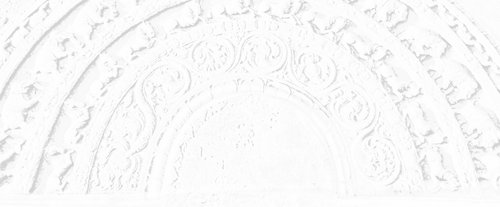

# Sermon 29

> Namo tassa bhagavato arahato sammāsambuddhassa \
> Namo tassa bhagavato arahato sammāsambuddhassa \
> Namo tassa bhagavato arahato sammāsambuddhassa
>
> *Etaṁ santaṁ, etaṁ paṇītaṁ, \
> yadidaṁ sabbasaṅkhārasamatho sabbūpadhipaṭinissaggo \
> taṇhakkhayo virāgo nirodho nibbānaṁ.*[^fn933]
>
> "This is peaceful, this is excellent, \
> namely the stilling of all preparations, the relinquishment of all assets, \
> the destruction of craving, detachment, cessation, extinction."

With the permission of the assembly of the venerable meditative monks. This is
the twenty-ninth sermon in the series of sermons on Nibbāna.

We made an attempt, in our last sermon, to highlight the impermanence of the
stage trappings which from the beginning of an aeon to its end this great earth
stage presents for the drama of existence of *saṁsāric* beings, enacted on it.
Putting side by side in vivid contrast to each other, the description of the
beginning of the aeon, as given in the *Aggaññasutta*, and the description of
the destruction of the aeon, in the *Sattasuriyasutta*, we tried to arouse a
powerful perception of impermanence, leading to disenchantment, which is the key
to Nibbāna.

A resonant echo of these discourses of the Buddha, suggestive of the
impermanence of this drama of existence and the earth stage on which it is
enacted, comes to us through the *Mahāhatthipadopamasutta*, preached by the
venerable Sāriputta.

> *Tassā hi nāma āvuso bāhirāya paṭhavīdhātuyā tāva mahallikāya aniccatā
> paññāyissati, khayadhammatā paññāyissati, vayadhammatā paññāyissati,
> vipariṇāmadhammatā paññāyissati, kiṁ pan' imassa mattaṭṭhakassa kāyassa
> taṇhupādiṇṇassa ahan'ti vā maman'ti vā asmī'ti vā, atha khvāssa no t' ev'
> ettha hoti.*[^fn934]
>
> Even of this external earth element, Friends, great as it is, an impermanence
> will become manifest, a liability to destruction will become manifest, a
> liability to waste away will become manifest, a liability to undergo change
> will become manifest, what to say of this ephemeral body clung to by craving
> as 'I' or 'mine' or 'am'? On the other hand there is no justification for such
> a clinging.

This pithy paragraph of the discourse is eloquent proof of the fact that it is
possible to dispel the latencies to conceit leading to 'I'-ing and 'mine'-ning
by penetrating into the impermanence of this puny internal earth element through
the broader perspective of the impermanence of the vast external earth element.

> *Animittañca bhāvehi, mānānusayamujjaha,*[^fn935]
>
> Develop the signless, too, and give up the latency to conceit!

was the advice the Buddha gave to venerable Rāhula in the *Rāhulasutta* of the
*Sutta Nipāta*. It is clear from this advice that, when signs fade away through
the perception of impermanence, latencies to conceit also lose their hold on the
mind.

Instead of pervertly exploiting the canonical discourses describing the
impermanence of the external world with wrong reflection in order to indulge in
worldly speculation, we should arouse radical reflection and project them into
our own internal world in order to understand the vanity of this drama of life.

Where are the actors and actresses who played their part in the early acts of
our drama of life? Where are those stage decorations and trappings? Though they
are no more, so long as latencies to perception, amassed through them, persist
in us, there is nothing to prevent us from indulging in thoughts and
proliferations. When we reflect on the impermanence of the entire world, we get
dispassionate about the heap of preparations in our drama of life, reckoned in
terms of objects, events and persons.

When dispassion sets in, signs fade away, like in a blurred water-colour
painting. For a meditator, developing the perception of impermanence, the world
might appear like an indistinct water-painting, with blotches of colour.

When the figures in the painting cannot be distinguished according to colour and
shape, there is less room for the perception of diversity, *nānattasaññā*.
Thereby latencies to conceit, which give rise to divisions and conflicts are
also attenuated. That is why the Buddha always reminds us of the perception of
impermanence as an important subject of meditation. He has recommended in
particular the signless concentration, for instance in the *Khandhasaṁyutta* of
the *Saṁyutta Nikāya*.

> *Tayome, bhikkhave, akusalavitakkā: kāmavitakko, byāpādavitakko,
> vihiṁsāvitakko. Ime ca, bhikkhave, tayo akusalavitakkā kva aparisesā
> nirujjhanti? Catūsu vā satipaṭṭhānesu supatiṭṭhita-cittassa animittaṁ vā
> samādhiṁ bhāvayato. Yāvañcidaṁ, bhikkhave, alam eva animitto samādhi
> bhāvetuṁ. Animitto, bhikkhave, samādhi bhāvito bahulīkato mahapphalo hoti
> mahānisaṁso.*[^fn936]
>
> Monks, there are these three kinds of unskilful thoughts: sensual thoughts,
> thoughts of ill-will, thoughts of harming. And where, monks, do these three
> unskilful thoughts cease without remainder? For one who dwells with the mind
> well attended by the four foundations of mindfulness, or for one who develops
> the signless concentration. So much so that this is reason enough for one to
> develop the signless concentration. Monks, when the signless concentration is
> developed and cultivated it is of great fruit, of great benefit.

From this quotation it becomes clear, that there are two methods of making the
three kinds of unskilful thoughts cease without residue. The first method is to
have a mind well attended by the four foundations of mindfulness. The second
method is the development of the signless concentration.

The particle *vā*, 'or', shows that it is an alternative. It seems, therefore,
that by developing the signless concentration these thoughts and concepts do not
get an opportunity, due to the very fact that signs fade away.

It is because of our *saṁsāric* habit of taking in signs that thoughts and
proliferations arise in us. But even in our endeavour to liberate our minds from
thoughts and proliferations, we cannot help resorting to a particular mode of
taking in signs. One cannot do without them altogether.

We have often mentioned the reason why the Buddha proclaimed a middle path. It
is in the nature of some things that, though they have to be given up, they
cannot be fully dispensed with. So the middle path has also to be a gradual
path, *anupubbapaṭipadā.*[^fn937] The middle path itself becomes a gradual path,
because there has to be a graded system in the course of practice to be
followed.

If we are to present the fundamental idea behind these two terms, the 'middle
path' and the 'gradual path', we may say that the course of practice leading to
Nibbāna is in principle both **pragmatic** and **relative**.

It is pragmatic in the sense that it has a practical value, as it is directed
towards some goal. It is relative to the extent that the stages that go to make
up the path have no absolute value in themselves. Each stage has only a relative
value, being of significance in relation to the next stage. Every stage in the
graded path is dependent and relative.

On an earlier occasion, we happened to mention the simile of the relay of
chariots in the *Rathavinītasutta.*[^fn938] Like stage coaches, the chariots run
relative to each other. It is an illustration of the principle of relativity.

So even in the attempt to liberate the mind from its hold on signs, we cannot
help making use of a particular set of signs. In that attempt, we have to be
guided by the first principles of relativity and pragmatism.

In order to explain these first principles, we made use of a certain simile in
one of our earlier sermons. The simile is: sharpening a razor.[^fn939] To
refresh our memory, the main purpose of bringing up this simile was to show the
difference between meditative reflection, *sammasana*, and dogmatic adherence,
*parāmasana*. Whereas *parāmasana* means tenacious grasping, *sammasana* is a
particular way of holding lightly for some subtle purpose. We took up the razor
simile to illustrate the distinction between these two.

If one grabs the razor roughly and moves it up and down the whetstone, it would
get blunt. But if one catches hold of the razor in a relaxed nonchalant way, and
mindfully sweeps the whetstone back and forth, it would get sharpened.

This way of reflection on preparations, or *saṅkhārā*, reminds us of the two
terms *vipassanā*, insight, and *anupassanā*, contemplation, which again are
relevant to the theme of pragmatism and relativity.

As an illustration, let us take the case of a carpenter, planing a piece of
wood. In the process of planing, from time to time he might hold up the piece of
wood to his left eye, and with his right eye closed might give it a critical
glance. There is something sinister about this way of looking. It is as if an
expert is directing a fault-finding critical glance on the work of an inexpert.
But here it is the carpenter himself looking at his own artefact. Why does he do
so? He is himself playing the role of a critic, in order to find out his
shortcomings as a carpenter. If he complacently looks at it with excessive
self-confidence, he can never rectify his errors and improve himself.

In the two terms *vipassanā* and *anupassanā* we have a special way of seeing
that is penetrative as well as contemplative. It is, in short, an **objective
approach to understand the subjective in one's experience, with a view to
attaining perfection**.

In the *Theragāthā* we find Venerable Mahā Moggallāna Thera stating the purpose
of this special way of seeing in the following verse.

> *Sukhumaṁ paṭivijjhanti* \
> *vālaggam usunā yathā* \
> *ye pañcakkhandhe passanti* \
> *parato no ca attato.*[^fn940]
>
> They penetrate into that which is subtle, \
> Like a horse's hair with an arrow, \
> Who look upon the aggregates five, \
> As something alien, not their own.

Sakulā Therī in the *Therīgāthā* voices something similar in the following
verse.

> *Saṅkhāre parato disvā* \
> *hetujāte palokine* \
> *pahāsiṁ āsave sabbe* \
> *sītibhūta'mhi nibbutā.*[^fn941]
>
> By seeing as alien all preparations, \
> As causally arisen and fragile, \
> I have given up all influxes, \
> Become cool and extinguished.

In the discourses, personality view or *sakkāyadiṭṭhi* is described in such
terms as *rūpaṁ attato samanupassati*, "he looks upon form as self", and
*vedanaṁ attato samanupassati*, "he looks upon feeling as self".[^fn942]

That is the way with the worlding, untaught in the Dhamma. But the noble
disciple, who has heard the Dhamma, particularly the one who meditates, makes
use of this looking upon as alien, *parato*. That is how his way of seeing
becomes an in-sight, *vipassanā*, a contemplation, *anupassanā*.

The term *anupassanā* as a particular mode of seeing in accordance occurs in the
*Satipaṭṭhānasutta* in a way that has puzzled many a scholar. Phrases like *kāye
kāyānupassī viharati* and *vedanāsu vedanānupassī viharati* seem to defy
translation.[^fn943] "In the body he dwells seeing in accordance with the body".

What is this 'seeing in accordance'? That is what the carpenter is doing. This
meditative carpenter, too, has to direct a critical glance at the preparations
in order to find out their shortcomings. He has to look upon them as alien,
*parato*. That is the significance of the expression *kāye kāyānupassī*.

If he starts off with the prejudice "this is my body, what is wrong with this?",
there is little chance that he will see its shortcomings, its impermanent,
suffering, not-self characteristics.

If he is to see them, he has to adjust his point of view. He has to look upon
the body as alien, *parato*. From this alien point of view, the meditative
carpenter not only discovers the shortcomings in his artefact, but also adopts a
technique of planing to smoothen out the rough edges.

What are these rough edges? The protuberances of craving, conceits and views.
Though this is a pure heap of preparations, *suddhasaṅkhārapuñjo*,[^fn944] as
Venerable Vajirā calls it, there are three protuberances, three rough edges to
be planed down in the form of craving, conceit and views. To smoothen them out,
the meditative carpenter resorts to a kind of planing. Let us now listen to the
sound of his planing.

> *Na etaṁ mama, na eso 'ham asmi, na me so attā.* \
> *Na etaṁ mama, na eso 'ham asmi, na me so attā.* \
> *Na etaṁ mama, na eso 'ham asmi, na me so attā.*
>
> Not: 'this is mine', not: 'this am I', not: 'this is my self'. \
> Not: 'this is mine', not: 'this am I', not: 'this is my self'. \
> Not: 'this is mine', not: 'this am I', not: 'this is my self'.

It is this sharp 'not', *na*, that cuts away the protruding defilements. So it
seems that these phrases are not mentioned in the discourses for the purpose of
grasping them as some sort of dogmatic formula. They have a pragmatic and
relative value for the meditator in his planing to do away with those rough
edges.

In this context, we may allude to the term *ussada*, which is particularly
relevant to the theme. This term comes up in some discourses, but its meaning is
not quite clear. It seems to imply something that comes up as a protuberance or
a swelling, something that surfaces and shows up. Cravings, conceits and views
are such swellings or protuberances which show up from this heap of
preparations. These swellings have to be planed down.

A verse in the *Tuvaṭakasutta* of the *Aṭṭhakavagga* in the *Sutta Nipāta* is
suggestive of these nuances of the term *ussada*. It is a verse that can be used
even for reflecting on the peace of Nibbāna, *upasamānussati*.

> *Majjhe yathā samuddassa* \
> *ūmi na jāyatī, ṭhito hoti* \
> *evaṁ ṭhito anej'assa* \
> *ussadaṁ bhikkhu na kareyya kuhiñci.*[^fn945]
>
> As in mid-ocean no waves arise, \
> And it is all steady and motionless, \
> So unmoved and steady let the monk be, \
> Let him not form any swelling anywhere.

This verse, by contrast, insinuates that the worldling's mind is much nearer the
seashore, where ripples turn into waves and furious breakers. In mid-ocean there
is not that fury, there are no waves or ripples. It is all calm and peaceful
there.

So the meditative carpenter has to plane down the rugged surfaces with
insightful contemplation, until those cravings, conceits and views that show up
are smoothened out and only a pure heap of preparations, *suddhasaṅkhārapuñjo*,
remains.

How the principle of relativity is applicable to this meditative planing down,
in accordance with the concept of a gradual path of practice,
*anupubbapaṭipadā*, is beautifully illustrated by the *Sakkapañhasutta* of the
*Dīgha Nikāya*.

This planing down the rough surface of thoughts and proliferations has to be
done gradually and systematically. Even a carpenter, while planing a piece of
wood, has to adjust his instrument from time to time in the course of planing.
He might even pick up another plane when the surface gets smoother. The planing
down of thoughts and proliferations, as a fading away of signs, is a gradual
process.

The *Sakkapañhasutta* provides us with a good illustration of it in the form of
a dialogue between Sakka, the king of gods, and the Buddha. The dialogue was so
pithy and deep, that at the end of it Sakka attained the fruit of
stream-winning. The first question that is relevant to our discussion, is worded
as follows.

> *Chando pana, mārisa, kiṁnidāno kiṁsamudayo kiṁjātiko kiṁpabhavo; kismīm sati
> chando hoti, kismiṁ asati chando na hoti?*[^fn946]
>
> What, dear sir, is the cause of desire, what is its arising, what is it born
> of, what is its origin? When what is there, does desire come to be; when what
> is not there, does desire not come to be?

The Buddha's answer was:

> *Chando kho, devānaminda, vitakkanidāno vitakkasamudayo vitakkajātiko
> vitakkapabhavo; vitakke sati chando hoti, vitakke asati chando na hoti*.
>
> Desire, O King of Gods, has thinking as its cause, it arises with thinking, it
> has thinking as its origin. When thinking is there, desire comes to be; when
> thinking is not there, desire does not come to be!

In the same way, Sakka asks:

> What is the cause, the arising and the origin of thinking?

and the Buddha replies:

> Reckonings born of prolific perception (*papañcasaññāsaṅkhā*), O King of Gods,
> is the cause, the arising and the origin of thinking.

So then it seems that reckonings born of prolific perception,
*papañcasaññāsaṅkhā*, is the cause of thinking. We happened to discuss this
particular term at length in our analysis of the *Madhupiṇḍikasutta*.[^fn947]
The term *papañca* actually stands for a proliferation of thoughts, of cravings,
conceits and views. Now *saṅkhā* has the sense of 'reckoning' or 'designation'.
The Buddha's reply therefore implies that thinking arises based on those
designations.

The next question of Sakka is:

> *Kathaṁ paṭipanno pana, mārisa, bhikkhu
> papañcasaññāsaṅkhānirodhasāruppagāminīpaṭipadaṁ paṭipanno hotī'ti?*
>
> How has a monk to set out, dear sir, so as to become one who is treading the
> path of practice conducive to the cessation of reckonings born of prolific
> perception?

The Buddha's answer to this question is directly relevant to our understanding
of the gradual path, *anupubbapaṭipadā*.

> *Somanassam p'ahaṁ, devānaminda, duvidhena vadāmi, sevitabbam pi asevitabbam
> pi. Domanassam p'ahaṁ, devānaminda, duvidhena vadāmi, sevitabbam pi
> asevitabbam pi. Upekham p'ahaṁ, devānaminda, duvidhena vadāmi, sevitabbam pi
> asevitabbam pi.*
>
> Even happiness, O King of Gods, I speak of as being of two kinds: one to be
> pursued, the other not to be pursued. Even unhappiness, O King of Gods, I
> speak of as being of two kinds: one to be pursued, the other not to be
> pursued. Even equanimity, O King of Gods, I speak of as being of two kinds:
> one to be pursued, the other not to be pursued.

Then the Buddha goes on to explain it further as follows:

> *Tattha yaṁ jaññā somanassaṁ: imaṁ kho me somanassaṁ sevato akusalā dhammā
> abhivaḍḍhanti, kusalā dhammā parihāyantīti, evarūpaṁ somanassaṁ na sevitabbaṁ.
> Tattha yaṁ jaññā somanassaṁ: imaṁ kho me somanassaṁ sevato akusalā dhammā
> parihāyanti, kusalā dhammā abhivaḍḍhantīti, evarūpaṁ somanassaṁ sevitabbaṁ.
> Tattha yañ ce savitakkaṁ savicāraṁ, yañ ce avitakkaṁ avicāraṁ, ye avitakke
> avicāre se paṇītatare.*
>
> Out of them, whatever happiness about which one knows: "while pursuing this
> happiness unskilful thoughts grow and skilful thoughts decline", that kind of
> happiness should not be pursued. Out of them, whatever happiness about which
> one knows: "while pursuing this happiness unskilful thoughts decline and
> skilful thoughts grow", that kind of happiness should be pursued. And there,
> too, of that happiness which is accompanied by thinking and pondering, and of
> that which is not accompanied by thinking and pondering, whatever is not
> accompanied by thinking and pondering is the more excellent.

From this we can infer the fact that the happiness unaccompanied by thinking and
pondering is nearer to Nibbāna. This is the criterion we can glean from this
discussion.

In the same way, the Buddha goes on to analyze unhappiness as being twofold. Out
of them, that which is productive of unskilful thoughts should be avoided, and
that which is productive of skilful thoughts should be pursued. But therein,
too, that which is unaccompanied by thinking and pondering is declared as more
excellent than that which is accompanied by thinking and pondering. That is the
path to Nibbāna.

So also is the case with regard to the analysis of equanimity. Therein, that
equanimity productive of skilful thoughts has to be pursued, subject to the
proviso that equanimity unaccompanied by thinking and pondering is more
excellent than that which is so accompanied.

In summing up, the Buddha concludes the explanation with the sentence:

> *Evaṁ paṭipanno kho, devanam inda, bhikkhu
> papañcasaññāsaṅkhānirodhasāruppagāminipaṭipadaṁ paṭipanno hoti.*
>
> It is a monk who has thus set out, O King of Gods, who is treading the path of
> practice conducive to the cessation of reckonings born of prolific
> perceptions.

So then, this discourse is one that is highly significant from a pragmatic point
of view.

Sometimes a little problem might crop up here. In our discussion of the
*Madhupiṇḍikasutta* in an earlier sermon, we came across the following
statement:

> *Yaṁ vitakketi taṁ papañceti, yaṁ papañceti tatonidānaṁ purisaṁ
> papañcasaññāsaṅkhā samudācaranti ...*[^fn948]
>
> What one reasons about, one proliferates; what one proliferates, owing to that
> reckonings born of prolific perception beset him ...

Apparently there is a contradiction between this statement in the
*Madhupiṇḍikasutta* and the above quoted reply by the Buddha in the
*Sakkapañhasutta*, where thinking is said to be the cause of desire, and
reckonings born of prolific perception are said to be the cause of thinking.

But actually there is no contradiction, since the raw material for thinking is
the set of reckonings or worldly concepts born of prolific perception.
Proliferation only aggravates the situation by further ramification of concepts,
which overwhelm and obsess the person concerned.

In other words, there is a peculiar circularity involved in the process. Even
for thinking concepts evolved by prolific perception are utilized. In the course
of thinking proliferation takes over, with the result that those concepts throw
up a flush that tends to overwhelm and obsess the one who initiated the whole
process. As in the case of a fermenting agent, used in the preparation of
liquor, there is a circularity in this proliferation, which makes the confusion
in *saṁsāra* worst confounded.

Now in order to break this cycle, a systematic and gradual approach is needed.
That is what the *Sakkapañhasutta* lays down. Here is a task that cannot be done
slipshod. It is one that calls for mindfulness and circumspection.

The Buddha has described in minor detail the modus operandi from the rugged
outset proceeding by gradual stages towards subtler and subtler objectives. It
is a forked path, where one has to proceed always keeping to the right, choosing
the skilful in preference to the unskilful, and intuitive in preference to the
ratiocinative. So here we have a wonderfully graded path that combines
relativity with pragmatism.

If our discussion of the terms *vitakka, papañca* and *papañcasaññāsaṅkhā* has
already revealed their incompatibility with insight, there cannot be any
confusion on coming across canonical references to the *arahattaphalasamādhi* as
*avitakkasamādhi*, 'thoughtless concentration'. This term has puzzled many a
scholar.

We find, for instance, in the *Subhūtisutta* of the *Jaccandhavagga* of the
*Udāna* a reference to *avitakkasamādhi*. There it is said that the Venerable
Subhūti, an *arahant*, was sitting cross-legged in front of the Buddha with his
body erect, having attained to *avitakkasamādhi*, and that the Buddha uttered
the following paean of joy on seeing him so seated:

> *Yassa vitakkā vidhūpitā* \
> *ajjhattaṁ suvikappitā asesā,* \
> *taṁ saṅgam aticca arūpasaññī* \
> *catuyogātigato na jātim eti.*[^fn949]

This is a verse with a very deep meaning, but before getting down to its meaning
as such, we cannot help making some observations about the commentarial
explanation of the term *avitakkasamādhi*, 'thoughtless concentration'.

According to the commentary, *avitakkasamādhi* stands for all levels of
concentration, both fine-material, *rūpāvacara* and immaterial, *arūpāvacara*,
from the second *jhāna* upwards. This is an interpretation purely from the
*samatha* or tranquillity standpoint. The commentary goes on to say that in the
present context it means *arahattaphalasamādhi*, based on the fourth *jhāna*,
*idha pana catutthajhānapādako arahattaphalasamādhi avitakkasamādhi'ti
adhippeto*.[^fn950]

But we have to point out that in the light of the foregoing observations on
*vitakka* and *papañca*, *avitakkasamādhi* is not a term that is relevant merely
to the *samatha* aspect of Buddhist meditation. It is not simply a term that
connotes all *jhānas* devoid of thought, *vitakka*. It is a term directly
relevant to insight, *vipassanā*.

The purpose of *samatha* is to temporarily suppress thought,
*vikkhambhanappahāna*, abandonment by suppression. It is the task of insight to
dig into the roots of thinking and clear up the mess, making them ineffective.
In other words, it is of relevance to abandonment by eradication,
*samucchedappahāna*. It is in that sense that *avitakkasamādhi* stands for
*arahattaphalasamādhi*.

But now in order to clarify this point further, let us get down to the meaning
of this difficult verse. It might be easier for comprehension if we explain the
four lines one by one.

The first line is *yassa vitakkā vidhūpitā*. There the commentary interprets
*vitakkā* as all wrong thoughts, such as those of sensuality. The word
*vidhūpitā* gets the following comment: *ariyamaggañāṇena santāpitā
susamucchinnā*, "burnt up by the knowledge of the noble path and fully
eradicated".

However, we happened to mention in an earlier sermon that the word *vidhūpita*
has an extremely deep meaning. Particularly in a context where the two words
*sandhūpeti* and *vidhūpeti* were found together, we pointed out that the
*dhūpa* element in both words is suggestive of a peculiar ritual connected with
incense.[^fn951] Fragrant incense powder is used for the propitiation of gods,
while caustic types are used for exorcising evil spirits. So *vidhūpita* could
mean 'smoking out' or 'expelling' of thoughts in this context.

Now as regards the second line, *ajjhattaṁ suvikappitā asesā*, the commentary
takes *suvikappitā* as an equivalent of *susamucchinnā*, 'fully eradicated'. But
it is more likely that the word *vikappita* basically signifies some form of
'building up', since it is derived from the root *kḷp,* "to make, build,
construct, fit out", from which Sanskrit words like *vikalpa, saṁkalpa, ākalpa*
and *kalpanā* are derived.

*Ajjhattaṁ suvikappitā* taken together would therefore mean "well constructed
within". The second line could now be paraphrased as *yassa ajjhattaṁ
suvikappitā vitakkā asesā vidhūpitā*, "in whom thoughts, well constructed
within, have been smoked out without residue".

Let us now try to unravel the meaning of the last two lines, *taṁ saṅgam aticca
arūpasaññī, catuyogātigato na jātim eti*. The commentary explains the word
*saṅgaṁ* as implying attachment to defilements such as lust, but the attachment
meant in this context is attachment to thoughts, *vitakka*. *Taṁ saṅgam aticca*
means having gone beyond the attachment to thoughts.

Then comes a term which is even more abstruse: *arūpasaññī*. The commentary
adopts a queer mode of exegesis here. It says: *ruppanasaṅkhātassa ca vikārassa
tattha abhāvato nibbikārahetubhāvato vā 'arūpan'ti laddhanāmaṁ nibbānaṁ
ārammaṇaṁ katvā*. "Nibbāna is called *arūpa* because it is devoid of change that
is reckoned as an affliction, *ruppana*, and *arūpasaññī* therefore means 'one
who is percipient of Nibbāna as the goal of the path'."

It is noteworthy that the compound term *arūpasaññī* could be analyzed in two
ways. One can split it up as *arūpa + saññī*, or as *a + rūpasaññī*, *a*
signifying negation equivalent to *na*.

In the first case, it gives the meaning "percipient of the immaterial" realm. In
the second case, the meaning is "devoid of perception of form". There is a
subtle difference between these two possible senses. The commentarial
interpretation prefers the first sense, trying to establish the term *arūpa* as
an epithet for Nibbāna rather arbitrarily. It is the second possible
interpretation that fits the context. *Arūpasaññī* means devoid of *rūpasaññā*,
*a + rūpasaññī*.

In one of our earlier sermons, we had occasion to mention that the perception of
form is a basic reason for thought activity, as it enables one to pick up signs.
By way of illustration, we alluded to the following verse in the *Jaṭāsutta* of
the *Saṁyutta Nikāya*:

> *Yattha nāmañca rūpañca,* \
> *asesaṁ uparujjhati,* \
> *paṭighaṁ rūpasaññā ca,* \
> *ettha sā chijjate jaṭā.*[^fn952]
>
> Where name and form \
> As well as resistance and perception of form \
> Are completely cut off, \
> It is there that the tangle gets snapped.

So it is that same *rūpasaññā* that finds mention here too in this problematic
verse. *Arahattaphalasamādhi* is not an approach towards *arūpasaññā*, but a
release from *rūpasaññā* in toto. As we have already pointed out on an earlier
occasion, *arūpa* still has the seed of *rūpa* in it. *Arūpa* is only a shadow
of *rūpa* and presupposes it.

Therefore, the reference in this verse is not to *arūpa*. *Arūpasaññī* has a
deeper meaning than that. It implies release from the perception of form,
*rūpasaññā*, which sustains the illusion of permanence and encourages the
grasping of signs. Perception of form and the idea of resistance, *paṭigha*,
that goes with it, is at the root of this *saṁsāric* problem. Now *arūpasaññī*
implies the absence of that *rūpasaññā* in the *arahattaphalasamādhi*.

The third line, *taṁ saṅgam aticca arūpasaññī*, could therefore be rendered as
"having gone beyond attachment (to thoughts) and being free from the perception
of form".

Now we are left with the last line of the verse: *catuyogātigato na jātim eti.*
*Catuyogā* means the four yokes, namely those of sensuality, existence, views
and ignorance, *kāma, bhava, diṭṭhi, avijjā*.

*Catuyogātigato na jātim eti* conveys the idea that the Venerable Arahant
Subhūti, who has gone beyond the four yokes, comes not back to birth. So this
particular verse reveals to us a deeper dimension of the term *avitakkasamādhi*.

Coming back to the question of smoking out or exorcising thoughts, it seems
thoughts, or *vitakkā*, are comparable to the army of Māra. In this concern, the
important issue of thoughts, so relevant to the life of a meditator, finds an
interesting answer.

The army of Māra is, in the last analysis, our thoughts themselves. Generally we
take references to an army of Māra in its gross sense. But in some suttas, like
the *Padhānasutta* in the *Sutta Nipāta*, the army of Māra is defined in terms
of thoughts. For instance, one reads in the *Padhānasutta*:

> *Kāmā te paṭhamā senā,* \
> *dutiyā arati vuccati,* \
> *tatiyā khuppipāsā te,* \
> *catutthī taṇhā pavuccati.*[^fn953]
>
> Sense desires are your first battalion, \
> And boredom is reckoned the second, \
> Hunger and thirst comes as the third, \
> And craving is called the fourth.

The word *kāmā* in this context does not refer to pleasurable objects as such,
though that is what is usually meant by it. Rather, it refers to thoughts about
pleasurable objects. In fact, *kāmā* in its real sense does imply thoughts about
pleasurable objects, as clearly stated in the following verse of the *Saṁyutta
Nikāya*.

> *Na te kāmā yāni citrāni loke,* \
> *saṅkapparāgo purisassa kāmo,* \
> *tiṭṭhanti citrāni tatheva loke,* \
> *athettha dhīrā vinayanti chandaṁ.*[^fn954]
>
> They are not the pleasures, those charming things in the world, \
> Lustful thought is the pleasure for a man, \
> They go on as before, those charming things in the world, \
> But it is the desire for them, that the wise discipline.

As we already mentioned in our discussion of the *Sakkapañhasutta*, desire is
the cause of thinking. There, the relation between desire and thought is
recognized. It is the desire for pleasure that those who are prudently wise
discipline and dispel. All this goes to prove that the word *kāmā* primarily
refers, not to the objects of sense desire, but to thoughts about them. So, in
the last analysis, we are confronted with the question of thought.

For instance, hunger and thirst, *khuppipāsā*, are cited as another battalion of
Māra. Here, too, it is not hunger and thirst in themselves that represent the
army of Māra. It is thoughts about them, such as *kiṁ su asissāmi, kuvaṁ vā
asissaṁ*, "what shall I eat, where shall I eat". For we read in the
*Sāriputtasutta* of the *Sutta Nipāta*:

> *Kiṁ su asissāmi, kuvaṁ vā asissaṁ* \
> *dukkhaṁ vata settha, kvajja sessaṁ* \
> *ete vitakke paridevaneyye,* \
> *vinayetha sekho aniketasārī.*[^fn955]
>
> What shall I eat, where shall I eat? \
> Badly have I slept, where shall I sleep? \
> Such miserable thoughts let the trainee discipline, \
> As he wanders forth without an abode.

Against this background of the paramount importance attached to thoughts, we can
reassess the significance of the following verse in the *Bodhivagga* of the
*Udāna*, we had already quoted in a previous sermon.

> *Yadā have pātubhavanti dhammā,* \
> *Ātāpino jhāyato brāhmaṇassa,* \
> *Vidhūpayaṁ tiṭṭhati Mārasenaṁ,* \
> *Suriyo 'va obhāsayam antalikkhaṁ.*[^fn956]
>
> When phenomena manifest themselves, \
> To the resolutely meditating Brahmin, \
> He stands fumigating the hordes of Māra, \
> Even as the sun irradiating the firmament.

After his enlightenment the Buddha spent the first week seated under the
Bodhi-tree and during the last watch of the night of the seventh day reflected
on the law of dependent arising both in the direct and reverse order. This
joyous utterance has an allusion to it. It is when the insight into conditioned
phenomena dawns on the contemplating *arahant* that he smokes out the hordes of
Māra, like the sun illuminating the sky.

In the light of this simile, we can now understand how the hordes of Māra are
dispelled. It is the reflection on the law of dependent arising in direct and
reverse order that dispels the denizens of darkness of ignorance, namely
thoughts.

The principle underlying the law of dependent arising is summed up in the
following abstract formula, which we had discussed at length:

> *Imasmiṁ sati idaṁ hoti,* \
> *imassuppādā idam uppajjati,* \
> *imasmiṁ asati idaṁ na hoti,* \
> *imassa nirodhā idaṁ nirujjhati.*
>
> This being, this comes to be; \
> With the arising of this, this arises. \
> This not being, this does not come to be; \
> With the cessation of this, this ceases.

When this principle is applied in a thorough-going way to conditioned phenomena,
they tend to fade away. That is how thoughts are dispelled. In the twelve-linked
formula each pair, for example *avijjāpaccayā saṅkhārā*, is based on this
dynamic principle represented by the term *paccaya.* A penetrative reflection
into arising and ceasing in a flash deprives thoughts of their evocative power
and renders them nugatory. This is the smoking out of the army of Māra, the
thoughts.

Now to hark back to the *avitakkasamādhi*, we come across an allusion to it in
the *Sāriputtatheragāthā*.

> *Avitakkaṁ samāpanno* \
> *sammāsambuddhasāvako* \
> *ariyena tuṇhībhāvena* \
> *upeto hoti tāvade.*[^fn957]
>
> The Fully Awakened One's disciple, \
> On attaining to thoughtless musing, \
> Is at once endowed with a silence \
> That is of the ennobling type.

This *avitakkasamādhi*, then, is none other than the *arahattaphalasamādhi*,
which is known as *ariyo tuṇhībhāvo*, 'noble silence'.

This is not to be confused with the second *jhāna*, in which thinking and
pondering have been calmed down by *samatha*, tranquillity meditation. Noble
silence in the highest sense is *arahattaphalasamādhi*, because in it the
question of thoughts is fully resolved. That, indeed, is the *avitakkasamādhi*.
We get another allusion to this thoughtless concentration in *Vimalātherīgāthā*.

> *Nisinnā rukkhamūlamhi* \
> *avitakkassa lābhinī.*[^fn958]
>
> Seated am I, at the root of a tree, \
> A winner to the thoughtless state.

We come across a long verse in the *Dhītarosutta* of the *Mārasaṁyutta* in the
*Saṁyutta Nikāya*, where again there is a reference to this thoughtless
concentration. To quote the relevant section:

> *Passaddhakāyo suvimuttacitto* \
> *asaṅkhārāno satimā anoko* \
> *aññāya dhammaṁ avitakkajhāyī.*[^fn959]
>
> In body relaxed, in mind well freed, \
> Concocting not, mindful, abode-less, \
> Well knowing the Norm, he muses thoughtless.

All this points to the fact that the *arahattaphalasamādhi* is called
*avitakkasamādhi* in a very special sense. It is relevant to insight meditation
and not to mere tranquillity meditation. The problem of thoughts could be fully
resolved only when the reckonings born of prolific perception are abandoned.

In the *Cūḷavagga* of the *Udāna* we get a reference to this aspect of the
*arahattaphalasamādhi*.

> *Tena kho pana samayena bhagavā attano papañcasaññāsaṅkhāpahānaṁ
> paccavekkhamāno nisinno hoti.*[^fn960]
>
> At that time the Fortunate One was seated reflecting on his abandonment of
> reckonings born of prolific perceptions.

At the time the mind is free from worldly concepts born of prolific perception,
inwardly all thoughts are rendered powerless. Thoughts do not come up and there
is no grasping of signs. It is to highlight this fact that the terms
*avitakkajhāna* and *avitakkasamādhi* are used.

By way of further proof, we may cite the following two verses in the
*Saṁyojanasutta* of the *Sagāthakavagga* in the *Saṁyutta Nikāya*. A deity poses
the question:

> *Kiṁsu saṁyojano loko,* \
> *kiṁsu tassa vicāraṇaṁ,* \
> *kissassa vippahānena* \
> *nibbānam iti vuccati?*[^fn961]
>
> What is the fetter of the world, \
> What is its trailing along? \
> By giving up what, do they say, \
> Nibbāna is attained?

And the Buddha gives the answer:

> *Nandī saṁyojano loko,* \
> *vitakkassa vicāraṇaṁ,* \
> *taṇhāya vippahānena* \
> *nibbānam iti vuccati.*
>
> To delight enfettered is the world, \
> Thought is its trailing along. \
> It is that craving, by giving up which, \
> They say, Nibbāna is attained.

Here, again, we have an indication of the relevance of thoughts to the question
of insight. The *Sundarikabhāradvājasutta* of the *Sutta Nipāta* has the
following allusion to the qualities of an *arahant*:

> *Bhavāsavā yassa vacī kharā ca* \
> *vidhūpitā atthagatā na santi.*[^fn962]
>
> In whom the influxes of existence, \
> And the sediments of speech as well, \
> Are smoked out, gone down, and exist no more.

The commentary takes the word *vacī kharā* to mean 'harsh speech'.[^fn963] There
is some imbalance between the two terms *bhavāsavā* and *vacī kharā*, if the
commentarial interpretation is granted. Harsh speech could ill afford to get
coupled with influxes of existence to be cited as fundamental defilements
extinct in an *arahant*.

It seems *vacī kharā* has a deeper significance than that. It probably means the
sediments or dregs (Sanskrit *kṣāra*) of speech, namely the worldly concepts and
designations which, as *papañcasaññāsaṅkhā*, reckonings born of prolific
perception, form the basis of all thoughts.

In the *arahant*, therefore, influxes of existence as well as sediments of
speech, are smoked out, gone down and made extinct. This, then, seems to be the
most plausible interpretation of the two lines in question, *bhavāsavā yassa
vacī kharā ca, vidhūpitā atthagatā na santi.*

So we have garnered sufficient canonical evidence to conclude that the terms
*vitakka* and *papañca* are particularly relevant to the life of a meditator.

Also, the fact that the *arahattaphalasamādhi* has been called
*avitakkasamādhi*, shows that the conquest of thoughts is not of a temporary
type, as in the case of tranquillity meditation. On the other hand, it is a
transcendence of a more radical type, through an insight into the relative
validity of worldly concepts, their falsifying nature and the perception of
permanence underlying them.

*Avitakkasamādhi* is a term used to denote that state of complete emancipation
of the mind by making all signs fade away, so that the whole world appears like
a blotched water-colour painting, thus freeing the mind from the perception of
diversity, without even resorting to a perception of unity.

[^fn933]: [MN 64 / M I 436](https://suttacentral.net/mn64/pli/ms), *Mahāmālunkyasutta*

[^fn934]: M I 185, *Mahāhatthipadopamasutta*

[^fn935]: Sn 342, *Rāhulasutta*; see also S I 188, *Ānandasutta*; Th 1226, *Vaṅgīsatheragāthā*; Thī 20, *Abhirūpanandātherīgāthā*

[^fn936]: S III 93, *Piṇḍolyasutta*

[^fn937]: E.g. M III 1, *Gaṇakamoggallānasutta*

[^fn938]: M I 149, *Rathavinītasutta*

[^fn939]: See *Sermon 5*

[^fn940]: Th 1160, *Mahāmoggallānatheragāthā*

[^fn941]: Thī 101, *Sakulātherīgāthā*

[^fn942]: E.g. M I 300, *Cūḷavedallasutta*

[^fn943]: [MN 10 / M I 56](https://suttacentral.net/mn10/pli/ms), *Satipaṭṭhānasutta*

[^fn944]: S I 135, *Vajirāsutta*

[^fn945]: Sn 920, *Tuvaṭakasutta*

[^fn946]: DN II 277, *Sakkapañhasutta*

[^fn947]: MN I 109, *Madhupiṇḍikasutta*; see *Sermon 11 and 12*

[^fn948]: MN I 112, *Madhupiṇḍikasutta*; see *Sermon 11*

[^fn949]: Ud 71, *Subhūtisutta*

[^fn950]: Ud-a 348

[^fn951]: S III 89, *Khajjanīyasutta*, see *Sermon 23*

[^fn952]: [SN 1.23 / S I 13](https://suttacentral.net/sn1.23/pli/ms), *Jaṭāsutta*; see *Sermon 11*

[^fn953]: Sn 436, *Padhānasutta*

[^fn954]: S I 22, *Nasantisutta*

[^fn955]: Sn 970, *Sāriputtasutta*

[^fn956]: Ud 3, *Bodhivagga*; see *Sermon 23*

[^fn957]: Th 999, *Sāriputtatheragāthā*

[^fn958]: Thī 75, *Vimalātherīgāthā*

[^fn959]: S I 126, *Dhītarosutta*

[^fn960]: Ud 77, *Papañcakhayasutta*

[^fn961]: [SN 1.61 / S I 39](https://suttacentral.net/sn1.61/pli/ms), *Saṁyojanasutta*

[^fn962]: Sn 472, *Sundarikabhāradvājasutta*

[^fn963]: Pj II 409
