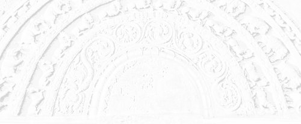

# Sermon 30

> Namo tassa bhagavato arahato sammāsambuddhassa \
> Namo tassa bhagavato arahato sammāsambuddhassa \
> Namo tassa bhagavato arahato sammāsambuddhassa
>
> *Etaṁ santaṁ, etaṁ paṇītaṁ, \
> yadidaṁ sabbasaṅkhārasamatho sabbūpadhipaṭinissaggo \
> taṇhakkhayo virāgo nirodho nibbānaṁ.*[^fn964]
>
> "This is peaceful, this is excellent, \
> namely the stilling of all preparations, the relinquishment of all assets, \
> the destruction of craving, detachment, cessation, extinction."

With the permission of the assembly of the venerable meditative monks. This is
the thirtieth sermon in the series of sermons on Nibbāna.

In our previous sermon we discussed the way of liberating the mind from the grip
of thoughts, which are comparable to the army of Māra by means of the gradual
and systematic mode of practice based on the twin principles of pragmatism and
relativity.

We also made an attempt to understand why the *arahattaphalasamādhi* of the
*arahant*, who arrives at the non-prolific state by gradually attenuating
cravings, conceits and views, comes to be called *avitakkasamādhi*, 'thoughtless
concentration'.

This *avitakkasamādhi* is the 'noble silence' in its highest sense. It is not
the temporary subsidence of thinking and pondering as in tranquillity
meditation. It goes deeper in that it routs the hosts of Māra at their very
citadel, as it were, by penetrative wisdom.

The other day, with special reference to the *Sakkapañhasutta* in the *Dīgha
Nikāya*, we outlined in brief a path of practice gradually tending towards the
cessation of reckonings born of prolific perception. That discourse expounds a
happiness, an unhappiness and an equanimity to be pursued, and a happiness, an
unhappiness and an equanimity not to be pursued.

We get a clear enunciation of these two kinds of happiness, unhappiness and
equanimity in the *Saḷāyatanavibhaṅgasutta* of the *Majjhima Nikāya*. In that
discourse, the Buddha gives an exposition of thirty-six pathways of thought of
beings under the heading *chattiṁsa sattapadā*, literally "thirty-six steps of
beings".[^fn965] They are listed as follows:

1. *Cha gehasitāni somanassāni,* \
"six kinds of happiness based on the household life"
2. *Cha nekkhammasitāni somanassāni,* \
"six kinds of happiness based on renunciation"
3. *Cha gehasitāni domanassāni,* \
"six kinds of unhappiness based on the household life"
4. *Cha nekkhammasitāni domanassāni,* \
"six kinds of unhappiness based on renunciation"
5. *Cha gehasitā upekkhā,* \
"six kinds of equanimity based on the household life"
6. *Cha nekkhammasitā upekkhā,* \
"six kinds of equanimity based on renunciation"

The 'six' in each case refers to the six objects of sense, namely form, sound,
smell, taste, tangible and idea, *rūpa, sadda, gandha, rasa, phoṭṭhabba,
dhamma.* Now in order to acquaint ourselves with the six kinds of happiness
based on the household life, let us try to understand the definition of the
first kind, that is to say 'form', as the object of the eye.

> *Cakkhuviññeyyānaṁ rūpānaṁ iṭṭhānaṁ kantānaṁ manāpānaṁ manoramānaṁ
> lokāmisapaṭisaṁyuttānaṁ paṭilābhaṁ vā paṭilabhato samanupassato pubbe vā
> paṭiladdhapubbaṁ atītaṁ niruddhaṁ vipariṇataṁ samanussarato uppajjati
> somanassaṁ, yaṁ evarūpaṁ somanassaṁ, idaṁ vuccati gehasitaṁ somanassaṁ.*
>
> When one regards as an acquisition an acquisition of forms, cognizable by the
> eye, that are desirable, charming, agreeable, delightful, connected with
> worldly gains, or when one recalls what was formerly acquired that has passed,
> ceased and changed, happiness arises. Such happiness as this is called
> happiness based on the household life.

The happiness based on renunciation is defined as follows:

> *Rūpānaṁ tveva aniccataṁ viditvā vipariṇāmavirāganirodhaṁ: 'Pubbe c'eva rūpā
> etarahi ca sabbe te rūpā aniccā dukkhā vipariṇāmadhammā'ti, evaṁ etaṁ
> yathābhūtaṁ samappaññāya passato uppajjati somanassaṁ, yaṁ evarūpaṁ
> somanassaṁ, idaṁ vuccati nekkhammasitaṁ somanassaṁ.*
>
> When by knowing the impermanence, change, fading away and cessation of forms
> one sees as it actually is with right wisdom that forms both formerly and now
> are all impermanent, suffering and subject to change, happiness arises. Such
> happiness as this is called happiness based on renunciation.

Then the unhappiness based on the household life is explained in the following
words:

> *Cakkhuviññeyyānaṁ rūpānaṁ iṭṭhānaṁ kantānaṁ manāpānaṁ manoramānaṁ
> lokāmisapaṭisaṁyuttānaṁ appaṭilābhaṁ vā appaṭilabhato samanupassato pubbe vā
> appaṭiladdhapubbaṁ atītaṁ niruddhaṁ vipariṇataṁ samanussarato uppajjati
> domanassaṁ, yaṁ evarūpaṁ domanassaṁ, idaṁ vuccati gehasitaṁ domanassaṁ.*
>
> When one regards as a non-acquisition the non-acquisition of forms cognizable
> by the eye that are desirable, charming, agreeable, delightful, connected with
> worldly gains, or when one recalls what was formerly not acquired that has
> passed, ceased and changed, unhappiness arises. Such unhappiness as this is
> called unhappiness based on the household life.

The description of unhappiness based on renunciation has a special significance
to insight meditation. It runs:

> *Rūpānaṁ tveva aniccataṁ viditvā vipariṇāmavirāganirodhaṁ: 'Pubbe c'eva rūpā
> etarahi ca sabbe te rūpā aniccā dukkhā vipariṇāmadhammā'ti, evaṁ etaṁ
> yathābhūtaṁ samappaññāya disvā anuttaresu vimokhesu pihaṁ upaṭṭhāpeti:
> 'kadā'ssu nām'ahaṁ tad āyatanaṁ upasampajja viharissāmi yad ariyā etarahi
> āyatanaṁ upasampajja viharantī'ti, iti anuttaresu vimokhesu pihaṁ
> uppaṭṭhāpayato uppajjati pihapaccayā domanassaṁ, yaṁ evarūpaṁ domanassaṁ, idaṁ
> vuccati nekkhammasitaṁ domanassaṁ.*
>
> When by knowing the impermanence, change, fading away and cessation of forms
> one sees as it actually is with right wisdom that forms both formerly and now
> are all impermanent, suffering and subject to change, one arouses a longing
> for the supreme deliverances thus: "When shall I enter upon and abide in that
> sphere that the Noble Ones now enter upon and abide in?" In one who arouses
> such a longing for the supreme deliverances unhappiness arises conditioned by
> that longing. Such unhappiness as this is called unhappiness based on
> renunciation.

The description of unhappiness based on renunciation brings up some important
terms worth discussing. *Anuttaresu vimokhesu* is a reference to the three
supreme deliverances known as *animitta*, the 'signless', *appaṇihita*, the
'undirected', and *suññata*, the 'void'.

The reference to an *āyatana*, 'sphere', in this passage is particularly
noteworthy. The sphere that the Noble Ones enter on and abide in is none other
than the sphere alluded to in the famous sutta on Nibbāna in the *Udāna*,
beginning with

> *atthi, bhikkhave, tad āyatanaṁ, yattha n'eva paṭhavī na āpo*[^fn966] etc.,
>
> "Monks, there is that sphere in which there is neither earth nor water" etc.

We have pointed out that it is a reference to the cessation of the six
sense-spheres as a realization.[^fn967] So the sphere that the Noble Ones enter
on and abide in is the very cessation of the six sense-spheres.

In the same sutta passage in the *Udāna*, we came across the three terms
*appatiṭṭhaṁ, appavattaṁ* and *anārammaṇaṁ*, the 'unestablished', the 'non
continuing' and the 'objectless', which we identified as allusions to the three
deliverances.

The word *pihā* (Sanskrit *spṛhā*, 'longing', 'desire'), occurring in this
context, shows that there need not be any hesitation in using words implying
desire in connection with Nibbāna. It is true that such a desire or longing for
Nibbāna makes one unhappy. But that unhappiness is preferable to the unhappiness
based on the household life. That is why it is upgraded here as unhappiness
based on renunciation.

So far we have quoted instances of the six kinds of happiness based on the
household life, *cha gehasitāni somanassāni*; the six kinds of happiness based
on renunciation, *cha nekkhammasitāni somanassāni*; the six kinds of unhappiness
based on the household life, *cha gehasitāni domanassāni*; and the six kinds of
unhappiness based on renunciation, *cha nekkhammasitāni domanassāni*.

The 'six' in each case refers to the objects of the six senses. Now lets us take
up a paradigm to understand the six kinds of equanimity based on the household
life, *cha gehasitā upekkhā*.

> *Cakkhunā rūpaṁ disvā uppajjati upekkhā bālassa mūḷhassa puthujjanassa
> anodhijinassa avipākajinassa anādīnavadassāvino assutavato puthujjanassa, yā
> evarūpā upekkhā rūpaṁ sā nātivattati, tasmā sā 'upekkhā gehasitā'ti vuccati.*
>
> On seeing a form with the eye, equanimity arises in a foolish infatuated
> worldling, in an untaught worldling who has not conquered his limitations, who
> has not conquered the results [of *kamma*], and who is not aware of danger,
> such equanimity as this does not transcend form, that is why it is called
> equanimity based on the household life.

The equanimity of a worldling, untaught in the Dhamma, who has not conquered
limitations and defilements, and who has not conquered the results of *kamma*,
is incapable of transcending form. His equanimity is accompanied by ignorance.

Then comes the description of equanimity based on renunciation, *nekkhammasitā
upekkhā*.

> *Rūpānaṁ tveva aniccataṁ viditvā vipariṇāmavirāganirodhaṁ: 'Pubbe c'eva rūpā
> etarahi ca sabbe te rūpā aniccā dukkhā vipariṇāmadhammā'ti, evaṁ etaṁ
> yathābhūtaṁ samappaññāya passato uppajjati upekkhā, yā evarūpā upekkhā rūpaṁ
> sā ativattati, tasmā sā 'upekkhā nekkhammasitā'ti vuccati.*
>
> When by knowing the impermanence, change, fading away and cessation of forms
> one sees as it actually is with right wisdom that forms both formerly and now
> are all impermanent, suffering and subject to change, equanimity arises. Such
> equanimity as this transcends form, that is why it is called 'equanimity based
> on renunciation'.

The same kind of reflection on impermanence upon occasion gives rise to
happiness, unhappiness and equanimity, according to the attitude taken up.
Unlike the equanimity born of ignorance, this equanimity, born of right wisdom,
transcends form. That is why it is called equanimity based on renunciation.

The Buddha speaks about all the thirty-six objects of sense, out of which we
brought up, as a paradigm, the illustration given about the visual object, form.

These thirty-six are called the thirty-six pathways of beings, *chattiṁsa
sattapadā*, in the sense that they depict the thought patterns of beings. In
this discourse, the Buddha proclaims the basic maxim he employs in gradually
channelling the thought processes of beings towards Nibbāna along these
thirty-six pathways. The maxim is summed up in the following words:

> *tatra idaṁ nissāya idam pajahatha*,
>
> therein, depending on this, abandon this.

This maxim has some affinity to the *paṭicca samuppāda* formula "this being,
this arises". In fact, this is a practical application of the same formula. In
the context of the path of practice, the dependence on one thing is for the
purpose of abandoning another. There is an attitude of detachment in this course
of practice. Based on this maxim, the Buddha outlines the way in which he guides
one towards Nibbāna in four stages. The first stage in that gradual path towards
Nibbāna is described as follows:

> *Tatra, bhikkhave, yāni cha nekkhammasitāni somanassāni tāni nissāya tāni
> āgamma, yāni cha gehasitāni somanassāni tāni pajahatha tāni samatikkamatha,
> evam etesaṁ pahānaṁ hoti, evam etesaṁ samatikkamo hoti.*
>
> Therein, monks, by depending on and relying on the six kinds of happiness
> based on renunciation, abandon and transcend the six kinds of happiness based
> on the household life, that is how they are abandoned, that is how they are
> transcended.

In the same way, by depending on the six kinds of unhappiness based on
renunciation, the six kinds of unhappiness based on the household life are
abandoned. Also, by depending on the six kinds of equanimity based on
renunciation, the six kinds of equanimity based on the household life are
abandoned.

So at the end of the first stage, what are we left with? All what is based on
the household life is left behind, and only the six kinds of happiness based on
renunciation, the six kinds of unhappiness based on renunciation and the six
kinds of equanimity based on renunciation remain. That is the position at the
end of the first stage.

Then, in the second stage, a subtler and more refined level of experience is
aimed at. Out of the three types of mental states based on renunciation,
firstly, the six kinds of unhappiness based on renunciation are abandoned by the
six kinds of happiness based on renunciation. Then the six kinds of happiness
based on renunciation are abandoned by the six kinds of equanimity based on
renunciation.

To the extent that all the above three mental states are based on renunciation,
they are of a piece with each other. Also, it is the same mode of insightful
reflection that gives rise to them.

However, as attitudes, happiness is subtler and more excellent than unhappiness,
and equanimity is subtler and more excellent than happiness, since it is nearer
to wisdom. So in the second stage we see a gradual procedure arriving at a
subtler and more excellent state even in the case of those three mental states
based on renunciation. By the end of the second stage, only equanimity based on
renunciation remains.

Now comes the third stage. Here the Buddha points out that in the case of
equanimity there can be two varieties.

> *Atthi, bhikkhave, upekkhā nānattā nānattasitā, atthi, bhikkhave, upekkhā
> ekattā ekattasitā.*
>
> There is, monks, an equanimity that is diversified, based on diversity, and
> there is an equanimity that is unified, based on unity.

What is that equanimity that is diversified? It is defined as the equanimity
regarding the objects of the five external senses, that is to say, equanimity
regarding forms, sounds, smells, flavours and tangibles.

Equanimity that is unified is defined with reference to the immaterial realms,
namely the sphere of infinity of space, the sphere of infinity of consciousness,
the sphere of nothingness and the sphere of
neither-perception-nor-non-perception.

Now in the case of these two types of equanimity, the Buddha points out a way of
abandoning the equanimity based on diversity with the help of the equanimity
based on unity. As equanimity both types are commendable, but that which is
diversified and based on diversity is grosser. Equanimity that is unified and
based on unity is subtler and more excellent. So the equanimity based on
diversity is abandoned and transcended by the equanimity that is unified, based
on unity. This is the end of the third stage.

In the fourth stage, we are left with only that equanimity that is based on
unity. It is experienced in the higher rungs of meditation. But here, too, the
Buddha advocates a prudent course of action. In fact, it is here that the
deepest practical hint is given.

> *Atammayataṁ, bhikkhave, nissāya atammayataṁ āgamma, yāyam upekkhā ekattā
> ekattasitā, taṁ pajahatha taṁ samatikkamatha, evam etissā pahānaṁ hoti, evam
> etissā samatikkamo hoti.*
>
> Monks, by depending and relying on non-identification abandon and transcend
> equanimity that is unified, based on unity; that is how it is abandoned, that
> is how it is transcended.

*Atammayatā* is a term we have already discussed at length in our earlier
sermons.[^fn968] Its importance has not been sufficiently recognized in our
tradition. As we pointed out, the word *tammayo*, literally 'of thatness', could
be explained with reference to such usages as *suvaṇṇamaya* and *rajatamaya*,
'golden' and 'silver'. How does this 'of thatness' come by?

If, for instance, one who has attained the infinity of space as a meditative
experience identifies himself with it, with the conceit *eso 'ham asmi*, 'this
am I', there is that *tammayatā* coming in. It is a subtle grasping, or in other
words a me-thinking, *maññanā* – imagining oneself to be one with that
experience. So the Buddha's advice is to abandon and transcend even that
equanimity based on unity by resorting to the maxim of *atammayatā*,
non-identification.

The subtle conceit 'am', *asmi*, is that trace of grasping with which one tries
to sit pretty on that which is impermanent and changing. It is the most
fundamental assertion of existence.

In the *Sappurisasutta* of the *Majjhima Nikāya* we get a good illustration of
the application of this principle of detachment, made known by the Buddha.

> *Sappuriso ca kho, bhikkhave, iti paṭisañcikkhati:*
>
> *Nevasaññānāsaññāyatanasamāpattiyā pi kho atammayatā vuttā Bhagavatā, 'yena yena
> hi maññanti tato taṁ hoti aññathā'ti.*

> *So atammayataṁ yeva antaraṁ karitvā tāya nevasaññānāsaññāyatanasamāpattiyā
> n'eva attān'ukkaṁseti na paraṁ vambheti. Ayam pi, bhikkhave,
> sappurisadhammo.*[^fn969]
>
> But a good man, monks, considers thus:
>
> "Non-identification even with the attainment of the sphere of
> neither-perception-nor-non-perception has been declared by the Fortunate One
> [in such terms as]: 'In whatever way they imagine, thereby it turns
> otherwise'."
>
> So he takes into account that very non-identification and neither exalts
> himself nor disparages others because of his attainment of the sphere of
> neither-perception-nor-non-perception. This, too, monks, is the nature of a
> good man.

In the *Sappurisasutta*, the Buddha expounds the characteristics of a 'good
man'. In this context, the term *sappurisa*, 'good man', is used exclusively to
represent a noble disciple, *ariyasāvaka*. A noble disciple does not look upon
his *jhānic* attainments in the same way as an ordinary meditator attaining
*jhānas*. His point of view is different.

This discourse explains his view point. A good man reflects wisely according to
the advice given by the Buddha to the effect that even to the higher *jhānic*
attainment of neither-perception-nor-non-perception the principle of
non-identification must be applied, recalling the maxim made known by the
Buddha:

> *Yena yena hi maññanti tato taṁ hoti aññatha*,
>
> in whatever way they imagine, thereby it turns otherwise.

This is a maxim we had discussed earlier too.[^fn970]

*Maññanā* is egoistic imagining. When one thinks in egoistic terms about
something, by that very me-thinking it turns otherwise. Due to egoistic
imagining, it becomes a thing, and once it becomes a thing, it is bound to
change and become another.

The good man calls to mind that maxim, that norm, and refrains from exalting
himself and disparaging others on account of his attainment. He does not
identify himself with it. From this it becomes clear that *atammayatā* or
**non-identification is the path to Nibbāna**.

So the Buddha gradually channelizes the pathways of thoughts of beings from the
grosser to subtler levels and finally tops up by directing them to Nibbāna
through non-identification, *atammayatā*. Non-identification is the watchword
for clinging-free *parinibbāna*.

The dictum *tatra idaṁ nissāya idam pajahatha*, "therein, depending on this,
abandon this", which the Buddha expounds in the *Saḷāyatanavibhaṅgasutta*,
portrays a duality between attention, *manasikāra*, and inattention,
*amanasikāra*.

That is to say, the basic principle in this dictum is the method of encouraging
inattention to grosser things by recommending a way of attending to subtler
things. So it seems both attention and inattention are given an importance in
this procedure.

In order to eliminate one thing by inattention, attention to some other thing is
recommended. For the purpose of inattention to something gross, attention to
something subtle is taken up. But that is not the end of it. Even that is
expelled with the help of something subtler. Here we have a wonderful technique,
based on the twin principles of pragmatism and relativity.

These two terms comprehend the entire gamut of the path of practice in Buddhism.
'Pragmatic' means 'for some practical purpose', 'relative' means 'in relation to
something else', that is, as a means to an end, and not absolutely as an end in
itself. So in this system of practice everything has a pragmatic and a relative
value.

The question of attention and inattention has also to be understood in that
background. A clear illustration of the method of elimination of grosser mental
states with the help of subtler mental states by attention and inattention comes
in the *Vitakkasaṇṭhānasutta* of the *Majjhima Nikāya*. There the Buddha
explains this method making use of a simile of a carpenter.

> *Seyyathā pi, bhikkhave, dakkho palagaṇḍo vā palagaṇḍantevāsī vā sukhumāya
> āṇiyā oḷārikaṁ āṇiṁ abhinīhaneyya abhinīhareyya abhinivajjeyya, evam eva kho,
> bhikkhave, bhikkhuno yaṁ nimittam āgamma yaṁ nimittaṁ manasikaroto uppajjanti
> pāpakā akusalā vitakkā chandūpasaṁhitā pi dosūpasaṁhitā pi mohūpasaṁhitā pi,
> tena, bhikkhave, bhikkhunā tamhā nimittā aññaṁ nimittaṁ manasikātabbaṁ
> kusalūpasaṁhitaṁ.*[^fn971]
>
> Just as, monks, a skilled carpenter or his apprentice might knock out, draw
> out and remove a coarse peg by means of a fine one, even so, monks, when a
> monk [finds that], due to some sign, by attending to some sign, there arise in
> him evil unskilful thoughts connected with desire, with hate and with
> delusion, that monk, monks, should attend to some other sign in its stead, one
> that has to do with the skilful.

Now let us try to understand the point of this simile. When, for instance, a
carpenter, in fitting out a door, finds that he is driving a blunt nail, he
extracts it with the help of a sharper one. He takes up the sharper nail just
for the purpose of extracting the blunt nail. So also one resorts to a skilful
thought to expel the unskilful thought as a means to an end. This kind of
pragmatic and relative approach avoids tenacious grasping and dogmatic
involvement.

The spirit of the law of dependent arising runs through the entire course of
Buddhist practice, culminating in *atammayatā*, non-identification.

The two terms *kusala* and *akusala* also deserve our special attention in this
context. The basic meaning of *kusala* is 'skilful', and *akusala* means
'unskilful'.

Here, again, we have something relative. 'Skilful' presupposes 'unskilful' and
gets a value in relation to the latter. It has no absolute value. We make use of
the skilful in order to push away the unskilful. That done, there is no further
involvement with it, as one's last resort is *atammayatā*, non-identification.
That is why there is no problem of a clogging coming in.

Our discussion of the *Saḷāyatanavibhaṅgasutta* brings to light another unique
feature of this Dhamma. In other religious systems the question of reality is
resolved by having recourse to unity. Oneness is supposed to be the ultimate
goal.

In our analysis of the *saṁsāric* problem, we often referred to a duality or a
dichotomy. Everywhere we were confronted with a duality. But to grasp the two as
one, in some form of oneness, is not the way out. Instead we have here, as the
final solution, *atammayatā* or non-identification, a clinging-free approach in
the last analysis.

It is in the nature of *saṁsāric* existence that beings find themselves bound
and fettered. These fetters are called *saṁyojanāni*. A binding or a fetter
implies 'two', as when two bulls are tied together.[^fn972]

The term *upādāna* is also used quite often. It implies a holding on to
something. There, too, the notion of a duality comes in – one who holds and the
thing held. It is not at all easy to transcend this duality, characteristic of
*saṁsāric* existence. This is the crux of the whole problem. Unity or oneness is
not the solution, it has to be solved with extreme judiciousness.

In the very first discourse of the *Saṁyutta Nikāya* we get a solution to the
problem, briefly stated. The discourse is called *Oghataraṇasutta*, "Crossing
the Flood", and it was given pride of place probably because of its importance.

A deity comes and asks the Buddha:

> *Kathaṁ nu tvaṁ mārisa ogham atari?*[^fn973]
>
> How did you, Sir, cross the flood?

And the Buddha answers:

> *Appatiṭṭhaṁ khvāham, āvuso, anāyūhaṁ ogham atariṁ.*
>
> Without tarrying, friend, and without hurrying, did I cross the flood.

But the deity, finding the answer too enigmatic, asks:

> *Yathā kathaṁ pana tvaṁ mārisa appatiṭṭham anāyūham ogham atari?*
>
> But how [exactly is it], sir, that you crossed the flood without tarrying and
> without hurrying?

Then the Buddha makes an explanatory statement:

> *Yadā svāham, āvuso, santiṭṭhāmi tadāssu saṁsīdāmi, yadā svāham āvuso āyūhāmi
> tadāssu nibbuyhāmi. Evam khvāham, āvuso, appatiṭṭhaṁ anāyūhaṁ ogham atariṁ.*
>
> When I, friend, tarried, I found myself sinking; when I, friend, hurried, I
> got swept away. And so, friend, without tarrying and without hurrying did I
> cross the flood.

Then the deity, being pleased, uttered the following verse in approbation:

> *Cirassaṁ vata passāmi,* \
> *brāhmaṇaṁ parinibbutaṁ,* \
> *appatiṭṭhaṁ anāyūhaṁ,* \
> *tiṇṇaṁ loke visattikaṁ.*
>
> O, what length of time since I beheld, \
> A saint with all his passions quelled, \
> Who neither tarrying nor yet hurrying, \
> Has crossed the world's viscosity – 'craving'.

This discourse on crossing the flood reveals some salient features of the middle
path. If a person caught up in a water current tries to stay still, he will
sink. If he simply struggles to escape, he will get swept away. So like a good
swimmer, he has to avoid both extremes, and, by means of a mindful and
systematic gradual effort, work out his freedom. In other words, he has to
strive – not struggle.

So we can understand why the Buddha in his very first sermon,
*Dhammacakkapavattanasutta*, "Discourse on the Turning of the Wheel of Dhamma",
proclaimed as the middle path the noble eightfold path, avoiding both extremes
of attachment to sensuality, *kāmasukhallikānuyoga*, and self-mortification,
*attakilamathānuyoga*.[^fn974] Here, too, the implication is that the entire
round of existence is a water current to be crossed over by means of a
systematic and gradual effort.

In some of our earlier sermons, while analyzing the law of dependent arising, we
made use of the simile of the vortex for easy comprehension.[^fn975] Now if we
are to take it up again, we may say that it is in the nature of beings in
*saṁsāra* to get drifted by the current of preparations, *saṇkhārā*, owing to
ignorance, *avijjā*, and go on revolving between consciousness, *viññāṇa*, and
name-and-form, *nāma-rūpa*.

This ignorance in the form of the four pervert perceptions – namely the
perception of permanence in the impermanent, the perception of pleasure in the
painful, the perception of beauty in the repulsive, and the perception of self
in the not-self – gives rise to the run-away current of water which keeps
running round and round between consciousness and name-and-form. This is the
*saṁsāric* vortex, *saṁsāravaṭṭa*.

Now, for instance, if we throw even a small leaf to a spot where there is a
vortex, it also keeps revolving. Similarly, all over this *saṁsāric* existence
duality holds sway. Therefore, freedom from it can be won only by a subtle form
of striving. That is why the Buddha used the two terms *appatiṭṭhaṁ* and
*anāyūhaṁ*. Avoiding the two extremes of stagnation and struggling, one has to
cross the flood going the middle way.

When the Buddha proclaimed that freedom can be won only by the middle way,
avoiding both extremes, the extremist philosophers of his day criticized and
disparaged him, saying: "Then you are preaching a doctrine of bewilderment".

We find such an instance of accusation in the *Māgandiyasutta* of the *Aṭṭhaka
Vagga* of the *Sutta Nipāta*. The Brāhmin Māgandiya poses the following question
to the Buddha:

> *'Ajjhattasantī'ti yam etam atthaṁ,* \
> *kathan nu dhīrehi paveditaṁ taṁ.*[^fn976]
>
> That which they call 'inward peace', \
> In what terms have the wise proclaimed that [peace]?

The Buddha's answer took the following form:

> *Na diṭṭhiyā na sutiyā na ñāṇena,* \
> *sīlabbatenāpi visuddhim āhu,* \
> *adiṭṭhiyā assutiyā aññāṇā* \
> *asīlatā abbatā no pi tena,* \
> *ete ca nissajja anuggahāya* \
> *santo anissāya bhavaṁ na jappe.*
> 
> Not by views, nor by learning, \
>  nor by knowledge, \
> Nor yet by virtue and holy vows, \
>  they say, can purity come, \
> Neither can it come by without views, \
>  learning and knowledge, \
> Without virtue and holy vows, \
> Letting go of them all and grasping not one, \
> That peaceful one, leaning on none, \
> Would hanker no more for existence.

At this reply the Brāhmin Māgandiya was puzzled and accuses the Buddha of
prevarication.

> *No ce kira diṭṭhiyā na sutiyā na ñāṇena,* \
> *sīlabbatenāpi visuddhim āha,* \
> *adiṭṭhiyā assutiyā aññāṇā* \
> *asīlatā abbatā no pi tena,* \
> *maññe-m-ahaṁ momuham eva dhammaṁ,* \
> *diṭṭhiyā eke paccenti suddhiṁ.*
>
> If not by views, nor by learning, \
>  nor by knowledge, \
> Nor yet by virtue and holy vows \
>  can purity be won, \
> If it comes not without views, \
>  learning and knowledge, \
> Without virtue and holy vows – well then \
> Bewilderment itself, I think, is this Dhamma, \
> For there are some who claim purity by views.

Now these two verses call for some comments. Firstly there is a minor problem
about variant readings. In both these verses, we followed the reading
*visuddhi*, whereas some editions accept the reading *na suddhim āha*, where the
negative seems superfluous. *Visuddhi* seems more meaningful here.

The commentarial explanation of these two verses seems to go off at a
tangent.[^fn977] It says that the negatives in the first two lines of the
Buddha's reply refer to wrong views, wrong learning, wrong knowledge, wrong
virtue and wrong vows, and that the third and fourth lines refer to right view,
right learning, right knowledge, right virtue and right vows. In other words, it
is only a question of wrong view, *micchā diṭṭhi*, and right view, *sammā
diṭṭhi*.

This interpretation misses the subtle point at issue in this dialogue. If it is
as simple as that, there is no ground for Māgandiya's accusation. Other
religious teachers, who disputed with each other, used to assert that purity is
attained only by their views, learning, knowledge, virtue and vows.

Here then it is not a question of difference between *micchā diṭṭhi* and *sammā
diṭṭhi*. Here is something more radical concerning *sammā diṭṭhi* itself.

According to this enlightened approach, views etc. cannot totally be dispensed
with, nor are they to be grasped. We come back now to the two key words
'pragmatic' and 'relative'. That is why the Buddha declared that purity cannot
be attained by views, learning, knowledge, virtue and vows, nor in the absence
of these qualities.

This is an apparently contradictory statement which, however, puts in a nutshell
the essence of the middle path. The inward peace, mentioned in the above
context, is nothing other than the clinging-free perfect extinction, *anupādā
parinibbāna*. That becomes clear by the last three lines of the Buddha's reply,

> *ete ca nissajja anuggahāya* \
> *santo anissāya bhavaṁ na jappe.*
>
> Letting go of them all and grasping not one, \
> That peaceful one, leaning on none, \
> Would hanker no more for existence.

We came across the word *anissita* in our discussions about Nibbāna, for
instance in the cryptic formula

> *nissitassa calitaṁ, anissitassa calitaṁ natthi*,[^fn978]
>
> to the one attached there is wavering, to the unattached one, there is no
> wavering.

Being unattached, there is no hankering for existence. Where there is grasping,
there is existence.

We may revert to our simile of sharpening a razor.[^fn979] The constituents of
the path have to be taken up as one takes up a razor for sharpening, ready to
let go. Once the purpose is served, they have to be given up. That is the dictum
underlying this dialogue in the *Māgandiyasutta*.

Now we come to a discourse which clearly and unmistakeably presents this
extraordinary first principle. The discourse is the *Rathavinītasutta* of the
*Majjhima Nikāya*.

Here it is not a case of arguing with a Brāhmin. The interlocutors in this
discourse are two stalwarts of this dispensation, namely Venerable Sāriputta and
Venerable Puṇṇa Mantāṇiputta. Their long discussion on the path of practice,
unfolding itself in dialogue form, was not meant for any clarification of doubts
for themselves. It was probably inspired by a benevolent wish to help those
'Māgandiyas' in the world, who are ignorant of the pragmatic nature and relative
value of the Buddha's middle path. For easy comprehension, we shall present this
discourse in three parts.

First of all Venerable Sāriputta poses the following question to Venerable Puṇṇa
Mantāṇiputta:

> *Kin nu kho, āvuso, sīlavisuddhatthaṁ Bhagavati brahmacariyaṁ vussatī'ti?*[^fn980]
>
> "What, friend, is it for the sake of purification of virtue that the holy life
> is lived under the Fortunate One?"

And Venerable Puṇṇa Mantāṇiputta replies:

> "No friend."
>
> "Then is it for the sake of purification of mind that the holy life is lived
> under the Fortunate One?" \
> "No friend."
>
> "Then is it for the sake of purification of view that the holy life is lived
> under the Fortunate One?" \
> "No friend."
>
> "Then is it for the sake of purification by overcoming doubt that the holy
> life is lived under the Fortunate One?" \
> "No friend."
>
> "Then is it for the sake of purification by knowledge and vision of what is
> the path and what is not the path that the holy life is lived under the
> Fortunate One?" \
> "No friend."
>
> "Then is it for the sake of purification by knowledge and vision of the way
> that the holy life is lived under the Fortunate One?" \
> "No friend."
>
> "Then is it for the sake of purification by knowledge and vision that the holy
> life is lived under the Fortunate One?" \
> "No friend."

Then Venerable Sāriputta asks:

> "Then for the sake of what, friend, is the holy life lived under the
> Fortunate One?"
>
> "Friend it is for the sake of perfect Nibbāna without clinging that the holy
> life is lived under the Fortunate One."

So the ensemble of part one of the dialogue is that the holy life is not lived
under the Fortunate One for the sake of any of those purifications, but for
something called *anupādā parinibbāna*, "perfect Nibbāna without clinging".

Now, in what we would call part two of the dialogue, Venerable Sāriputta
highlights the contradictions in the answers given so far, somewhat like
Māgandiya. Apparently there is some need for clarification. He asks:

> "But, friend, is purification of virtue perfect Nibbāna without clinging?" \
> "No friend".

In this way he asks whether any of the other stages of purification, up to and
including purification by knowledge and vision, is perfect Nibbāna without
clinging. Venerable Puṇṇa answers in the negative. Then Venerable Sāriputta
asks:

> *Kim pan' āvuso aññatra imehi dhammehi anupādā parinibbānaṁ?*
>
> "But, friend, is perfect Nibbāna without clinging [to be attained] without
> these states?" \
> "No friend".

So, then, it looks as if the trend of contradictions has come to a head.

Now in part three of the dialogue we find Venerable Sāriputta rhetorically
summing up the previous section of the dialogue:

> "When asked: 'But, friend, is purification of virtue perfect Nibbāna without
> clinging?', you replied: 'No friend'"

(and so on), citing even the last negative response:

> "And when asked: 'But, friend, is perfect Nibbāna without clinging [to be
> attained] without these states?', you replied: 'No friend'";

and rounds up by asking with apparent exasperation:

> *yathākathaṁ pan' āvuso imassa bhāsitassa attho daṭṭhabbo?*
>
> "How, then, friend, can one understand the meaning of this statement?"

So rather dramatically the stage is now set for Venerable Puṇṇa Mantāṇiputta to
come out with the deepest point in the discussion:

> *Sīlavisuddhiñce āvuso Bhagavā anupādā parinibbānaṁ paññāpessa, sa-upādānaṁ
> yeva samānaṁ anupādā parinibbānaṁ paññāpessa.*
>
> "Friend, if the Fortunate One had designated purification of virtue as perfect
> Nibbāna without clinging, he would have designated what is still accompanied
> by clinging as perfect Nibbāna without clinging."

In the same strain, he goes on to apply this criterion to the other stages of
purification and finally brings out the absurdity of the other extreme in the
following words:

> *Aññatra ce, āvuso, imehi dhammehi anupādā parinibbānaṁ abhavissa, puthujjano
> parinibbāyeyya, puthujjano hi, āvuso, aññatra imehi dhammehi.*
>
> "And if, friend, perfect Nibbāna without clinging were to be attained without
> these states, then even an ordinary worldling would have attained perfect
> Nibbāna without clinging, for an ordinary worldling, friend, is without these
> states."

Now we can see how subtle this question is. Simply because it was said that none
of the above states is perfect Nibbāna without clinging, they cannot be
dispensed with.

We have already discussed the significance of the *Alagaddūpamasutta* in this
concern. There we came across two similes, the simile of the raft and the simile
of the water snake. To carry the raft on one's shoulder after crossing is one
extreme.[^fn981] To take the water snake by its tail is the other extreme. The
middle path lies between these two extremes. That is the implication of the
above statement that if perfect Nibbāna without clinging is attained without
these states, then even an ordinary worldling would have attained it, for he has
none of them.

For further clarification of this point, Venerable Puṇṇa Mantāṇiputta comes out
with the simile of the relay of chariots. King Pasendi of Kosala, while living
in Sāvatthī, has some urgent business to settle at Sāketa. Between Sāvatthī and
Sāketa seven relay chariots are kept ready for him. The king mounts the first
relay chariot and by means of it arrives at the second relay chariot. Then he
dismounts from the first relay chariot and mounts the second chariot. By means
of the second chariot he arrives at the third chariot. In this way, finally he
arrives at Sāketa by means of the seventh chariot.

Then, when his friends and relatives in Sāketa ask him: "Sire, did you come from
Sāvatthī to Sāketa by means of this chariot?", he cannot reply in the
affirmative. He has to relate the whole story of passing from chariot to
chariot.

Having given this simile as an illustration, Venerable Puṇṇa Mantāṇiputta sums
up the correct solution to the point at issue in the following memorable words:

> *Evameva kho, āvuso, sīlavisuddhi yāvadeva cittavisuddhatthā,*
>
> *cittavisuddhi yāvadeva diṭṭhivisuddhatthā,*
>
> *diṭṭhivisuddhi yāvadeva kaṅkhāvitaraṇavisuddhatthā,*
>
> *kaṅkhāvitaraṇavisuddhi yāvadeva maggāmaggañāṇadassanavisuddhatthā,*
>
> *maggāmaggañāṇadassanavisuddhi yāvadeva paṭipadañāṇadassanavisuddhatthā,*
>
> *paṭipadañāṇadassanavisuddhi yāvadeva ñāṇadassanavisuddhatthā,*
>
> *ñāṇadassanavisuddhi yāvadeva anupādā parinibbānatthā.*
>
> *Anupādā parinibbānatthaṁ kho, āvuso, Bhagavati brahmacariyaṁ vussati.*
>
> Even so, friend, purification of virtue is purposeful as far as purification
> of the mind;
>
> purification of the mind is purposeful as far as purification of view;
>
> purification of view is purposeful as far as purification by overcoming doubt;
>
> purification by overcoming doubt is purposeful as far as purification by
> knowledge and vision of what is the path and what is not the path;
>
> purification by knowledge and vision of what is the path and what is not the
> path is purposeful as far as purification by knowledge and vision of the way;
>
> purification by knowledge and vision of the way is purposeful as far as
> purification by knowledge and vision;
>
> purification by knowledge and vision is purposeful as far as perfect Nibbāna
> without clinging.
>
> It is for perfect Nibbāna without clinging that the holy life is lived under
> the Fortunate One.

The key word in this grand finale of this dramatic exposition is *yāvadeva*.
Simply rendered it means 'just for', that is, the sufficing condition for
something else.

Properly understood, it is a watchword upholding the twin principles of
pragmatism and relativity. In the light of the illustration by relay chariots,
this watchword stands for that impersonal momentum or impetus required for any
gradual course of purposive action, according to the law of dependent arising.

So we see how the Buddha discovered and laid bare the first principles of a
universal law conducive to one's emancipation. Here is a series of states, in
which one state is to be made use of for reaching another, and that for reaching
yet another, but none of which is to be grasped per se. This is the distinction
between what is called *upadhi*, or *saṁsāric* asset, and *nirupadhi*, or the
asset-less Nibbāna.

In the case of those meritorious deeds, productive of *saṁsāric* assets, one
goes on accumulating and amassing them. But, for the *nibbānic* state of
*nirupadhi*, the asset-less, there is a different approach.

One state leads up to another, and that to yet another, in accordance with the
simile of the relay chariots, but none of them is to be grasped per se. One
grasps neither purification of virtue, nor purification of the mind, nor
purification of view, nay, not even purification by knowledge and vision.
Leaving them all behind and reaching the subtlest of them all, there comes the
final 'let go' to attain that perfect extinction without clinging, *anupādā
parinibbāna*. This is the subtlest truth in this Dhamma.

[^fn964]: [MN 64 / M I 436](https://suttacentral.net/mn64/pli/ms), *Mahāmālunkyasutta*

[^fn965]: M III 217, *Saḷāyatanavibhaṅgasutta*

[^fn966]: [Ud 8.2 / Ud 80](https://suttacentral.net/ud8.2/pli/ms), *Paṭhamanibbānapaṭisaṁyuttasutta*

[^fn967]: See *Sermon 17*

[^fn968]: See esp. *Sermons 14, 15, 24 and 25*

[^fn969]: [MN 113 / M III 44](https://suttacentral.net/mn113/pli/ms), *Sappurisasutta*

[^fn970]: See *Sermons 13, 14 and 15*

[^fn971]: M I 119, *Vitakkasanthānasutta*

[^fn972]: S IV 282, *Saṁyojanasutta*

[^fn973]: S I 1, *Oghataraṇasutta*

[^fn974]: [SN 56.11 / S V 421](https://suttacentral.net/sn56.11/pli/ms), *Dhammacakkapavattanasutta*

[^fn975]: See *Sermon 3* etc.

[^fn976]: Sn 838, *Māgandiyasutta*

[^fn977]: Pj II 545

[^fn978]: [MN 144 / M III 266](https://suttacentral.net/mn144/pli/ms), *Channovādasutta*; see *Sermon 4*

[^fn979]: See *Sermon 5*

[^fn980]: M I 147, *Rathavinītasutta*

[^fn981]: [MN 22 / M I 134](https://suttacentral.net/mn22/pli/ms), *Alagaddūpamasutta*; see *Sermon 18*
