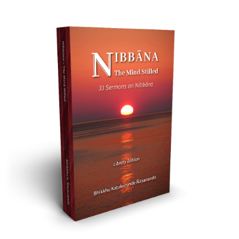

  <h1>Nibbāna - The Mind Stilled</h1>
  <h2>33 Sermons on Nibbāna</h2>
  
<em>by Bhikkhu Kaṭukurunde Ñāṇananda</em>

  
<em>Last updated on: 2025-04-06</em>

<https://seeingthroughthenet.net/>

<https://seeingthroughthenet.github.io/nibbana-the-mind-stilled>

## Downloads

  

    
  

  

    <h3>Nibbāna - The Mind Stilled</h3>
    
<em>by Bhikkhu Kaṭukurunde Ñāṇananda</em>

    
<a href="https://seeingthroughthenet.github.io/nibbana-the-mind-stilled/assets/docs/Nibbana-The-Mind-Stilled.pdf">PDF for desktop</a>

    
<a href="https://seeingthroughthenet.github.io/nibbana-the-mind-stilled/assets/docs/Nibbana-The-Mind-Stilled.epub">EPUB for phone, tablet and Kindle</a>

  

## Hard Copies via Print-On-Demand

  

    
  

  

    <h3>Nibbāna - The Mind Stilled, Part 1-2.</h3>
    
<em>by Bhikkhu Kaṭukurunde Ñāṇananda</em>

  

Hard-copies are available via print-on-demand. We ask you to enquire in email at [knssb@seeingthroughthenet.net](mailto:knssb@seeingthroughthenet.net) so that the KNSSB Team may provide you with the information about how to access the print-on-demand service.

Distribution and commercial rights are reserved by the KNSSB.

Published strictly for free distribution

Copyright © Kaṭukurunde Ñāṇananda Sadaham Senasun Bhāraya (KNSSB) 2025

Chapter heading background photo: \
Sandakada Pahana (Moonstone) at the entrance to the Polonnaruwa Vatadage \
12th century CE, Sri Lanka

